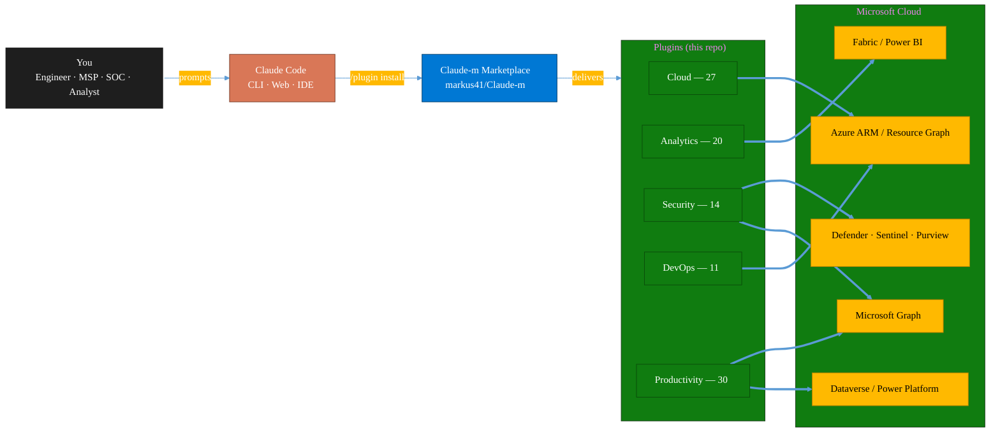
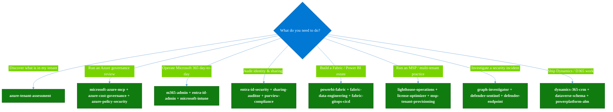
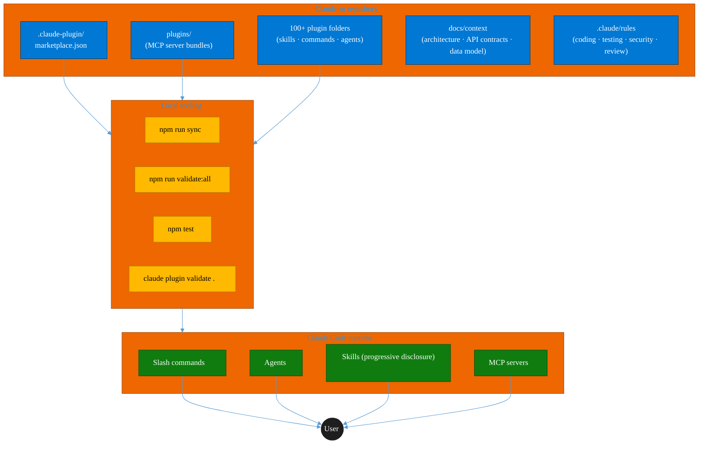
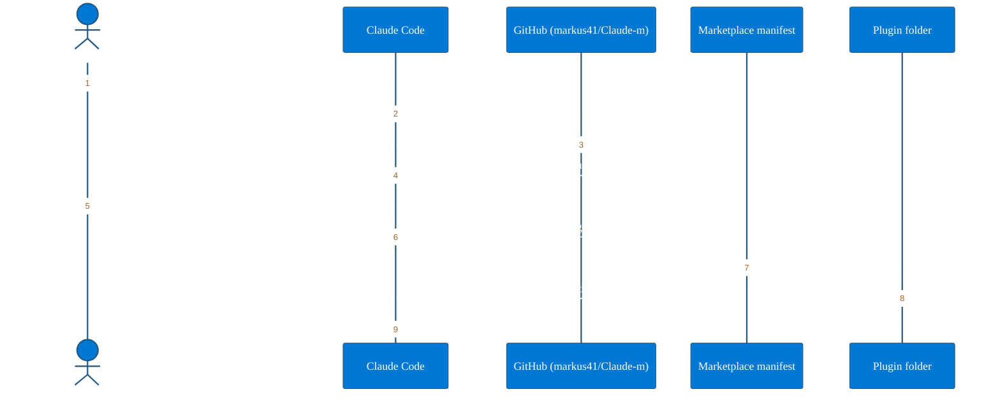
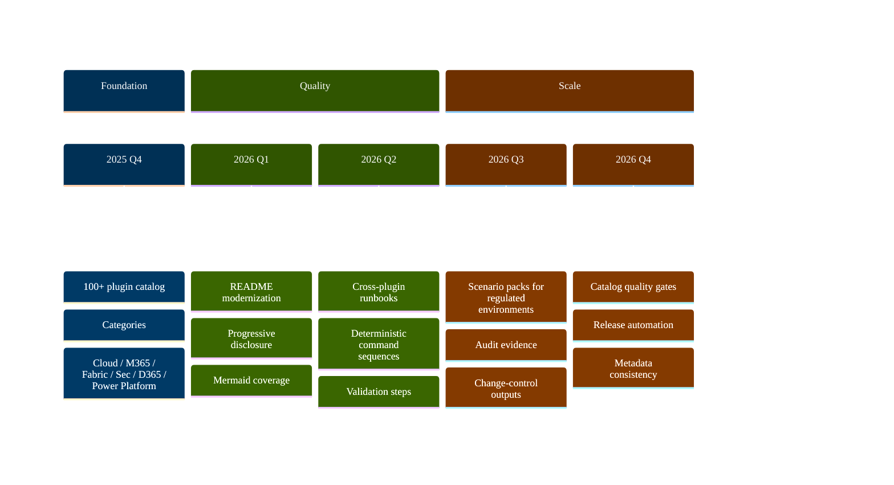

<div align="center">

<a id="top"></a>

# Claude&#8209;m

### The Microsoft Plugin Marketplace for Claude Code

**100+ production-grade plugins · Azure · Microsoft 365 · Fabric · Dynamics 365 · Power Platform · Security**

<sub>One install source. Composable runbooks. Built for engineers, MSPs, SOC teams, and analytics leaders who live inside the Microsoft cloud.</sub>

<br />

<table align="center">
<tr>
<td align="center"><b>Plugins</b><br /><code>102</code></td>
<td align="center"><b>Categories</b><br /><code>5</code></td>
<td align="center"><b>License</b><br /><code>MIT</code></td>
<td align="center"><b>Stack</b><br /><code>TypeScript · Node · MCP</code></td>
<td align="center"><b>Status</b><br /><code>Active</code></td>
</tr>
</table>

<br />

<a href="#quick-start"><b>Quick start</b></a> &nbsp;·&nbsp;
<a href="#plugin-catalog"><b>Catalog</b></a> &nbsp;·&nbsp;
<a href="#choose-your-path"><b>Choose a plugin</b></a> &nbsp;·&nbsp;
<a href="#opinionated-stacks"><b>Opinionated stacks</b></a> &nbsp;·&nbsp;
<a href="#development"><b>Develop</b></a> &nbsp;·&nbsp;
<a href="#faq--troubleshooting"><b>FAQ</b></a>

</div>

---

> [!TIP]
> **New here?** Run `/plugin marketplace add markus41/Claude-m` inside Claude Code, then jump to [**Choose your path**](#choose-your-path) to get a tailored install plan in under 60 seconds.

> [!NOTE]
> **What is this?** A curated, batteries-included Claude Code marketplace that turns Claude into a senior Microsoft cloud engineer. Each plugin is a self-contained skill pack — commands, agents, references, and (where useful) MCP servers — composable into multi-step runbooks.

---

## Table of contents

<details open>
<summary><b>Click to collapse / expand</b></summary>

- [Highlights](#highlights)
- [How it fits together](#how-it-fits-together)
- [Quick start](#quick-start)
- [Choose your path](#choose-your-path)
- [Plugin catalog](#plugin-catalog)
  - [Cloud (27)](#cloud-27)
  - [Analytics (20)](#analytics-20)
  - [Security (14)](#security-14)
  - [DevOps (11)](#devops-11)
  - [Productivity (30)](#productivity-30)
- [Opinionated stacks](#opinionated-stacks)
- [Architecture](#architecture)
- [Development](#development)
- [Validation](#validation)
- [Contributing](#contributing)
- [FAQ & troubleshooting](#faq--troubleshooting)
- [Roadmap](#roadmap)
- [License](#license)

</details>

---

## Highlights

<table>
<tr>
<td width="33%" valign="top">

### Cloud-native

Inventory, govern, and operate **Azure** at any scale — subscriptions, resource graphs, networking, AKS, App Service, Functions, Storage, Key Vault, Monitor, Backup, API Management, Service Bus.

</td>
<td width="33%" valign="top">

### Fabric-first analytics

End-to-end **Microsoft Fabric** coverage — Lakehouses, Warehouses, Real-Time Intelligence, Data Factory, Data Science, OneLake, Mirroring, Semantic Models, Capacity Ops, GitOps CI/CD.

</td>
<td width="33%" valign="top">

### Identity & compliance

**Entra ID**, **Defender XDR**, **Sentinel**, **Purview**, **Intune** — plus opinionated audit, access-review, and DLP runbooks for MSPs and SOC teams.

</td>
</tr>
<tr>
<td width="33%" valign="top">

### M365 productivity

**Teams**, **Outlook**, **SharePoint**, **OneDrive**, **Planner**, **Loop**, **OneNote**, **Forms**, **Lists**, **Bookings**, **Copilot Studio** — all wired to Microsoft Graph.

</td>
<td width="33%" valign="top">

### Dynamics & Power Platform

**Dynamics 365** (Sales, Service, Field, Project), **Business Central**, **Power Apps**, **Power Pages**, **Power Automate**, **Dataverse**, ALM, PCF.

</td>
<td width="33%" valign="top">

### AI & agents

**Azure OpenAI**, **AI Foundry**, **Document Intelligence**, **Copilot Studio**, plus agent-orchestration plugins for Azure DevOps and Microsoft Planner.

</td>
</tr>
</table>

---

## How it fits together



> [!IMPORTANT]
> Every plugin is **read-aware by default**. Destructive operations require explicit prompts — and most plugins ship with redaction patterns for sensitive output (tokens, secrets, GUIDs).

<p align="right"><a href="#top"><sub>Back to top</sub></a></p>

---

## Quick start

```bash
# 1) Add the marketplace
/plugin marketplace add markus41/Claude-m

# 2) (optional) Verify it registered
/plugin marketplace list

# 3) Install any plugin from the catalog
/plugin install <plugin-name>@claude-m-microsoft-marketplace
```

<details>
<summary><b>Three concrete examples</b></summary>

```bash
# Azure inventory + governance
/plugin install microsoft-azure-mcp@claude-m-microsoft-marketplace
/plugin install azure-cost-governance@claude-m-microsoft-marketplace

# Power BI / Fabric authoring
/plugin install powerbi-fabric@claude-m-microsoft-marketplace

# Teams lifecycle (create, archive, govern)
/plugin install teams-lifecycle@claude-m-microsoft-marketplace
```

Then ask Claude:

> _"Use `microsoft-azure-mcp` to list all resource groups in subscription `<id>`, identify resources with no recent activity, and suggest cleanup candidates."_

</details>

> [!WARNING]
> If `/plugin marketplace add` fails with `git@github.com: Permission denied (publickey)`, Git is trying SSH but no key is configured. Switch to HTTPS:
> ```bash
> git config --global url."https://github.com/".insteadOf "git@github.com:"
> ```

<p align="right"><a href="#top"><sub>Back to top</sub></a></p>

---

## Choose your path



> [!TIP]
> Click any green node above (on GitHub.com) to open the matching plugin's README directly.

<p align="right"><a href="#top"><sub>Back to top</sub></a></p>

---
## Plugin catalog

> [!NOTE]
> Every plugin is installable with one command. Click any plugin name to open its README.

<a id="cloud-27"></a>

### Cloud (27)

<details open>
<summary><b>Show all 27 cloud plugins</b></summary>

| Plugin | Description | Install |
|---|---|---|
| [`agent-foundry`](agent-foundry/README.md) | Azure AI Foundry agent lifecycle management — scaffold, deploy, test, and manage AI agents with Azure AI Foundry MCP integration | `agent-foundry` |
| [`azure-ai-services`](azure-ai-services/README.md) | Azure AI workloads — Azure OpenAI Service deployments, AI Search indexes, AI Studio/Foundry projects, Cognitive Services provisioning, content filtering, and responsible AI governance | `azure-ai-services` |
| [`azure-api-management`](azure-api-management/README.md) | Azure API Management operations - API inventory, policy drift detection, key rotation workflows, and contract diff checks across revisions. | `azure-api-management` |
| [`azure-backup-recovery`](azure-backup-recovery/README.md) | Azure Backup and Site Recovery operations - job health checks, restore drill readiness, recovery plan audits, and cross-region resilience checks. | `azure-backup-recovery` |
| [`azure-containers`](azure-containers/README.md) | Azure Container Apps, Container Instances, and Container Registry — build, push, deploy, and scale containerized workloads | `azure-containers` |
| [`azure-cost-governance`](azure-cost-governance/README.md) | Azure FinOps and governance workflows — query costs, monitor budgets, detect anomalies, and identify idle resources for optimization | `azure-cost-governance` |
| [`azure-document-intelligence`](azure-document-intelligence/README.md) | Azure AI Document Intelligence — OCR, prebuilt models (invoices, receipts, IDs, tax forms), custom models, layout analysis, document classification, and batch processing | `azure-document-intelligence` |
| [`azure-functions`](azure-functions/README.md) | Azure Functions — triggers, bindings, Durable Functions, deployment, and local development with Azure Functions Core Tools | `azure-functions` |
| [`azure-kubernetes`](azure-kubernetes/README.md) | Azure Kubernetes Service operations - cluster inventory, pod failure diagnostics, node pool scaling, and policy posture checks. | `azure-kubernetes` |
| [`azure-logic-apps`](azure-logic-apps/README.md) | Azure Logic Apps — enterprise integration workflows, Workflow Definition Language, Standard and Consumption hosting, connectors, B2B/EDI integration accounts, and CI/CD deployment | `azure-logic-apps` |
| [`azure-monitor`](azure-monitor/README.md) | Azure Monitor, Application Insights, and Log Analytics — metrics, alerts, KQL queries, dashboards, and diagnostic settings | `azure-monitor` |
| [`azure-networking`](azure-networking/README.md) | Azure Networking — VNets, subnets, NSGs, Load Balancers, Application Gateway, Front Door, DNS zones, VPN gateways, ExpressRoute, Azure Firewall, Route Tables, Bastion, and Private Link | `azure-networking` |
| [`azure-openai`](azure-openai/README.md) | Azure OpenAI Service — model deployments, fine-tuning, content filtering, prompt engineering, batch API, and quota management with az cognitiveservices and REST API | `azure-openai` |
| [`azure-organization`](azure-organization/README.md) | Azure organization and governance — management groups, subscription management, resource tagging, naming conventions, landing zones, and tenant-level hierarchy | `azure-organization` |
| [`azure-service-bus`](azure-service-bus/README.md) | Azure messaging operations for Service Bus and event-driven workloads - lag scans, dead-letter replay planning, stale subscription cleanup, and namespace quota checks. | `azure-service-bus` |
| [`azure-service-health`](azure-service-health/README.md) | Azure Service Health operations - active incident watchlists, impact scoring, runbook mapping, and communications-ready outage summaries. | `azure-service-health` |
| [`azure-sql-database`](azure-sql-database/README.md) | Azure SQL Database and Cosmos DB — provisioning, schema management, query optimization, security hardening, and backup/restore | `azure-sql-database` |
| [`azure-static-web-apps`](azure-static-web-apps/README.md) | Azure Static Web Apps — JAMstack/SPA hosting with built-in auth, API backends, PR preview environments, and staticwebapp.config.json management | `azure-static-web-apps` |
| [`azure-storage`](azure-storage/README.md) | Azure Storage — Blob, Queue, Table, and Files services with lifecycle policies, SAS tokens, and managed identity access | `azure-storage` |
| [`azure-tenant-assessment`](azure-tenant-assessment/README.md) | Entry-point Azure tenant assessment — subscription inventory, resource catalog, security posture snapshot, cost overview, and plugin setup recommendations | `azure-tenant-assessment` |
| [`azure-web-apps`](azure-web-apps/README.md) | Azure App Service — create, deploy, and manage web apps, deployment slots, custom domains, and TLS certificates via ARM REST API | `azure-web-apps` |
| [`dataverse-schema`](dataverse-schema/README.md) | Dataverse table, column, and relationship management via Web API — schema design, data seeding, and solution lifecycle | `dataverse-schema` |
| [`license-optimizer`](license-optimizer/README.md) | M365 license optimization for MSPs/CSPs — identify inactive licenses, map downgrades and upgrades, estimate savings, and generate multi-tenant Lighthouse reports for customer review meetings | `license-optimizer` |
| [`m365-admin`](m365-admin/README.md) | M365 tenant admin via Microsoft Graph — users, groups, licenses, Exchange, SharePoint, Teams, Intune, PIM, access reviews, usage reports, guest management, administrative units, Microsoft Search, and domain/federation management | `m365-admin` |
| [`m365-platform-clients`](m365-platform-clients/README.md) | TypeScript patterns for Dataverse Web API and Microsoft Graph — auth, clients, and combined provisioning workflows | `m365-platform-clients` |
| [`microsoft-azure-mcp`](plugins/azure/README.md) | Inspect subscriptions, resource groups, and resources via MCP. | `microsoft-azure-mcp` |
| [`msp-tenant-provisioning`](msp-tenant-provisioning/README.md) | Full MSP/CSP new customer provisioning — Partner Center CSP tenant creation, Azure subscription and management group setup, initial M365 security baseline, domain DNS configuration, and Microsoft 365 Lighthouse onboarding. | `msp-tenant-provisioning` |

</details>

<p align="right"><a href="#top"><sub>Back to top</sub></a></p>

<a id="analytics-20"></a>

### Analytics (20)

<details open>
<summary><b>Show all 20 analytics plugins</b></summary>

| Plugin | Description | Install |
|---|---|---|
| [`fabric-ai-agents`](fabric-ai-agents/README.md) | Microsoft Fabric AI and operations agents - anomaly detector, data agent, operations agent, ontology, and digital twin builder workflows with preview guardrails. | `fabric-ai-agents` |
| [`fabric-capacity-ops`](fabric-capacity-ops/README.md) | Microsoft Fabric Capacity Operations — CU monitoring, throttling diagnostics, workload tuning, autoscale planning, and cost-performance optimization | `fabric-capacity-ops` |
| [`fabric-data-activator`](fabric-data-activator/README.md) | Microsoft Fabric Data Activator — Reflex triggers, condition-based alerts, real-time actions, and event-driven automation on Fabric data | `fabric-data-activator` |
| [`fabric-data-engineering`](fabric-data-engineering/README.md) | Microsoft Fabric Data Engineering — lakehouses, Spark notebooks, data pipelines, Delta Lake tables, lakehouse SQL endpoints, multi-notebook orchestration, workspace lifecycle management, pipeline monitoring, and advanced optimization | `fabric-data-engineering` |
| [`fabric-data-factory`](fabric-data-factory/README.md) | Microsoft Fabric Data Factory — data pipelines, Dataflow Gen2, Copy activity, orchestration patterns, and scheduling | `fabric-data-factory` |
| [`fabric-data-prep-jobs`](fabric-data-prep-jobs/README.md) | Microsoft Fabric data preparation jobs - Dataflow Gen1, Apache Airflow jobs, mounted Azure Data Factory pipelines, and dbt job governance for deterministic prep workflows. | `fabric-data-prep-jobs` |
| [`fabric-data-science`](fabric-data-science/README.md) | Microsoft Fabric Data Science — ML experiments, model training, MLflow tracking, PREDICT function, and semantic link integration | `fabric-data-science` |
| [`fabric-data-store`](fabric-data-store/README.md) | Microsoft Fabric data store operations - Cosmos DB database, SQL database, Snowflake database links, datamarts, and Event Schema Set governance. | `fabric-data-store` |
| [`fabric-data-warehouse`](fabric-data-warehouse/README.md) | Microsoft Fabric Data Warehouse — Synapse warehouses, T-SQL DDL/DML, cross-database queries, stored procedures, and data modeling | `fabric-data-warehouse` |
| [`fabric-graph-geo`](fabric-graph-geo/README.md) | Microsoft Fabric graph and geospatial analytics - graph model, graph queryset, map, and exploration workflows with preview guardrails. | `fabric-graph-geo` |
| [`fabric-mirroring`](fabric-mirroring/README.md) | Microsoft Fabric Mirroring — source onboarding, CDC replication, latency monitoring, schema drift handling, and reconciliation workflows | `fabric-mirroring` |
| [`fabric-mirroring-azure`](fabric-mirroring-azure/README.md) | Microsoft Fabric mirroring for Azure-native sources - Cosmos DB, PostgreSQL, Databricks catalog, Azure SQL Database, and SQL Managed Instance. | `fabric-mirroring-azure` |
| [`fabric-mirroring-external`](fabric-mirroring-external/README.md) | Microsoft Fabric mirroring for external sources - generic databases, BigQuery, Oracle, SAP, Snowflake, and SQL Server with preview caveats where applicable. | `fabric-mirroring-external` |
| [`fabric-observability`](fabric-observability/README.md) | Microsoft Fabric Observability — Monitor Hub triage, notebook/pipeline reliability runbooks, SLA tracking, alert design, and incident diagnostics | `fabric-observability` |
| [`fabric-onelake`](fabric-onelake/README.md) | Microsoft Fabric OneLake — unified data lake, shortcuts, file explorer, ADLS Gen2 APIs, and cross-workspace data access | `fabric-onelake` |
| [`fabric-real-time-analytics`](fabric-real-time-analytics/README.md) | Microsoft Fabric Real-Time Analytics — Eventhouse, KQL databases, eventstreams, Real-Time Dashboards, and streaming ingestion | `fabric-real-time-analytics` |
| [`fabric-semantic-models`](fabric-semantic-models/README.md) | Microsoft Fabric Semantic Models — Direct Lake modeling, DAX governance, calculation groups, XMLA deployment, and semantic link automation | `fabric-semantic-models` |
| [`powerbi-fabric`](powerbi-fabric/README.md) | DAX measures, Power Query M, Power BI Embedded, deployment pipelines, PBIP scaffolding, Fabric Lakehouse, Direct Lake, performance optimization | `powerbi-fabric` |
| [`powerbi-paginated-reports`](powerbi-paginated-reports/README.md) | Power BI paginated reports through Fabric — RDL authoring, VB.NET expressions, data source configuration, rendering/export, REST API automation, SSRS-to-Fabric migration, performance tuning, and troubleshooting | `powerbi-paginated-reports` |
| [`process-task-mining`](process-task-mining/README.md) | Process and task mining from M365, Power Automate, and Azure Monitor logs — extract event logs, discover process models, analyze performance, and check conformance | `process-task-mining` |

</details>

<p align="right"><a href="#top"><sub>Back to top</sub></a></p>

<a id="security-14"></a>

### Security (14)

<details open>
<summary><b>Show all 14 security plugins</b></summary>

| Plugin | Description | Install |
|---|---|---|
| [`azure-key-vault`](azure-key-vault/README.md) | Azure Key Vault — secrets, keys, and certificates management with RBAC, rotation policies, and managed identity integration | `azure-key-vault` |
| [`azure-policy-security`](azure-policy-security/README.md) | Evaluate Azure policy compliance and security posture — policy assignments, drift analysis, remediation planning, and guardrail recommendations | `azure-policy-security` |
| [`defender-endpoint`](defender-endpoint/README.md) | Microsoft Defender for Endpoint operations - incident triage, machine isolation, live response package metadata checks, and evidence summary generation. | `defender-endpoint` |
| [`defender-sentinel`](defender-sentinel/README.md) | Microsoft Sentinel SIEM/SOAR and Defender XDR — incident triage, KQL threat hunting, analytics rules, SOAR playbooks, advanced hunting, and unified security operations center workflows | `defender-sentinel` |
| [`entra-access-reviews`](entra-access-reviews/README.md) | Microsoft Entra access review automation - stale privileged access detection, review cycle drafting, remediation ticket generation, and status reporting. | `entra-access-reviews` |
| [`entra-id-admin`](entra-id-admin/README.md) | Microsoft Entra ID administration via Graph API — full user/group lifecycle, directory roles, PIM, authentication methods, admin units, B2B guest management, license assignment, named locations, and entitlement management | `entra-id-admin` |
| [`entra-id-security`](entra-id-security/README.md) | Microsoft Entra ID identity governance and security — app registrations, service principals, conditional access, sign-in logs, and risk detection | `entra-id-security` |
| [`fabric-security-governance`](fabric-security-governance/README.md) | Microsoft Fabric Security Governance — workspace RBAC, RLS/OLS patterns, sensitivity labels, lineage controls, and audit readiness | `fabric-security-governance` |
| [`graph-investigator`](graph-investigator/README.md) | Microsoft Graph Investigator — unified user investigation, mailbox forensics, activity timelines, device correlation, and forensic reporting across all M365 services | `graph-investigator` |
| [`lighthouse-health`](lighthouse-health/README.md) | Microsoft 365 Lighthouse tenant health scorecard — green/yellow/red dashboard for security posture, MFA coverage, stale accounts, and licensing anomalies across managed tenants | `lighthouse-health` |
| [`lighthouse-operations`](lighthouse-operations/README.md) | Comprehensive Azure Lighthouse and M365 Lighthouse operations for MSPs/CSPs — Azure delegation ARM/Bicep templates, managed services marketplace offers, GDAP full lifecycle management, baseline deployment automation, cross-tenant governance, Partner Center integration, and alert management. | `lighthouse-operations` |
| [`microsoft-intune`](microsoft-intune/README.md) | Device lifecycle and compliance management for Microsoft Intune and Endpoint Manager - non-compliant device detection, lost device actions, compliance policy rollout, and app protection policy review. | `microsoft-intune` |
| [`purview-compliance`](purview-compliance/README.md) | Microsoft Purview compliance workflows — DLP review, retention planning, sensitivity labels, eDiscovery readiness, and guided compliance playbooks with audit-ready change logs | `purview-compliance` |
| [`sharing-auditor`](sharing-auditor/README.md) | SharePoint and OneDrive external sharing auditor — find overshared links, anonymous access, stale guest users, and auto-generate approval tasks for safe revocation | `sharing-auditor` |

</details>

<p align="right"><a href="#top"><sub>Back to top</sub></a></p>

<a id="devops-11"></a>

### DevOps (11)

<details open>
<summary><b>Show all 11 devops plugins</b></summary>

| Plugin | Description | Install |
|---|---|---|
| [`azure-devops`](azure-devops/README.md) | Comprehensive Azure DevOps expertise — Git repos with passwordless auth (GCM, WIF, SSH), YAML and Classic pipelines, deployment environments, agent pools, work items, boards, sprints, test plans, security namespaces, dashboards, wikis, service hooks, Analytics OData, CLI, and extensions | `azure-devops` |
| [`azure-devops-orchestrator`](azure-devops-orchestrator/README.md) | Intelligent orchestration for Azure DevOps — ship work items with Claude Code, triage backlogs, plan sprints, coordinate releases, monitor pipelines, and balance workloads across projects. Integrates with microsoft-teams-mcp and microsoft-outlook-mcp when installed. | `azure-devops-orchestrator` |
| [`azure-dotnet-webapp`](azure-dotnet-webapp/README.md) | Scaffold and build ASP.NET Core Web API and Blazor apps on Azure — Minimal API, controllers, Microsoft.Identity.Web, EF Core, SignalR, OpenAPI, App Service deployment, and Graph API integration patterns. | `azure-dotnet-webapp` |
| [`azure-graph-dotnet`](azure-graph-dotnet/README.md) | Scaffold and build Microsoft Graph C# / .NET solutions on Azure — Functions, Container Jobs, Azure Identity, Polly resilience, and SharePoint file intelligence implementations. | `azure-graph-dotnet` |
| [`fabric-developer-runtime`](fabric-developer-runtime/README.md) | Microsoft Fabric developer runtime operations - GraphQL API, environments, user data functions, and variable library governance. | `fabric-developer-runtime` |
| [`fabric-gitops-cicd`](fabric-gitops-cicd/README.md) | Microsoft Fabric GitOps CI/CD — workspace Git integration, deployment pipelines, artifact promotion, branch strategy, and release validation | `fabric-gitops-cicd` |
| [`fluent-ui-design`](fluent-ui-design/README.md) | Microsoft Fluent 2 design system mastery — design tokens, color system, typography, layout, components, Teams theming, advanced UI patterns, Griffel styling, accessibility, responsive design, and Figma design kits | `fluent-ui-design` |
| [`marketplace-dev-tools`](marketplace-dev-tools/README.md) | Research Microsoft APIs, scaffold new plugins, extend existing ones, and audit marketplace coverage | `marketplace-dev-tools` |
| [`microsoft-docs-mcp`](plugins/docs/README.md) | Search and fetch official Microsoft documentation via the Learn MCP server. | `microsoft-docs-mcp` |
| [`powerplatform-alm`](powerplatform-alm/README.md) | Power Platform ALM — environments, solution transport, CI/CD pipelines, PCF controls, and deployment automation | `powerplatform-alm` |
| [`teams-app-dev`](teams-app-dev/README.md) | Custom Teams app development — manifest v1.25, M365 Agents Toolkit, Adaptive Cards, message extensions, meeting apps, Custom Engine Agents, Agent 365 blueprints, workflow bots, notification hubs, Copilot plugins, Teams SDK migration, and advanced meeting experiences with Live Share | `teams-app-dev` |

</details>

<p align="right"><a href="#top"><sub>Back to top</sub></a></p>

<a id="productivity-30"></a>

### Productivity (30)

<details open>
<summary><b>Show all 30 productivity plugins</b></summary>

| Plugin | Description | Install |
|---|---|---|
| [`business-central`](business-central/README.md) | Microsoft Dynamics 365 Business Central ERP — finance, supply chain, and inventory management via BC OData v4 / API v2.0 REST API | `business-central` |
| [`copilot-studio-bots`](copilot-studio-bots/README.md) | Copilot Studio — design bot topics, author trigger phrases, configure generative AI orchestration, and publish chatbots | `copilot-studio-bots` |
| [`domain-business-name-finder`](plugins/domain-business-name-finder/README.md) | Brainstorm business names and check domain availability across popular TLDs using Firecrawl, Perplexity, WHOIS, and Domain Search MCP servers | `domain-business-name-finder` |
| [`dynamics-365-crm`](dynamics-365-crm/README.md) | Dynamics 365 Sales and Customer Service via Dataverse Web API — leads, opportunities, accounts, contacts, cases, SLAs, queues, pipeline reporting, and CRM workflow automation | `dynamics-365-crm` |
| [`dynamics-365-field-service`](dynamics-365-field-service/README.md) | Dynamics 365 Field Service via Dataverse Web API — work orders, bookings, resource scheduling, service accounts, assets, and IoT-triggered service events | `dynamics-365-field-service` |
| [`dynamics-365-project-ops`](dynamics-365-project-ops/README.md) | Dynamics 365 Project Operations via Dataverse Web API — projects, WBS, time and expense tracking, resource assignments, project contracts, and billing | `dynamics-365-project-ops` |
| [`excel-automation`](excel-automation/README.md) | Excel data cleaning with pandas, Office Script generation, and Power Automate flow creation | `excel-automation` |
| [`excel-office-scripts`](excel-office-scripts/README.md) | Deep knowledge of Excel Office Scripts — Microsoft's TypeScript-based automation platform for Excel on the web | `excel-office-scripts` |
| [`exchange-mailflow`](exchange-mailflow/README.md) | Exchange Online mail flow diagnostics and deliverability — guided 'email not received' troubleshooting, transport rules, quarantine, connectors, and SPF/DKIM/DMARC checks with client-safe explanations | `exchange-mailflow` |
| [`fabric-distribution-apps`](fabric-distribution-apps/README.md) | Microsoft Fabric org app distribution - package, permission model, release, and adoption workflows for organizational app rollout. | `fabric-distribution-apps` |
| [`m365-meeting-intelligence`](m365-meeting-intelligence/README.md) | Meeting transcript intelligence for Teams and Outlook - transcript fetch, commitment extraction, task handoff, and owner reminder workflows. | `m365-meeting-intelligence` |
| [`microsoft-bookings`](microsoft-bookings/README.md) | Microsoft Bookings — manage appointment calendars, services, staff availability, and customer bookings via Graph API | `microsoft-bookings` |
| [`microsoft-excel-mcp`](plugins/excel/README.md) | Read and update workbooks, worksheets, ranges, and tables via MCP. | `microsoft-excel-mcp` |
| [`microsoft-forms-surveys`](microsoft-forms-surveys/README.md) | Microsoft Forms — create surveys, add questions, collect responses, and summarize results via Graph API | `microsoft-forms-surveys` |
| [`microsoft-lists-tracker`](microsoft-lists-tracker/README.md) | Microsoft Lists — create and manage lists for process tracking, issue logs, and project trackers via Graph API | `microsoft-lists-tracker` |
| [`microsoft-loop`](microsoft-loop/README.md) | Microsoft Loop workspaces, pages, and components — create collaborative spaces, embed portable Loop components across M365 apps, manage via Graph API, and govern Loop at the tenant level. | `microsoft-loop` |
| [`microsoft-outlook-mcp`](plugins/outlook/README.md) | Send email and manage inbox/calendar tasks via MCP. | `microsoft-outlook-mcp` |
| [`microsoft-sharepoint-mcp`](plugins/sharepoint/README.md) | Browse and transfer SharePoint files through MCP tools. | `microsoft-sharepoint-mcp` |
| [`microsoft-teams-mcp`](plugins/teams/README.md) | Send messages, create meetings, and manage Teams channels via MCP. | `microsoft-teams-mcp` |
| [`notion`](notion/README.md) | Comprehensive Notion mastery — page design and styling, every block type, databases and formulas, AI features, MCP integration, REST API automation, and professional page templates | `notion` |
| [`onedrive`](onedrive/README.md) | OneDrive file management via Microsoft Graph — upload, download, share, search, and manage files and folders | `onedrive` |
| [`onenote-knowledge-base`](onenote-knowledge-base/README.md) | OneNote Knowledge Base - headless-first Graph automation for advanced page architecture, styling, and task workflows | `onenote-knowledge-base` |
| [`planner-orchestrator`](planner-orchestrator/README.md) | Intelligent orchestration for Microsoft Planner — ship tasks with Claude Code, triage backlogs, plan sprint buckets, monitor deadlines, and balance workloads across plans. Integrates with microsoft-teams-mcp, microsoft-outlook-mcp, and powerbi-fabric when installed. | `planner-orchestrator` |
| [`planner-todo`](planner-todo/README.md) | Microsoft Planner and To Do task management via Graph API — classic plans, Premium Dataverse projects, buckets, tasks, assignments, checklists, nested plans, roster plans, sprints, goals, and Business Scenarios | `planner-todo` |
| [`power-automate`](power-automate/README.md) | Design and troubleshoot Power Automate cloud flows — trigger/action patterns, run diagnostics, retries, and deployment-safe flow definitions | `power-automate` |
| [`power-pages`](power-pages/README.md) | Microsoft Power Pages — sites, page templates, Liquid, web forms, table permissions, web roles, and Dataverse portal integration | `power-pages` |
| [`powerapps`](powerapps/README.md) | Microsoft Power Apps development — canvas app creation, model-driven app scaffolding, deployment, formulas, custom connectors, component libraries, and PCF controls | `powerapps` |
| [`servicedesk-runbooks`](servicedesk-runbooks/README.md) | M365 service desk auto-runbooks — guided workflows for common tickets like shared mailbox access, MFA reset, file recovery, and password reset with pre-checks, approval gates, and end-user verification | `servicedesk-runbooks` |
| [`sharepoint-file-intelligence`](sharepoint-file-intelligence/README.md) | Scan, categorize, deduplicate, and organize SharePoint and OneDrive files at scale using Microsoft Graph. | `sharepoint-file-intelligence` |
| [`teams-lifecycle`](teams-lifecycle/README.md) | Teams lifecycle management — create and archive teams with templates, enforce naming and ownership, apply sensitivity labels, and run expiration reviews using non-technical 'project start/end' language | `teams-lifecycle` |

</details>

<p align="right"><a href="#top"><sub>Back to top</sub></a></p>

---

## Opinionated stacks

Pre-curated multi-plugin "playbooks" — install the bundle, run the prompt, get the outcome.

<table>
<tr>
<th width="30%">Stack</th>
<th>Install</th>
<th>Sample prompt</th>
</tr>

<tr>
<td valign="top"><b>Microsoft collaboration audit</b><br /><sub>Comms · files · calendars</sub></td>
<td valign="top">

```bash
/plugin install microsoft-teams-mcp@claude-m-microsoft-marketplace
/plugin install microsoft-outlook-mcp@claude-m-microsoft-marketplace
/plugin install microsoft-sharepoint-mcp@claude-m-microsoft-marketplace
```

</td>
<td valign="top"><i>"Audit communication and file-handoff risks for this week and produce a remediation plan."</i></td>
</tr>

<tr>
<td valign="top"><b>Azure governance review</b><br /><sub>Inventory · cost · policy</sub></td>
<td valign="top">

```bash
/plugin install microsoft-azure-mcp@claude-m-microsoft-marketplace
/plugin install azure-cost-governance@claude-m-microsoft-marketplace
/plugin install azure-policy-security@claude-m-microsoft-marketplace
```

</td>
<td valign="top"><i>"List subscriptions, RGs, and resources, then flag policy drift and likely cost waste."</i></td>
</tr>

<tr>
<td valign="top"><b>Entra + compliance sweep</b><br /><sub>Identity · DLP · sharing</sub></td>
<td valign="top">

```bash
/plugin install entra-id-security@claude-m-microsoft-marketplace
/plugin install purview-compliance@claude-m-microsoft-marketplace
/plugin install sharing-auditor@claude-m-microsoft-marketplace
```

</td>
<td valign="top"><i>"Review conditional access gaps, overshared files, and DLP policy coverage."</i></td>
</tr>

<tr>
<td valign="top"><b>MSP multi-tenant health</b><br /><sub>Lighthouse · licensing · runbooks</sub></td>
<td valign="top">

```bash
/plugin install lighthouse-health@claude-m-microsoft-marketplace
/plugin install license-optimizer@claude-m-microsoft-marketplace
/plugin install servicedesk-runbooks@claude-m-microsoft-marketplace
```

</td>
<td valign="top"><i>"Score all tenants for security posture and produce a customer-ready monthly report."</i></td>
</tr>

<tr>
<td valign="top"><b>Fabric estate launch</b><br /><sub>Lakehouse · pipelines · CI/CD</sub></td>
<td valign="top">

```bash
/plugin install fabric-data-engineering@claude-m-microsoft-marketplace
/plugin install fabric-data-factory@claude-m-microsoft-marketplace
/plugin install fabric-gitops-cicd@claude-m-microsoft-marketplace
```

</td>
<td valign="top"><i>"Stand up a Bronze/Silver/Gold lakehouse, scaffold pipelines, and wire workspace Git integration."</i></td>
</tr>

<tr>
<td valign="top"><b>Security incident response</b><br /><sub>XDR · investigation · forensics</sub></td>
<td valign="top">

```bash
/plugin install defender-sentinel@claude-m-microsoft-marketplace
/plugin install graph-investigator@claude-m-microsoft-marketplace
/plugin install entra-access-reviews@claude-m-microsoft-marketplace
```

</td>
<td valign="top"><i>"Triage today's high-severity Sentinel incidents, build a forensic timeline per affected user, and stage access-review remediations."</i></td>
</tr>
</table>

<p align="right"><a href="#top"><sub>Back to top</sub></a></p>

---

## Architecture



<details>
<summary><b>Plugin anatomy — what a single plugin folder contains</b></summary>

```text
<plugin-name>/
├── .claude-plugin/
│   └── plugin.json          # name, version, category, description
├── commands/                # /command-name.md slash commands
│   └── *.md
├── agents/                  # subagents with system prompts
│   └── *.md
├── skills/                  # progressive-disclosure skill packs
│   └── <skill>/
│       ├── SKILL.md
│       └── references/
│           └── *.md
├── (optional) src/          # MCP server source (TypeScript)
├── (optional) .mcp.json     # MCP server registration
└── README.md                # this document
```

</details>

<details>
<summary><b>Lifecycle of an install</b></summary>



</details>

<p align="right"><a href="#top"><sub>Back to top</sub></a></p>

---

## Development

```bash
# Install
npm install

# Build TypeScript
npm run build

# Lint / type-check
npm run lint

# Run tests
npm test

# Sync descriptions across marketplace.json + CLAUDE.md
npm run sync

# Full pipeline (sync → setup → validate → build → test)
npm run deploy
```

<details>
<summary><b>Repo conventions</b></summary>

| Area | Rule |
|---|---|
| Branching | Feature branches off `main`; prefix with `claude/` |
| Commits | Conventional, scoped, descriptive |
| Pre-merge | `npm test` + `npm run validate:all` must pass |
| Code style | See [`.claude/rules/coding.md`](.claude/rules/coding.md) |
| Testing | See [`.claude/rules/testing.md`](.claude/rules/testing.md) |
| Security | See [`.claude/rules/security.md`](.claude/rules/security.md) |
| Review | See [`.claude/rules/review.md`](.claude/rules/review.md) |

</details>

<p align="right"><a href="#top"><sub>Back to top</sub></a></p>

---

## Validation

Run the same checks locally and in CI:

```bash
# Inside Claude Code
/plugin validate .

# CLI
claude plugin validate .

# Repo-level scripts
npm run validate:marketplace   # checks .claude-plugin/marketplace.json
npm run validate:plugins       # checks every plugins/*/plugin.json
npm run validate:all           # both, plus type-check + tests
```

> [!CAUTION]
> Never relax `strict: true` on first-party plugins to silence a validation error. Fix the underlying schema/metadata mismatch instead.

<p align="right"><a href="#top"><sub>Back to top</sub></a></p>

---

## Contributing

<details>
<summary><b>Adding a new plugin</b></summary>

1. Scaffold a plugin folder following the **Plugin anatomy** above.
2. Add the entry to [`.claude-plugin/marketplace.json`](.claude-plugin/marketplace.json).
3. Run `npm run sync` to refresh derived docs.
4. Run `npm run validate:all` and fix any errors.
5. Open a PR using the [PR template](.claude/templates/pr-description.md).

</details>

<details>
<summary><b>Improving an existing plugin</b></summary>

- Keep skills small and progressively disclosed; references should be lazily loaded.
- Add tests for any new command or agent behavior.
- Update the plugin's local `README.md` to reflect the new behavior.
- Bump `version` in the plugin's `plugin.json` if behavior changed in user-visible ways.

</details>

<details>
<summary><b>Code-of-conduct &amp; security</b></summary>

- Never commit secrets, tokens, or API keys.
- Validate and sanitize all external input.
- Use parameterized queries; never concatenate SQL.
- Follow least-privilege on all IAM roles and service principals.

</details>

<p align="right"><a href="#top"><sub>Back to top</sub></a></p>

---

## FAQ & troubleshooting

<details>
<summary><b>Q: Does this work with the Claude Code web app and IDE extensions?</b></summary>

Yes. The marketplace is portable across the CLI, the web app at `claude.ai/code`, the desktop app, and the JetBrains / VS Code extensions. Plugins that depend on local-only resources (e.g., MCP servers spawned over stdio) work best in environments where the host can spawn child processes.

</details>

<details>
<summary><b>Q: Why use a marketplace instead of cloning each plugin?</b></summary>

A marketplace is centrally indexed, version-pinned, and auditable. Installs are reproducible; upgrades are atomic; org admins can allow-list with `strictKnownMarketplaces` so users only install vetted plugins.

</details>

<details>
<summary><b>Q: I keep getting <code>Permission denied (publickey)</code> when adding the marketplace.</b></summary>

Git is trying SSH but no key is configured. Switch to HTTPS:

```bash
git config --global url."https://github.com/".insteadOf "git@github.com:"
```

Then re-run `/plugin marketplace add markus41/Claude-m`.

</details>

<details>
<summary><b>Q: How do I uninstall a plugin?</b></summary>

```bash
/plugin uninstall <plugin-name>
```

To remove the entire marketplace registration:

```bash
/plugin marketplace remove claude-m-microsoft-marketplace
```

</details>

<details>
<summary><b>Q: Are MCP server credentials stored safely?</b></summary>

Plugins read credentials from environment variables you control (e.g. `AZURE_CLIENT_SECRET`). The marketplace itself never ships secrets. For production, source secrets from Azure Key Vault, AWS Secrets Manager, or your team's secret store and inject them at runtime — never commit them.

</details>

<details>
<summary><b>Q: Can I customize a plugin's commands or skills locally?</b></summary>

Yes — fork the plugin folder under your own marketplace repo, set `strict: false`, and modify command/agent definitions. Keep first-party plugins in this repo with `strict: true`.

</details>

<p align="right"><a href="#top"><sub>Back to top</sub></a></p>

---

## Roadmap



- Expand cross-plugin runbooks with deterministic command sequences and validation steps.
- Add scenario packs for regulated environments (least privilege, audit evidence, change-control outputs).
- Improve catalog quality gates and release automation for metadata consistency across plugins.

<p align="right"><a href="#top"><sub>Back to top</sub></a></p>

---

## License

[MIT](LICENSE) © Markus Ahling.

<div align="center">

<sub>Built with care for the Microsoft ecosystem · Powered by <a href="https://docs.claude.com/claude-code">Claude Code</a></sub>

</div>
