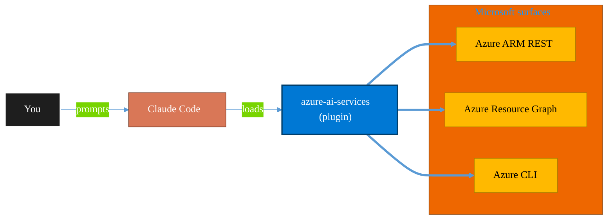

<!-- claude-m:premium-header:start -->
<div align="center">

<a id="top"></a>

# azure-ai-services

### Azure AI workloads — Azure OpenAI Service deployments, AI Search indexes, AI Studio/Foundry projects, Cognitive Services provisioning, content filtering, and responsible AI governance

<sub>Inventory, govern, and operate Azure resources at any scale.</sub>

<br />

<table align="center">
<tr>
<td align="center"><b>Category</b><br /><code>Cloud</code></td>
<td align="center"><b>Surfaces</b><br /><sub>Azure ARM · Resource Graph · ARM REST · CLI</sub></td>
<td align="center"><b>Version</b><br /><code>1.0.0</code></td>
<td align="center"><b>Marketplace</b><br /><code>claude-m-microsoft-marketplace</code></td>
</tr>
</table>

<sub><code>microsoft</code> &nbsp;·&nbsp; <code>azure</code> &nbsp;·&nbsp; <code>azure-openai</code> &nbsp;·&nbsp; <code>ai-search</code> &nbsp;·&nbsp; <code>cognitive-services</code> &nbsp;·&nbsp; <code>ai-studio</code></sub>

<a href="#install"><b>Install</b></a> &nbsp;·&nbsp;
<a href="#overview"><b>Overview</b></a> &nbsp;·&nbsp;
<a href="#architecture"><b>Architecture</b></a> &nbsp;·&nbsp;
<a href="#related-plugins"><b>Related plugins</b></a> &nbsp;·&nbsp;
<a href="../README.md"><b>Marketplace</b></a>

</div>

---

> [!TIP]
> **One-line install** — `/plugin install azure-ai-services@claude-m-microsoft-marketplace`


## Overview

> Azure AI workloads — Azure OpenAI Service deployments, AI Search indexes, AI Studio/Foundry projects, Cognitive Services provisioning, content filtering, and responsible AI governance

<details>
<summary><b>What ships in this plugin</b> (commands, agents, skills)</summary>

| Component | Items |
|---|---|
| **Commands** | `/azure-ai-services-setup` · `/azure-ai-studio-setup` · `/azure-openai-audit` · `/azure-openai-deploy` · `/azure-search-index` |
| **Agents** | `azure-ai-services-reviewer` |
| **Skills** | `azure-ai-services` |

</details>


<details>
<summary><b>Quick example</b></summary>

```text
Use azure-ai-services to audit and operate Azure resources end-to-end.
```

</details>

<a id="architecture"></a>

## Architecture



<a id="install"></a>

## Install

```bash
/plugin marketplace add markus41/Claude-m
/plugin install azure-ai-services@claude-m-microsoft-marketplace
```

> [!IMPORTANT]
> This plugin operates against **Azure ARM · Resource Graph · ARM REST · CLI**. Configure credentials via environment variables — never commit secrets.

[Back to top](#top)

---

<!-- claude-m:premium-header:end -->

Azure AI workloads plugin for Claude Code. Covers Azure OpenAI Service deployments, Azure AI Search indexes and RAG pipelines, Azure AI Studio / AI Foundry projects, Cognitive Services provisioning, content filtering, quota management, and responsible AI governance.

## What it covers

- **Azure OpenAI Service** — deployments (GPT-4o, GPT-4o-mini, embeddings, DALL-E, Whisper), quota management, fine-tuning, content filter policies
- **Azure AI Search** — index schema design with vector fields, HNSW configuration, semantic ranking, indexers, skillsets, hybrid search
- **Azure AI Studio / Foundry** — AI Hub and Project provisioning, connections (OpenAI, Search, Blob), model catalog, evaluation
- **Cognitive Services** — Language, Vision, Speech, Translator endpoint provisioning
- **Responsible AI** — content filter governance, managed identity patterns, PII handling, rate limiting

## Install

```bash
/plugin install azure-ai-services@claude-m-microsoft-marketplace
```

## Required permissions

| Workload | Role |
|---|---|
| Azure OpenAI management (deployments, filters) | `Cognitive Services Contributor` or `Azure AI Administrator` |
| Azure OpenAI data plane (completions, embeddings) | `Cognitive Services OpenAI User` |
| Azure AI Search management | `Search Service Contributor` |
| Azure AI Search data plane | `Search Index Data Contributor` |
| AI Studio / Foundry Hub + Project | `Azure AI Developer` or `Owner` on hub |

## Setup

```
/azure-ai-services-setup
```

Discovers or creates Azure OpenAI resources, checks quota, validates RBAC, tests data-plane connectivity, and optionally sets up AI Search.

## Commands

| Command | Description |
|---|---|
| `/azure-ai-services-setup` | Validate auth, discover resources, check quota and connectivity |
| `/azure-openai-deploy` | Provision a new model deployment with SKU, capacity, and content filter |
| `/azure-openai-audit` | Audit all deployments — quota, content filters, RBAC, governance gaps |
| `/azure-search-index` | Create or update an AI Search index with vector + semantic config |
| `/azure-ai-studio-setup` | Scaffold an AI Hub and Project with OpenAI and Search connections |

## Example prompts

- "Use `azure-ai-services` to audit all Azure OpenAI deployments in my subscription"
- "Deploy gpt-4o with 30k TPM Standard capacity and a production content filter policy"
- "Create an AI Search index named 'knowledge-base' with 1536-dimension vector fields and semantic ranker"
- "Set up an AI Foundry project in rg-ai-dev with connections to my OpenAI account and Search service"
- "Show me which Azure OpenAI deployments are using deprecated model versions"

## Auth pattern

Uses the integration context contract (`docs/integration-context.md`). Required context:

```
tenantId + subscriptionId + AZURE_OPENAI_ACCOUNT_NAME (or AZURE_SEARCH_SERVICE_NAME)
```

Managed identity is preferred over API keys for production deployments.
<!-- claude-m:premium-footer:start -->

---

<a id="related-plugins"></a>

## Related plugins

<table>
<tr><th>Plugin</th><th>What it does</th></tr>
<tr><td><a href="../azure-openai/README.md"><code>azure-openai</code></a></td><td>Azure OpenAI Service — model deployments, fine-tuning, content filtering, prompt engineering, batch API, and quota management with az cognitiveservices and REST API</td></tr>
<tr><td><a href="../agent-foundry/README.md"><code>agent-foundry</code></a></td><td>Azure AI Foundry agent lifecycle management — scaffold, deploy, test, and manage AI agents with Azure AI Foundry MCP integration</td></tr>
<tr><td><a href="../azure-containers/README.md"><code>azure-containers</code></a></td><td>Azure Container Apps, Container Instances, and Container Registry — build, push, deploy, and scale containerized workloads</td></tr>
<tr><td><a href="../azure-cost-governance/README.md"><code>azure-cost-governance</code></a></td><td>Azure FinOps and governance workflows — query costs, monitor budgets, detect anomalies, and identify idle resources for optimization</td></tr>
<tr><td><a href="../azure-document-intelligence/README.md"><code>azure-document-intelligence</code></a></td><td>Azure AI Document Intelligence — OCR, prebuilt models (invoices, receipts, IDs, tax forms), custom models, layout analysis, document classification, and batch processing</td></tr>
<tr><td><a href="../azure-functions/README.md"><code>azure-functions</code></a></td><td>Azure Functions — triggers, bindings, Durable Functions, deployment, and local development with Azure Functions Core Tools</td></tr>
</table>


<details>
<summary><b>Composable stacks that include <code>azure-ai-services</code></b></summary>

Combine with sibling plugins to build cross-surface runbooks. Browse the full [marketplace catalog](../README.md#plugin-catalog) for a tailored selection.

</details>

---

<div align="center">

<sub>Part of <a href="../README.md"><b>Claude-m</b></a> — the Microsoft plugin marketplace for Claude Code.</sub>

<sub>Licensed under <a href="../LICENSE">MIT</a>. Built for engineers, MSPs, SOC teams, and analytics leaders.</sub>

</div>

<!-- claude-m:premium-footer:end -->

