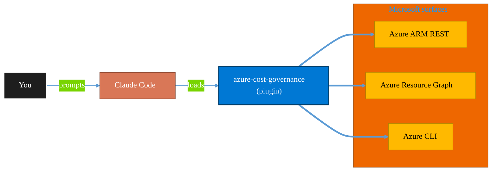

<!-- claude-m:premium-header:start -->
<div align="center">

<a id="top"></a>

# azure-cost-governance

### Azure FinOps and governance workflows — query costs, monitor budgets, detect anomalies, and identify idle resources for optimization

<sub>Inventory, govern, and operate Azure resources at any scale.</sub>

<br />

<table align="center">
<tr>
<td align="center"><b>Category</b><br /><code>Cloud</code></td>
<td align="center"><b>Surfaces</b><br /><sub>Azure ARM · Resource Graph · ARM REST · CLI</sub></td>
<td align="center"><b>Version</b><br /><code>1.0.0</code></td>
<td align="center"><b>Marketplace</b><br /><code>claude-m-microsoft-marketplace</code></td>
</tr>
</table>

<sub><code>microsoft</code> &nbsp;·&nbsp; <code>azure</code> &nbsp;·&nbsp; <code>finops</code> &nbsp;·&nbsp; <code>cost-management</code> &nbsp;·&nbsp; <code>budgets</code> &nbsp;·&nbsp; <code>governance</code></sub>

<a href="#install"><b>Install</b></a> &nbsp;·&nbsp;
<a href="#overview"><b>Overview</b></a> &nbsp;·&nbsp;
<a href="#architecture"><b>Architecture</b></a> &nbsp;·&nbsp;
<a href="#related-plugins"><b>Related plugins</b></a> &nbsp;·&nbsp;
<a href="../README.md"><b>Marketplace</b></a>

</div>

---

> [!TIP]
> **One-line install** — `/plugin install azure-cost-governance@claude-m-microsoft-marketplace`


## Overview

> Azure FinOps and governance workflows — query costs, monitor budgets, detect anomalies, and identify idle resources for optimization

<details>
<summary><b>What ships in this plugin</b> (commands, agents, skills)</summary>

| Component | Items |
|---|---|
| **Commands** | `/azure-budget-check` · `/azure-cost-query` · `/azure-cost-setup` · `/azure-idle-resources` |
| **Agents** | `azure-cost-governance-reviewer` |
| **Skills** | `azure-cost-governance` |

</details>


<details>
<summary><b>Quick example</b></summary>

```text
Use azure-cost-governance to audit and operate Azure resources end-to-end.
```

</details>

<a id="architecture"></a>

## Architecture



<a id="install"></a>

## Install

```bash
/plugin marketplace add markus41/Claude-m
/plugin install azure-cost-governance@claude-m-microsoft-marketplace
```

> [!IMPORTANT]
> This plugin operates against **Azure ARM · Resource Graph · ARM REST · CLI**. Configure credentials via environment variables — never commit secrets.

[Back to top](#top)

---

<!-- claude-m:premium-header:end -->

Azure cost governance workflows for Claude Code teams.

## What this plugin helps with
- Analyze spend trends and cost anomalies
- Review budget thresholds and forecast risk
- Identify idle or underutilized resources
- Produce optimization recommendations with expected savings

## Integration Context Contract
- Canonical contract: [`docs/integration-context.md`](../docs/integration-context.md)

| Command family | tenantId | subscriptionId | environmentCloud | principalType | scopesOrRoles |
|---|---|---|---|---|---|
| Cost query, budgets, idle resources | required | required | `AzureCloud`\* | `delegated-user` or `service-principal` | `CostManagement.Read`, `Consumption.Read`, Azure `Reader` |

\* Use sovereign cloud values from the contract when applicable.

Commands must fail fast on missing/invalid context before Azure API calls and return contract error codes.
All outputs must redact tenant/subscription identifiers using the shared policy.

## Included commands
- `commands/setup.md`
- `commands/azure-cost-query.md`
- `commands/azure-budget-check.md`
- `commands/azure-idle-resources.md`

## Skill
- `skills/azure-cost-governance/SKILL.md`

## Plugin structure
- `.claude-plugin/plugin.json`
- `skills/azure-cost-governance/SKILL.md`
- `commands/setup.md`
- `commands/azure-cost-query.md`
- `commands/azure-budget-check.md`
- `commands/azure-idle-resources.md`
- `agents/azure-cost-governance-reviewer.md`
<!-- claude-m:premium-footer:start -->

---

<a id="related-plugins"></a>

## Related plugins

<table>
<tr><th>Plugin</th><th>What it does</th></tr>
<tr><td><a href="../azure-organization/README.md"><code>azure-organization</code></a></td><td>Azure organization and governance — management groups, subscription management, resource tagging, naming conventions, landing zones, and tenant-level hierarchy</td></tr>
<tr><td><a href="../azure-tenant-assessment/README.md"><code>azure-tenant-assessment</code></a></td><td>Entry-point Azure tenant assessment — subscription inventory, resource catalog, security posture snapshot, cost overview, and plugin setup recommendations</td></tr>
<tr><td><a href="../agent-foundry/README.md"><code>agent-foundry</code></a></td><td>Azure AI Foundry agent lifecycle management — scaffold, deploy, test, and manage AI agents with Azure AI Foundry MCP integration</td></tr>
<tr><td><a href="../azure-ai-services/README.md"><code>azure-ai-services</code></a></td><td>Azure AI workloads — Azure OpenAI Service deployments, AI Search indexes, AI Studio/Foundry projects, Cognitive Services provisioning, content filtering, and responsible AI governance</td></tr>
<tr><td><a href="../azure-containers/README.md"><code>azure-containers</code></a></td><td>Azure Container Apps, Container Instances, and Container Registry — build, push, deploy, and scale containerized workloads</td></tr>
<tr><td><a href="../azure-document-intelligence/README.md"><code>azure-document-intelligence</code></a></td><td>Azure AI Document Intelligence — OCR, prebuilt models (invoices, receipts, IDs, tax forms), custom models, layout analysis, document classification, and batch processing</td></tr>
</table>


<details>
<summary><b>Composable stacks that include <code>azure-cost-governance</code></b></summary>

Combine with sibling plugins to build cross-surface runbooks. Browse the full [marketplace catalog](../README.md#plugin-catalog) for a tailored selection.

</details>

---

<div align="center">

<sub>Part of <a href="../README.md"><b>Claude-m</b></a> — the Microsoft plugin marketplace for Claude Code.</sub>

<sub>Licensed under <a href="../LICENSE">MIT</a>. Built for engineers, MSPs, SOC teams, and analytics leaders.</sub>

</div>

<!-- claude-m:premium-footer:end -->

