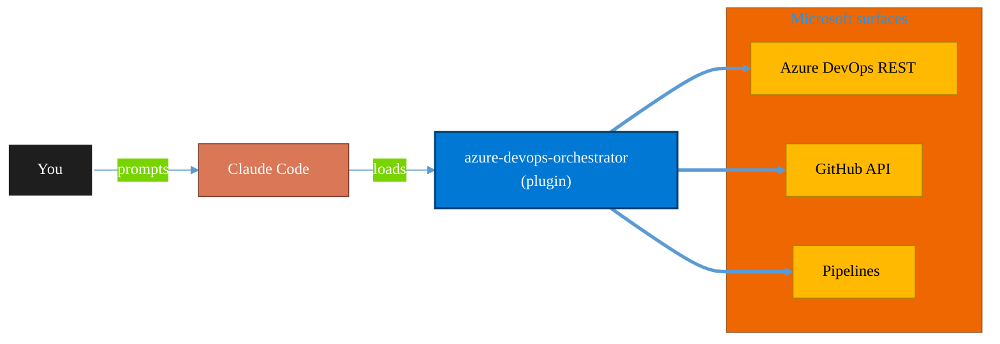

<!-- claude-m:premium-header:start -->
<div align="center">

<a id="top"></a>

# azure-devops-orchestrator

### Intelligent orchestration for Azure DevOps — ship work items with Claude Code, triage backlogs, plan sprints, coordinate releases, monitor pipelines, and balance workloads across projects. Integrates with microsoft-teams-mcp and microsoft-outlook-mcp when installed.

<sub>Ship reliably with first-class CI/CD and ALM.</sub>

<br />

<table align="center">
<tr>
<td align="center"><b>Category</b><br /><code>DevOps</code></td>
<td align="center"><b>Surfaces</b><br /><sub>Azure DevOps · GitHub · Pipelines · ALM · IaC</sub></td>
<td align="center"><b>Version</b><br /><code>1.0.0</code></td>
<td align="center"><b>Marketplace</b><br /><code>claude-m-microsoft-marketplace</code></td>
</tr>
</table>

<sub><code>microsoft</code> &nbsp;·&nbsp; <code>azure-devops</code> &nbsp;·&nbsp; <code>orchestration</code> &nbsp;·&nbsp; <code>ship</code> &nbsp;·&nbsp; <code>sprint</code> &nbsp;·&nbsp; <code>triage</code></sub>

<a href="#install"><b>Install</b></a> &nbsp;·&nbsp;
<a href="#overview"><b>Overview</b></a> &nbsp;·&nbsp;
<a href="#architecture"><b>Architecture</b></a> &nbsp;·&nbsp;
<a href="#related-plugins"><b>Related plugins</b></a> &nbsp;·&nbsp;
<a href="../README.md"><b>Marketplace</b></a>

</div>

---

> [!TIP]
> **One-line install** — `/plugin install azure-devops-orchestrator@claude-m-microsoft-marketplace`


## Overview

> Intelligent orchestration for Azure DevOps — ship work items with Claude Code, triage backlogs, plan sprints, coordinate releases, monitor pipelines, and balance workloads across projects. Integrates with microsoft-teams-mcp and microsoft-outlook-mcp when installed.

<details>
<summary><b>What ships in this plugin</b> (commands, agents, skills)</summary>

| Component | Items |
|---|---|
| **Commands** | `/orchestrate` · `/pipeline` · `/release` · `/retro` · `/ship` · `/sprint` · `/status` · `/triage` |
| **Agents** | `backlog-triage` · `health-monitor` · `pipeline-orchestrator` · `pr-reviewer` · `release-coordinator` · `retrospective-analyzer` · `ship-orchestrator` · `sprint-planner` · `teams-notifier` · `workload-balancer` |
| **Skills** | `devops-orchestration` |

</details>


<details>
<summary><b>Quick example</b></summary>

```text
Use azure-devops-orchestrator to ship work through pipelines with full ALM.
```

</details>

<a id="architecture"></a>

## Architecture



<a id="install"></a>

## Install

```bash
/plugin marketplace add markus41/Claude-m
/plugin install azure-devops-orchestrator@claude-m-microsoft-marketplace
```

> [!IMPORTANT]
> This plugin operates against **Azure DevOps · GitHub · Pipelines · ALM · IaC**. Configure credentials via environment variables — never commit secrets.

[Back to top](#top)

---

<!-- claude-m:premium-header:end -->

Intelligent orchestration layer for Azure DevOps — ship work items with Claude Code, triage backlogs, plan sprints, coordinate releases, monitor pipelines, balance workloads, and optionally push updates to Teams and Outlook.

## Prerequisites

- `azure-devops` plugin installed (provides the Azure DevOps API / CLI layer)
- Azure DevOps PAT or authentication configured (`az devops login` or `AZURE_DEVOPS_EXT_PAT`)
- `az devops` CLI extension installed (`az extension add --name azure-devops`)
- Git repository (required for `/azure-devops-orchestrator:ship`)

## Install

```bash
/plugin install azure-devops-orchestrator@claude-m-microsoft-marketplace
```

## Architecture

```
azure-devops-orchestrator (intelligence layer)
    |
    |-- Ship work items end-to-end
    |-- Triage & prioritize backlogs
    |-- Sprint planning with capacity analysis
    |-- Release coordination & gate validation
    |-- Pipeline monitoring & failure analysis
    |-- DORA metrics & health dashboards
    |-- Workload balancing across team members
    |-- Retrospective analysis & trend reporting
    |
    └── azure-devops (API / CLI toolkit layer)
            |
            ├── Azure DevOps REST API
            ├── az devops CLI
            └── Azure DevOps MCP Server
```

The orchestrator sits above the `azure-devops` plugin as an intelligence layer. Where `azure-devops` provides raw CRUD operations — creating work items, querying WIQL, running pipelines — the orchestrator composes those primitives into multi-step workflows with state management, checkpoints, and cross-plugin integration.

## Commands

| Command | Description |
|---------|-------------|
| `/azure-devops-orchestrator:ship <workItemId>` | Implement a work item end-to-end with Claude Code — branch, code, test, PR, update ADO |
| `/azure-devops-orchestrator:triage <project>` | Auto-prioritize, classify, assign, and route backlog work items |
| `/azure-devops-orchestrator:sprint <project> <team>` | Capacity-aware sprint planning with WSJF scoring |
| `/azure-devops-orchestrator:status [project]` | Health dashboard — overdue, blocked, stalled, unassigned work items |
| `/azure-devops-orchestrator:release <project>` | Release coordination — gate validation, environment promotion, release notes |
| `/azure-devops-orchestrator:pipeline [project]` | Pipeline monitoring — failed builds, flaky tests, performance regression |
| `/azure-devops-orchestrator:orchestrate` | Master entry point — portfolio overview, workload balance, full health analysis |
| `/azure-devops-orchestrator:retro <project> <iteration>` | Retrospective analysis — velocity trends, completion rates, escaped defects |

## Agents

| Agent | Triggered by |
|-------|-------------|
| `ship-orchestrator` | `/ship` command — implements a work item as code end-to-end |
| `sprint-planner` | `/sprint` command — capacity-aware sprint planning with WSJF |
| `backlog-triage` | `/triage` command — backlog classification, priority, and routing |
| `pipeline-orchestrator` | `/pipeline` command — build failure analysis, flaky test detection |
| `release-coordinator` | `/release` command — gate validation, environment promotion, rollback |
| `health-monitor` | `/status` command — cross-project DORA metrics and health scoring |
| `workload-balancer` | `/orchestrate --balance` — assignment distribution analysis |
| `pr-reviewer` | Invoked during ship workflow — automated PR review and feedback |
| `teams-notifier` | Any command with `--teams` or after ship completes |
| `retrospective-analyzer` | `/retro` command — sprint retrospective data analysis |

## Built-in MCP Servers

These MCP servers are bundled directly in `.mcp.json` and activate automatically:

| Server | Package | Purpose |
|--------|---------|---------|
| `azure-devops` | `@microsoft/azure-devops-mcp` | Work items, repos, pipelines, PRs, boards |
| `azure` | `@azure/mcp` | Azure resource context for deployment tasks |

**Prerequisites**: Node.js + npx (for npm packages), `az login` (for Azure auth), PAT or DefaultAzureCredential for Azure DevOps.

## Optional Cross-Plugin Integration

When these plugins are also installed, the orchestrator delegates to them automatically:

| Plugin | What it enables |
|--------|----------------|
| `microsoft-teams-mcp` | Post adaptive card summaries, ship notifications, pipeline alerts to Teams channels |
| `microsoft-outlook-mcp` | Send sprint digest emails, release notifications, deadline alerts to stakeholders |
| `powerbi-fabric` | Export DORA metrics and sprint data for Power BI dashboards |

All integrations degrade gracefully — if a plugin isn't installed, the action is skipped and noted in the output.

## Ship Workflow

```
/azure-devops-orchestrator:ship <workItemId>
```

1. Pre-flight checks (auth, git repo, clean tree)
2. Fetches work item + acceptance criteria from Azure DevOps
3. Creates a git branch (`feature/{workItemId}-{slug}`)
4. Explores codebase for context
5. Plans implementation — **asks for your approval**
6. Writes code + tests — **shows diff for review**
7. Runs test suite
8. Creates commit + PR (linked to work item)
9. Updates work item state: Active -> Resolved
10. Posts Teams notification (if available)

Supports `--dry-run`, `--resume`, `--status`, and `--from=<STATE>`.

## Example Prompts

```
"Ship work item #4521 from our Azure DevOps backlog"
"Triage the backlog in project MyApp — assign priorities and route items"
"Plan Sprint 14 for the Platform team with capacity analysis"
"What's overdue across all our Azure DevOps projects?"
"Coordinate the v2.5 release — validate gates and generate release notes"
"Show me pipeline health — any flaky tests or recurring failures?"
"Who's overloaded on the dev team? Rebalance work items"
"Run a retrospective analysis on Sprint 13 — velocity, completion, escaped defects"
```
<!-- claude-m:premium-footer:start -->

---

<a id="related-plugins"></a>

## Related plugins

<table>
<tr><th>Plugin</th><th>What it does</th></tr>
<tr><td><a href="../azure-devops/README.md"><code>azure-devops</code></a></td><td>Comprehensive Azure DevOps expertise — Git repos with passwordless auth (GCM, WIF, SSH), YAML and Classic pipelines, deployment environments, agent pools, work items, boards, sprints, test plans, security namespaces, dashboards, wikis, service hooks, Analytics OData, CLI, and extensions</td></tr>
<tr><td><a href="../fabric-gitops-cicd/README.md"><code>fabric-gitops-cicd</code></a></td><td>Microsoft Fabric GitOps CI/CD — workspace Git integration, deployment pipelines, artifact promotion, branch strategy, and release validation</td></tr>
<tr><td><a href="../azure-dotnet-webapp/README.md"><code>azure-dotnet-webapp</code></a></td><td>Scaffold and build ASP.NET Core Web API and Blazor apps on Azure — Minimal API, controllers, Microsoft.Identity.Web, EF Core, SignalR, OpenAPI, App Service deployment, and Graph API integration patterns.</td></tr>
<tr><td><a href="../azure-graph-dotnet/README.md"><code>azure-graph-dotnet</code></a></td><td>Scaffold and build Microsoft Graph C# / .NET solutions on Azure — Functions, Container Jobs, Azure Identity, Polly resilience, and SharePoint file intelligence implementations.</td></tr>
<tr><td><a href="../fabric-developer-runtime/README.md"><code>fabric-developer-runtime</code></a></td><td>Microsoft Fabric developer runtime operations - GraphQL API, environments, user data functions, and variable library governance.</td></tr>
<tr><td><a href="../fluent-ui-design/README.md"><code>fluent-ui-design</code></a></td><td>Microsoft Fluent 2 design system mastery — design tokens, color system, typography, layout, components, Teams theming, advanced UI patterns, Griffel styling, accessibility, responsive design, and Figma design kits</td></tr>
</table>


<details>
<summary><b>Composable stacks that include <code>azure-devops-orchestrator</code></b></summary>

Combine with sibling plugins to build cross-surface runbooks. Browse the full [marketplace catalog](../README.md#plugin-catalog) for a tailored selection.

</details>

---

<div align="center">

<sub>Part of <a href="../README.md"><b>Claude-m</b></a> — the Microsoft plugin marketplace for Claude Code.</sub>

<sub>Licensed under <a href="../LICENSE">MIT</a>. Built for engineers, MSPs, SOC teams, and analytics leaders.</sub>

</div>

<!-- claude-m:premium-footer:end -->

