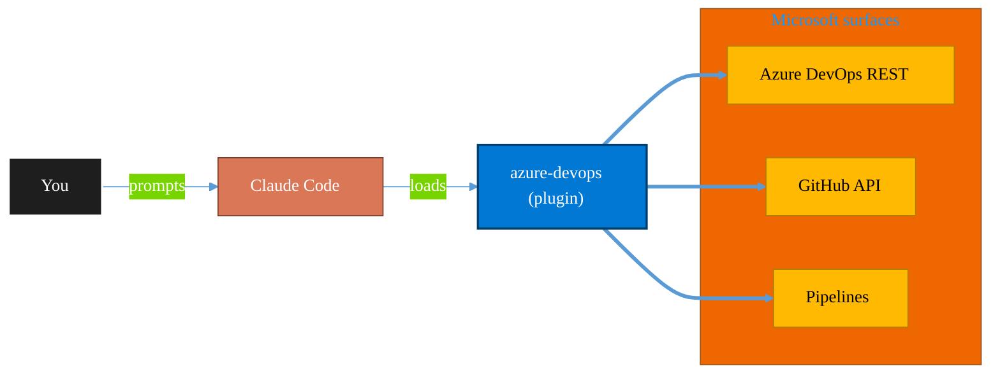

<!-- claude-m:premium-header:start -->
<div align="center">

<a id="top"></a>

# azure-devops

### Comprehensive Azure DevOps expertise — Git repos with passwordless auth (GCM, WIF, SSH), YAML and Classic pipelines, deployment environments, agent pools, work items, boards, sprints, test plans, security namespaces, dashboards, wikis, service hooks, Analytics OData, CLI, and extensions

<sub>Ship reliably with first-class CI/CD and ALM.</sub>

<br />

<table align="center">
<tr>
<td align="center"><b>Category</b><br /><code>DevOps</code></td>
<td align="center"><b>Surfaces</b><br /><sub>Azure DevOps · GitHub · Pipelines · ALM · IaC</sub></td>
<td align="center"><b>Version</b><br /><code>2.0.0</code></td>
<td align="center"><b>Marketplace</b><br /><code>claude-m-microsoft-marketplace</code></td>
</tr>
</table>

<sub><code>microsoft</code> &nbsp;·&nbsp; <code>azure-devops</code> &nbsp;·&nbsp; <code>pipelines</code> &nbsp;·&nbsp; <code>repos</code> &nbsp;·&nbsp; <code>work-items</code> &nbsp;·&nbsp; <code>cicd</code></sub>

<a href="#install"><b>Install</b></a> &nbsp;·&nbsp;
<a href="#overview"><b>Overview</b></a> &nbsp;·&nbsp;
<a href="#architecture"><b>Architecture</b></a> &nbsp;·&nbsp;
<a href="#related-plugins"><b>Related plugins</b></a> &nbsp;·&nbsp;
<a href="../README.md"><b>Marketplace</b></a>

</div>

---

> [!TIP]
> **One-line install** — `/plugin install azure-devops@claude-m-microsoft-marketplace`


## Overview

> Comprehensive Azure DevOps expertise — Git repos with passwordless auth (GCM, WIF, SSH), YAML and Classic pipelines, deployment environments, agent pools, work items, boards, sprints, test plans, security namespaces, dashboards, wikis, service hooks, Analytics OData, CLI, and extensions

<details>
<summary><b>What ships in this plugin</b> (commands, agents, skills)</summary>

| Component | Items |
|---|---|
| **Commands** | `/ado-agent-status` · `/ado-analytics` · `/ado-branch-policy` · `/ado-build-status` · `/ado-dashboard` · `/ado-delivery-plan` · `/ado-environment-create` · `/ado-extensions` · `/ado-git-auth` · `/ado-permissions` · `/ado-pipeline-create` · `/ado-pipeline-run` · `/ado-pr-create` · `/ado-process` · `/ado-query-workitems` · `/ado-repo-create` · `/ado-service-connection` · `/ado-service-hook` · `/ado-setup` · `/ado-sprint-plan` · `/ado-test-plan` · `/ado-test-run` · `/ado-variable-group` · `/ado-wiki` · `/ado-workitem-create` |
| **Agents** | `devops-migration-planner` · `devops-pipeline-debugger` · `devops-reviewer` · `devops-security-auditor` |
| **Skills** | `azure-devops-admin` · `azure-devops-boards` · `azure-devops-pipelines` · `azure-devops-repos` · `azure-devops-testing` |

</details>


<details>
<summary><b>Quick example</b></summary>

```text
Use azure-devops to ship work through pipelines with full ALM.
```

</details>

<a id="architecture"></a>

## Architecture



<a id="install"></a>

## Install

```bash
/plugin marketplace add markus41/Claude-m
/plugin install azure-devops@claude-m-microsoft-marketplace
```

> [!IMPORTANT]
> This plugin operates against **Azure DevOps · GitHub · Pipelines · ALM · IaC**. Configure credentials via environment variables — never commit secrets.

[Back to top](#top)

---

<!-- claude-m:premium-header:end -->

A comprehensive Claude Code knowledge plugin for Azure DevOps — covering the entire platform: Git repositories with passwordless authentication, YAML and Classic pipelines, deployment environments, work items and boards, test plans, security and permissions, dashboards, wikis, service hooks, Analytics OData, CLI, and marketplace extensions.

## What This Plugin Provides

This is a **knowledge plugin** — it gives Claude deep expertise across all Azure DevOps services so it can generate correct REST API integration code, YAML pipeline definitions, WIQL queries, Git authentication configurations, security policies, and administrative workflows. It does not contain runtime code, MCP servers, or executable scripts.

## Setup

Run `/ado-setup` to configure authentication and verify Azure DevOps access:

```
/ado-setup                                    # Full guided setup with GCM, PAT, or OAuth
/ado-setup --minimal                          # Dependencies only
/ado-setup --org myorg --project myproject    # Specify org and project
```

For passwordless Git authentication:
```
/ado-git-auth --method gcm                    # Git Credential Manager with Entra OAuth
/ado-git-auth --method ssh                    # SSH key setup
/ado-git-auth --method wif                    # Workload Identity Federation for CI/CD
```

## Skills (5)

| Skill | Focus Areas |
|-------|-------------|
| **Azure DevOps Repos** | Git repositories, pull requests, branch policies, code search, passwordless Git auth (GCM, SSH, WIF) |
| **Azure DevOps Pipelines** | YAML pipelines, Classic releases, deployment environments, agent pools, variable groups, service connections |
| **Azure DevOps Boards** | Work items, WIQL queries, Kanban boards, sprint planning, process customization, delivery plans |
| **Azure DevOps Testing** | Test plans, test suites, test cases, test runs, test configurations, test analytics |
| **Azure DevOps Admin** | Security namespaces, dashboards, wikis, service hooks, Analytics OData, CLI, extensions, artifact feeds |

## Commands (25)

### Repos & Git
| Command | Description |
|---------|-------------|
| `/ado-setup` | Configure authentication (GCM, PAT, OAuth, SSH) and verify access |
| `/ado-repo-create` | Create a Git repository with init options and branch config |
| `/ado-pr-create` | Create pull requests with auto-complete, draft mode, and merge strategy |
| `/ado-branch-policy` | Configure branch policies (reviewers, build validation, status checks) |
| `/ado-git-auth` | Set up passwordless Git auth — GCM, SSH, WIF, managed identity |

### Pipelines
| Command | Description |
|---------|-------------|
| `/ado-pipeline-create` | Generate YAML pipelines with multi-stage templates and service connections |
| `/ado-build-status` | Check build status with log inspection and failure analysis |
| `/ado-pipeline-run` | Trigger pipeline runs with parameters and variable overrides |
| `/ado-environment-create` | Create deployment environments with approval checks and gates |
| `/ado-variable-group` | Manage variable groups with Key Vault linking |
| `/ado-agent-status` | Check agent pool health and diagnose offline agents |
| `/ado-service-connection` | Create WIF, managed identity, or SP service connections |

### Boards
| Command | Description |
|---------|-------------|
| `/ado-workitem-create` | Create work items with relations, custom fields, and bulk creation |
| `/ado-query-workitems` | Query work items with WIQL, pagination, and tree queries |
| `/ado-sprint-plan` | Manage iterations, assign work, and view sprint burndown |
| `/ado-delivery-plan` | Create cross-team delivery plans with timeline management |

### Testing
| Command | Description |
|---------|-------------|
| `/ado-test-plan` | Create test plans, suites, and test cases with configurations |
| `/ado-test-run` | Execute test runs and view test analytics and trends |

### Administration
| Command | Description |
|---------|-------------|
| `/ado-wiki` | Create and manage project and code wikis |
| `/ado-dashboard` | Create dashboards and configure widgets |
| `/ado-permissions` | View and set security namespace ACLs and permissions |
| `/ado-service-hook` | Create webhook subscriptions for DevOps events |
| `/ado-process` | Manage inherited processes, custom WITs, fields, and rules |
| `/ado-extensions` | Search, install, and manage marketplace extensions |
| `/ado-analytics` | Run OData analytics queries for work items, pipelines, and tests |

## Agents (4)

| Agent | Description |
|-------|-------------|
| **Azure DevOps Reviewer** | Reviews REST API usage, YAML pipeline syntax, WIQL queries, service connection security, and credential handling |
| **Pipeline Debugger** | Diagnoses pipeline failures — analyzes logs, identifies flaky tests, checks agent capabilities, suggests fixes |
| **Security Auditor** | Audits security posture — overprivileged connections, branch policy gaps, credential exposure, permission sprawl |
| **Migration Planner** | Plans Classic-to-YAML migration — maps stages to environments, converts tasks, preserves approval gates |

## Examples (5)

| Example | Content |
|---------|---------|
| `pipeline-templates.md` | 6+ ready-to-use YAML templates: Node.js, .NET, Python, Docker, Terraform, multi-stage |
| `automation-scripts.md` | TypeScript/CLI scripts for bulk work items, pipeline triggers, PR automation |
| `git-auth-recipes.md` | Step-by-step passwordless Git setup for workstations, CI/CD, containers |
| `security-recipes.md` | Branch protection matrix, least-privilege connections, PAT rotation, audit queries |
| `integration-patterns.md` | Service hooks to Teams/Slack, webhooks to Azure Functions, OData to Power BI |

## Plugin Structure

```
azure-devops/
├── .claude-plugin/
│   └── plugin.json
├── skills/
│   ├── azure-devops-repos/        # Git repos, PRs, branch policies, auth
│   ├── azure-devops-pipelines/    # YAML, Classic, environments, agents, variables
│   ├── azure-devops-boards/       # Work items, WIQL, sprints, process customization
│   ├── azure-devops-testing/      # Test plans, suites, runs, analytics
│   └── azure-devops-admin/        # Security, dashboards, wiki, hooks, CLI, extensions
├── commands/                      # 25 command files
├── agents/                        # 4 agent files
├── examples/                      # 5 example files
└── README.md
```

## Trigger Keywords

The plugin activates automatically for: `azure devops`, `ado`, `yaml pipeline`, `azure repos`, `pull request`, `branch policy`, `git credential manager`, `passwordless git`, `work item`, `wiql`, `sprint`, `kanban`, `test plan`, `test case`, `ado security`, `ado permissions`, `ado wiki`, `service hook`, `ado dashboard`, `ado analytics`, `az devops cli`, `deployment environment`, `agent pool`, `variable group`, `service connection`, `classic release`.

## Author

Markus Ahling
<!-- claude-m:premium-footer:start -->

---

<a id="related-plugins"></a>

## Related plugins

<table>
<tr><th>Plugin</th><th>What it does</th></tr>
<tr><td><a href="../azure-devops-orchestrator/README.md"><code>azure-devops-orchestrator</code></a></td><td>Intelligent orchestration for Azure DevOps — ship work items with Claude Code, triage backlogs, plan sprints, coordinate releases, monitor pipelines, and balance workloads across projects. Integrates with microsoft-teams-mcp and microsoft-outlook-mcp when installed.</td></tr>
<tr><td><a href="../fabric-gitops-cicd/README.md"><code>fabric-gitops-cicd</code></a></td><td>Microsoft Fabric GitOps CI/CD — workspace Git integration, deployment pipelines, artifact promotion, branch strategy, and release validation</td></tr>
<tr><td><a href="../powerplatform-alm/README.md"><code>powerplatform-alm</code></a></td><td>Power Platform ALM — environments, solution transport, CI/CD pipelines, PCF controls, and deployment automation</td></tr>
<tr><td><a href="../azure-dotnet-webapp/README.md"><code>azure-dotnet-webapp</code></a></td><td>Scaffold and build ASP.NET Core Web API and Blazor apps on Azure — Minimal API, controllers, Microsoft.Identity.Web, EF Core, SignalR, OpenAPI, App Service deployment, and Graph API integration patterns.</td></tr>
<tr><td><a href="../azure-graph-dotnet/README.md"><code>azure-graph-dotnet</code></a></td><td>Scaffold and build Microsoft Graph C# / .NET solutions on Azure — Functions, Container Jobs, Azure Identity, Polly resilience, and SharePoint file intelligence implementations.</td></tr>
<tr><td><a href="../fabric-developer-runtime/README.md"><code>fabric-developer-runtime</code></a></td><td>Microsoft Fabric developer runtime operations - GraphQL API, environments, user data functions, and variable library governance.</td></tr>
</table>


<details>
<summary><b>Composable stacks that include <code>azure-devops</code></b></summary>

Combine with sibling plugins to build cross-surface runbooks. Browse the full [marketplace catalog](../README.md#plugin-catalog) for a tailored selection.

</details>

---

<div align="center">

<sub>Part of <a href="../README.md"><b>Claude-m</b></a> — the Microsoft plugin marketplace for Claude Code.</sub>

<sub>Licensed under <a href="../LICENSE">MIT</a>. Built for engineers, MSPs, SOC teams, and analytics leaders.</sub>

</div>

<!-- claude-m:premium-footer:end -->

