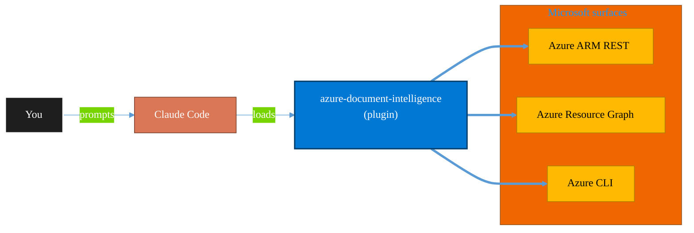

<!-- claude-m:premium-header:start -->
<div align="center">

<a id="top"></a>

# azure-document-intelligence

### Azure AI Document Intelligence — OCR, prebuilt models (invoices, receipts, IDs, tax forms), custom models, layout analysis, document classification, and batch processing

<sub>Inventory, govern, and operate Azure resources at any scale.</sub>

<br />

<table align="center">
<tr>
<td align="center"><b>Category</b><br /><code>Cloud</code></td>
<td align="center"><b>Surfaces</b><br /><sub>Azure ARM · Resource Graph · ARM REST · CLI</sub></td>
<td align="center"><b>Version</b><br /><code>1.0.0</code></td>
<td align="center"><b>Marketplace</b><br /><code>claude-m-microsoft-marketplace</code></td>
</tr>
</table>

<sub><code>microsoft</code> &nbsp;·&nbsp; <code>azure</code> &nbsp;·&nbsp; <code>document-intelligence</code> &nbsp;·&nbsp; <code>ocr</code> &nbsp;·&nbsp; <code>invoices</code> &nbsp;·&nbsp; <code>form-recognizer</code></sub>

<a href="#install"><b>Install</b></a> &nbsp;·&nbsp;
<a href="#overview"><b>Overview</b></a> &nbsp;·&nbsp;
<a href="#architecture"><b>Architecture</b></a> &nbsp;·&nbsp;
<a href="#related-plugins"><b>Related plugins</b></a> &nbsp;·&nbsp;
<a href="../README.md"><b>Marketplace</b></a>

</div>

---

> [!TIP]
> **One-line install** — `/plugin install azure-document-intelligence@claude-m-microsoft-marketplace`


## Overview

> Azure AI Document Intelligence — OCR, prebuilt models (invoices, receipts, IDs, tax forms), custom models, layout analysis, document classification, and batch processing

<details>
<summary><b>What ships in this plugin</b> (commands, agents, skills)</summary>

| Component | Items |
|---|---|
| **Commands** | `/docai-analyze` · `/docai-batch` · `/docai-classify` · `/docai-custom-model` · `/docai-setup` |
| **Agents** | `docai-reviewer` |
| **Skills** | `azure-document-intelligence` |

</details>


<details>
<summary><b>Quick example</b></summary>

```text
Use azure-document-intelligence to audit and operate Azure resources end-to-end.
```

</details>

<a id="architecture"></a>

## Architecture



<a id="install"></a>

## Install

```bash
/plugin marketplace add markus41/Claude-m
/plugin install azure-document-intelligence@claude-m-microsoft-marketplace
```

> [!IMPORTANT]
> This plugin operates against **Azure ARM · Resource Graph · ARM REST · CLI**. Configure credentials via environment variables — never commit secrets.

[Back to top](#top)

---

<!-- claude-m:premium-header:end -->

Azure AI Document Intelligence plugin for Claude Code. Covers OCR, prebuilt models (invoices, receipts, ID documents, tax forms), custom extraction and classification models, layout analysis, batch processing, and SDK/REST API integration patterns.

## What it covers

- **Prebuilt Models** — Invoice, Receipt, ID Document, W-2, 1099, Health Insurance Card, Business Card, Contract, Layout, Read (OCR), General Document
- **Custom Models** — Template and neural extraction models, composed models, Document Intelligence Studio labeling, model lifecycle management
- **Layout Analysis** — Document structure extraction (paragraphs, tables, figures, selection marks, barcodes), reading order, language detection
- **Document Classification** — Custom classifiers, split/classify workflows, multi-document classification, confidence thresholds
- **OCR & Read Model** — Text extraction, handwriting recognition, language support, style detection (handwritten vs printed)
- **Batch Processing** — Analyze batch operations, async polling, large-scale document processing pipelines
- **Integration Patterns** — Logic Apps, Power Automate, Azure Functions, Blob Storage event-driven processing, AI Search skillset integration

## Install

```bash
/plugin install azure-document-intelligence@claude-m-microsoft-marketplace
```

## Required permissions

| Workload | Role |
|---|---|
| Resource provisioning and management | `Cognitive Services Contributor` |
| Document analysis (data plane) | `Cognitive Services User` |
| Custom model training | `Cognitive Services Contributor` |
| Network and security configuration | `Contributor` on the resource |

## Setup

```
/docai-setup
```

Discovers or creates a Document Intelligence resource, validates RBAC, tests connectivity with a sample analysis, and configures environment variables.

## Commands

| Command | Description |
|---|---|
| `/docai-setup` | Create or discover Document Intelligence resource, validate auth, test connectivity |
| `/docai-analyze` | Analyze a document with a prebuilt or custom model |
| `/docai-custom-model` | Build a custom extraction model: prepare data, label, train, evaluate |
| `/docai-classify` | Build and use a document classifier for splitting and routing documents |
| `/docai-batch` | Batch analyze multiple documents, monitor jobs, retrieve results |

## Agent

| Agent | Description |
|---|---|
| `docai-reviewer` | Reviews Document Intelligence implementations for model selection, confidence handling, security, and cost optimization |

## Example prompts

- "Use `azure-document-intelligence` to extract data from an invoice PDF"
- "Analyze a batch of receipt images and extract totals and merchant names"
- "Build a custom model to extract fields from my company's purchase orders"
- "Create a document classifier to route invoices, receipts, and contracts"
- "Set up Document Intelligence with managed identity and private endpoints"
- "Extract table data and reading order from a multi-page PDF layout"

## Auth pattern

Uses the integration context contract (`docs/integration-context.md`). Required context:

```
tenantId + subscriptionId + DOCUMENT_INTELLIGENCE_ENDPOINT (or resource name)
```

Managed identity is preferred over API keys for production deployments.
<!-- claude-m:premium-footer:start -->

---

<a id="related-plugins"></a>

## Related plugins

<table>
<tr><th>Plugin</th><th>What it does</th></tr>
<tr><td><a href="../agent-foundry/README.md"><code>agent-foundry</code></a></td><td>Azure AI Foundry agent lifecycle management — scaffold, deploy, test, and manage AI agents with Azure AI Foundry MCP integration</td></tr>
<tr><td><a href="../azure-ai-services/README.md"><code>azure-ai-services</code></a></td><td>Azure AI workloads — Azure OpenAI Service deployments, AI Search indexes, AI Studio/Foundry projects, Cognitive Services provisioning, content filtering, and responsible AI governance</td></tr>
<tr><td><a href="../azure-containers/README.md"><code>azure-containers</code></a></td><td>Azure Container Apps, Container Instances, and Container Registry — build, push, deploy, and scale containerized workloads</td></tr>
<tr><td><a href="../azure-cost-governance/README.md"><code>azure-cost-governance</code></a></td><td>Azure FinOps and governance workflows — query costs, monitor budgets, detect anomalies, and identify idle resources for optimization</td></tr>
<tr><td><a href="../azure-functions/README.md"><code>azure-functions</code></a></td><td>Azure Functions — triggers, bindings, Durable Functions, deployment, and local development with Azure Functions Core Tools</td></tr>
<tr><td><a href="../azure-logic-apps/README.md"><code>azure-logic-apps</code></a></td><td>Azure Logic Apps — enterprise integration workflows, Workflow Definition Language, Standard and Consumption hosting, connectors, B2B/EDI integration accounts, and CI/CD deployment</td></tr>
</table>


<details>
<summary><b>Composable stacks that include <code>azure-document-intelligence</code></b></summary>

Combine with sibling plugins to build cross-surface runbooks. Browse the full [marketplace catalog](../README.md#plugin-catalog) for a tailored selection.

</details>

---

<div align="center">

<sub>Part of <a href="../README.md"><b>Claude-m</b></a> — the Microsoft plugin marketplace for Claude Code.</sub>

<sub>Licensed under <a href="../LICENSE">MIT</a>. Built for engineers, MSPs, SOC teams, and analytics leaders.</sub>

</div>

<!-- claude-m:premium-footer:end -->

