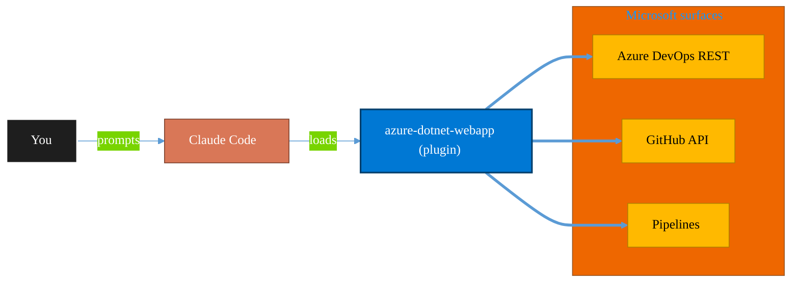

<!-- claude-m:premium-header:start -->
<div align="center">

<a id="top"></a>

# azure-dotnet-webapp

### Scaffold and build ASP.NET Core Web API and Blazor apps on Azure — Minimal API, controllers, Microsoft.Identity.Web, EF Core, SignalR, OpenAPI, App Service deployment, and Graph API integration patterns.

<sub>Ship reliably with first-class CI/CD and ALM.</sub>

<br />

<table align="center">
<tr>
<td align="center"><b>Category</b><br /><code>DevOps</code></td>
<td align="center"><b>Surfaces</b><br /><sub>Azure DevOps · GitHub · Pipelines · ALM · IaC</sub></td>
<td align="center"><b>Version</b><br /><code>1.0.0</code></td>
<td align="center"><b>Marketplace</b><br /><code>claude-m-microsoft-marketplace</code></td>
</tr>
</table>

<sub><code>microsoft</code> &nbsp;·&nbsp; <code>azure</code> &nbsp;·&nbsp; <code>dotnet</code> &nbsp;·&nbsp; <code>csharp</code> &nbsp;·&nbsp; <code>aspnetcore</code> &nbsp;·&nbsp; <code>blazor</code></sub>

<a href="#install"><b>Install</b></a> &nbsp;·&nbsp;
<a href="#overview"><b>Overview</b></a> &nbsp;·&nbsp;
<a href="#architecture"><b>Architecture</b></a> &nbsp;·&nbsp;
<a href="#related-plugins"><b>Related plugins</b></a> &nbsp;·&nbsp;
<a href="../README.md"><b>Marketplace</b></a>

</div>

---

> [!TIP]
> **One-line install** — `/plugin install azure-dotnet-webapp@claude-m-microsoft-marketplace`


## Overview

> Scaffold and build ASP.NET Core Web API and Blazor apps on Azure — Minimal API, controllers, Microsoft.Identity.Web, EF Core, SignalR, OpenAPI, App Service deployment, and Graph API integration patterns.

<details>
<summary><b>What ships in this plugin</b> (commands, agents, skills)</summary>

| Component | Items |
|---|---|
| **Commands** | `/add-webapi-operation` · `/deploy-webapp` · `/scaffold-api` · `/scaffold-blazor` · `/webapp-setup` |
| **Agents** | `aspnetcore-reviewer` |
| **Skills** | `azure-dotnet-webapp` |

</details>


<details>
<summary><b>Quick example</b></summary>

```text
Use azure-dotnet-webapp to ship work through pipelines with full ALM.
```

</details>

<a id="architecture"></a>

## Architecture



<a id="install"></a>

## Install

```bash
/plugin marketplace add markus41/Claude-m
/plugin install azure-dotnet-webapp@claude-m-microsoft-marketplace
```

> [!IMPORTANT]
> This plugin operates against **Azure DevOps · GitHub · Pipelines · ALM · IaC**. Configure credentials via environment variables — never commit secrets.

[Back to top](#top)

---

<!-- claude-m:premium-header:end -->

Scaffold and build **ASP.NET Core Web API** and **Blazor** applications on Azure App Service.

Covers the complete development lifecycle: interactive project setup, Minimal API and MVC
controller scaffolding, Microsoft.Identity.Web authentication, EF Core with Azure SQL and Managed
Identity, SignalR hubs, OpenAPI/Swagger, rate limiting, Blazor Server/WASM/Auto render modes,
Bicep-based App Service provisioning, and GitHub Actions / Azure DevOps CI/CD pipelines.

---

## Install

```bash
/plugin install azure-dotnet-webapp@claude-m-microsoft-marketplace
```

---

## Commands

| Command | What it does |
|---------|-------------|
| `/azure-dotnet-webapp:webapp-setup` | Interactive project setup — type, auth, DB, Graph integration |
| `/azure-dotnet-webapp:scaffold-api` | Scaffold Minimal API endpoint group or MVC controller with CRUD |
| `/azure-dotnet-webapp:scaffold-blazor` | Scaffold Blazor page, service, auth guard, and NavMenu entry |
| `/azure-dotnet-webapp:add-webapi-operation` | Add Graph-backed or custom endpoint to existing project |
| `/azure-dotnet-webapp:deploy-webapp` | Provision App Service with Bicep and deploy via zip or CI/CD |

---

## Quick Start

### 1. Scaffold a new Web API

```
/azure-dotnet-webapp:webapp-setup --type api --auth azure-ad --db sql
```

Sets up a new ASP.NET Core Web API project with:
- Microsoft.Identity.Web JWT bearer authentication
- EF Core connected to Azure SQL via Managed Identity
- Swagger UI, health checks, rate limiting
- Fully compilable stub with `appsettings.json`

### 2. Add an endpoint

```
/azure-dotnet-webapp:scaffold-api --style minimal --resource FileInventory --crud
```

Generates a complete endpoint group:
- `FileInventoryEndpoints.cs` — 5 CRUD endpoints with OpenAPI metadata
- `IFileInventoryService.cs` — service interface
- `FileInventoryService.cs` — stub implementation
- `FileInventoryDto.cs` — request/response records
- Auto-updates `Program.cs`

### 3. Add a Graph-backed operation

```
/azure-dotnet-webapp:add-webapi-operation --operation graph-files
```

Adds a `/api/graph/files/inventory` endpoint that calls Microsoft Graph delta query,
wires `GraphServiceClient` + Polly `ResiliencePipeline` into `Program.cs`.

### 4. Deploy to Azure

```
/azure-dotnet-webapp:deploy-webapp --resource-group rg-webapp --app-name mywebapi --sku P1v3
```

Generates Bicep (App Service Plan + Web App + App Insights + Key Vault), runs what-if,
deploys, grants Managed Identity access to Key Vault, and generates a GitHub Actions pipeline.

---

## Skill Triggers

The skill activates automatically when you describe ASP.NET Core or Blazor tasks:

- "scaffold an asp.net core web api that returns file inventory"
- "add Microsoft.Identity.Web to my .NET 8 project"
- "create a Blazor server page with auth guard"
- "set up EF Core with Azure SQL and Managed Identity"
- "add SignalR hub to my web app"
- "generate Bicep for App Service deployment"

---

## Agent: `aspnetcore-reviewer`

Triggers automatically when you ask for code review:

- "review my asp.net core code"
- "audit my middleware pipeline"
- "check my efcore queries for N+1"
- "validate my Blazor component auth"

Produces a structured report across 8 categories: Auth/Security, Middleware Order, DI Lifetimes,
EF Core, Performance, OpenAPI, Error Handling, Blazor.

---

## Composition with `azure-graph-dotnet`

This plugin composes cleanly with [`azure-graph-dotnet`](../azure-graph-dotnet/):

```
azure-graph-dotnet                  azure-dotnet-webapp
─────────────────                   ───────────────────
DeltaScanService         ─────────► FileInventoryController  (scaffold-api)
DuplicateDetectionService ────────► DuplicatesController     (scaffold-api)
MetadataService          ─────────► DuplicatesDashboard.razor (scaffold-blazor)
GraphServiceClient        shared    injected in both plugins
ResiliencePipeline        shared    injected in both plugins
```

Use `/azure-dotnet-webapp:add-webapi-operation --operation graph-files` to bridge the two:
it reads existing Graph service interfaces from `azure-graph-dotnet` and wraps them in
ASP.NET Core HTTP endpoints or Blazor service calls.

---

## Reference Files

| Topic | File |
|-------|------|
| Program.cs, middleware, DI, configuration | `skills/azure-dotnet-webapp/references/aspnetcore-patterns.md` |
| Microsoft.Identity.Web, JWT, OIDC, MSAL | `skills/azure-dotnet-webapp/references/auth-identity-web.md` |
| Blazor Server, WASM, Auto render modes | `skills/azure-dotnet-webapp/references/blazor-patterns.md` |
| EF Core + Azure SQL + Managed Identity | `skills/azure-dotnet-webapp/references/efcore-azure-sql.md` |
| OpenAPI, SignalR, health checks, rate limiting | `skills/azure-dotnet-webapp/references/openapi-signalr.md` |
| Bicep, GitHub Actions, Azure DevOps, slots | `skills/azure-dotnet-webapp/references/webapp-cicd.md` |

---

## Settings

Plugin settings are stored in `.claude/azure-dotnet-webapp.local.md` in your project:

```yaml
---
dotnet_version: net8.0
project_type: api
auth_mode: azure-ad
database: none
app_service_sku: B1
resource_group: rg-webapp
location: eastus
cicd: github-actions
graph_integration: false
---
```

Commands read these defaults so you don't have to repeat them each time.
<!-- claude-m:premium-footer:start -->

---

<a id="related-plugins"></a>

## Related plugins

<table>
<tr><th>Plugin</th><th>What it does</th></tr>
<tr><td><a href="../azure-graph-dotnet/README.md"><code>azure-graph-dotnet</code></a></td><td>Scaffold and build Microsoft Graph C# / .NET solutions on Azure — Functions, Container Jobs, Azure Identity, Polly resilience, and SharePoint file intelligence implementations.</td></tr>
<tr><td><a href="../azure-devops/README.md"><code>azure-devops</code></a></td><td>Comprehensive Azure DevOps expertise — Git repos with passwordless auth (GCM, WIF, SSH), YAML and Classic pipelines, deployment environments, agent pools, work items, boards, sprints, test plans, security namespaces, dashboards, wikis, service hooks, Analytics OData, CLI, and extensions</td></tr>
<tr><td><a href="../azure-devops-orchestrator/README.md"><code>azure-devops-orchestrator</code></a></td><td>Intelligent orchestration for Azure DevOps — ship work items with Claude Code, triage backlogs, plan sprints, coordinate releases, monitor pipelines, and balance workloads across projects. Integrates with microsoft-teams-mcp and microsoft-outlook-mcp when installed.</td></tr>
<tr><td><a href="../fabric-developer-runtime/README.md"><code>fabric-developer-runtime</code></a></td><td>Microsoft Fabric developer runtime operations - GraphQL API, environments, user data functions, and variable library governance.</td></tr>
<tr><td><a href="../fabric-gitops-cicd/README.md"><code>fabric-gitops-cicd</code></a></td><td>Microsoft Fabric GitOps CI/CD — workspace Git integration, deployment pipelines, artifact promotion, branch strategy, and release validation</td></tr>
<tr><td><a href="../fluent-ui-design/README.md"><code>fluent-ui-design</code></a></td><td>Microsoft Fluent 2 design system mastery — design tokens, color system, typography, layout, components, Teams theming, advanced UI patterns, Griffel styling, accessibility, responsive design, and Figma design kits</td></tr>
</table>


<details>
<summary><b>Composable stacks that include <code>azure-dotnet-webapp</code></b></summary>

Combine with sibling plugins to build cross-surface runbooks. Browse the full [marketplace catalog](../README.md#plugin-catalog) for a tailored selection.

</details>

---

<div align="center">

<sub>Part of <a href="../README.md"><b>Claude-m</b></a> — the Microsoft plugin marketplace for Claude Code.</sub>

<sub>Licensed under <a href="../LICENSE">MIT</a>. Built for engineers, MSPs, SOC teams, and analytics leaders.</sub>

</div>

<!-- claude-m:premium-footer:end -->

