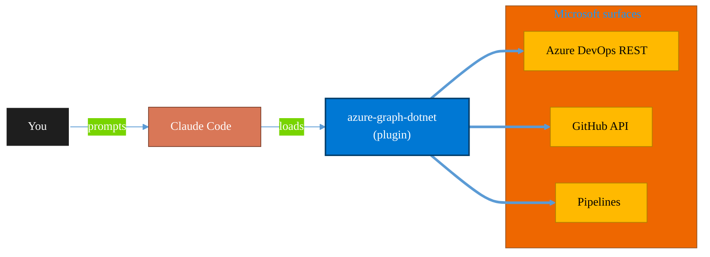

<!-- claude-m:premium-header:start -->
<div align="center">

<a id="top"></a>

# azure-graph-dotnet

### Scaffold and build Microsoft Graph C# / .NET solutions on Azure — Functions, Container Jobs, Azure Identity, Polly resilience, and SharePoint file intelligence implementations.

<sub>Ship reliably with first-class CI/CD and ALM.</sub>

<br />

<table align="center">
<tr>
<td align="center"><b>Category</b><br /><code>DevOps</code></td>
<td align="center"><b>Surfaces</b><br /><sub>Azure DevOps · GitHub · Pipelines · ALM · IaC</sub></td>
<td align="center"><b>Version</b><br /><code>1.0.0</code></td>
<td align="center"><b>Marketplace</b><br /><code>claude-m-microsoft-marketplace</code></td>
</tr>
</table>

<sub><code>microsoft</code> &nbsp;·&nbsp; <code>azure</code> &nbsp;·&nbsp; <code>dotnet</code> &nbsp;·&nbsp; <code>csharp</code> &nbsp;·&nbsp; <code>graph-api</code> &nbsp;·&nbsp; <code>azure-functions</code></sub>

<a href="#install"><b>Install</b></a> &nbsp;·&nbsp;
<a href="#overview"><b>Overview</b></a> &nbsp;·&nbsp;
<a href="#architecture"><b>Architecture</b></a> &nbsp;·&nbsp;
<a href="#related-plugins"><b>Related plugins</b></a> &nbsp;·&nbsp;
<a href="../README.md"><b>Marketplace</b></a>

</div>

---

> [!TIP]
> **One-line install** — `/plugin install azure-graph-dotnet@claude-m-microsoft-marketplace`


## Overview

> Scaffold and build Microsoft Graph C# / .NET solutions on Azure — Functions, Container Jobs, Azure Identity, Polly resilience, and SharePoint file intelligence implementations.

<details>
<summary><b>What ships in this plugin</b> (commands, agents, skills)</summary>

| Component | Items |
|---|---|
| **Commands** | `/add-graph-operation` · `/deploy-azure` · `/dotnet-setup` · `/scaffold-console` · `/scaffold-function` |
| **Agents** | `dotnet-graph-reviewer` |
| **Skills** | `azure-graph-dotnet` |

</details>


<details>
<summary><b>Quick example</b></summary>

```text
Use azure-graph-dotnet to ship work through pipelines with full ALM.
```

</details>

<a id="architecture"></a>

## Architecture



<a id="install"></a>

## Install

```bash
/plugin marketplace add markus41/Claude-m
/plugin install azure-graph-dotnet@claude-m-microsoft-marketplace
```

> [!IMPORTANT]
> This plugin operates against **Azure DevOps · GitHub · Pipelines · ALM · IaC**. Configure credentials via environment variables — never commit secrets.

[Back to top](#top)

---

<!-- claude-m:premium-header:end -->

Scaffold and build Microsoft Graph C# / .NET solutions on Azure — Azure Functions, Container
Jobs, Azure Identity, Polly resilience, and complete SharePoint file intelligence implementations.

## What This Plugin Does

Provides everything needed to build production-grade C# / .NET applications that call Microsoft
Graph on Azure:

1. **Setup** — checks toolchain, scaffolds project, configures auth
2. **Scaffold Functions** — timer/HTTP/Durable Azure Function classes with full DI wiring
3. **Scaffold Container Job** — batch console app with Dockerfile and ACA Job Bicep
4. **Add Graph Operations** — drop-in service classes for delta scan, dedup, metadata, file moves
5. **Deploy** — Bicep infra, Managed Identity Graph permissions, GitHub Actions / Azure DevOps CI/CD
6. **Review** — AI code review agent checks auth, resilience, SDK usage, and security

## Install

```bash
/plugin install azure-graph-dotnet@claude-m-microsoft-marketplace
```

## Quick Start

```bash
# 1. Set up a new project
/azure-graph-dotnet:dotnet-setup --functions

# 2. Scaffold the delta scan function
/azure-graph-dotnet:scaffold-function delta-scan --trigger timer

# 3. Add duplicate detection
/azure-graph-dotnet:add-graph-operation duplicate-detection

# 4. Deploy to Azure
/azure-graph-dotnet:deploy-azure --resource-group rg-graph-intelligence

# 5. Review code quality
"review my Azure Graph C# code in ./GraphFileIntelligence"
```

## Commands

| Command | Description |
|---------|-------------|
| `dotnet-setup` | Interactive setup — toolchain check, project scaffold, credentials, build verify |
| `scaffold-function` | Generate Azure Function class (timer/HTTP/Durable) for a Graph operation |
| `scaffold-console` | Generate Console App / ACA Container Job with Dockerfile and Bicep |
| `add-graph-operation` | Add service + interface + models for a specific Graph operation |
| `deploy-azure` | Provision infra, deploy, assign Managed Identity permissions, generate CI/CD |

## Agent

**`dotnet-graph-reviewer`** — triggered by "review my Graph C# code". Checks:
- `DefaultAzureCredential` / `GraphServiceClient` as Singleton
- `PageIterator` for pagination (not manual `nextLink` loops)
- Polly v8 `ResiliencePipeline` with exponential backoff + jitter
- Batch requests for bulk operations
- Missing `CancellationToken` propagation
- Hardcoded credentials, over-permissioned scopes, log data leaks

## Settings

Create `.claude/azure-graph-dotnet.local.md` to configure defaults:

```yaml
---
dotnet_version: net8.0
hosting_model: functions    # functions | container-job
default_namespace: MyCompany.GraphIntelligence
resource_group: rg-graph-intelligence
location: eastus
acr_name: ""
cicd: github-actions        # github-actions | azure-devops | both
---
```

## Tech Stack

| Layer | Technology |
|-------|-----------|
| Language | C# 12 / .NET 8 |
| Graph SDK | `Microsoft.Graph` v5 |
| Authentication | `Azure.Identity` — `DefaultAzureCredential` |
| Hosting | Azure Functions v4 (isolated worker) or Azure Container Apps Jobs |
| Resilience | `Polly` v8 — `ResiliencePipeline` with exponential backoff |
| Observability | Application Insights + `ILogger<T>` |
| Secrets | Azure Key Vault via config provider |
| Storage | Azure Blob Storage for inventory output + delta state |
| IaC | Bicep |
| CI/CD | GitHub Actions (OIDC) or Azure DevOps |

## Related Plugins

- `sharepoint-file-intelligence` — the Node.js / Graph pattern reference this plugin implements in C#
- `azure-functions` — general Azure Functions guidance
- `azure-key-vault` — Key Vault secrets and rotation
- `azure-monitor` — Application Insights and KQL queries
<!-- claude-m:premium-footer:start -->

---

<a id="related-plugins"></a>

## Related plugins

<table>
<tr><th>Plugin</th><th>What it does</th></tr>
<tr><td><a href="../azure-dotnet-webapp/README.md"><code>azure-dotnet-webapp</code></a></td><td>Scaffold and build ASP.NET Core Web API and Blazor apps on Azure — Minimal API, controllers, Microsoft.Identity.Web, EF Core, SignalR, OpenAPI, App Service deployment, and Graph API integration patterns.</td></tr>
<tr><td><a href="../marketplace-dev-tools/README.md"><code>marketplace-dev-tools</code></a></td><td>Research Microsoft APIs, scaffold new plugins, extend existing ones, and audit marketplace coverage</td></tr>
<tr><td><a href="../azure-devops/README.md"><code>azure-devops</code></a></td><td>Comprehensive Azure DevOps expertise — Git repos with passwordless auth (GCM, WIF, SSH), YAML and Classic pipelines, deployment environments, agent pools, work items, boards, sprints, test plans, security namespaces, dashboards, wikis, service hooks, Analytics OData, CLI, and extensions</td></tr>
<tr><td><a href="../azure-devops-orchestrator/README.md"><code>azure-devops-orchestrator</code></a></td><td>Intelligent orchestration for Azure DevOps — ship work items with Claude Code, triage backlogs, plan sprints, coordinate releases, monitor pipelines, and balance workloads across projects. Integrates with microsoft-teams-mcp and microsoft-outlook-mcp when installed.</td></tr>
<tr><td><a href="../fabric-developer-runtime/README.md"><code>fabric-developer-runtime</code></a></td><td>Microsoft Fabric developer runtime operations - GraphQL API, environments, user data functions, and variable library governance.</td></tr>
<tr><td><a href="../fabric-gitops-cicd/README.md"><code>fabric-gitops-cicd</code></a></td><td>Microsoft Fabric GitOps CI/CD — workspace Git integration, deployment pipelines, artifact promotion, branch strategy, and release validation</td></tr>
</table>


<details>
<summary><b>Composable stacks that include <code>azure-graph-dotnet</code></b></summary>

Combine with sibling plugins to build cross-surface runbooks. Browse the full [marketplace catalog](../README.md#plugin-catalog) for a tailored selection.

</details>

---

<div align="center">

<sub>Part of <a href="../README.md"><b>Claude-m</b></a> — the Microsoft plugin marketplace for Claude Code.</sub>

<sub>Licensed under <a href="../LICENSE">MIT</a>. Built for engineers, MSPs, SOC teams, and analytics leaders.</sub>

</div>

<!-- claude-m:premium-footer:end -->

