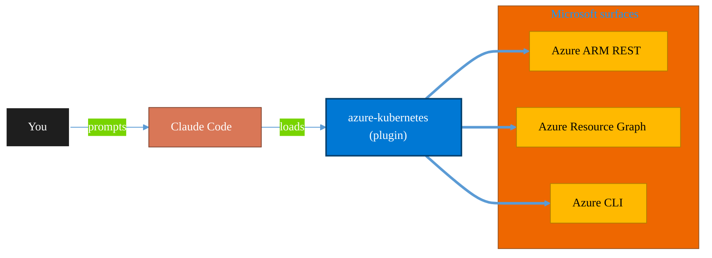

<!-- claude-m:premium-header:start -->
<div align="center">

<a id="top"></a>

# azure-kubernetes

### Azure Kubernetes Service operations - cluster inventory, pod failure diagnostics, node pool scaling, and policy posture checks.

<sub>Inventory, govern, and operate Azure resources at any scale.</sub>

<br />

<table align="center">
<tr>
<td align="center"><b>Category</b><br /><code>Cloud</code></td>
<td align="center"><b>Surfaces</b><br /><sub>Azure ARM · Resource Graph · ARM REST · CLI</sub></td>
<td align="center"><b>Version</b><br /><code>1.0.0</code></td>
<td align="center"><b>Marketplace</b><br /><code>claude-m-microsoft-marketplace</code></td>
</tr>
</table>

<sub><code>azure</code> &nbsp;·&nbsp; <code>kubernetes</code></sub>

<a href="#install"><b>Install</b></a> &nbsp;·&nbsp;
<a href="#overview"><b>Overview</b></a> &nbsp;·&nbsp;
<a href="#architecture"><b>Architecture</b></a> &nbsp;·&nbsp;
<a href="#related-plugins"><b>Related plugins</b></a> &nbsp;·&nbsp;
<a href="../README.md"><b>Marketplace</b></a>

</div>

---

> [!TIP]
> **One-line install** — `/plugin install azure-kubernetes@claude-m-microsoft-marketplace`


## Overview

> Azure Kubernetes Service operations - cluster inventory, pod failure diagnostics, node pool scaling, and policy posture checks.

<details>
<summary><b>What ships in this plugin</b> (commands, agents, skills)</summary>

| Component | Items |
|---|---|
| **Commands** | `/aks-cluster-inventory` · `/aks-nodepool-scale` · `/aks-pod-failure-scan` · `/aks-policy-status` · `/aks-setup` |
| **Agents** | `azure-kubernetes-reviewer` |
| **Skills** | `azure-kubernetes` |

</details>


<details>
<summary><b>Quick example</b></summary>

```text
Use azure-kubernetes to audit and operate Azure resources end-to-end.
```

</details>

<a id="architecture"></a>

## Architecture



<a id="install"></a>

## Install

```bash
/plugin marketplace add markus41/Claude-m
/plugin install azure-kubernetes@claude-m-microsoft-marketplace
```

> [!IMPORTANT]
> This plugin operates against **Azure ARM · Resource Graph · ARM REST · CLI**. Configure credentials via environment variables — never commit secrets.

[Back to top](#top)

---

<!-- claude-m:premium-header:end -->

Azure Kubernetes Service operations - cluster inventory, pod failure diagnostics, node pool scaling, and policy posture checks.

## Purpose

This plugin is a knowledge plugin for Azure Kubernetes workflows. It provides deterministic command guidance and review patterns, and does not include runtime MCP servers.

## Prerequisites

- Microsoft tenant access for the target workload.
- Required scopes or roles: `Azure Kubernetes Service RBAC Cluster Admin`, `Reader`
- Redaction and fail-fast behavior must follow the shared integration contract.

## Install

```bash
/plugin install azure-kubernetes@claude-m-microsoft-marketplace
```

## Integration Context Contract
- Canonical contract: [`docs/integration-context.md`](../docs/integration-context.md)

| Command family | tenantId | subscriptionId | environmentCloud | principalType | scopesOrRoles |
|---|---|---|---|---|---|
| Azure Kubernetes operations | required | required | `AzureCloud`* | service-principal or delegated-user | `Azure Kubernetes Service RBAC Cluster Admin`, `Reader` |

* Use sovereign cloud values from the canonical contract when applicable.

Commands must fail fast before network calls when required context is missing or invalid. All outputs must redact sensitive IDs and secrets.

## Commands

| Command | Description |
|---|---|
| `/aks-setup` | Run aks setup workflow. |
| `/aks-cluster-inventory` | Run aks cluster inventory workflow. |
| `/aks-pod-failure-scan` | Run aks pod failure scan workflow. |
| `/aks-nodepool-scale` | Run aks nodepool scale workflow. |
| `/aks-policy-status` | Run aks policy status workflow. |

## Agent

| Agent | Description |
|---|---|
| `azure-kubernetes-reviewer` | Reviews command and skill docs for API correctness, permissions, and safety checks. |

## Trigger Keywords

- `aks`
- `azure kubernetes`
- `pod crashloop`
- `node pool scale`
- `azure policy for aks`
<!-- claude-m:premium-footer:start -->

---

<a id="related-plugins"></a>

## Related plugins

<table>
<tr><th>Plugin</th><th>What it does</th></tr>
<tr><td><a href="../agent-foundry/README.md"><code>agent-foundry</code></a></td><td>Azure AI Foundry agent lifecycle management — scaffold, deploy, test, and manage AI agents with Azure AI Foundry MCP integration</td></tr>
<tr><td><a href="../azure-ai-services/README.md"><code>azure-ai-services</code></a></td><td>Azure AI workloads — Azure OpenAI Service deployments, AI Search indexes, AI Studio/Foundry projects, Cognitive Services provisioning, content filtering, and responsible AI governance</td></tr>
<tr><td><a href="../azure-api-management/README.md"><code>azure-api-management</code></a></td><td>Azure API Management operations - API inventory, policy drift detection, key rotation workflows, and contract diff checks across revisions.</td></tr>
<tr><td><a href="../azure-backup-recovery/README.md"><code>azure-backup-recovery</code></a></td><td>Azure Backup and Site Recovery operations - job health checks, restore drill readiness, recovery plan audits, and cross-region resilience checks.</td></tr>
<tr><td><a href="../azure-containers/README.md"><code>azure-containers</code></a></td><td>Azure Container Apps, Container Instances, and Container Registry — build, push, deploy, and scale containerized workloads</td></tr>
<tr><td><a href="../azure-cost-governance/README.md"><code>azure-cost-governance</code></a></td><td>Azure FinOps and governance workflows — query costs, monitor budgets, detect anomalies, and identify idle resources for optimization</td></tr>
</table>


<details>
<summary><b>Composable stacks that include <code>azure-kubernetes</code></b></summary>

Combine with sibling plugins to build cross-surface runbooks. Browse the full [marketplace catalog](../README.md#plugin-catalog) for a tailored selection.

</details>

---

<div align="center">

<sub>Part of <a href="../README.md"><b>Claude-m</b></a> — the Microsoft plugin marketplace for Claude Code.</sub>

<sub>Licensed under <a href="../LICENSE">MIT</a>. Built for engineers, MSPs, SOC teams, and analytics leaders.</sub>

</div>

<!-- claude-m:premium-footer:end -->

