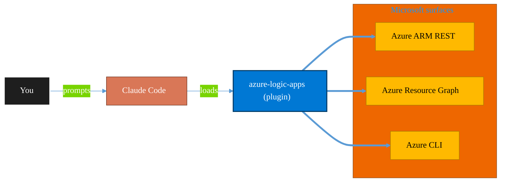

<!-- claude-m:premium-header:start -->
<div align="center">

<a id="top"></a>

# azure-logic-apps

### Azure Logic Apps — enterprise integration workflows, Workflow Definition Language, Standard and Consumption hosting, connectors, B2B/EDI integration accounts, and CI/CD deployment

<sub>Inventory, govern, and operate Azure resources at any scale.</sub>

<br />

<table align="center">
<tr>
<td align="center"><b>Category</b><br /><code>Cloud</code></td>
<td align="center"><b>Surfaces</b><br /><sub>Azure ARM · Resource Graph · ARM REST · CLI</sub></td>
<td align="center"><b>Version</b><br /><code>1.0.0</code></td>
<td align="center"><b>Marketplace</b><br /><code>claude-m-microsoft-marketplace</code></td>
</tr>
</table>

<sub><code>azure</code> &nbsp;·&nbsp; <code>logic-apps</code> &nbsp;·&nbsp; <code>integration</code> &nbsp;·&nbsp; <code>workflow</code> &nbsp;·&nbsp; <code>B2B</code> &nbsp;·&nbsp; <code>EDI</code></sub>

<a href="#install"><b>Install</b></a> &nbsp;·&nbsp;
<a href="#overview"><b>Overview</b></a> &nbsp;·&nbsp;
<a href="#architecture"><b>Architecture</b></a> &nbsp;·&nbsp;
<a href="#related-plugins"><b>Related plugins</b></a> &nbsp;·&nbsp;
<a href="../README.md"><b>Marketplace</b></a>

</div>

---

> [!TIP]
> **One-line install** — `/plugin install azure-logic-apps@claude-m-microsoft-marketplace`


## Overview

> Azure Logic Apps — enterprise integration workflows, Workflow Definition Language, Standard and Consumption hosting, connectors, B2B/EDI integration accounts, and CI/CD deployment

<details>
<summary><b>What ships in this plugin</b> (commands, agents, skills)</summary>

| Component | Items |
|---|---|
| **Commands** | `/la-connector-config` · `/la-create` · `/la-deploy` · `/la-expression-helper` · `/la-integration-account` · `/la-migrate-ise` · `/la-setup` · `/la-troubleshoot` |
| **Agents** | `logic-apps-reviewer` |
| **Skills** | `azure-logic-apps` |

</details>


<details>
<summary><b>Quick example</b></summary>

```text
Use azure-logic-apps to audit and operate Azure resources end-to-end.
```

</details>

<a id="architecture"></a>

## Architecture



<a id="install"></a>

## Install

```bash
/plugin marketplace add markus41/Claude-m
/plugin install azure-logic-apps@claude-m-microsoft-marketplace
```

> [!IMPORTANT]
> This plugin operates against **Azure ARM · Resource Graph · ARM REST · CLI**. Configure credentials via environment variables — never commit secrets.

[Back to top](#top)

---

<!-- claude-m:premium-header:end -->

Azure Logic Apps enterprise integration development -- build automated workflows with Workflow Definition Language, connectors, B2B/EDI integration accounts, and deploy across Standard and Consumption hosting models.

## Setup

```
/plugin install azure-logic-apps@claude-m-microsoft-marketplace
```

## Commands

| Command | Description |
|---------|-------------|
| `/la-setup` | Install Azure CLI, Logic Apps extension, create a Logic App resource, and configure local project settings |
| `/la-create` | Create a new Logic App workflow with trigger selection (HTTP, Recurrence, Service Bus, Event Grid, etc.) |
| `/la-deploy` | Deploy workflows to Azure via CLI, ARM/Bicep templates, or generate GitHub Actions CI/CD pipelines |
| `/la-troubleshoot` | Diagnose failed workflow runs, inspect run history, check trigger status, and resolve connector errors |
| `/la-connector-config` | Configure managed, custom, and built-in connectors with connection references and managed identity auth |
| `/la-integration-account` | Set up B2B integration accounts with trading partners, agreements, schemas, maps, and certificates |
| `/la-migrate-ise` | Migrate Integration Service Environment (ISE) Logic Apps to Logic Apps Standard with connector compatibility checks |
| `/la-expression-helper` | Build and validate Workflow Definition Language expressions, functions, and dynamic content references |

## Agent

| Agent | Description |
|-------|-------------|
| **Logic Apps Reviewer** | Reviews Azure Logic Apps projects for WDL workflow structure, connector configuration, error handling patterns, security best practices, B2B integration correctness, and deployment readiness |

## Trigger Keywords

The skill activates automatically when conversations mention: `azure logic apps`, `logic app`, `workflow definition language`, `WDL`, `enterprise integration`, `integration account`, `B2B integration`, `EDI`, `logic app standard`, `logic app consumption`, `connector configuration`, `workflow automation`, `runAfter`, `logic app trigger`.

## Prompt Examples

- "Use `azure-logic-apps` to scaffold a Standard Logic App with an HTTP trigger that calls a SQL connector and sends results to a Service Bus queue."
- "Use `azure-logic-apps` to review my workflow.json files for missing error handling, hardcoded secrets, and deployment readiness."
- "Use `azure-logic-apps` to migrate my ISE-hosted Logic Apps to Standard tier and identify connectors that need replacement."
- "Use `azure-logic-apps` to set up a B2B integration account with AS2 agreements, X12 schemas, and partner certificates for EDI message processing."

## Related Plugins

| Plugin | Relationship |
|--------|-------------|
| `azure-functions` | Logic Apps can call Azure Functions as inline actions; Functions can trigger Logic App workflows |
| `power-automate` | Power Automate uses the same connector ecosystem; migration paths exist between Logic Apps and Power Automate flows |
| `azure-api-management` | Expose Logic App workflows as managed APIs with policies, rate limiting, and developer portal publishing |
| `azure-service-bus` | Service Bus triggers and actions are core to Logic Apps messaging patterns; dead-letter and session handling integration |

## Author

Markus Ahling
<!-- claude-m:premium-footer:start -->

---

<a id="related-plugins"></a>

## Related plugins

<table>
<tr><th>Plugin</th><th>What it does</th></tr>
<tr><td><a href="../agent-foundry/README.md"><code>agent-foundry</code></a></td><td>Azure AI Foundry agent lifecycle management — scaffold, deploy, test, and manage AI agents with Azure AI Foundry MCP integration</td></tr>
<tr><td><a href="../azure-ai-services/README.md"><code>azure-ai-services</code></a></td><td>Azure AI workloads — Azure OpenAI Service deployments, AI Search indexes, AI Studio/Foundry projects, Cognitive Services provisioning, content filtering, and responsible AI governance</td></tr>
<tr><td><a href="../azure-containers/README.md"><code>azure-containers</code></a></td><td>Azure Container Apps, Container Instances, and Container Registry — build, push, deploy, and scale containerized workloads</td></tr>
<tr><td><a href="../azure-cost-governance/README.md"><code>azure-cost-governance</code></a></td><td>Azure FinOps and governance workflows — query costs, monitor budgets, detect anomalies, and identify idle resources for optimization</td></tr>
<tr><td><a href="../azure-document-intelligence/README.md"><code>azure-document-intelligence</code></a></td><td>Azure AI Document Intelligence — OCR, prebuilt models (invoices, receipts, IDs, tax forms), custom models, layout analysis, document classification, and batch processing</td></tr>
<tr><td><a href="../azure-functions/README.md"><code>azure-functions</code></a></td><td>Azure Functions — triggers, bindings, Durable Functions, deployment, and local development with Azure Functions Core Tools</td></tr>
</table>


<details>
<summary><b>Composable stacks that include <code>azure-logic-apps</code></b></summary>

Combine with sibling plugins to build cross-surface runbooks. Browse the full [marketplace catalog](../README.md#plugin-catalog) for a tailored selection.

</details>

---

<div align="center">

<sub>Part of <a href="../README.md"><b>Claude-m</b></a> — the Microsoft plugin marketplace for Claude Code.</sub>

<sub>Licensed under <a href="../LICENSE">MIT</a>. Built for engineers, MSPs, SOC teams, and analytics leaders.</sub>

</div>

<!-- claude-m:premium-footer:end -->

