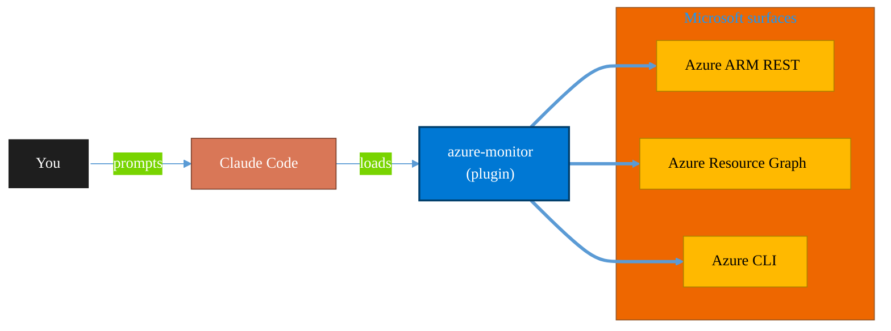

<!-- claude-m:premium-header:start -->
<div align="center">

<a id="top"></a>

# azure-monitor

### Azure Monitor, Application Insights, and Log Analytics — metrics, alerts, KQL queries, dashboards, and diagnostic settings

<sub>Inventory, govern, and operate Azure resources at any scale.</sub>

<br />

<table align="center">
<tr>
<td align="center"><b>Category</b><br /><code>Cloud</code></td>
<td align="center"><b>Surfaces</b><br /><sub>Azure ARM · Resource Graph · ARM REST · CLI</sub></td>
<td align="center"><b>Version</b><br /><code>1.0.0</code></td>
<td align="center"><b>Marketplace</b><br /><code>claude-m-microsoft-marketplace</code></td>
</tr>
</table>

<sub><code>microsoft</code> &nbsp;·&nbsp; <code>azure</code> &nbsp;·&nbsp; <code>monitor</code> &nbsp;·&nbsp; <code>application-insights</code> &nbsp;·&nbsp; <code>log-analytics</code> &nbsp;·&nbsp; <code>kql</code></sub>

<a href="#install"><b>Install</b></a> &nbsp;·&nbsp;
<a href="#overview"><b>Overview</b></a> &nbsp;·&nbsp;
<a href="#architecture"><b>Architecture</b></a> &nbsp;·&nbsp;
<a href="#related-plugins"><b>Related plugins</b></a> &nbsp;·&nbsp;
<a href="../README.md"><b>Marketplace</b></a>

</div>

---

> [!TIP]
> **One-line install** — `/plugin install azure-monitor@claude-m-microsoft-marketplace`


## Overview

> Azure Monitor, Application Insights, and Log Analytics — metrics, alerts, KQL queries, dashboards, and diagnostic settings

<details>
<summary><b>What ships in this plugin</b> (commands, agents, skills)</summary>

| Component | Items |
|---|---|
| **Commands** | `/alert-create` · `/appinsights-setup` · `/dashboard-create` · `/diagnostic-settings` · `/kql-query` · `/monitor-setup` |
| **Agents** | `monitor-reviewer` |
| **Skills** | `azure-monitor` |

</details>


<details>
<summary><b>Quick example</b></summary>

```text
Use azure-monitor to audit and operate Azure resources end-to-end.
```

</details>

<a id="architecture"></a>

## Architecture



<a id="install"></a>

## Install

```bash
/plugin marketplace add markus41/Claude-m
/plugin install azure-monitor@claude-m-microsoft-marketplace
```

> [!IMPORTANT]
> This plugin operates against **Azure ARM · Resource Graph · ARM REST · CLI**. Configure credentials via environment variables — never commit secrets.

[Back to top](#top)

---

<!-- claude-m:premium-header:end -->

Azure Monitor, Application Insights, and Log Analytics — write KQL queries, configure metric and log alerts with action groups, set up Application Insights instrumentation and sampling, create dashboards and workbooks, manage diagnostic settings for Azure resources, implement distributed tracing with OpenTelemetry, and optimize monitoring costs.

## What This Plugin Provides

This is a **knowledge plugin** — it gives Claude deep expertise in Azure Monitor so it can write KQL queries, create alerts, configure diagnostic settings, instrument applications with Application Insights, build dashboards, and review monitoring configurations. It does not contain runtime code, MCP servers, or executable scripts.

## Setup

Run `/setup` to install Azure CLI and create a Log Analytics workspace:

```
/setup              # Full guided setup
/setup --minimal    # Workspace creation only
```

Requires an Azure subscription with Contributor access.

## Commands

| Command | Description |
|---------|-------------|
| `/setup` | Install Azure CLI, create Log Analytics workspace, enable diagnostic settings |
| `/kql-query` | Write and run KQL queries against Log Analytics, explain results |
| `/alert-create` | Create metric or log alerts with action groups |
| `/appinsights-setup` | Add Application Insights to a Node.js/TypeScript project with sampling |
| `/dashboard-create` | Create Azure Dashboard or Workbook from KQL queries |
| `/diagnostic-settings` | Configure diagnostic settings for Azure resources |

## Agent

| Agent | Description |
|-------|-------------|
| **Monitor Reviewer** | Reviews monitoring configurations for coverage, alert quality, KQL efficiency, cost optimization, and security |

## Trigger Keywords

The skill activates automatically when conversations mention: `azure monitor`, `application insights`, `app insights`, `log analytics`, `kql`, `kusto query`, `azure alerts`, `azure metrics`, `diagnostic settings`, `azure dashboard`, `workbook`, `action group`, `smart detection`.

## Author

Markus Ahling
<!-- claude-m:premium-footer:start -->

---

<a id="related-plugins"></a>

## Related plugins

<table>
<tr><th>Plugin</th><th>What it does</th></tr>
<tr><td><a href="../agent-foundry/README.md"><code>agent-foundry</code></a></td><td>Azure AI Foundry agent lifecycle management — scaffold, deploy, test, and manage AI agents with Azure AI Foundry MCP integration</td></tr>
<tr><td><a href="../azure-ai-services/README.md"><code>azure-ai-services</code></a></td><td>Azure AI workloads — Azure OpenAI Service deployments, AI Search indexes, AI Studio/Foundry projects, Cognitive Services provisioning, content filtering, and responsible AI governance</td></tr>
<tr><td><a href="../azure-containers/README.md"><code>azure-containers</code></a></td><td>Azure Container Apps, Container Instances, and Container Registry — build, push, deploy, and scale containerized workloads</td></tr>
<tr><td><a href="../azure-cost-governance/README.md"><code>azure-cost-governance</code></a></td><td>Azure FinOps and governance workflows — query costs, monitor budgets, detect anomalies, and identify idle resources for optimization</td></tr>
<tr><td><a href="../azure-document-intelligence/README.md"><code>azure-document-intelligence</code></a></td><td>Azure AI Document Intelligence — OCR, prebuilt models (invoices, receipts, IDs, tax forms), custom models, layout analysis, document classification, and batch processing</td></tr>
<tr><td><a href="../azure-functions/README.md"><code>azure-functions</code></a></td><td>Azure Functions — triggers, bindings, Durable Functions, deployment, and local development with Azure Functions Core Tools</td></tr>
</table>


<details>
<summary><b>Composable stacks that include <code>azure-monitor</code></b></summary>

Combine with sibling plugins to build cross-surface runbooks. Browse the full [marketplace catalog](../README.md#plugin-catalog) for a tailored selection.

</details>

---

<div align="center">

<sub>Part of <a href="../README.md"><b>Claude-m</b></a> — the Microsoft plugin marketplace for Claude Code.</sub>

<sub>Licensed under <a href="../LICENSE">MIT</a>. Built for engineers, MSPs, SOC teams, and analytics leaders.</sub>

</div>

<!-- claude-m:premium-footer:end -->

