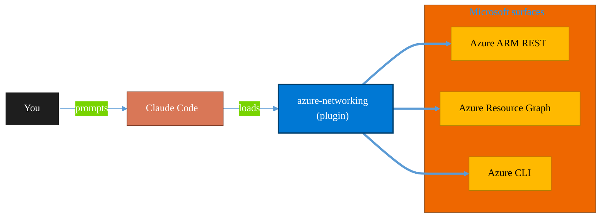

<!-- claude-m:premium-header:start -->
<div align="center">

<a id="top"></a>

# azure-networking

### Azure Networking — VNets, subnets, NSGs, Load Balancers, Application Gateway, Front Door, DNS zones, VPN gateways, ExpressRoute, Azure Firewall, Route Tables, Bastion, and Private Link

<sub>Inventory, govern, and operate Azure resources at any scale.</sub>

<br />

<table align="center">
<tr>
<td align="center"><b>Category</b><br /><code>Cloud</code></td>
<td align="center"><b>Surfaces</b><br /><sub>Azure ARM · Resource Graph · ARM REST · CLI</sub></td>
<td align="center"><b>Version</b><br /><code>1.0.0</code></td>
<td align="center"><b>Marketplace</b><br /><code>claude-m-microsoft-marketplace</code></td>
</tr>
</table>

<sub><code>microsoft</code> &nbsp;·&nbsp; <code>azure</code> &nbsp;·&nbsp; <code>networking</code> &nbsp;·&nbsp; <code>vnet</code> &nbsp;·&nbsp; <code>nsg</code> &nbsp;·&nbsp; <code>load-balancer</code></sub>

<a href="#install"><b>Install</b></a> &nbsp;·&nbsp;
<a href="#overview"><b>Overview</b></a> &nbsp;·&nbsp;
<a href="#architecture"><b>Architecture</b></a> &nbsp;·&nbsp;
<a href="#related-plugins"><b>Related plugins</b></a> &nbsp;·&nbsp;
<a href="../README.md"><b>Marketplace</b></a>

</div>

---

> [!TIP]
> **One-line install** — `/plugin install azure-networking@claude-m-microsoft-marketplace`


## Overview

> Azure Networking — VNets, subnets, NSGs, Load Balancers, Application Gateway, Front Door, DNS zones, VPN gateways, ExpressRoute, Azure Firewall, Route Tables, Bastion, and Private Link

<details>
<summary><b>What ships in this plugin</b> (commands, agents, skills)</summary>

| Component | Items |
|---|---|
| **Commands** | `/appgw-manage` · `/bastion-manage` · `/dns-manage` · `/expressroute-manage` · `/firewall-manage` · `/frontdoor-manage` · `/lb-create` · `/network-setup` · `/nsg-configure` · `/private-endpoint-create` · `/route-table-manage` · `/vnet-create` · `/vpn-manage` |
| **Agents** | `networking-reviewer` |
| **Skills** | `azure-networking` |

</details>


<details>
<summary><b>Quick example</b></summary>

```text
Use azure-networking to audit and operate Azure resources end-to-end.
```

</details>

<a id="architecture"></a>

## Architecture



<a id="install"></a>

## Install

```bash
/plugin marketplace add markus41/Claude-m
/plugin install azure-networking@claude-m-microsoft-marketplace
```

> [!IMPORTANT]
> This plugin operates against **Azure ARM · Resource Graph · ARM REST · CLI**. Configure credentials via environment variables — never commit secrets.

[Back to top](#top)

---

<!-- claude-m:premium-header:end -->

Azure networking expertise — design and deploy Virtual Networks with subnets and peering, configure Network Security Groups, deploy Standard Load Balancers and Application Gateways, manage Azure Front Door for global traffic distribution, administer public and private DNS zones, set up VPN and ExpressRoute gateways, create Private Endpoints with DNS integration, and operate Azure Firewall for centralized network security.

## What This Plugin Provides

This is a **knowledge plugin** — it gives Claude deep expertise in Azure networking so it can design network topologies, create VNets and subnets, configure NSGs, deploy load balancers, manage DNS zones, set up private connectivity, and troubleshoot network issues. It does not contain runtime code, MCP servers, or executable scripts.

## Setup

Run `/setup` to install Azure CLI and verify networking resource providers:

```
/setup              # Full guided setup
/setup --minimal    # CLI + providers only
```

Requires an Azure subscription with at least Network Contributor role.

## Commands

| Command | Description |
|---------|-------------|
| `/setup` | Install Azure CLI, verify networking providers, check subscription quotas |
| `/vnet-create` | Create a VNet with subnets, peering, and service endpoints |
| `/nsg-configure` | Create and assign NSG rules, configure ASGs, enable flow logs |
| `/lb-create` | Create a Load Balancer (public or internal) with backend pool and health probes |
| `/dns-manage` | Manage public and private DNS zones and records |
| `/private-endpoint-create` | Create a Private Endpoint for Azure services with DNS integration |

## Agent

| Agent | Description |
|-------|-------------|
| **Networking Reviewer** | Reviews Azure networking configurations for security, architecture, high availability, private connectivity, and cost optimization |

## Trigger Keywords

The skill activates automatically when conversations mention: `azure networking`, `virtual network`, `vnet`, `nsg`, `network security group`, `load balancer`, `azure dns`, `front door`, `vpn gateway`, `private endpoint`, `private link`, `application gateway`, `azure firewall`, `subnet`, `peering`, `service endpoint`.

## Author

Markus Ahling
<!-- claude-m:premium-footer:start -->

---

<a id="related-plugins"></a>

## Related plugins

<table>
<tr><th>Plugin</th><th>What it does</th></tr>
<tr><td><a href="../agent-foundry/README.md"><code>agent-foundry</code></a></td><td>Azure AI Foundry agent lifecycle management — scaffold, deploy, test, and manage AI agents with Azure AI Foundry MCP integration</td></tr>
<tr><td><a href="../azure-ai-services/README.md"><code>azure-ai-services</code></a></td><td>Azure AI workloads — Azure OpenAI Service deployments, AI Search indexes, AI Studio/Foundry projects, Cognitive Services provisioning, content filtering, and responsible AI governance</td></tr>
<tr><td><a href="../azure-containers/README.md"><code>azure-containers</code></a></td><td>Azure Container Apps, Container Instances, and Container Registry — build, push, deploy, and scale containerized workloads</td></tr>
<tr><td><a href="../azure-cost-governance/README.md"><code>azure-cost-governance</code></a></td><td>Azure FinOps and governance workflows — query costs, monitor budgets, detect anomalies, and identify idle resources for optimization</td></tr>
<tr><td><a href="../azure-document-intelligence/README.md"><code>azure-document-intelligence</code></a></td><td>Azure AI Document Intelligence — OCR, prebuilt models (invoices, receipts, IDs, tax forms), custom models, layout analysis, document classification, and batch processing</td></tr>
<tr><td><a href="../azure-functions/README.md"><code>azure-functions</code></a></td><td>Azure Functions — triggers, bindings, Durable Functions, deployment, and local development with Azure Functions Core Tools</td></tr>
</table>


<details>
<summary><b>Composable stacks that include <code>azure-networking</code></b></summary>

Combine with sibling plugins to build cross-surface runbooks. Browse the full [marketplace catalog](../README.md#plugin-catalog) for a tailored selection.

</details>

---

<div align="center">

<sub>Part of <a href="../README.md"><b>Claude-m</b></a> — the Microsoft plugin marketplace for Claude Code.</sub>

<sub>Licensed under <a href="../LICENSE">MIT</a>. Built for engineers, MSPs, SOC teams, and analytics leaders.</sub>

</div>

<!-- claude-m:premium-footer:end -->

