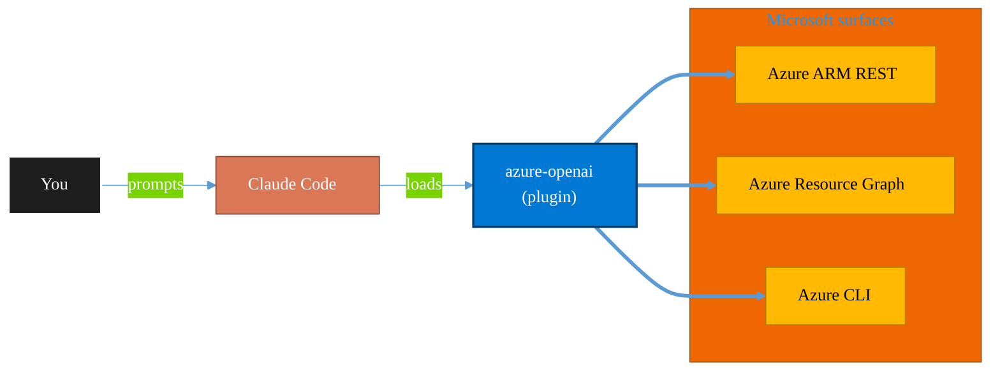

<!-- claude-m:premium-header:start -->
<div align="center">

<a id="top"></a>

# azure-openai

### Azure OpenAI Service — model deployments, fine-tuning, content filtering, prompt engineering, batch API, and quota management with az cognitiveservices and REST API

<sub>Inventory, govern, and operate Azure resources at any scale.</sub>

<br />

<table align="center">
<tr>
<td align="center"><b>Category</b><br /><code>Cloud</code></td>
<td align="center"><b>Surfaces</b><br /><sub>Azure ARM · Resource Graph · ARM REST · CLI</sub></td>
<td align="center"><b>Version</b><br /><code>1.0.0</code></td>
<td align="center"><b>Marketplace</b><br /><code>claude-m-microsoft-marketplace</code></td>
</tr>
</table>

<sub><code>microsoft</code> &nbsp;·&nbsp; <code>azure</code> &nbsp;·&nbsp; <code>openai</code> &nbsp;·&nbsp; <code>gpt</code> &nbsp;·&nbsp; <code>embeddings</code> &nbsp;·&nbsp; <code>fine-tuning</code></sub>

<a href="#install"><b>Install</b></a> &nbsp;·&nbsp;
<a href="#overview"><b>Overview</b></a> &nbsp;·&nbsp;
<a href="#architecture"><b>Architecture</b></a> &nbsp;·&nbsp;
<a href="#related-plugins"><b>Related plugins</b></a> &nbsp;·&nbsp;
<a href="../README.md"><b>Marketplace</b></a>

</div>

---

> [!TIP]
> **One-line install** — `/plugin install azure-openai@claude-m-microsoft-marketplace`


## Overview

> Azure OpenAI Service — model deployments, fine-tuning, content filtering, prompt engineering, batch API, and quota management with az cognitiveservices and REST API

<details>
<summary><b>What ships in this plugin</b> (commands, agents, skills)</summary>

| Component | Items |
|---|---|
| **Commands** | `/aoai-batch` · `/aoai-content-filter` · `/aoai-deploy` · `/aoai-fine-tune` · `/aoai-quota` · `/aoai-setup` |
| **Agents** | `openai-reviewer` |
| **Skills** | `azure-openai` |

</details>


<details>
<summary><b>Quick example</b></summary>

```text
Use azure-openai to audit and operate Azure resources end-to-end.
```

</details>

<a id="architecture"></a>

## Architecture



<a id="install"></a>

## Install

```bash
/plugin marketplace add markus41/Claude-m
/plugin install azure-openai@claude-m-microsoft-marketplace
```

> [!IMPORTANT]
> This plugin operates against **Azure ARM · Resource Graph · ARM REST · CLI**. Configure credentials via environment variables — never commit secrets.

[Back to top](#top)

---

<!-- claude-m:premium-header:end -->

Azure OpenAI Service operations — deploy and manage GPT-4o, GPT-4, GPT-3.5-Turbo, Embeddings, DALL-E, Whisper, and TTS models. Covers Standard, Provisioned-Managed, and Global Standard deployment types, fine-tuning workflows, content filtering policies, prompt engineering patterns, Batch API, quota management, and secure production architectures using `az cognitiveservices` CLI and the Azure OpenAI REST API.

## What This Plugin Provides

This is a **knowledge plugin** — it gives Claude deep expertise in Azure OpenAI Service so it can create and manage deployments, configure content filters, design effective prompts, run fine-tuning jobs, process batch workloads, and optimize cost and security. It does not contain runtime code, MCP servers, or executable scripts.

## Setup

Run `/aoai-setup` to create an Azure OpenAI resource and verify API access:

```
/aoai-setup              # Full guided setup
/aoai-setup --minimal    # Resource creation and key retrieval only
```

Requires an Azure subscription with access to Azure OpenAI Service.

## Commands

| Command | Description |
|---------|-------------|
| `/aoai-setup` | Install Azure CLI, create cognitive account, configure defaults, verify API access |
| `/aoai-deploy` | Create, update, or delete model deployments — set capacity, choose SKU, manage model versions |
| `/aoai-fine-tune` | Upload training data, create fine-tuning job, monitor progress, deploy the result |
| `/aoai-content-filter` | Create and manage content filter policies and custom blocklists |
| `/aoai-quota` | View quota usage, monitor TPM/RPM limits, identify rate limit bottlenecks |
| `/aoai-batch` | Create batch processing jobs, upload input files, monitor, retrieve results |

## Agent

| Agent | Description |
|-------|-------------|
| **OpenAI Reviewer** | Reviews Azure OpenAI implementations for deployment configuration, content filter policies, prompt engineering quality, security posture, cost optimization, and error handling patterns |

## Trigger Keywords

The skill activates automatically when conversations mention: `azure openai`, `openai deployment`, `gpt deployment`, `azure openai fine-tuning`, `content filter`, `openai quota`, `openai batch`, `azure openai model`, `prompt engineering azure`, `dalle azure`, `whisper azure`, `embedding deployment`.

## Example Prompts

- "Deploy GPT-4o with 50K TPM capacity in East US and set up a strict content filter policy."
- "Fine-tune GPT-4o-mini with my customer support training data and deploy the result."
- "Review my Azure OpenAI implementation for security best practices and cost optimization."
- "Create a batch job to classify 10,000 support tickets using GPT-4o-mini."
- "Show my current quota usage and recommend capacity adjustments."
- "Set up a RAG pipeline with Azure OpenAI embeddings and AI Search."

## Author

Markus Ahling
<!-- claude-m:premium-footer:start -->

---

<a id="related-plugins"></a>

## Related plugins

<table>
<tr><th>Plugin</th><th>What it does</th></tr>
<tr><td><a href="../azure-ai-services/README.md"><code>azure-ai-services</code></a></td><td>Azure AI workloads — Azure OpenAI Service deployments, AI Search indexes, AI Studio/Foundry projects, Cognitive Services provisioning, content filtering, and responsible AI governance</td></tr>
<tr><td><a href="../agent-foundry/README.md"><code>agent-foundry</code></a></td><td>Azure AI Foundry agent lifecycle management — scaffold, deploy, test, and manage AI agents with Azure AI Foundry MCP integration</td></tr>
<tr><td><a href="../azure-containers/README.md"><code>azure-containers</code></a></td><td>Azure Container Apps, Container Instances, and Container Registry — build, push, deploy, and scale containerized workloads</td></tr>
<tr><td><a href="../azure-cost-governance/README.md"><code>azure-cost-governance</code></a></td><td>Azure FinOps and governance workflows — query costs, monitor budgets, detect anomalies, and identify idle resources for optimization</td></tr>
<tr><td><a href="../azure-document-intelligence/README.md"><code>azure-document-intelligence</code></a></td><td>Azure AI Document Intelligence — OCR, prebuilt models (invoices, receipts, IDs, tax forms), custom models, layout analysis, document classification, and batch processing</td></tr>
<tr><td><a href="../azure-functions/README.md"><code>azure-functions</code></a></td><td>Azure Functions — triggers, bindings, Durable Functions, deployment, and local development with Azure Functions Core Tools</td></tr>
</table>


<details>
<summary><b>Composable stacks that include <code>azure-openai</code></b></summary>

Combine with sibling plugins to build cross-surface runbooks. Browse the full [marketplace catalog](../README.md#plugin-catalog) for a tailored selection.

</details>

---

<div align="center">

<sub>Part of <a href="../README.md"><b>Claude-m</b></a> — the Microsoft plugin marketplace for Claude Code.</sub>

<sub>Licensed under <a href="../LICENSE">MIT</a>. Built for engineers, MSPs, SOC teams, and analytics leaders.</sub>

</div>

<!-- claude-m:premium-footer:end -->

