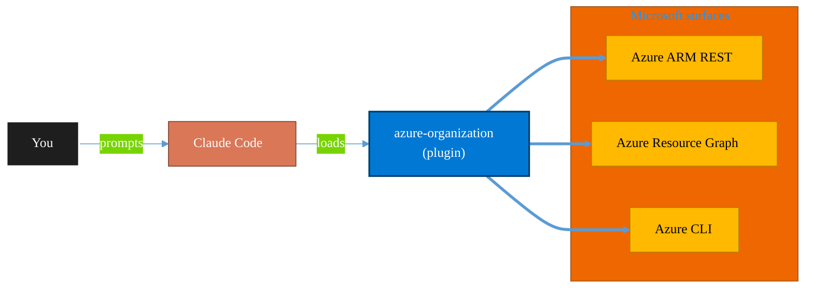

<!-- claude-m:premium-header:start -->
<div align="center">

<a id="top"></a>

# azure-organization

### Azure organization and governance — management groups, subscription management, resource tagging, naming conventions, landing zones, and tenant-level hierarchy

<sub>Inventory, govern, and operate Azure resources at any scale.</sub>

<br />

<table align="center">
<tr>
<td align="center"><b>Category</b><br /><code>Cloud</code></td>
<td align="center"><b>Surfaces</b><br /><sub>Azure ARM · Resource Graph · ARM REST · CLI</sub></td>
<td align="center"><b>Version</b><br /><code>1.0.0</code></td>
<td align="center"><b>Marketplace</b><br /><code>claude-m-microsoft-marketplace</code></td>
</tr>
</table>

<sub><code>microsoft</code> &nbsp;·&nbsp; <code>azure</code> &nbsp;·&nbsp; <code>organization</code> &nbsp;·&nbsp; <code>management-groups</code> &nbsp;·&nbsp; <code>subscriptions</code> &nbsp;·&nbsp; <code>tags</code></sub>

<a href="#install"><b>Install</b></a> &nbsp;·&nbsp;
<a href="#overview"><b>Overview</b></a> &nbsp;·&nbsp;
<a href="#architecture"><b>Architecture</b></a> &nbsp;·&nbsp;
<a href="#related-plugins"><b>Related plugins</b></a> &nbsp;·&nbsp;
<a href="../README.md"><b>Marketplace</b></a>

</div>

---

> [!TIP]
> **One-line install** — `/plugin install azure-organization@claude-m-microsoft-marketplace`


## Overview

> Azure organization and governance — management groups, subscription management, resource tagging, naming conventions, landing zones, and tenant-level hierarchy

<details>
<summary><b>What ships in this plugin</b> (commands, agents, skills)</summary>

| Component | Items |
|---|---|
| **Commands** | `/org-inventory` · `/org-landing-zone` · `/org-naming-check` · `/org-setup` · `/org-tag-audit` |
| **Agents** | `org-reviewer` |
| **Skills** | `azure-organization` |

</details>


<details>
<summary><b>Quick example</b></summary>

```text
Use azure-organization to audit and operate Azure resources end-to-end.
```

</details>

<a id="architecture"></a>

## Architecture



<a id="install"></a>

## Install

```bash
/plugin marketplace add markus41/Claude-m
/plugin install azure-organization@claude-m-microsoft-marketplace
```

> [!IMPORTANT]
> This plugin operates against **Azure ARM · Resource Graph · ARM REST · CLI**. Configure credentials via environment variables — never commit secrets.

[Back to top](#top)

---

<!-- claude-m:premium-header:end -->

Azure organizational hierarchy and governance workflows — management groups, subscription management, resource group organization, resource tagging, naming conventions, Azure Landing Zones, and tenant-level governance.

## What this plugin helps with
- Design and assess management group hierarchies aligned with Cloud Adoption Framework
- Inventory subscriptions, resource groups, and resources across the tenant
- Audit tag compliance and enforce consistent tagging strategies
- Validate resource names against CAF naming conventions
- Deploy or assess Azure Landing Zone architectures (hub-spoke, Virtual WAN)
- Configure RBAC at scale using management group inheritance
- Apply Azure Policy at management group scope for organization-wide governance

## Install

```bash
/plugin install azure-organization@claude-m-microsoft-marketplace
```

## Included commands

| Command | Description |
|---|---|
| `org-setup` | Verify tenant access, list management group hierarchy, confirm RBAC permissions |
| `org-inventory` | Full tenant inventory — subscriptions, resource groups, resources by type/region/tag |
| `org-tag-audit` | Scan resources for tag compliance, report missing required tags, suggest remediation |
| `org-naming-check` | Validate resource names against CAF conventions, report violations, suggest corrections |
| `org-landing-zone` | Deploy or assess Azure Landing Zone architecture and readiness |

## Agent

| Agent | Description |
|---|---|
| `org-reviewer` | Reviews organizational structure for hierarchy design, tagging, naming, RBAC, and policy coverage |

## Skill
- `skills/azure-organization/SKILL.md`

## Plugin structure
- `.claude-plugin/plugin.json`
- `skills/azure-organization/SKILL.md`
- `skills/azure-organization/references/management-groups.md`
- `skills/azure-organization/references/naming-conventions.md`
- `skills/azure-organization/references/landing-zones.md`
- `commands/org-setup.md`
- `commands/org-inventory.md`
- `commands/org-tag-audit.md`
- `commands/org-naming-check.md`
- `commands/org-landing-zone.md`
- `agents/org-reviewer.md`

## Example prompts

- "Use `azure-organization` to show the management group hierarchy and identify subscriptions still in the root group."
- "Use `azure-organization` to run a full inventory of subscriptions and resources grouped by type and region."
- "Use `azure-organization` to audit all resources for missing Environment, Owner, and CostCenter tags."
- "Use `azure-organization` to validate resource names against CAF naming conventions and suggest corrections."
- "Use `azure-organization` to assess the current environment against Azure Landing Zone best practices."
- "Use `azure-organization` to check RBAC assignments at the management group scope and flag Owner at root."

## Related plugins

| Plugin | Relationship |
|---|---|
| `azure-policy-security` | Policy assignments and compliance at management group scope |
| `azure-cost-governance` | Cost allocation by tags and subscription budgets |
| `entra-id-admin` | RBAC groups and PIM configuration |
| `azure-networking` | Landing zone connectivity (hub-spoke, Virtual WAN) |
| `azure-tenant-assessment` | Entry-point tenant assessment for new environments |
<!-- claude-m:premium-footer:start -->

---

<a id="related-plugins"></a>

## Related plugins

<table>
<tr><th>Plugin</th><th>What it does</th></tr>
<tr><td><a href="../azure-cost-governance/README.md"><code>azure-cost-governance</code></a></td><td>Azure FinOps and governance workflows — query costs, monitor budgets, detect anomalies, and identify idle resources for optimization</td></tr>
<tr><td><a href="../azure-tenant-assessment/README.md"><code>azure-tenant-assessment</code></a></td><td>Entry-point Azure tenant assessment — subscription inventory, resource catalog, security posture snapshot, cost overview, and plugin setup recommendations</td></tr>
<tr><td><a href="../agent-foundry/README.md"><code>agent-foundry</code></a></td><td>Azure AI Foundry agent lifecycle management — scaffold, deploy, test, and manage AI agents with Azure AI Foundry MCP integration</td></tr>
<tr><td><a href="../azure-ai-services/README.md"><code>azure-ai-services</code></a></td><td>Azure AI workloads — Azure OpenAI Service deployments, AI Search indexes, AI Studio/Foundry projects, Cognitive Services provisioning, content filtering, and responsible AI governance</td></tr>
<tr><td><a href="../azure-containers/README.md"><code>azure-containers</code></a></td><td>Azure Container Apps, Container Instances, and Container Registry — build, push, deploy, and scale containerized workloads</td></tr>
<tr><td><a href="../azure-document-intelligence/README.md"><code>azure-document-intelligence</code></a></td><td>Azure AI Document Intelligence — OCR, prebuilt models (invoices, receipts, IDs, tax forms), custom models, layout analysis, document classification, and batch processing</td></tr>
</table>


<details>
<summary><b>Composable stacks that include <code>azure-organization</code></b></summary>

Combine with sibling plugins to build cross-surface runbooks. Browse the full [marketplace catalog](../README.md#plugin-catalog) for a tailored selection.

</details>

---

<div align="center">

<sub>Part of <a href="../README.md"><b>Claude-m</b></a> — the Microsoft plugin marketplace for Claude Code.</sub>

<sub>Licensed under <a href="../LICENSE">MIT</a>. Built for engineers, MSPs, SOC teams, and analytics leaders.</sub>

</div>

<!-- claude-m:premium-footer:end -->

