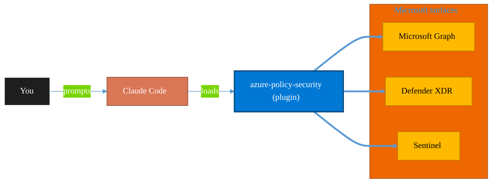

<!-- claude-m:premium-header:start -->
<div align="center">

<a id="top"></a>

# azure-policy-security

### Evaluate Azure policy compliance and security posture — policy assignments, drift analysis, remediation planning, and guardrail recommendations

<sub>Protect identity, endpoints, data, and information.</sub>

<br />

<table align="center">
<tr>
<td align="center"><b>Category</b><br /><code>Security</code></td>
<td align="center"><b>Surfaces</b><br /><sub>Microsoft Graph · Defender · Sentinel · Purview · Entra</sub></td>
<td align="center"><b>Version</b><br /><code>1.0.0</code></td>
<td align="center"><b>Marketplace</b><br /><code>claude-m-microsoft-marketplace</code></td>
</tr>
</table>

<sub><code>microsoft</code> &nbsp;·&nbsp; <code>azure</code> &nbsp;·&nbsp; <code>policy</code> &nbsp;·&nbsp; <code>security</code> &nbsp;·&nbsp; <code>governance</code> &nbsp;·&nbsp; <code>compliance</code></sub>

<a href="#install"><b>Install</b></a> &nbsp;·&nbsp;
<a href="#overview"><b>Overview</b></a> &nbsp;·&nbsp;
<a href="#architecture"><b>Architecture</b></a> &nbsp;·&nbsp;
<a href="#related-plugins"><b>Related plugins</b></a> &nbsp;·&nbsp;
<a href="../README.md"><b>Marketplace</b></a>

</div>

---

> [!TIP]
> **One-line install** — `/plugin install azure-policy-security@claude-m-microsoft-marketplace`


## Overview

> Evaluate Azure policy compliance and security posture — policy assignments, drift analysis, remediation planning, and guardrail recommendations

<details>
<summary><b>What ships in this plugin</b> (commands, agents, skills)</summary>

| Component | Items |
|---|---|
| **Commands** | `/drift-analysis` · `/policy-coverage` · `/policy-setup` · `/remediation-plan` |
| **Agents** | `azure-policy-security-reviewer` |
| **Skills** | `azure-policy-security` |

</details>


<details>
<summary><b>Quick example</b></summary>

```text
Use azure-policy-security to investigate, contain, and harden against threats.
```

</details>

<a id="architecture"></a>

## Architecture



<a id="install"></a>

## Install

```bash
/plugin marketplace add markus41/Claude-m
/plugin install azure-policy-security@claude-m-microsoft-marketplace
```

> [!IMPORTANT]
> This plugin operates against **Microsoft Graph · Defender · Sentinel · Purview · Entra**. Configure credentials via environment variables — never commit secrets.

[Back to top](#top)

---

<!-- claude-m:premium-header:end -->

Azure policy and security posture review workflows.

## What this plugin helps with
- Audit policy assignment coverage and exemptions
- Detect drift against baseline guardrails
- Prioritize remediation actions by risk and blast radius
- Track compliance posture over time

## Integration Context Contract
- Canonical contract: [`docs/integration-context.md`](../docs/integration-context.md)

| Command family | tenantId | subscriptionId | environmentCloud | principalType | scopesOrRoles |
|---|---|---|---|---|---|
| Policy coverage, drift, remediation | required | required | `AzureCloud`\* | `delegated-user` or `service-principal` | `PolicyInsights.Read`, `Policy.Read.All`, Azure `Reader` |

\* Use sovereign cloud values from the contract when applicable.

All commands must fail fast with `MissingIntegrationContext`, `InvalidIntegrationContext`, `ContextCloudMismatch`, or `InsufficientScopesOrRoles` before API calls.
Outputs and reviewer notes must redact sensitive IDs using the contract rules.

## Included commands
- `commands/setup.md`
- `commands/policy-coverage.md`
- `commands/drift-analysis.md`
- `commands/remediation-plan.md`

## Skill
- `skills/azure-policy-security/SKILL.md`

## Plugin structure
- `.claude-plugin/plugin.json`
- `skills/azure-policy-security/SKILL.md`
- `commands/setup.md`
- `commands/policy-coverage.md`
- `commands/drift-analysis.md`
- `commands/remediation-plan.md`
- `agents/azure-policy-security-reviewer.md`
<!-- claude-m:premium-footer:start -->

---

<a id="related-plugins"></a>

## Related plugins

<table>
<tr><th>Plugin</th><th>What it does</th></tr>
<tr><td><a href="../fabric-security-governance/README.md"><code>fabric-security-governance</code></a></td><td>Microsoft Fabric Security Governance — workspace RBAC, RLS/OLS patterns, sensitivity labels, lineage controls, and audit readiness</td></tr>
<tr><td><a href="../graph-investigator/README.md"><code>graph-investigator</code></a></td><td>Microsoft Graph Investigator — unified user investigation, mailbox forensics, activity timelines, device correlation, and forensic reporting across all M365 services</td></tr>
<tr><td><a href="../azure-key-vault/README.md"><code>azure-key-vault</code></a></td><td>Azure Key Vault — secrets, keys, and certificates management with RBAC, rotation policies, and managed identity integration</td></tr>
<tr><td><a href="../entra-id-security/README.md"><code>entra-id-security</code></a></td><td>Microsoft Entra ID identity governance and security — app registrations, service principals, conditional access, sign-in logs, and risk detection</td></tr>
<tr><td><a href="../lighthouse-operations/README.md"><code>lighthouse-operations</code></a></td><td>Comprehensive Azure Lighthouse and M365 Lighthouse operations for MSPs/CSPs — Azure delegation ARM/Bicep templates, managed services marketplace offers, GDAP full lifecycle management, baseline deployment automation, cross-tenant governance, Partner Center integration, and alert management.</td></tr>
<tr><td><a href="../purview-compliance/README.md"><code>purview-compliance</code></a></td><td>Microsoft Purview compliance workflows — DLP review, retention planning, sensitivity labels, eDiscovery readiness, and guided compliance playbooks with audit-ready change logs</td></tr>
</table>


<details>
<summary><b>Composable stacks that include <code>azure-policy-security</code></b></summary>

Combine with sibling plugins to build cross-surface runbooks. Browse the full [marketplace catalog](../README.md#plugin-catalog) for a tailored selection.

</details>

---

<div align="center">

<sub>Part of <a href="../README.md"><b>Claude-m</b></a> — the Microsoft plugin marketplace for Claude Code.</sub>

<sub>Licensed under <a href="../LICENSE">MIT</a>. Built for engineers, MSPs, SOC teams, and analytics leaders.</sub>

</div>

<!-- claude-m:premium-footer:end -->

