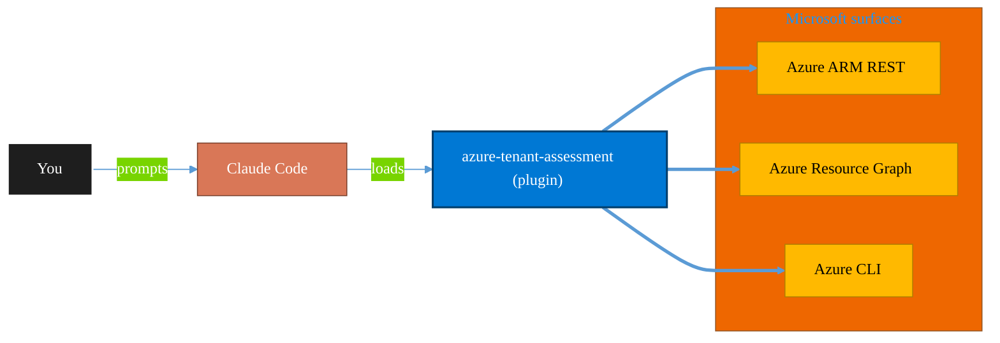

<!-- claude-m:premium-header:start -->
<div align="center">

<a id="top"></a>

# azure-tenant-assessment

### Entry-point Azure tenant assessment — subscription inventory, resource catalog, security posture snapshot, cost overview, and plugin setup recommendations

<sub>Inventory, govern, and operate Azure resources at any scale.</sub>

<br />

<table align="center">
<tr>
<td align="center"><b>Category</b><br /><code>Cloud</code></td>
<td align="center"><b>Surfaces</b><br /><sub>Azure ARM · Resource Graph · ARM REST · CLI</sub></td>
<td align="center"><b>Version</b><br /><code>1.0.0</code></td>
<td align="center"><b>Marketplace</b><br /><code>claude-m-microsoft-marketplace</code></td>
</tr>
</table>

<sub><code>microsoft</code> &nbsp;·&nbsp; <code>azure</code> &nbsp;·&nbsp; <code>assessment</code> &nbsp;·&nbsp; <code>onboarding</code> &nbsp;·&nbsp; <code>inventory</code> &nbsp;·&nbsp; <code>governance</code></sub>

<a href="#install"><b>Install</b></a> &nbsp;·&nbsp;
<a href="#overview"><b>Overview</b></a> &nbsp;·&nbsp;
<a href="#architecture"><b>Architecture</b></a> &nbsp;·&nbsp;
<a href="#related-plugins"><b>Related plugins</b></a> &nbsp;·&nbsp;
<a href="../README.md"><b>Marketplace</b></a>

</div>

---

> [!TIP]
> **One-line install** — `/plugin install azure-tenant-assessment@claude-m-microsoft-marketplace`


## Overview

> Entry-point Azure tenant assessment — subscription inventory, resource catalog, security posture snapshot, cost overview, and plugin setup recommendations

<details>
<summary><b>What ships in this plugin</b> (commands, agents, skills)</summary>

| Component | Items |
|---|---|
| **Commands** | `/azure-tenant-assess` · `/azure-tenant-plugin-setup` · `/azure-tenant-setup` |
| **Agents** | `azure-tenant-assessment-reviewer` |
| **Skills** | `azure-tenant-assessment` |

</details>


<details>
<summary><b>Quick example</b></summary>

```text
Use azure-tenant-assessment to audit and operate Azure resources end-to-end.
```

</details>

<a id="architecture"></a>

## Architecture



<a id="install"></a>

## Install

```bash
/plugin marketplace add markus41/Claude-m
/plugin install azure-tenant-assessment@claude-m-microsoft-marketplace
```

> [!IMPORTANT]
> This plugin operates against **Azure ARM · Resource Graph · ARM REST · CLI**. Configure credentials via environment variables — never commit secrets.

[Back to top](#top)

---

<!-- claude-m:premium-header:end -->

Entry-point plugin for any new Azure engagement. Surveys the tenant, produces a structured "lay of the land" assessment report, and maps discovered resources to the right plugins in this marketplace.

## What it does

1. **Surveys the Azure tenant** — subscriptions, resource groups, and full resource inventory using `microsoft-azure-mcp` MCP tools when available; falls back to a guided questionnaire when not.
2. **Produces a structured report** — saved to `azure-assessment-YYYY-MM-DD.md` and printed to screen. Covers: subscription inventory, resource catalog, resource distribution, security posture snapshot, and recommended plugins.
3. **Recommends plugins** — maps discovered ARM resource types to the relevant plugins in this marketplace and optionally installs them interactively.

## Commands

| Command | Purpose |
|---|---|
| `/azure-tenant-setup` | Validate auth context and test MCP connectivity before assessment |
| `/azure-tenant-assess` | Run the full tenant assessment and produce the report |
| `/azure-tenant-plugin-setup` | Recommend and optionally install plugins based on assessment findings |

## Quick start

```bash
# 1. Validate setup
/azure-tenant-setup

# 2. Run assessment
/azure-tenant-assess --depth quick

# 3. Install recommended plugins
/azure-tenant-plugin-setup --install
```

## Arguments

### `/azure-tenant-setup`
```
[--tenant-id <guid>]          Override tenant ID from integration context
[--subscription-id <guid>]    Validate against a specific subscription
[--cloud <AzureCloud|AzureUSGovernment|AzureChinaCloud>]
```

### `/azure-tenant-assess`
```
[--subscription <id>]         Assess a single subscription only
[--all-subscriptions]         Assess all accessible subscriptions (default)
[--depth <quick|full>]        quick = subscription-level resources; full = per-RG (default: quick)
[--output <path>]             Override report output path (default: azure-assessment-YYYY-MM-DD.md)
```

### `/azure-tenant-plugin-setup`
```
[--assessment-file <path>]    Read from a specific assessment file (auto-detects latest if omitted)
[--install]                   Interactively confirm and install each recommended plugin
```

## Modes

### Live mode (MCP available)
Requires `microsoft-azure-mcp` plugin to be installed. Uses `azure_list_subscriptions`, `azure_list_resource_groups`, and `azure_list_resources` MCP tools for real-time data.

### Guided mode (no MCP)
When `microsoft-azure-mcp` is not installed, falls back to a structured questionnaire. Produces the same report format with user-provided estimates.

## Report structure

```
azure-assessment-YYYY-MM-DD.md
├── Executive Summary
├── Subscription Inventory
├── Resource Catalog (type × count × recommended plugins)
├── Resource Distribution (by region, top RGs)
├── Security Posture Summary
├── Recommended Plugins (tiered table with install commands)
└── Next Steps
```

## Agent

The **Azure Tenant Assessment Reviewer** agent reviews completed assessment reports for:
- Inventory completeness
- Report accuracy
- Plugin recommendation quality
- Security coverage gaps
- Redaction compliance

Trigger it by asking: "review my azure assessment report"

## Design principles

- **Read-only**: Never creates, modifies, or deletes any Azure resource.
- **Live-first**: Uses MCP tools when available; graceful guided fallback when not.
- **Self-contained**: Works without any other plugin installed.
- **Marketplace-aware**: Maps all discovered resource types to plugins in this marketplace.

## Install

```bash
/plugin install azure-tenant-assessment@claude-m-microsoft-marketplace
```
<!-- claude-m:premium-footer:start -->

---

<a id="related-plugins"></a>

## Related plugins

<table>
<tr><th>Plugin</th><th>What it does</th></tr>
<tr><td><a href="../azure-cost-governance/README.md"><code>azure-cost-governance</code></a></td><td>Azure FinOps and governance workflows — query costs, monitor budgets, detect anomalies, and identify idle resources for optimization</td></tr>
<tr><td><a href="../azure-organization/README.md"><code>azure-organization</code></a></td><td>Azure organization and governance — management groups, subscription management, resource tagging, naming conventions, landing zones, and tenant-level hierarchy</td></tr>
<tr><td><a href="../msp-tenant-provisioning/README.md"><code>msp-tenant-provisioning</code></a></td><td>Full MSP/CSP new customer provisioning — Partner Center CSP tenant creation, Azure subscription and management group setup, initial M365 security baseline, domain DNS configuration, and Microsoft 365 Lighthouse onboarding.</td></tr>
<tr><td><a href="../agent-foundry/README.md"><code>agent-foundry</code></a></td><td>Azure AI Foundry agent lifecycle management — scaffold, deploy, test, and manage AI agents with Azure AI Foundry MCP integration</td></tr>
<tr><td><a href="../azure-ai-services/README.md"><code>azure-ai-services</code></a></td><td>Azure AI workloads — Azure OpenAI Service deployments, AI Search indexes, AI Studio/Foundry projects, Cognitive Services provisioning, content filtering, and responsible AI governance</td></tr>
<tr><td><a href="../azure-containers/README.md"><code>azure-containers</code></a></td><td>Azure Container Apps, Container Instances, and Container Registry — build, push, deploy, and scale containerized workloads</td></tr>
</table>


<details>
<summary><b>Composable stacks that include <code>azure-tenant-assessment</code></b></summary>

Combine with sibling plugins to build cross-surface runbooks. Browse the full [marketplace catalog](../README.md#plugin-catalog) for a tailored selection.

</details>

---

<div align="center">

<sub>Part of <a href="../README.md"><b>Claude-m</b></a> — the Microsoft plugin marketplace for Claude Code.</sub>

<sub>Licensed under <a href="../LICENSE">MIT</a>. Built for engineers, MSPs, SOC teams, and analytics leaders.</sub>

</div>

<!-- claude-m:premium-footer:end -->

