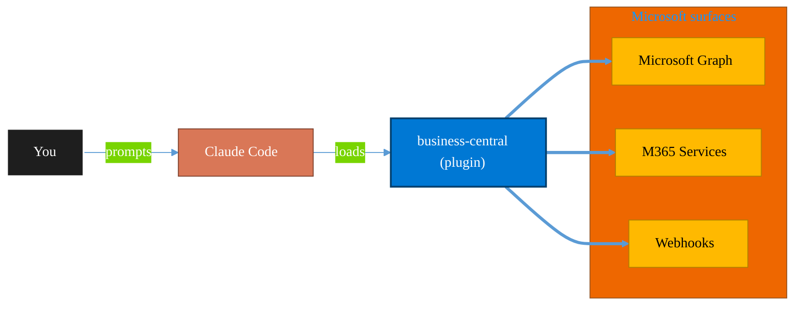

<!-- claude-m:premium-header:start -->
<div align="center">

<a id="top"></a>

# business-central

### Microsoft Dynamics 365 Business Central ERP — finance, supply chain, and inventory management via BC OData v4 / API v2.0 REST API

<sub>Automate everyday Microsoft 365 collaboration workflows.</sub>

<br />

<table align="center">
<tr>
<td align="center"><b>Category</b><br /><code>Productivity</code></td>
<td align="center"><b>Surfaces</b><br /><sub>Microsoft Graph · M365 · Teams · Outlook · SharePoint · Loop</sub></td>
<td align="center"><b>Version</b><br /><code>1.0.0</code></td>
<td align="center"><b>Marketplace</b><br /><code>claude-m-microsoft-marketplace</code></td>
</tr>
</table>

<sub><code>microsoft</code> &nbsp;·&nbsp; <code>dynamics-365</code> &nbsp;·&nbsp; <code>business-central</code> &nbsp;·&nbsp; <code>erp</code> &nbsp;·&nbsp; <code>finance</code> &nbsp;·&nbsp; <code>general-ledger</code></sub>

<a href="#install"><b>Install</b></a> &nbsp;·&nbsp;
<a href="#overview"><b>Overview</b></a> &nbsp;·&nbsp;
<a href="#architecture"><b>Architecture</b></a> &nbsp;·&nbsp;
<a href="#related-plugins"><b>Related plugins</b></a> &nbsp;·&nbsp;
<a href="../README.md"><b>Marketplace</b></a>

</div>

---

> [!TIP]
> **One-line install** — `/plugin install business-central@claude-m-microsoft-marketplace`


## Overview

> Microsoft Dynamics 365 Business Central ERP — finance, supply chain, and inventory management via BC OData v4 / API v2.0 REST API

<details>
<summary><b>What ships in this plugin</b> (commands, agents, skills)</summary>

| Component | Items |
|---|---|
| **Commands** | `/bc-gl-report` · `/bc-inventory-status` · `/bc-purchase-order` · `/bc-sales-invoice` · `/business-central-setup` |
| **Agents** | `business-central-reviewer` |
| **Skills** | `business-central` |

</details>


<details>
<summary><b>Quick example</b></summary>

```text
Use business-central to automate Microsoft 365 collaboration workflows.
```

</details>

<a id="architecture"></a>

## Architecture



<a id="install"></a>

## Install

```bash
/plugin marketplace add markus41/Claude-m
/plugin install business-central@claude-m-microsoft-marketplace
```

> [!IMPORTANT]
> This plugin operates against **Microsoft Graph · M365 · Teams · Outlook · SharePoint · Loop**. Configure credentials via environment variables — never commit secrets.

[Back to top](#top)

---

<!-- claude-m:premium-header:end -->

Dynamics 365 Business Central ERP for Claude Code — Finance, Supply Chain, and Inventory management via the BC OData v4 / API v2.0 REST API.

## What this plugin provides

| Area | Capabilities |
|---|---|
| **Finance** | Chart of accounts, GL entries, journal entries (create + post), AP/AR aging, bank account balances, payment terms |
| **Supply Chain** | Sales orders, sales invoices (create + post + send), purchase orders (create + receive), purchase invoices |
| **Inventory** | Item availability, inventory valuation, item ledger entry history, low-stock alerts |
| **Setup** | Environment discovery, company selection, API connectivity validation, permission set check |

## Install

```bash
/plugin install business-central@claude-m-microsoft-marketplace
```

## Permissions Required

### Azure App Registration (Entra ID)

| Permission | Type | Scope |
|---|---|---|
| `Financials.ReadWrite.All` | Delegated or Application | Business Central API |

Grant admin consent for application permissions in **Entra ID** → **App registrations** → your app → **API permissions**.

### Business Central Permission Sets

The application user in BC must be assigned at least one of:

| Permission Set | Workload |
|---|---|
| `D365 BUS FULL ACCESS` | Full Finance + Supply Chain read/write |
| `D365 READ` | Read-only audit access |
| `FINANCE, ALL` | Finance read/write only |
| `SALES & RECEIVABLE` | Sales orders and invoices |
| `PURCH & PAYABLE` | Purchase orders and invoices |

To assign:
1. Open **BC Admin Center**: `https://businesscentral.dynamics.com/{tenantId}/{environmentName}`
2. Navigate to **Users** → find the application user by Azure AD app (client) ID
3. Click **Permission Sets** → add the required set(s)

## Setup

Run the setup command to discover environments, select a company, and validate connectivity:

```bash
/business-central-setup
```

With options:

```bash
/business-central-setup --environment Production --company-name "Cronus International Ltd."
/business-central-setup --finance-only
/business-central-setup --supply-chain-only
```

## Commands

| Command | Description |
|---|---|
| `/business-central-setup` | Discover environments, validate company access, test API connectivity |
| `/bc-gl-report` | General ledger summary, trial balance, GL entry listing, AP/AR aging |
| `/bc-sales-invoice` | Create, update, post, and send sales invoices; list open/posted invoices |
| `/bc-purchase-order` | Create purchase orders, add lines, receive goods, post purchase invoices |
| `/bc-inventory-status` | Item availability, inventory valuation, item ledger history, low-stock alerts |

## Example Prompts

### Finance

```
Use business-central to generate a trial balance for March 2026 and highlight any accounts where the balance has changed by more than 20% vs February 2026.
```

```
Use business-central to pull aged receivables for all open customer ledger entries and identify customers over 60 days past due.
```

```
Use business-central to create a journal entry to record $1,200 of prepaid insurance expense: debit account 1600 (Prepaid Expenses), credit account 1010 (Bank). Post to March 2026.
```

### Supply Chain

```
Use business-central to create a sales invoice for customer Contoso Ltd for 5 units of Widget Pro 2000 at $199.99 each, then post and send the invoice.
```

```
Use business-central to list all open purchase orders with an expected receipt date in the past, and flag any that are more than 7 days overdue.
```

```
Use business-central to receive PO-2026-0042 and then post the vendor invoice from Fabrikam with vendor invoice number VINV-20260312.
```

### Inventory

```
Use business-central to show current inventory levels for all Inventory-type items and flag any with zero or negative stock.
```

```
Use business-central to produce an inventory valuation report grouped by item category, sorted by total value descending.
```

```
Use business-central to show the last 30 days of item ledger movements for item WIDGET-2000 and summarize the net quantity change.
```

## API Details

**Base URL (company-scoped):**

```
https://api.businesscentral.dynamics.com/v2.0/{tenantId}/{environmentName}/api/v2.0/companies({companyId})/
```

**Auth scope:** `https://api.businesscentral.dynamics.com/.default`

**Token audience:** `https://api.businesscentral.dynamics.com` (not management.azure.com)

## Reviewer Agent

The `business-central-reviewer` agent reviews BC API scripts for:

- Correct endpoint construction (company-scoped vs tenant-scoped)
- Proper use of NAV post/receive actions (not direct status PATCH)
- Journal entry balance correctness (debit = credit)
- Posting state guards (not re-posting already-posted documents)
- Token audience validation
- BC-specific error code handling

Invoke it when reviewing any BC automation script:

```
Use business-central-reviewer to review this journal posting script.
```

## Troubleshooting

| Error | Cause | Fix |
|---|---|---|
| `401 Authentication_InvalidCredentials` | Wrong token audience | Use `https://api.businesscentral.dynamics.com` as resource |
| `403 Authorization_RequestDenied` | Missing BC permission set | Assign `D365 BUS FULL ACCESS` to the application user in BC |
| `404 Internal_CompanyNotFound` | Invalid companyId or environment name | Run `/business-central-setup` to re-discover companies |
| `422 Internal_PostingError` | Unbalanced journal or closed period | Check journal debit/credit balance and `accountingPeriods` |
| `429 Internal_RequestLimitExceeded` | API rate limit | Apply `Retry-After` header backoff; use `$batch` for bulk operations |

## Resources

- [Business Central API Reference](https://learn.microsoft.com/en-us/dynamics365/business-central/dev-itpro/api-reference/v2.0/)
- [Business Central Authentication](https://learn.microsoft.com/en-us/dynamics365/business-central/dev-itpro/developer/devenv-develop-connect-apps)
- [Business Central Admin Center](https://businesscentral.dynamics.com)
- [BC Permission Sets](https://learn.microsoft.com/en-us/dynamics365/business-central/ui-define-granular-permissions)
<!-- claude-m:premium-footer:start -->

---

<a id="related-plugins"></a>

## Related plugins

<table>
<tr><th>Plugin</th><th>What it does</th></tr>
<tr><td><a href="../dynamics-365-crm/README.md"><code>dynamics-365-crm</code></a></td><td>Dynamics 365 Sales and Customer Service via Dataverse Web API — leads, opportunities, accounts, contacts, cases, SLAs, queues, pipeline reporting, and CRM workflow automation</td></tr>
<tr><td><a href="../dynamics-365-field-service/README.md"><code>dynamics-365-field-service</code></a></td><td>Dynamics 365 Field Service via Dataverse Web API — work orders, bookings, resource scheduling, service accounts, assets, and IoT-triggered service events</td></tr>
<tr><td><a href="../dynamics-365-project-ops/README.md"><code>dynamics-365-project-ops</code></a></td><td>Dynamics 365 Project Operations via Dataverse Web API — projects, WBS, time and expense tracking, resource assignments, project contracts, and billing</td></tr>
<tr><td><a href="../copilot-studio-bots/README.md"><code>copilot-studio-bots</code></a></td><td>Copilot Studio — design bot topics, author trigger phrases, configure generative AI orchestration, and publish chatbots</td></tr>
<tr><td><a href="../excel-automation/README.md"><code>excel-automation</code></a></td><td>Excel data cleaning with pandas, Office Script generation, and Power Automate flow creation</td></tr>
<tr><td><a href="../excel-office-scripts/README.md"><code>excel-office-scripts</code></a></td><td>Deep knowledge of Excel Office Scripts — Microsoft's TypeScript-based automation platform for Excel on the web</td></tr>
</table>


<details>
<summary><b>Composable stacks that include <code>business-central</code></b></summary>

Combine with sibling plugins to build cross-surface runbooks. Browse the full [marketplace catalog](../README.md#plugin-catalog) for a tailored selection.

</details>

---

<div align="center">

<sub>Part of <a href="../README.md"><b>Claude-m</b></a> — the Microsoft plugin marketplace for Claude Code.</sub>

<sub>Licensed under <a href="../LICENSE">MIT</a>. Built for engineers, MSPs, SOC teams, and analytics leaders.</sub>

</div>

<!-- claude-m:premium-footer:end -->

