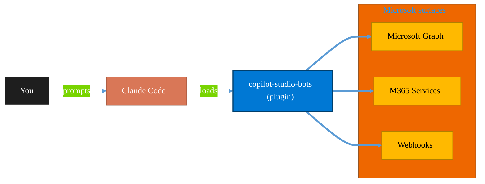

<!-- claude-m:premium-header:start -->
<div align="center">

<a id="top"></a>

# copilot-studio-bots

### Copilot Studio — design bot topics, author trigger phrases, configure generative AI orchestration, and publish chatbots

<sub>Automate everyday Microsoft 365 collaboration workflows.</sub>

<br />

<table align="center">
<tr>
<td align="center"><b>Category</b><br /><code>Productivity</code></td>
<td align="center"><b>Surfaces</b><br /><sub>Microsoft Graph · M365 · Teams · Outlook · SharePoint · Loop</sub></td>
<td align="center"><b>Version</b><br /><code>1.0.0</code></td>
<td align="center"><b>Marketplace</b><br /><code>claude-m-microsoft-marketplace</code></td>
</tr>
</table>

<sub><code>microsoft</code> &nbsp;·&nbsp; <code>copilot-studio</code> &nbsp;·&nbsp; <code>chatbot</code> &nbsp;·&nbsp; <code>power-virtual-agents</code> &nbsp;·&nbsp; <code>conversation-ai</code> &nbsp;·&nbsp; <code>bot</code></sub>

<a href="#install"><b>Install</b></a> &nbsp;·&nbsp;
<a href="#overview"><b>Overview</b></a> &nbsp;·&nbsp;
<a href="#architecture"><b>Architecture</b></a> &nbsp;·&nbsp;
<a href="#related-plugins"><b>Related plugins</b></a> &nbsp;·&nbsp;
<a href="../README.md"><b>Marketplace</b></a>

</div>

---

> [!TIP]
> **One-line install** — `/plugin install copilot-studio-bots@claude-m-microsoft-marketplace`


## Overview

> Copilot Studio — design bot topics, author trigger phrases, configure generative AI orchestration, and publish chatbots

<details>
<summary><b>What ships in this plugin</b> (commands, agents, skills)</summary>

| Component | Items |
|---|---|
| **Commands** | `/bot-publish` · `/bot-setup` · `/bot-test-conversation` · `/bot-topic-create` |
| **Agents** | `copilot-studio-reviewer` |
| **Skills** | `copilot-studio-bots` |

</details>


<details>
<summary><b>Quick example</b></summary>

```text
Use copilot-studio-bots to automate Microsoft 365 collaboration workflows.
```

</details>

<a id="architecture"></a>

## Architecture



<a id="install"></a>

## Install

```bash
/plugin marketplace add markus41/Claude-m
/plugin install copilot-studio-bots@claude-m-microsoft-marketplace
```

> [!IMPORTANT]
> This plugin operates against **Microsoft Graph · M365 · Teams · Outlook · SharePoint · Loop**. Configure credentials via environment variables — never commit secrets.

[Back to top](#top)

---

<!-- claude-m:premium-header:end -->

A Claude Code knowledge plugin for Microsoft Copilot Studio (formerly Power Virtual Agents) — design bot topics, author trigger phrases, configure generative AI orchestration, test conversation flows, and publish chatbots to Teams, web, or custom channels.

## What This Plugin Provides

This is a **knowledge plugin** -- it gives Claude deep expertise in Copilot Studio so it can create well-structured bot topics, write diverse trigger phrases, configure generative AI nodes, test conversation flows via Direct Line API, and publish bots to channels. It does not contain runtime code, MCP servers, or executable scripts.

## Setup

Run `/setup` to configure Power Platform and Dataverse access:

```
/setup              # Full guided setup
/setup --minimal    # Node.js dependencies only
```

Requires an Azure Entra app registration with **Environment.Read** (Power Platform API) and **Chatbots.ReadWrite** (Dataverse) permissions. You will need your Dataverse environment URL (e.g., `https://orgXXXXX.crm.dynamics.com`).

## Commands

| Command | Description |
|---------|-------------|
| `/bot-topic-create` | Create a new topic with trigger phrases and conversation nodes |
| `/bot-test-conversation` | Test a bot conversation flow with sample inputs via Direct Line |
| `/bot-publish` | Publish a bot to Teams, web widget, or custom Direct Line channel |
| `/setup` | Configure Power Platform environment access and Dataverse credentials |

## Agent

| Agent | Description |
|-------|-------------|
| **Copilot Studio Reviewer** | Reviews bot topic definitions for trigger phrase quality, conversation flow completeness, and generative AI configuration |

## Trigger Keywords

The skill activates automatically when conversations mention: `copilot studio`, `power virtual agents`, `chatbot`, `bot topic`, `trigger phrases`, `conversation flow`, `bot publish`, `pva`, `virtual agent`.

## Author

Markus Ahling
<!-- claude-m:premium-footer:start -->

---

<a id="related-plugins"></a>

## Related plugins

<table>
<tr><th>Plugin</th><th>What it does</th></tr>
<tr><td><a href="../business-central/README.md"><code>business-central</code></a></td><td>Microsoft Dynamics 365 Business Central ERP — finance, supply chain, and inventory management via BC OData v4 / API v2.0 REST API</td></tr>
<tr><td><a href="../dynamics-365-crm/README.md"><code>dynamics-365-crm</code></a></td><td>Dynamics 365 Sales and Customer Service via Dataverse Web API — leads, opportunities, accounts, contacts, cases, SLAs, queues, pipeline reporting, and CRM workflow automation</td></tr>
<tr><td><a href="../dynamics-365-field-service/README.md"><code>dynamics-365-field-service</code></a></td><td>Dynamics 365 Field Service via Dataverse Web API — work orders, bookings, resource scheduling, service accounts, assets, and IoT-triggered service events</td></tr>
<tr><td><a href="../dynamics-365-project-ops/README.md"><code>dynamics-365-project-ops</code></a></td><td>Dynamics 365 Project Operations via Dataverse Web API — projects, WBS, time and expense tracking, resource assignments, project contracts, and billing</td></tr>
<tr><td><a href="../excel-automation/README.md"><code>excel-automation</code></a></td><td>Excel data cleaning with pandas, Office Script generation, and Power Automate flow creation</td></tr>
<tr><td><a href="../excel-office-scripts/README.md"><code>excel-office-scripts</code></a></td><td>Deep knowledge of Excel Office Scripts — Microsoft's TypeScript-based automation platform for Excel on the web</td></tr>
</table>


<details>
<summary><b>Composable stacks that include <code>copilot-studio-bots</code></b></summary>

Combine with sibling plugins to build cross-surface runbooks. Browse the full [marketplace catalog](../README.md#plugin-catalog) for a tailored selection.

</details>

---

<div align="center">

<sub>Part of <a href="../README.md"><b>Claude-m</b></a> — the Microsoft plugin marketplace for Claude Code.</sub>

<sub>Licensed under <a href="../LICENSE">MIT</a>. Built for engineers, MSPs, SOC teams, and analytics leaders.</sub>

</div>

<!-- claude-m:premium-footer:end -->

