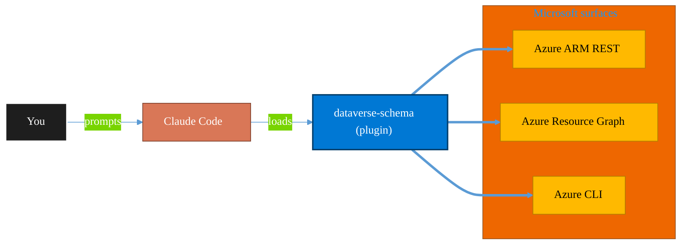

<!-- claude-m:premium-header:start -->
<div align="center">

<a id="top"></a>

# dataverse-schema

### Dataverse table, column, and relationship management via Web API — schema design, data seeding, and solution lifecycle

<sub>Inventory, govern, and operate Azure resources at any scale.</sub>

<br />

<table align="center">
<tr>
<td align="center"><b>Category</b><br /><code>Cloud</code></td>
<td align="center"><b>Surfaces</b><br /><sub>Azure ARM · Resource Graph · ARM REST · CLI</sub></td>
<td align="center"><b>Version</b><br /><code>1.0.0</code></td>
<td align="center"><b>Marketplace</b><br /><code>claude-m-microsoft-marketplace</code></td>
</tr>
</table>

<sub><code>microsoft</code> &nbsp;·&nbsp; <code>dataverse</code> &nbsp;·&nbsp; <code>power-platform</code> &nbsp;·&nbsp; <code>schema</code> &nbsp;·&nbsp; <code>solutions</code> &nbsp;·&nbsp; <code>fetchxml</code></sub>

<a href="#install"><b>Install</b></a> &nbsp;·&nbsp;
<a href="#overview"><b>Overview</b></a> &nbsp;·&nbsp;
<a href="#architecture"><b>Architecture</b></a> &nbsp;·&nbsp;
<a href="#related-plugins"><b>Related plugins</b></a> &nbsp;·&nbsp;
<a href="../README.md"><b>Marketplace</b></a>

</div>

---

> [!TIP]
> **One-line install** — `/plugin install dataverse-schema@claude-m-microsoft-marketplace`


## Overview

> Dataverse table, column, and relationship management via Web API — schema design, data seeding, and solution lifecycle

<details>
<summary><b>What ships in this plugin</b> (commands, agents, skills)</summary>

| Component | Items |
|---|---|
| **Commands** | `/dataverse-column-add` · `/dataverse-optionset-create` · `/dataverse-query` · `/dataverse-relationship-create` · `/dataverse-seed` · `/dataverse-setup` · `/dataverse-solution-export` · `/dataverse-solution-import` · `/dataverse-table-create` |
| **Agents** | `schema-reviewer` |
| **Skills** | `dataverse-schema` |

</details>


<details>
<summary><b>Quick example</b></summary>

```text
Use dataverse-schema to audit and operate Azure resources end-to-end.
```

</details>

<a id="architecture"></a>

## Architecture



<a id="install"></a>

## Install

```bash
/plugin marketplace add markus41/Claude-m
/plugin install dataverse-schema@claude-m-microsoft-marketplace
```

> [!IMPORTANT]
> This plugin operates against **Azure ARM · Resource Graph · ARM REST · CLI**. Configure credentials via environment variables — never commit secrets.

[Back to top](#top)

---

<!-- claude-m:premium-header:end -->

A Claude Code knowledge plugin for creating and managing Microsoft Dataverse tables, columns, relationships, option sets, and solutions via the Dataverse Web API (v9.2).

## Setup

Run `/setup` to configure your Dataverse environment and credentials:

```
/setup                    # Full guided setup
/setup --minimal          # Dependencies only, configure auth manually
/setup --with-pac-cli     # Also install PAC CLI for solution management
```

## What This Plugin Does

This plugin gives Claude deep expertise in Dataverse schema management so it can:

- Generate correct Web API payloads for creating tables, columns, and relationships
- Design schemas following Dataverse naming conventions and best practices
- Configure cascading behavior for relationships
- Build FetchXML and OData queries
- Create solution export/import automation scripts
- Seed data from CSV/JSON files or generate test data
- Review schema designs for correctness and performance

## Scope

- Strictly tables, columns, relationships, option sets, and solutions
- No model-driven app layout scaffolding
- Supports both solution-aware and unmanaged component creation
- Default: work within a solution context

## Commands

### `/setup [--minimal] [--with-pac-cli]`
Set up the Dataverse Schema plugin — configure environment URL, auth credentials, publisher prefix, and verify Web API connectivity.

### `/dataverse-table-create <table-name> [description]`
Create a new custom table with a primary name column and optional additional columns. Generates the complete `EntityDefinitions` POST payload and TypeScript code.

### `/dataverse-column-add <table-name> <column-name> [type]`
Add a column to an existing table. Determines the correct `AttributeMetadata` subtype based on the description and generates the full API payload.

### `/dataverse-relationship-create <parent-table> <child-table> [1:N|N:N]`
Create a 1:N or N:N relationship between tables. Configures cascading behavior and generates the `RelationshipDefinitions` payload.

### `/dataverse-optionset-create <name> <options...>`
Create a global or local option set with proper value numbering, colors, and labels.

### `/dataverse-seed <table-name> <source-file|count>`
Generate a script to seed data from CSV, JSON, or random test data. Handles lookup bindings and batches requests in groups of 50.

### `/dataverse-query <description>`
Generate a FetchXML or OData query based on a natural language description. Provides both formats when practical, plus TypeScript execution code.

### `/dataverse-solution-export <solution-name> [managed|unmanaged]`
Generate a script to export a solution as a zip file. Handles publishing, base64 decoding, and file writing.

### `/dataverse-solution-import <solution-zip-path> [target-env-url]`
Generate a script to import a solution with async status polling. Handles large solution timeouts and connection reference mapping.

## Skill Knowledge

The core skill (`skills/dataverse-schema/SKILL.md`) provides:
- Metadata Web API overview (EntityDefinitions, AttributeMetadata, RelationshipDefinitions)
- Table creation quick reference with all key properties
- Column type decision tree
- Relationship types summary with trade-offs
- Publisher prefix and naming conventions
- Solution-aware development defaults
- Dataverse platform limits

### Reference Files

| File | Content |
|------|---------|
| `references/table-management.md` | Create, modify, delete tables; alternate keys; table types (standard, activity, virtual, elastic); managed properties |
| `references/column-types.md` | All column types with complete API payloads: String, Integer, Decimal, Float, Currency, DateTime, Boolean, Choice, MultiSelect, Lookup, Polymorphic, File, Image, Calculated, Rollup, Auto-number |
| `references/relationships.md` | 1:N and N:N relationships; cascading behavior configuration; self-referential and hierarchical; polymorphic lookups |
| `references/option-sets.md` | Global and local option sets; add, reorder, retire options; Status/StatusReason special option sets |
| `references/solution-management.md` | Solution lifecycle: publisher, create, add/remove components, export managed/unmanaged, async import, versioning, layering |
| `references/fetchxml-odata.md` | FetchXML structure, filter operators, link-entity joins, aggregation, pagination with paging cookies, OData equivalents |

### Example Files

| File | Content |
|------|---------|
| `examples/table-operations.md` | 7 complete TypeScript examples for table CRUD, auto-number, activity tables, alternate keys |
| `examples/relationship-patterns.md` | 5 examples: 1:N with tight/loose/restrict coupling, N:N with association, self-referential hierarchy, polymorphic Customer lookup |
| `examples/solution-workflows.md` | 5 examples: create publisher/solution, add components, export (TypeScript + Bash), async import with polling, dev-to-prod pipeline |
| `examples/data-seeding.md` | 5 examples: CSV import, JSON with lookup binding, random test data generation, option set seeding, batch requests |

## Agent

### Schema Reviewer
Reviews Dataverse schema designs for:
- Naming convention compliance
- Column type appropriateness
- Relationship and cascading behavior correctness
- Solution structure and layering concerns
- Query efficiency
- API payload correctness

## Quick Start

1. Place this plugin in your Claude Code plugins directory
2. Use any command (e.g., `/dataverse-table-create Customer`) to start
3. Claude will ask for any missing information (prefix, solution name, etc.)
4. Receive complete API payloads and TypeScript code ready for use

## API Version

All payloads target **Dataverse Web API v9.2**:
```
{environmentUrl}/api/data/v9.2/
```

## Publisher Prefix

Every schema object requires a publisher prefix. Common format: 2-5 lowercase characters (e.g., `cr123`, `contoso`). The prefix is defined on the Publisher record and applied to all SchemaName values.
<!-- claude-m:premium-footer:start -->

---

<a id="related-plugins"></a>

## Related plugins

<table>
<tr><th>Plugin</th><th>What it does</th></tr>
<tr><td><a href="../m365-platform-clients/README.md"><code>m365-platform-clients</code></a></td><td>TypeScript patterns for Dataverse Web API and Microsoft Graph — auth, clients, and combined provisioning workflows</td></tr>
<tr><td><a href="../agent-foundry/README.md"><code>agent-foundry</code></a></td><td>Azure AI Foundry agent lifecycle management — scaffold, deploy, test, and manage AI agents with Azure AI Foundry MCP integration</td></tr>
<tr><td><a href="../azure-ai-services/README.md"><code>azure-ai-services</code></a></td><td>Azure AI workloads — Azure OpenAI Service deployments, AI Search indexes, AI Studio/Foundry projects, Cognitive Services provisioning, content filtering, and responsible AI governance</td></tr>
<tr><td><a href="../azure-containers/README.md"><code>azure-containers</code></a></td><td>Azure Container Apps, Container Instances, and Container Registry — build, push, deploy, and scale containerized workloads</td></tr>
<tr><td><a href="../azure-cost-governance/README.md"><code>azure-cost-governance</code></a></td><td>Azure FinOps and governance workflows — query costs, monitor budgets, detect anomalies, and identify idle resources for optimization</td></tr>
<tr><td><a href="../azure-document-intelligence/README.md"><code>azure-document-intelligence</code></a></td><td>Azure AI Document Intelligence — OCR, prebuilt models (invoices, receipts, IDs, tax forms), custom models, layout analysis, document classification, and batch processing</td></tr>
</table>


<details>
<summary><b>Composable stacks that include <code>dataverse-schema</code></b></summary>

Combine with sibling plugins to build cross-surface runbooks. Browse the full [marketplace catalog](../README.md#plugin-catalog) for a tailored selection.

</details>

---

<div align="center">

<sub>Part of <a href="../README.md"><b>Claude-m</b></a> — the Microsoft plugin marketplace for Claude Code.</sub>

<sub>Licensed under <a href="../LICENSE">MIT</a>. Built for engineers, MSPs, SOC teams, and analytics leaders.</sub>

</div>

<!-- claude-m:premium-footer:end -->

