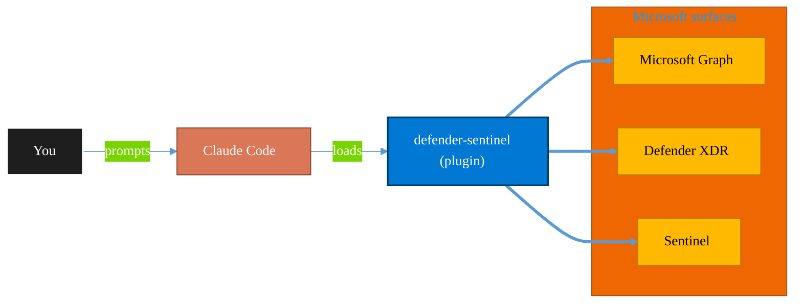

<!-- claude-m:premium-header:start -->
<div align="center">

<a id="top"></a>

# defender-sentinel

### Microsoft Sentinel SIEM/SOAR and Defender XDR — incident triage, KQL threat hunting, analytics rules, SOAR playbooks, advanced hunting, and unified security operations center workflows

<sub>Protect identity, endpoints, data, and information.</sub>

<br />

<table align="center">
<tr>
<td align="center"><b>Category</b><br /><code>Security</code></td>
<td align="center"><b>Surfaces</b><br /><sub>Microsoft Graph · Defender · Sentinel · Purview · Entra</sub></td>
<td align="center"><b>Version</b><br /><code>1.0.0</code></td>
<td align="center"><b>Marketplace</b><br /><code>claude-m-microsoft-marketplace</code></td>
</tr>
</table>

<sub><code>microsoft</code> &nbsp;·&nbsp; <code>sentinel</code> &nbsp;·&nbsp; <code>defender-xdr</code> &nbsp;·&nbsp; <code>siem</code> &nbsp;·&nbsp; <code>soar</code> &nbsp;·&nbsp; <code>threat-hunting</code></sub>

<a href="#install"><b>Install</b></a> &nbsp;·&nbsp;
<a href="#overview"><b>Overview</b></a> &nbsp;·&nbsp;
<a href="#architecture"><b>Architecture</b></a> &nbsp;·&nbsp;
<a href="#related-plugins"><b>Related plugins</b></a> &nbsp;·&nbsp;
<a href="../README.md"><b>Marketplace</b></a>

</div>

---

> [!TIP]
> **One-line install** — `/plugin install defender-sentinel@claude-m-microsoft-marketplace`


## Overview

> Microsoft Sentinel SIEM/SOAR and Defender XDR — incident triage, KQL threat hunting, analytics rules, SOAR playbooks, advanced hunting, and unified security operations center workflows

<details>
<summary><b>What ships in this plugin</b> (commands, agents, skills)</summary>

| Component | Items |
|---|---|
| **Commands** | `/defender-alert-investigate` · `/defender-sentinel-setup` · `/sentinel-analytics-rule` · `/sentinel-hunting-query` · `/sentinel-incident-triage` |
| **Agents** | `defender-sentinel-reviewer` |
| **Skills** | `defender-sentinel` |

</details>


<details>
<summary><b>Quick example</b></summary>

```text
Use defender-sentinel to investigate, contain, and harden against threats.
```

</details>

<a id="architecture"></a>

## Architecture



<a id="install"></a>

## Install

```bash
/plugin marketplace add markus41/Claude-m
/plugin install defender-sentinel@claude-m-microsoft-marketplace
```

> [!IMPORTANT]
> This plugin operates against **Microsoft Graph · Defender · Sentinel · Purview · Entra**. Configure credentials via environment variables — never commit secrets.

[Back to top](#top)

---

<!-- claude-m:premium-header:end -->

Microsoft Sentinel SIEM/SOAR and Defender XDR plugin for Claude Code. Covers incident triage, KQL threat hunting, analytics rule authoring, SOAR playbook patterns, and cross-signal advanced hunting.

## What it covers

- **Microsoft Sentinel** — incidents, analytics rules (Scheduled, NRT, Fusion), watchlists, bookmarks, automation rules, SOAR playbooks (Logic Apps)
- **Microsoft Defender XDR** — unified incident queue, alert investigation with evidence, advanced hunting across MDE/MDI/MDO/MDCA tables
- **KQL** — threat hunting query templates, MITRE ATT&CK mapped detections, Log Analytics query API
- **Response actions** — device isolation, user disable, file hash blocking, indicator management

## Install

```bash
/plugin install defender-sentinel@claude-m-microsoft-marketplace
```

## Required permissions

| Workload | Role / Permission |
|---|---|
| Sentinel incidents (read + update) | `Microsoft Sentinel Responder` on the Log Analytics workspace |
| Sentinel analytics rules + watchlists | `Microsoft Sentinel Contributor` |
| Log Analytics KQL queries | `Log Analytics Reader` on the workspace |
| Defender XDR incidents | `SecurityIncident.Read.All` / `SecurityIncident.ReadWrite.All` (Graph) |
| Advanced hunting | `ThreatHunting.Read.All` (Graph) |
| MDE device actions | `Machine.Isolate` scope on MDE API |
| User disable | `User.ReadWrite.All` (Graph) |

## Setup

```
/defender-sentinel-setup
```

Validates workspace connectivity, RBAC, data connector status, and Defender XDR access.

## Commands

| Command | Description |
|---|---|
| `/defender-sentinel-setup` | Validate auth, workspace, RBAC, and data connectors |
| `/sentinel-incident-triage` | List open incidents, enrich with entities, suggest actions |
| `/sentinel-hunting-query` | Generate and run KQL threat hunting queries |
| `/sentinel-analytics-rule` | Create, update, tune, or list analytics rules |
| `/defender-alert-investigate` | Pivot on a Defender XDR alert — device, user, process tree |

## Focused Plugin Routing

Use `defender-sentinel` for SIEM and SOAR workflows across Sentinel and Defender XDR. For endpoint-specific host response runbooks, use:

- `defender-endpoint`: endpoint triage, machine isolation workflows, live response metadata checks, and endpoint evidence summaries.

## Example prompts

- "Use `defender-sentinel` to triage all High severity New incidents in the workspace"
- "Write a KQL hunting query for T1059.001 (PowerShell obfuscation) looking back 7 days"
- "Create a Scheduled analytics rule detecting off-hours privileged role assignments"
- "Investigate Defender alert {alert-id} — show the process tree and network connections"
- "List all Sentinel analytics rules and flag any that are disabled or have no MITRE mapping"

## Auth pattern

Uses the integration context contract (`docs/integration-context.md`). Required context:

```
tenantId + subscriptionId + SENTINEL_WORKSPACE_RESOURCE_ID
```

For Defender XDR: `tenantId` only (Graph Security API).
<!-- claude-m:premium-footer:start -->

---

<a id="related-plugins"></a>

## Related plugins

<table>
<tr><th>Plugin</th><th>What it does</th></tr>
<tr><td><a href="../purview-compliance/README.md"><code>purview-compliance</code></a></td><td>Microsoft Purview compliance workflows — DLP review, retention planning, sensitivity labels, eDiscovery readiness, and guided compliance playbooks with audit-ready change logs</td></tr>
<tr><td><a href="../azure-key-vault/README.md"><code>azure-key-vault</code></a></td><td>Azure Key Vault — secrets, keys, and certificates management with RBAC, rotation policies, and managed identity integration</td></tr>
<tr><td><a href="../azure-policy-security/README.md"><code>azure-policy-security</code></a></td><td>Evaluate Azure policy compliance and security posture — policy assignments, drift analysis, remediation planning, and guardrail recommendations</td></tr>
<tr><td><a href="../entra-id-admin/README.md"><code>entra-id-admin</code></a></td><td>Microsoft Entra ID administration via Graph API — full user/group lifecycle, directory roles, PIM, authentication methods, admin units, B2B guest management, license assignment, named locations, and entitlement management</td></tr>
<tr><td><a href="../entra-id-security/README.md"><code>entra-id-security</code></a></td><td>Microsoft Entra ID identity governance and security — app registrations, service principals, conditional access, sign-in logs, and risk detection</td></tr>
<tr><td><a href="../fabric-security-governance/README.md"><code>fabric-security-governance</code></a></td><td>Microsoft Fabric Security Governance — workspace RBAC, RLS/OLS patterns, sensitivity labels, lineage controls, and audit readiness</td></tr>
</table>


<details>
<summary><b>Composable stacks that include <code>defender-sentinel</code></b></summary>

Combine with sibling plugins to build cross-surface runbooks. Browse the full [marketplace catalog](../README.md#plugin-catalog) for a tailored selection.

</details>

---

<div align="center">

<sub>Part of <a href="../README.md"><b>Claude-m</b></a> — the Microsoft plugin marketplace for Claude Code.</sub>

<sub>Licensed under <a href="../LICENSE">MIT</a>. Built for engineers, MSPs, SOC teams, and analytics leaders.</sub>

</div>

<!-- claude-m:premium-footer:end -->

