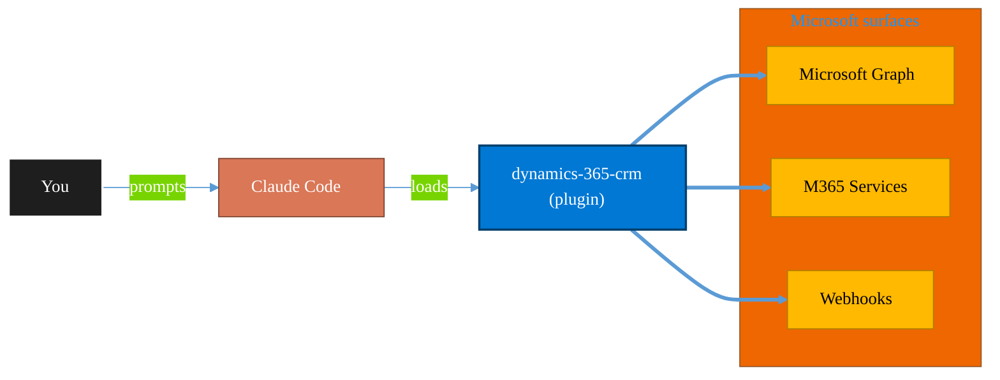

<!-- claude-m:premium-header:start -->
<div align="center">

<a id="top"></a>

# dynamics-365-crm

### Dynamics 365 Sales and Customer Service via Dataverse Web API — leads, opportunities, accounts, contacts, cases, SLAs, queues, pipeline reporting, and CRM workflow automation

<sub>Automate everyday Microsoft 365 collaboration workflows.</sub>

<br />

<table align="center">
<tr>
<td align="center"><b>Category</b><br /><code>Productivity</code></td>
<td align="center"><b>Surfaces</b><br /><sub>Microsoft Graph · M365 · Teams · Outlook · SharePoint · Loop</sub></td>
<td align="center"><b>Version</b><br /><code>1.0.0</code></td>
<td align="center"><b>Marketplace</b><br /><code>claude-m-microsoft-marketplace</code></td>
</tr>
</table>

<sub><code>microsoft</code> &nbsp;·&nbsp; <code>dynamics-365</code> &nbsp;·&nbsp; <code>crm</code> &nbsp;·&nbsp; <code>dataverse</code> &nbsp;·&nbsp; <code>d365-sales</code> &nbsp;·&nbsp; <code>d365-customer-service</code></sub>

<a href="#install"><b>Install</b></a> &nbsp;·&nbsp;
<a href="#overview"><b>Overview</b></a> &nbsp;·&nbsp;
<a href="#architecture"><b>Architecture</b></a> &nbsp;·&nbsp;
<a href="#related-plugins"><b>Related plugins</b></a> &nbsp;·&nbsp;
<a href="../README.md"><b>Marketplace</b></a>

</div>

---

> [!TIP]
> **One-line install** — `/plugin install dynamics-365-crm@claude-m-microsoft-marketplace`


## Overview

> Dynamics 365 Sales and Customer Service via Dataverse Web API — leads, opportunities, accounts, contacts, cases, SLAs, queues, pipeline reporting, and CRM workflow automation

<details>
<summary><b>What ships in this plugin</b> (commands, agents, skills)</summary>

| Component | Items |
|---|---|
| **Commands** | `/d365-case-manage` · `/d365-lead-qualify` · `/d365-pipeline-report` · `/dynamics-365-crm-setup` |
| **Agents** | `dynamics-365-crm-reviewer` |
| **Skills** | `dynamics-365-crm` |

</details>


<details>
<summary><b>Quick example</b></summary>

```text
Use dynamics-365-crm to automate Microsoft 365 collaboration workflows.
```

</details>

<a id="architecture"></a>

## Architecture



<a id="install"></a>

## Install

```bash
/plugin marketplace add markus41/Claude-m
/plugin install dynamics-365-crm@claude-m-microsoft-marketplace
```

> [!IMPORTANT]
> This plugin operates against **Microsoft Graph · M365 · Teams · Outlook · SharePoint · Loop**. Configure credentials via environment variables — never commit secrets.

[Back to top](#top)

---

<!-- claude-m:premium-header:end -->

Dynamics 365 Sales and Customer Service plugin for Claude Code. Covers the full CRM business application layer on top of Dataverse — leads, opportunities, accounts, contacts, cases, queues, SLAs, pipeline reporting, and CRM workflow automation.

## What it covers

- **Dynamics 365 Sales** — lead qualification (`QualifyLead` action), opportunity lifecycle (`WinOpportunity`, `LoseOpportunity`), accounts, contacts, quotes, orders, pipeline forecasting
- **Dynamics 365 Customer Service** — case management (`ResolveIncident` action), queue routing, SLA KPI monitoring, knowledge base, entitlements, case escalation
- **Activity logging** — tasks, phone calls, emails, appointments against CRM records
- **Business rules** — rollup field calculation, duplicate detection, process flows
- **Power Automate** — Dataverse trigger patterns for CRM automation

Builds on top of the `dataverse-schema` plugin which covers the underlying Dataverse schema layer.

## Install

```bash
/plugin install dynamics-365-crm@claude-m-microsoft-marketplace
```

## Required permissions

| Workload | Role |
|---|---|
| Dynamics 365 Sales | `Salesperson` or `Sales Manager` security role in the org |
| Dynamics 365 Customer Service | `Customer Service Representative` or `Customer Service Manager` |
| Read-only / reporting | Minimum: `Dataverse User` + app-specific read roles |
| Bulk data operations | `System Administrator` |

The service principal must also have a `systemuser` record in the Dynamics 365 organization (created via Power Platform Admin Center > Application Users).

## Setup

```
/dynamics-365-crm-setup
```

Discovers the organization URL, validates the `systemuser` record, checks security roles, and tests connectivity to Sales and Customer Service entities.

## Commands

| Command | Description |
|---|---|
| `/dynamics-365-crm-setup` | Validate auth, org URL, systemuser record, and entity access |
| `/d365-lead-qualify` | Qualify a lead — create account, contact, and opportunity via `QualifyLead` |
| `/d365-case-manage` | Create, update, escalate, route, or resolve a customer service case |
| `/d365-pipeline-report` | Generate pipeline forecast by owner, stage, and close date |

## Example prompts

- "Use `dynamics-365-crm` to qualify lead {lead-id} and assign the opportunity to user {owner-id}"
- "Create a High priority case for account Contoso about a VPN outage"
- "Generate a Q2 2026 pipeline report for all sales reps"
- "Show me all cases in the Tier 1 queue that are approaching SLA breach"
- "Resolve case CAS-01234 with resolution: firmware upgrade resolved the connectivity issue"

## Auth pattern

Uses the integration context contract (`docs/integration-context.md`). Required context:

```
tenantId + D365_ORG_URL (e.g., https://contoso.crm.dynamics.com)
```

Token audience must be the exact org URL. The service principal needs a `systemuser` record with the appropriate security roles.
<!-- claude-m:premium-footer:start -->

---

<a id="related-plugins"></a>

## Related plugins

<table>
<tr><th>Plugin</th><th>What it does</th></tr>
<tr><td><a href="../dynamics-365-field-service/README.md"><code>dynamics-365-field-service</code></a></td><td>Dynamics 365 Field Service via Dataverse Web API — work orders, bookings, resource scheduling, service accounts, assets, and IoT-triggered service events</td></tr>
<tr><td><a href="../dynamics-365-project-ops/README.md"><code>dynamics-365-project-ops</code></a></td><td>Dynamics 365 Project Operations via Dataverse Web API — projects, WBS, time and expense tracking, resource assignments, project contracts, and billing</td></tr>
<tr><td><a href="../business-central/README.md"><code>business-central</code></a></td><td>Microsoft Dynamics 365 Business Central ERP — finance, supply chain, and inventory management via BC OData v4 / API v2.0 REST API</td></tr>
<tr><td><a href="../planner-todo/README.md"><code>planner-todo</code></a></td><td>Microsoft Planner and To Do task management via Graph API — classic plans, Premium Dataverse projects, buckets, tasks, assignments, checklists, nested plans, roster plans, sprints, goals, and Business Scenarios</td></tr>
<tr><td><a href="../power-automate/README.md"><code>power-automate</code></a></td><td>Design and troubleshoot Power Automate cloud flows — trigger/action patterns, run diagnostics, retries, and deployment-safe flow definitions</td></tr>
<tr><td><a href="../power-pages/README.md"><code>power-pages</code></a></td><td>Microsoft Power Pages — sites, page templates, Liquid, web forms, table permissions, web roles, and Dataverse portal integration</td></tr>
</table>


<details>
<summary><b>Composable stacks that include <code>dynamics-365-crm</code></b></summary>

Combine with sibling plugins to build cross-surface runbooks. Browse the full [marketplace catalog](../README.md#plugin-catalog) for a tailored selection.

</details>

---

<div align="center">

<sub>Part of <a href="../README.md"><b>Claude-m</b></a> — the Microsoft plugin marketplace for Claude Code.</sub>

<sub>Licensed under <a href="../LICENSE">MIT</a>. Built for engineers, MSPs, SOC teams, and analytics leaders.</sub>

</div>

<!-- claude-m:premium-footer:end -->

