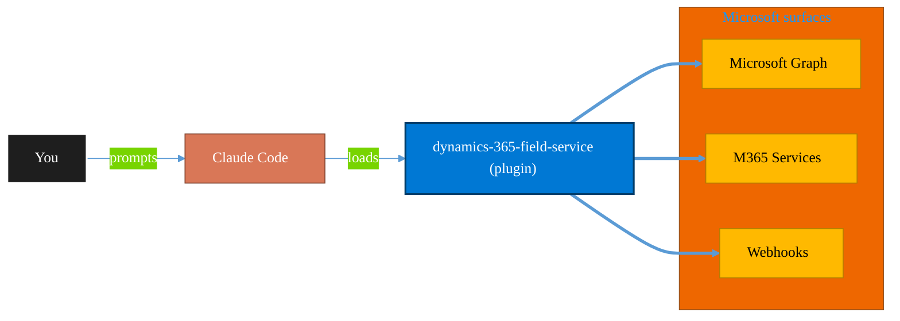

<!-- claude-m:premium-header:start -->
<div align="center">

<a id="top"></a>

# dynamics-365-field-service

### Dynamics 365 Field Service via Dataverse Web API — work orders, bookings, resource scheduling, service accounts, assets, and IoT-triggered service events

<sub>Automate everyday Microsoft 365 collaboration workflows.</sub>

<br />

<table align="center">
<tr>
<td align="center"><b>Category</b><br /><code>Productivity</code></td>
<td align="center"><b>Surfaces</b><br /><sub>Microsoft Graph · M365 · Teams · Outlook · SharePoint · Loop</sub></td>
<td align="center"><b>Version</b><br /><code>1.0.0</code></td>
<td align="center"><b>Marketplace</b><br /><code>claude-m-microsoft-marketplace</code></td>
</tr>
</table>

<sub><code>microsoft</code> &nbsp;·&nbsp; <code>dynamics-365</code> &nbsp;·&nbsp; <code>field-service</code> &nbsp;·&nbsp; <code>work-orders</code> &nbsp;·&nbsp; <code>scheduling</code> &nbsp;·&nbsp; <code>dataverse</code></sub>

<a href="#install"><b>Install</b></a> &nbsp;·&nbsp;
<a href="#overview"><b>Overview</b></a> &nbsp;·&nbsp;
<a href="#architecture"><b>Architecture</b></a> &nbsp;·&nbsp;
<a href="#related-plugins"><b>Related plugins</b></a> &nbsp;·&nbsp;
<a href="../README.md"><b>Marketplace</b></a>

</div>

---

> [!TIP]
> **One-line install** — `/plugin install dynamics-365-field-service@claude-m-microsoft-marketplace`


## Overview

> Dynamics 365 Field Service via Dataverse Web API — work orders, bookings, resource scheduling, service accounts, assets, and IoT-triggered service events

<details>
<summary><b>What ships in this plugin</b> (commands, agents, skills)</summary>

| Component | Items |
|---|---|
| **Commands** | `/fs-reporting` · `/fs-schedule` · `/fs-service-account` · `/fs-setup` · `/fs-work-order` |
| **Agents** | `dynamics-365-field-service-reviewer` |
| **Skills** | `dynamics-365-field-service` |

</details>


<details>
<summary><b>Quick example</b></summary>

```text
Use dynamics-365-field-service to automate Microsoft 365 collaboration workflows.
```

</details>

<a id="architecture"></a>

## Architecture



<a id="install"></a>

## Install

```bash
/plugin marketplace add markus41/Claude-m
/plugin install dynamics-365-field-service@claude-m-microsoft-marketplace
```

> [!IMPORTANT]
> This plugin operates against **Microsoft Graph · M365 · Teams · Outlook · SharePoint · Loop**. Configure credentials via environment variables — never commit secrets.

[Back to top](#top)

---

<!-- claude-m:premium-header:end -->

Dynamics 365 Field Service plugin for Claude Code. Covers the full Field Service operational layer on top of Dataverse — work orders, booking and scheduling, resource management, service accounts, customer assets, incident types, and IoT-triggered service automation via Connected Field Service.

## What it covers

- **Work order lifecycle** — create/update/complete work orders; apply incident type templates; add service tasks, products, and services
- **Booking and scheduling** — find available resources via Schedule Assistant API, create/reassign bookings, update booking status (Scheduled → Traveling → In Progress → Completed)
- **Resource management** — bookable resources, skills/certifications, service territories, organizational units, time off requests
- **Service accounts and assets** — customer assets, functional location hierarchy, asset service history
- **Incident types** — service task templates, product templates, incident type libraries
- **IoT / Connected Field Service** — IoT alerts, device management, alert-to-work-order automation, device commands
- **Agreements** — recurring work order (preventive maintenance) agreement setup
- **Reporting** — MTTR, First-Time Fix Rate, resource utilization, SLA compliance, incident type distribution

Builds on top of the `dataverse-schema` plugin which covers the underlying Dataverse schema layer.

## Install

```bash
/plugin install dynamics-365-field-service@claude-m-microsoft-marketplace
```

## Required permissions

| Workload | Role |
|---|---|
| Work order create/update | `Field Service - Dispatcher` |
| Resource scheduling (URS) | `Field Service - Dispatcher` + `Field Service - Resource` |
| Read-only / reporting | `Field Service - Read Only` |
| IoT / Connected Field Service | `IoT - Administrator` + `Field Service - Administrator` |

The service principal must have a `systemuser` record in the Dynamics 365 organization (created via Power Platform Admin Center > Application Users).

## Setup

```
/fs-setup
```

Discovers the organization URL, validates the `systemuser` record, confirms Field Service is installed, checks security roles, and tests connectivity to work order and booking entities.

## Commands

| Command | Description |
|---|---|
| `/fs-setup` | Validate auth, org URL, Field Service installation, and entity access |
| `/fs-work-order` | Create, update, add tasks/products, and complete work orders |
| `/fs-schedule` | Find available resources, create bookings, reassign, update booking status |
| `/fs-service-account` | Manage service accounts, customer assets, and functional locations |
| `/fs-reporting` | MTTR, first-time fix rate, resource utilization, SLA compliance reports |

## Example prompts

- "Use `dynamics-365-field-service` to create a work order for account Contoso — HVAC compressor failure, High priority"
- "Find available technicians for work order {id} in the North territory and book the best slot"
- "Show all customer assets for account {account-id} and their service history"
- "Generate a Q1 2026 Field Service report: MTTR, first-time fix rate, and resource utilization for all territories"
- "Create an IoT-triggered work order from alert {alert-id}"
- "Update booking {id} status to Traveling and set estimated travel time to 25 minutes"

## Auth pattern

Uses the integration context contract (`docs/integration-context.md`). Required context:

```
tenantId + D365_ORG_URL (e.g., https://contoso.crm.dynamics.com)
```

Token audience must be the exact org URL. The service principal needs a `systemuser` record with Field Service security roles.
<!-- claude-m:premium-footer:start -->

---

<a id="related-plugins"></a>

## Related plugins

<table>
<tr><th>Plugin</th><th>What it does</th></tr>
<tr><td><a href="../dynamics-365-project-ops/README.md"><code>dynamics-365-project-ops</code></a></td><td>Dynamics 365 Project Operations via Dataverse Web API — projects, WBS, time and expense tracking, resource assignments, project contracts, and billing</td></tr>
<tr><td><a href="../dynamics-365-crm/README.md"><code>dynamics-365-crm</code></a></td><td>Dynamics 365 Sales and Customer Service via Dataverse Web API — leads, opportunities, accounts, contacts, cases, SLAs, queues, pipeline reporting, and CRM workflow automation</td></tr>
<tr><td><a href="../microsoft-bookings/README.md"><code>microsoft-bookings</code></a></td><td>Microsoft Bookings — manage appointment calendars, services, staff availability, and customer bookings via Graph API</td></tr>
<tr><td><a href="../business-central/README.md"><code>business-central</code></a></td><td>Microsoft Dynamics 365 Business Central ERP — finance, supply chain, and inventory management via BC OData v4 / API v2.0 REST API</td></tr>
<tr><td><a href="../planner-todo/README.md"><code>planner-todo</code></a></td><td>Microsoft Planner and To Do task management via Graph API — classic plans, Premium Dataverse projects, buckets, tasks, assignments, checklists, nested plans, roster plans, sprints, goals, and Business Scenarios</td></tr>
<tr><td><a href="../power-automate/README.md"><code>power-automate</code></a></td><td>Design and troubleshoot Power Automate cloud flows — trigger/action patterns, run diagnostics, retries, and deployment-safe flow definitions</td></tr>
</table>


<details>
<summary><b>Composable stacks that include <code>dynamics-365-field-service</code></b></summary>

Combine with sibling plugins to build cross-surface runbooks. Browse the full [marketplace catalog](../README.md#plugin-catalog) for a tailored selection.

</details>

---

<div align="center">

<sub>Part of <a href="../README.md"><b>Claude-m</b></a> — the Microsoft plugin marketplace for Claude Code.</sub>

<sub>Licensed under <a href="../LICENSE">MIT</a>. Built for engineers, MSPs, SOC teams, and analytics leaders.</sub>

</div>

<!-- claude-m:premium-footer:end -->

