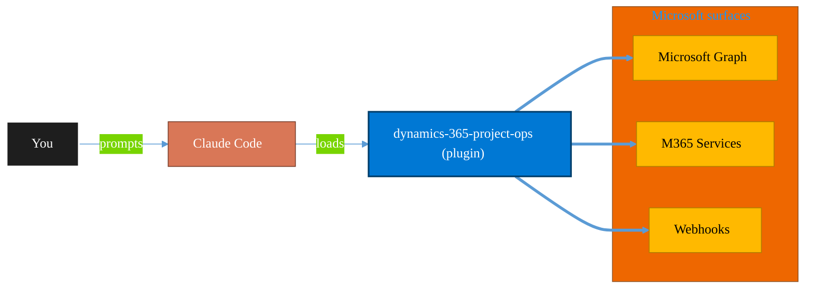

<!-- claude-m:premium-header:start -->
<div align="center">

<a id="top"></a>

# dynamics-365-project-ops

### Dynamics 365 Project Operations via Dataverse Web API — projects, WBS, time and expense tracking, resource assignments, project contracts, and billing

<sub>Automate everyday Microsoft 365 collaboration workflows.</sub>

<br />

<table align="center">
<tr>
<td align="center"><b>Category</b><br /><code>Productivity</code></td>
<td align="center"><b>Surfaces</b><br /><sub>Microsoft Graph · M365 · Teams · Outlook · SharePoint · Loop</sub></td>
<td align="center"><b>Version</b><br /><code>1.0.0</code></td>
<td align="center"><b>Marketplace</b><br /><code>claude-m-microsoft-marketplace</code></td>
</tr>
</table>

<sub><code>microsoft</code> &nbsp;·&nbsp; <code>dynamics-365</code> &nbsp;·&nbsp; <code>project-operations</code> &nbsp;·&nbsp; <code>project-management</code> &nbsp;·&nbsp; <code>time-tracking</code> &nbsp;·&nbsp; <code>billing</code></sub>

<a href="#install"><b>Install</b></a> &nbsp;·&nbsp;
<a href="#overview"><b>Overview</b></a> &nbsp;·&nbsp;
<a href="#architecture"><b>Architecture</b></a> &nbsp;·&nbsp;
<a href="#related-plugins"><b>Related plugins</b></a> &nbsp;·&nbsp;
<a href="../README.md"><b>Marketplace</b></a>

</div>

---

> [!TIP]
> **One-line install** — `/plugin install dynamics-365-project-ops@claude-m-microsoft-marketplace`


## Overview

> Dynamics 365 Project Operations via Dataverse Web API — projects, WBS, time and expense tracking, resource assignments, project contracts, and billing

<details>
<summary><b>What ships in this plugin</b> (commands, agents, skills)</summary>

| Component | Items |
|---|---|
| **Commands** | `/proj-billing` · `/proj-manage` · `/proj-resources` · `/proj-setup` · `/proj-time-expense` |
| **Agents** | `dynamics-365-project-ops-reviewer` |
| **Skills** | `dynamics-365-project-ops` |

</details>


<details>
<summary><b>Quick example</b></summary>

```text
Use dynamics-365-project-ops to automate Microsoft 365 collaboration workflows.
```

</details>

<a id="architecture"></a>

## Architecture



<a id="install"></a>

## Install

```bash
/plugin marketplace add markus41/Claude-m
/plugin install dynamics-365-project-ops@claude-m-microsoft-marketplace
```

> [!IMPORTANT]
> This plugin operates against **Microsoft Graph · M365 · Teams · Outlook · SharePoint · Loop**. Configure credentials via environment variables — never commit secrets.

[Back to top](#top)

---

<!-- claude-m:premium-header:end -->

Dynamics 365 Project Operations plugin for Claude Code. Covers the full project management and billing layer on top of Dataverse — project creation, work breakdown structures, task and milestone management, time and expense tracking, resource assignments, project contracts, invoice proposals, and billing actuals.

## What it covers

- **Project lifecycle** — create/manage projects through Quote → Plan → Manage → Close stages
- **WBS and tasks** — add tasks, milestones, subtasks; update progress; query WBS structure
- **Team members** — assign bookable resources with roles; manage project team composition
- **Time entries** — submit, approve, reject, recall time entries; query pending approvals
- **Expense reports** — submit expenses by category; approval workflows
- **Resource assignments** — assign resources to tasks; detect over-allocation; view utilization
- **Project contracts** — create contracts and contract lines (Time & Material or Fixed Price)
- **Invoice proposals** — generate invoice proposals via `msdyn_CreateInvoice`; confirm via `msdyn_ConfirmInvoice`
- **Actuals** — query Cost, Unbilled Sales, and Billed Sales actuals; revenue summary by task
- **Billing milestones** — fixed-price milestone management and invoice inclusion

Builds on top of the `dataverse-schema` plugin which covers the underlying Dataverse schema layer.

## Install

```bash
/plugin install dynamics-365-project-ops@claude-m-microsoft-marketplace
```

## Required permissions

| Workload | Role |
|---|---|
| Project create/manage (WBS, team) | `Project Manager` |
| Time and expense entry/submission | `Project Team Member` |
| Resource scheduling and booking | `Resource Manager` |
| Invoice creation and billing | `Project Billing Admin` |
| Read-only reporting | `Project Viewer` |

The service principal must have a `systemuser` record in the Dynamics 365 organization with the appropriate Project Operations security roles.

## Setup

```
/proj-setup
```

Verifies the organization URL, confirms Project Operations is provisioned (via `msdyn_projectparameters`), validates security roles, and tests connectivity to project, time entry, and billing entities.

## Commands

| Command | Description |
|---|---|
| `/proj-setup` | Validate auth, org URL, Project Operations provisioning, and security roles |
| `/proj-manage` | Create projects, add WBS tasks/milestones, manage team members, update progress |
| `/proj-time-expense` | Submit, approve, reject, and recall time entries and expense reports |
| `/proj-resources` | Assign resources to tasks, view utilization, detect over-allocation |
| `/proj-billing` | Create contracts, generate invoice proposals, confirm invoices, review actuals |

## Example prompts

- "Use `dynamics-365-project-ops` to create a project for customer Contoso — ERP Migration Phase 1, starting April 2026"
- "Add tasks to project {id}: Infrastructure Assessment (80h), Data Migration (160h), UAT (40h)"
- "Submit 8 hours of time for project {id}, task {task-id} on 2026-04-07 — infrastructure assessment"
- "List all pending time entry approvals for project {id} and approve them"
- "Generate an invoice proposal for project {id} dated 2026-05-31"
- "Show unbilled actuals for project {id} and total revenue to date"
- "Detect over-allocated resources on project {id} between April and June 2026"

## Auth pattern

Uses the integration context contract (`docs/integration-context.md`). Required context:

```
tenantId + D365_ORG_URL (e.g., https://contoso.crm.dynamics.com)
```

Token audience must be the exact org URL. The service principal needs a `systemuser` record with Project Operations security roles. Project Operations must be provisioned in the environment — confirmed via presence of `msdyn_projectparameters` records.
<!-- claude-m:premium-footer:start -->

---

<a id="related-plugins"></a>

## Related plugins

<table>
<tr><th>Plugin</th><th>What it does</th></tr>
<tr><td><a href="../dynamics-365-field-service/README.md"><code>dynamics-365-field-service</code></a></td><td>Dynamics 365 Field Service via Dataverse Web API — work orders, bookings, resource scheduling, service accounts, assets, and IoT-triggered service events</td></tr>
<tr><td><a href="../dynamics-365-crm/README.md"><code>dynamics-365-crm</code></a></td><td>Dynamics 365 Sales and Customer Service via Dataverse Web API — leads, opportunities, accounts, contacts, cases, SLAs, queues, pipeline reporting, and CRM workflow automation</td></tr>
<tr><td><a href="../planner-todo/README.md"><code>planner-todo</code></a></td><td>Microsoft Planner and To Do task management via Graph API — classic plans, Premium Dataverse projects, buckets, tasks, assignments, checklists, nested plans, roster plans, sprints, goals, and Business Scenarios</td></tr>
<tr><td><a href="../business-central/README.md"><code>business-central</code></a></td><td>Microsoft Dynamics 365 Business Central ERP — finance, supply chain, and inventory management via BC OData v4 / API v2.0 REST API</td></tr>
<tr><td><a href="../power-automate/README.md"><code>power-automate</code></a></td><td>Design and troubleshoot Power Automate cloud flows — trigger/action patterns, run diagnostics, retries, and deployment-safe flow definitions</td></tr>
<tr><td><a href="../power-pages/README.md"><code>power-pages</code></a></td><td>Microsoft Power Pages — sites, page templates, Liquid, web forms, table permissions, web roles, and Dataverse portal integration</td></tr>
</table>


<details>
<summary><b>Composable stacks that include <code>dynamics-365-project-ops</code></b></summary>

Combine with sibling plugins to build cross-surface runbooks. Browse the full [marketplace catalog](../README.md#plugin-catalog) for a tailored selection.

</details>

---

<div align="center">

<sub>Part of <a href="../README.md"><b>Claude-m</b></a> — the Microsoft plugin marketplace for Claude Code.</sub>

<sub>Licensed under <a href="../LICENSE">MIT</a>. Built for engineers, MSPs, SOC teams, and analytics leaders.</sub>

</div>

<!-- claude-m:premium-footer:end -->

