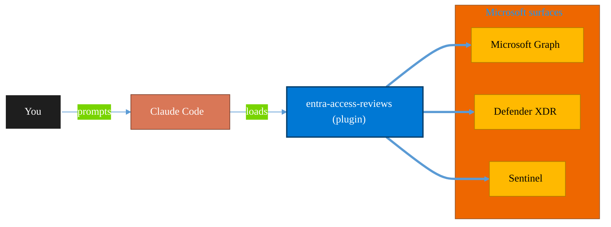

<!-- claude-m:premium-header:start -->
<div align="center">

<a id="top"></a>

# entra-access-reviews

### Microsoft Entra access review automation - stale privileged access detection, review cycle drafting, remediation ticket generation, and status reporting.

<sub>Protect identity, endpoints, data, and information.</sub>

<br />

<table align="center">
<tr>
<td align="center"><b>Category</b><br /><code>Security</code></td>
<td align="center"><b>Surfaces</b><br /><sub>Microsoft Graph · Defender · Sentinel · Purview · Entra</sub></td>
<td align="center"><b>Version</b><br /><code>1.0.0</code></td>
<td align="center"><b>Marketplace</b><br /><code>claude-m-microsoft-marketplace</code></td>
</tr>
</table>

<sub><code>entra</code> &nbsp;·&nbsp; <code>access</code> &nbsp;·&nbsp; <code>reviews</code></sub>

<a href="#install"><b>Install</b></a> &nbsp;·&nbsp;
<a href="#overview"><b>Overview</b></a> &nbsp;·&nbsp;
<a href="#architecture"><b>Architecture</b></a> &nbsp;·&nbsp;
<a href="#related-plugins"><b>Related plugins</b></a> &nbsp;·&nbsp;
<a href="../README.md"><b>Marketplace</b></a>

</div>

---

> [!TIP]
> **One-line install** — `/plugin install entra-access-reviews@claude-m-microsoft-marketplace`


## Overview

> Microsoft Entra access review automation - stale privileged access detection, review cycle drafting, remediation ticket generation, and status reporting.

<details>
<summary><b>What ships in this plugin</b> (commands, agents, skills)</summary>

| Component | Items |
|---|---|
| **Commands** | `/access-reviews-cycle-draft` · `/access-reviews-remediation-tickets` · `/access-reviews-setup` · `/access-reviews-stale-privileged` · `/access-reviews-status-report` |
| **Agents** | `entra-access-reviews-reviewer` |
| **Skills** | `entra-access-reviews` |

</details>


<details>
<summary><b>Quick example</b></summary>

```text
Use entra-access-reviews to investigate, contain, and harden against threats.
```

</details>

<a id="architecture"></a>

## Architecture



<a id="install"></a>

## Install

```bash
/plugin marketplace add markus41/Claude-m
/plugin install entra-access-reviews@claude-m-microsoft-marketplace
```

> [!IMPORTANT]
> This plugin operates against **Microsoft Graph · Defender · Sentinel · Purview · Entra**. Configure credentials via environment variables — never commit secrets.

[Back to top](#top)

---

<!-- claude-m:premium-header:end -->

Microsoft Entra access review automation - stale privileged access detection, review cycle drafting, remediation ticket generation, and status reporting.

## Purpose

This plugin is a knowledge plugin for Entra Access Reviews workflows. It provides deterministic command guidance and review patterns, and does not include runtime MCP servers.

## Prerequisites

- Microsoft tenant access for the target workload.
- Required scopes or roles: `AccessReview.ReadWrite.All`, `RoleManagement.Read.All`, `Directory.Read.All`
- Redaction and fail-fast behavior must follow the shared integration contract.

## Install

```bash
/plugin install entra-access-reviews@claude-m-microsoft-marketplace
```

## Integration Context Contract
- Canonical contract: [`docs/integration-context.md`](../docs/integration-context.md)

| Command family | tenantId | subscriptionId | environmentCloud | principalType | scopesOrRoles |
|---|---|---|---|---|---|
| Entra Access Reviews operations | required | optional | `AzureCloud`* | delegated-user or service-principal | `AccessReview.ReadWrite.All`, `RoleManagement.Read.All`, `Directory.Read.All` |

* Use sovereign cloud values from the canonical contract when applicable.

Commands must fail fast before network calls when required context is missing or invalid. All outputs must redact sensitive IDs and secrets.

## Commands

| Command | Description |
|---|---|
| `/access-reviews-setup` | Run access reviews setup workflow. |
| `/access-reviews-stale-privileged` | Run access reviews stale privileged workflow. |
| `/access-reviews-cycle-draft` | Run access reviews cycle draft workflow. |
| `/access-reviews-remediation-tickets` | Run access reviews remediation tickets workflow. |
| `/access-reviews-status-report` | Run access reviews status report workflow. |

## Agent

| Agent | Description |
|---|---|
| `entra-access-reviews-reviewer` | Reviews command and skill docs for API correctness, permissions, and safety checks. |

## Trigger Keywords

- `access reviews`
- `entra access review`
- `stale privileged access`
- `review cycle`
- `access certification`
<!-- claude-m:premium-footer:start -->

---

<a id="related-plugins"></a>

## Related plugins

<table>
<tr><th>Plugin</th><th>What it does</th></tr>
<tr><td><a href="../azure-key-vault/README.md"><code>azure-key-vault</code></a></td><td>Azure Key Vault — secrets, keys, and certificates management with RBAC, rotation policies, and managed identity integration</td></tr>
<tr><td><a href="../azure-policy-security/README.md"><code>azure-policy-security</code></a></td><td>Evaluate Azure policy compliance and security posture — policy assignments, drift analysis, remediation planning, and guardrail recommendations</td></tr>
<tr><td><a href="../defender-endpoint/README.md"><code>defender-endpoint</code></a></td><td>Microsoft Defender for Endpoint operations - incident triage, machine isolation, live response package metadata checks, and evidence summary generation.</td></tr>
<tr><td><a href="../defender-sentinel/README.md"><code>defender-sentinel</code></a></td><td>Microsoft Sentinel SIEM/SOAR and Defender XDR — incident triage, KQL threat hunting, analytics rules, SOAR playbooks, advanced hunting, and unified security operations center workflows</td></tr>
<tr><td><a href="../entra-id-admin/README.md"><code>entra-id-admin</code></a></td><td>Microsoft Entra ID administration via Graph API — full user/group lifecycle, directory roles, PIM, authentication methods, admin units, B2B guest management, license assignment, named locations, and entitlement management</td></tr>
<tr><td><a href="../entra-id-security/README.md"><code>entra-id-security</code></a></td><td>Microsoft Entra ID identity governance and security — app registrations, service principals, conditional access, sign-in logs, and risk detection</td></tr>
</table>


<details>
<summary><b>Composable stacks that include <code>entra-access-reviews</code></b></summary>

Combine with sibling plugins to build cross-surface runbooks. Browse the full [marketplace catalog](../README.md#plugin-catalog) for a tailored selection.

</details>

---

<div align="center">

<sub>Part of <a href="../README.md"><b>Claude-m</b></a> — the Microsoft plugin marketplace for Claude Code.</sub>

<sub>Licensed under <a href="../LICENSE">MIT</a>. Built for engineers, MSPs, SOC teams, and analytics leaders.</sub>

</div>

<!-- claude-m:premium-footer:end -->

