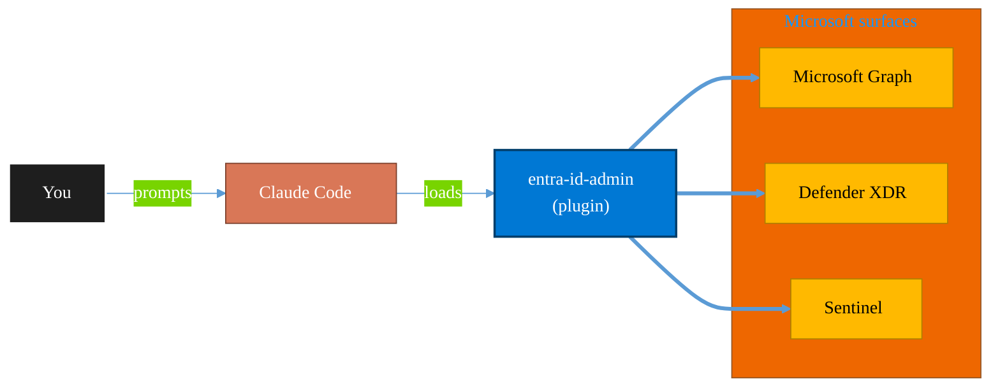

<!-- claude-m:premium-header:start -->
<div align="center">

<a id="top"></a>

# entra-id-admin

### Microsoft Entra ID administration via Graph API — full user/group lifecycle, directory roles, PIM, authentication methods, admin units, B2B guest management, license assignment, named locations, and entitlement management

<sub>Protect identity, endpoints, data, and information.</sub>

<br />

<table align="center">
<tr>
<td align="center"><b>Category</b><br /><code>Security</code></td>
<td align="center"><b>Surfaces</b><br /><sub>Microsoft Graph · Defender · Sentinel · Purview · Entra</sub></td>
<td align="center"><b>Version</b><br /><code>1.0.0</code></td>
<td align="center"><b>Marketplace</b><br /><code>claude-m-microsoft-marketplace</code></td>
</tr>
</table>

<sub><code>microsoft</code> &nbsp;·&nbsp; <code>entra-id</code> &nbsp;·&nbsp; <code>identity</code> &nbsp;·&nbsp; <code>user-management</code> &nbsp;·&nbsp; <code>pim</code> &nbsp;·&nbsp; <code>mfa</code></sub>

<a href="#install"><b>Install</b></a> &nbsp;·&nbsp;
<a href="#overview"><b>Overview</b></a> &nbsp;·&nbsp;
<a href="#architecture"><b>Architecture</b></a> &nbsp;·&nbsp;
<a href="#related-plugins"><b>Related plugins</b></a> &nbsp;·&nbsp;
<a href="../README.md"><b>Marketplace</b></a>

</div>

---

> [!TIP]
> **One-line install** — `/plugin install entra-id-admin@claude-m-microsoft-marketplace`


## Overview

> Microsoft Entra ID administration via Graph API — full user/group lifecycle, directory roles, PIM, authentication methods, admin units, B2B guest management, license assignment, named locations, and entitlement management

<details>
<summary><b>What ships in this plugin</b> (commands, agents, skills)</summary>

| Component | Items |
|---|---|
| **Commands** | `/entra-access-package-create` · `/entra-access-review-create` · `/entra-admin-setup` · `/entra-admin-unit-add` · `/entra-admin-unit-create` · `/entra-auth-methods-get` · `/entra-auth-mfa-require` · `/entra-collab-settings` · `/entra-group-create` · `/entra-group-list` · `/entra-group-member-add` · `/entra-group-member-remove` · `/entra-group-update` · `/entra-guest-invite` · `/entra-license-assign` · `/entra-license-report` · `/entra-named-location-create` · `/entra-pim-activate` · `/entra-pim-assign` · `/entra-pim-list` · `/entra-role-assign` · `/entra-role-list` · `/entra-role-remove` · `/entra-user-bulk-import` · `/entra-user-create` · `/entra-user-disable` · `/entra-user-get` · `/entra-user-password-reset` · `/entra-user-update` |
| **Agents** | `entra-compliance-auditor` · `pim-guardian` · `user-lifecycle-agent` |
| **Skills** | `entra-admin` |

</details>


<details>
<summary><b>Quick example</b></summary>

```text
Use entra-id-admin to investigate, contain, and harden against threats.
```

</details>

<a id="architecture"></a>

## Architecture



<a id="install"></a>

## Install

```bash
/plugin marketplace add markus41/Claude-m
/plugin install entra-id-admin@claude-m-microsoft-marketplace
```

> [!IMPORTANT]
> This plugin operates against **Microsoft Graph · Defender · Sentinel · Purview · Entra**. Configure credentials via environment variables — never commit secrets.

[Back to top](#top)

---

<!-- claude-m:premium-header:end -->

Comprehensive Microsoft Entra ID (Azure AD) administration plugin for Claude Code. Covers the full admin surface via Microsoft Graph API v1.0 and beta — from basic user/group lifecycle to advanced governance with PIM, entitlement management, and access reviews.

## Features

- **User Management**: Create, update, disable/enable, bulk import from CSV, password reset, soft-delete restore
- **Group Management**: M365 Groups, Security Groups, Dynamic Groups, group-based licensing, batch membership
- **Directory Roles**: Assign/remove built-in and custom roles, scoped to admin units or tenant-wide
- **PIM (Privileged Identity Management)**: Eligible and active assignments, self-service role activation with justification, approval workflows
- **Authentication Methods**: View/delete MFA methods per user, Temporary Access Passes, bulk MFA enforcement, SSPR config
- **Administrative Units**: Create static/dynamic/restricted AUs, add scoped admins
- **B2B Guest Invitations**: Invite external guests, configure external collaboration policy, cross-tenant access (XTAP)
- **License Assignment**: Direct and group-based, service plan control, usage reports
- **Named Locations**: IP ranges and country-based locations for Conditional Access
- **Entitlement Management**: Access packages, catalogs, assignment policies with approval workflows and access reviews
- **Autonomous Agents**: User lifecycle orchestrator, PIM security auditor, compliance posture auditor

## Prerequisites

- Azure CLI installed and authenticated (`az login`)
- Appropriate Microsoft Entra ID role or app permissions:
  - `User.ReadWrite.All` — user management
  - `Group.ReadWrite.All` — group management
  - `RoleManagement.ReadWrite.Directory` — role assignments
  - `PrivilegedAccess.ReadWrite.AzureResources` — PIM (requires P2 license)
  - `UserAuthenticationMethod.ReadWrite.All` — MFA/auth methods
  - `Directory.ReadWrite.All` — admin units
  - `EntitlementManagement.ReadWrite.All` — access packages/reviews (requires P2 license)
  - `LicenseAssignment.ReadWrite.All` — licenses
  - `Policy.ReadWrite.ConditionalAccess` — named locations

## Installation

```bash
/plugin install entra-id-admin@claude-m-microsoft-marketplace
```

## Setup

```
/entra-id-admin:entra-admin-setup
```

Verifies authentication, checks required permissions, and detects available features (PIM, Entitlement Management).

## Commands

### User Management
| Command | Description |
|---------|-------------|
| `/entra-id-admin:entra-user-create` | Create user with full property support |
| `/entra-id-admin:entra-user-update` | Update user properties |
| `/entra-id-admin:entra-user-disable` | Disable/enable account, revoke sessions |
| `/entra-id-admin:entra-user-bulk-import` | Bulk create from CSV via batch API |
| `/entra-id-admin:entra-user-get` | Full user details including licenses, groups, MFA, roles |
| `/entra-id-admin:entra-user-password-reset` | Reset password, revoke sessions |

### Group Management
| Command | Description |
|---------|-------------|
| `/entra-id-admin:entra-group-create` | Create M365/Security/Dynamic group |
| `/entra-id-admin:entra-group-update` | Update group properties, owners, dynamic rule |
| `/entra-id-admin:entra-group-member-add` | Add members (batch of 20) |
| `/entra-id-admin:entra-group-member-remove` | Remove members |
| `/entra-id-admin:entra-group-list` | Filter groups by type, owner, member |

### Directory Roles
| Command | Description |
|---------|-------------|
| `/entra-id-admin:entra-role-assign` | Assign role — tenant-wide or AU-scoped |
| `/entra-id-admin:entra-role-remove` | Remove role assignment |
| `/entra-id-admin:entra-role-list` | Audit all role assignments |

### PIM (Requires P2)
| Command | Description |
|---------|-------------|
| `/entra-id-admin:entra-pim-assign` | Create eligible or active PIM assignment |
| `/entra-id-admin:entra-pim-activate` | Self-activate eligible role |
| `/entra-id-admin:entra-pim-list` | Audit all PIM assignments and activations |

### Authentication Methods
| Command | Description |
|---------|-------------|
| `/entra-id-admin:entra-auth-methods-get` | List/delete auth methods, add TAP |
| `/entra-id-admin:entra-auth-mfa-require` | Report and bulk-enforce MFA registration |

### Admin Units
| Command | Description |
|---------|-------------|
| `/entra-id-admin:entra-admin-unit-create` | Create static/dynamic/restricted AU |
| `/entra-id-admin:entra-admin-unit-add` | Add member or assign scoped role |

### External Identities
| Command | Description |
|---------|-------------|
| `/entra-id-admin:entra-guest-invite` | Invite B2B guest user |
| `/entra-id-admin:entra-collab-settings` | Configure external collaboration policy |

### Licenses
| Command | Description |
|---------|-------------|
| `/entra-id-admin:entra-license-assign` | Assign/remove license from user or group |
| `/entra-id-admin:entra-license-report` | Usage report with errors and gaps |

### Named Locations
| Command | Description |
|---------|-------------|
| `/entra-id-admin:entra-named-location-create` | Create IP or country named location |

### Entitlement Management (Requires P2)
| Command | Description |
|---------|-------------|
| `/entra-id-admin:entra-access-package-create` | Create access package with policy |
| `/entra-id-admin:entra-access-review-create` | Create recurring access review |

## Focused Plugin Routing

Use `entra-id-admin` for broad identity administration across users, groups, roles, and governance entities. For a focused access certification lifecycle, use:

- `entra-access-reviews`: stale privileged access detection, review cycle drafting, remediation ticket generation, and status reporting.

## Agents

| Agent | Description |
|-------|-------------|
| `user-lifecycle-agent` | Automates full onboarding and offboarding workflows |
| `pim-guardian` | Audits PIM assignments for security hygiene |
| `entra-compliance-auditor` | Full tenant identity compliance posture report |

## Usage Examples

```
# Onboard a new employee
"Onboard Jane Smith as Software Engineer in Engineering, assign M365 E3 license"

# Full offboarding
"Offboard bob.jones@contoso.com — he's leaving today, revoke everything"

# Audit privileged access
"Audit our PIM assignments for security issues"

# Compliance check
"Run a full Entra ID compliance audit and give me a score"

# Direct commands
/entra-id-admin:entra-user-create --upn jane.smith@contoso.com --name "Jane Smith" --dept Engineering --location US
/entra-id-admin:entra-pim-assign --role "User Administrator" --principal jane.smith@contoso.com --duration P180D
/entra-id-admin:entra-license-report --errors
```

## License Requirements

| Feature | License |
|---------|---------|
| Users, groups, roles, auth methods, guest invitations | Microsoft 365 (any) |
| PIM (eligible assignments, activation) | Entra ID P2 or Governance |
| Entitlement Management, Access Reviews | Entra ID P2 or Governance |
| Administrative Units (basic) | Entra ID P1 |
| Restricted Management AUs | Entra ID P2 |
<!-- claude-m:premium-footer:start -->

---

<a id="related-plugins"></a>

## Related plugins

<table>
<tr><th>Plugin</th><th>What it does</th></tr>
<tr><td><a href="../entra-id-security/README.md"><code>entra-id-security</code></a></td><td>Microsoft Entra ID identity governance and security — app registrations, service principals, conditional access, sign-in logs, and risk detection</td></tr>
<tr><td><a href="../azure-key-vault/README.md"><code>azure-key-vault</code></a></td><td>Azure Key Vault — secrets, keys, and certificates management with RBAC, rotation policies, and managed identity integration</td></tr>
<tr><td><a href="../azure-policy-security/README.md"><code>azure-policy-security</code></a></td><td>Evaluate Azure policy compliance and security posture — policy assignments, drift analysis, remediation planning, and guardrail recommendations</td></tr>
<tr><td><a href="../defender-sentinel/README.md"><code>defender-sentinel</code></a></td><td>Microsoft Sentinel SIEM/SOAR and Defender XDR — incident triage, KQL threat hunting, analytics rules, SOAR playbooks, advanced hunting, and unified security operations center workflows</td></tr>
<tr><td><a href="../fabric-security-governance/README.md"><code>fabric-security-governance</code></a></td><td>Microsoft Fabric Security Governance — workspace RBAC, RLS/OLS patterns, sensitivity labels, lineage controls, and audit readiness</td></tr>
<tr><td><a href="../graph-investigator/README.md"><code>graph-investigator</code></a></td><td>Microsoft Graph Investigator — unified user investigation, mailbox forensics, activity timelines, device correlation, and forensic reporting across all M365 services</td></tr>
</table>


<details>
<summary><b>Composable stacks that include <code>entra-id-admin</code></b></summary>

Combine with sibling plugins to build cross-surface runbooks. Browse the full [marketplace catalog](../README.md#plugin-catalog) for a tailored selection.

</details>

---

<div align="center">

<sub>Part of <a href="../README.md"><b>Claude-m</b></a> — the Microsoft plugin marketplace for Claude Code.</sub>

<sub>Licensed under <a href="../LICENSE">MIT</a>. Built for engineers, MSPs, SOC teams, and analytics leaders.</sub>

</div>

<!-- claude-m:premium-footer:end -->

