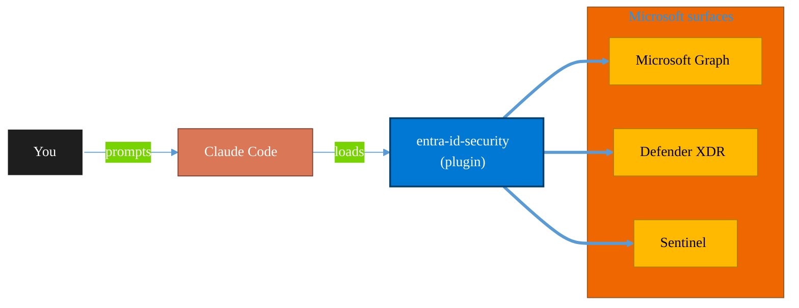

<!-- claude-m:premium-header:start -->
<div align="center">

<a id="top"></a>

# entra-id-security

### Microsoft Entra ID identity governance and security — app registrations, service principals, conditional access, sign-in logs, and risk detection

<sub>Protect identity, endpoints, data, and information.</sub>

<br />

<table align="center">
<tr>
<td align="center"><b>Category</b><br /><code>Security</code></td>
<td align="center"><b>Surfaces</b><br /><sub>Microsoft Graph · Defender · Sentinel · Purview · Entra</sub></td>
<td align="center"><b>Version</b><br /><code>1.0.0</code></td>
<td align="center"><b>Marketplace</b><br /><code>claude-m-microsoft-marketplace</code></td>
</tr>
</table>

<sub><code>microsoft</code> &nbsp;·&nbsp; <code>entra-id</code> &nbsp;·&nbsp; <code>identity</code> &nbsp;·&nbsp; <code>security</code> &nbsp;·&nbsp; <code>conditional-access</code> &nbsp;·&nbsp; <code>sign-in-logs</code></sub>

<a href="#install"><b>Install</b></a> &nbsp;·&nbsp;
<a href="#overview"><b>Overview</b></a> &nbsp;·&nbsp;
<a href="#architecture"><b>Architecture</b></a> &nbsp;·&nbsp;
<a href="#related-plugins"><b>Related plugins</b></a> &nbsp;·&nbsp;
<a href="../README.md"><b>Marketplace</b></a>

</div>

---

> [!TIP]
> **One-line install** — `/plugin install entra-id-security@claude-m-microsoft-marketplace`


## Overview

> Microsoft Entra ID identity governance and security — app registrations, service principals, conditional access, sign-in logs, and risk detection

<details>
<summary><b>What ships in this plugin</b> (commands, agents, skills)</summary>

| Component | Items |
|---|---|
| **Commands** | `/entra-app-register` · `/entra-ca-policy-create` · `/entra-ca-wizard` · `/entra-permissions-audit` · `/entra-risky-users` · `/entra-setup` · `/entra-signin-logs` · `/entra-sp-create` |
| **Agents** | `entra-security-reviewer` |
| **Skills** | `entra-security` |

</details>


<details>
<summary><b>Quick example</b></summary>

```text
Use entra-id-security to investigate, contain, and harden against threats.
```

</details>

<a id="architecture"></a>

## Architecture



<a id="install"></a>

## Install

```bash
/plugin marketplace add markus41/Claude-m
/plugin install entra-id-security@claude-m-microsoft-marketplace
```

> [!IMPORTANT]
> This plugin operates against **Microsoft Graph · Defender · Sentinel · Purview · Entra**. Configure credentials via environment variables — never commit secrets.

[Back to top](#top)

---

<!-- claude-m:premium-header:end -->

A Claude Code knowledge plugin for Microsoft Entra ID (Azure AD) identity governance and security — app registrations, service principals, conditional access, sign-in monitoring, and risk detection via Microsoft Graph API.

## What This Plugin Provides

This is a **knowledge plugin** -- it gives Claude deep expertise in Entra ID security so it can generate correct Graph API code for identity management, build conditional access policies safely, analyze sign-in logs, and audit permission grants. It does not contain runtime code, MCP servers, or executable scripts.

## Setup

Run `/setup` to configure authentication and verify Entra ID access:

```
/setup              # Full guided setup
/setup --minimal    # Node.js dependencies only
```

## Integration Context Contract
- Canonical contract: [`docs/integration-context.md`](../docs/integration-context.md)

| Command family | tenantId | subscriptionId | environmentCloud | principalType | scopesOrRoles |
|---|---|---|---|---|---|
| App/SP/CA/sign-in/risk operations | required | optional (required only when chaining to Azure scope) | `AzureCloud`\* | `delegated-user` or `service-principal` | `Application.ReadWrite.All`, `Policy.Read.All`, `AuditLog.Read.All`, `Directory.Read.All` |

\* Use sovereign cloud values from the contract when applicable.

Commands must fail fast on missing context before issuing Graph calls and use standardized context error codes.
All outputs/reviews must redact tenant/object identifiers using the contract redaction policy.

## Capabilities

| Area | What Claude Can Do |
|------|-------------------|
| **App Registrations** | Create apps with secure defaults, certificate credentials, and least-privilege permissions |
| **Service Principals** | Create and configure service principals with role assignments |
| **Conditional Access** | Build CA policies in report-only mode with MFA, device compliance, and location conditions |
| **Sign-In Logs** | Query and analyze sign-in logs to detect failed attempts and anomalies |
| **Risk Detection** | List and manage risky users with appropriate remediation actions |
| **Permission Audit** | Audit OAuth2 grants to find over-permissioned applications |
| **Review** | Analyze identity code for secure app registration, CA policy safety, and credential handling |

## Commands

| Command | Description |
|---------|-------------|
| `/entra-app-register` | Register a new application with secure defaults |
| `/entra-sp-create` | Create a service principal with role assignments |
| `/entra-ca-policy-create` | Create a conditional access policy (always report-only) |
| `/entra-signin-logs` | Query and analyze sign-in logs |
| `/entra-risky-users` | List and manage risky users |
| `/entra-permissions-audit` | Audit OAuth2 permission grants across the tenant |
| `/setup` | Configure Azure auth with identity and security permissions |

## Agent

| Agent | Description |
|-------|-------------|
| **Entra ID Security Reviewer** | Reviews app registration security, CA policy safety, permission grants, and credential handling |

## Plugin Structure

```
entra-id-security/
├── .claude-plugin/
│   └── plugin.json
├── skills/
│   └── entra-security/
│       └── SKILL.md
├── commands/
│   ├── entra-app-register.md
│   ├── entra-sp-create.md
│   ├── entra-ca-policy-create.md
│   ├── entra-signin-logs.md
│   ├── entra-risky-users.md
│   ├── entra-permissions-audit.md
│   └── setup.md
├── agents/
│   └── entra-security-reviewer.md
└── README.md
```

## Trigger Keywords

The skill activates automatically when conversations mention: `entra id`, `azure ad`, `app registration`, `service principal`, `conditional access`, `sign-in log`, `risky user`, `identity governance`, `permission audit`, `oauth consent`, `managed identity`, `certificate credential`.

## Author

Markus Ahling
<!-- claude-m:premium-footer:start -->

---

<a id="related-plugins"></a>

## Related plugins

<table>
<tr><th>Plugin</th><th>What it does</th></tr>
<tr><td><a href="../entra-id-admin/README.md"><code>entra-id-admin</code></a></td><td>Microsoft Entra ID administration via Graph API — full user/group lifecycle, directory roles, PIM, authentication methods, admin units, B2B guest management, license assignment, named locations, and entitlement management</td></tr>
<tr><td><a href="../azure-policy-security/README.md"><code>azure-policy-security</code></a></td><td>Evaluate Azure policy compliance and security posture — policy assignments, drift analysis, remediation planning, and guardrail recommendations</td></tr>
<tr><td><a href="../fabric-security-governance/README.md"><code>fabric-security-governance</code></a></td><td>Microsoft Fabric Security Governance — workspace RBAC, RLS/OLS patterns, sensitivity labels, lineage controls, and audit readiness</td></tr>
<tr><td><a href="../graph-investigator/README.md"><code>graph-investigator</code></a></td><td>Microsoft Graph Investigator — unified user investigation, mailbox forensics, activity timelines, device correlation, and forensic reporting across all M365 services</td></tr>
<tr><td><a href="../azure-key-vault/README.md"><code>azure-key-vault</code></a></td><td>Azure Key Vault — secrets, keys, and certificates management with RBAC, rotation policies, and managed identity integration</td></tr>
<tr><td><a href="../defender-sentinel/README.md"><code>defender-sentinel</code></a></td><td>Microsoft Sentinel SIEM/SOAR and Defender XDR — incident triage, KQL threat hunting, analytics rules, SOAR playbooks, advanced hunting, and unified security operations center workflows</td></tr>
</table>


<details>
<summary><b>Composable stacks that include <code>entra-id-security</code></b></summary>

Combine with sibling plugins to build cross-surface runbooks. Browse the full [marketplace catalog](../README.md#plugin-catalog) for a tailored selection.

</details>

---

<div align="center">

<sub>Part of <a href="../README.md"><b>Claude-m</b></a> — the Microsoft plugin marketplace for Claude Code.</sub>

<sub>Licensed under <a href="../LICENSE">MIT</a>. Built for engineers, MSPs, SOC teams, and analytics leaders.</sub>

</div>

<!-- claude-m:premium-footer:end -->

