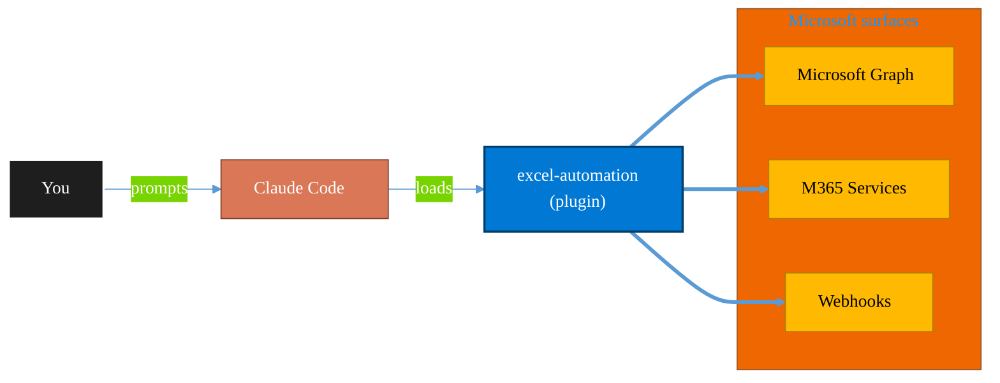

<!-- claude-m:premium-header:start -->
<div align="center">

<a id="top"></a>

# excel-automation

### Excel data cleaning with pandas, Office Script generation, and Power Automate flow creation

<sub>Automate everyday Microsoft 365 collaboration workflows.</sub>

<br />

<table align="center">
<tr>
<td align="center"><b>Category</b><br /><code>Productivity</code></td>
<td align="center"><b>Surfaces</b><br /><sub>Microsoft Graph · M365 · Teams · Outlook · SharePoint · Loop</sub></td>
<td align="center"><b>Version</b><br /><code>1.0.0</code></td>
<td align="center"><b>Marketplace</b><br /><code>claude-m-microsoft-marketplace</code></td>
</tr>
</table>

<sub><code>microsoft</code> &nbsp;·&nbsp; <code>excel</code> &nbsp;·&nbsp; <code>pandas</code> &nbsp;·&nbsp; <code>office-scripts</code> &nbsp;·&nbsp; <code>data-cleaning</code> &nbsp;·&nbsp; <code>power-automate</code></sub>

<a href="#install"><b>Install</b></a> &nbsp;·&nbsp;
<a href="#overview"><b>Overview</b></a> &nbsp;·&nbsp;
<a href="#architecture"><b>Architecture</b></a> &nbsp;·&nbsp;
<a href="#related-plugins"><b>Related plugins</b></a> &nbsp;·&nbsp;
<a href="../README.md"><b>Marketplace</b></a>

</div>

---

> [!TIP]
> **One-line install** — `/plugin install excel-automation@claude-m-microsoft-marketplace`


## Overview

> Excel data cleaning with pandas, Office Script generation, and Power Automate flow creation

<details>
<summary><b>What ships in this plugin</b> (commands, agents, skills)</summary>

| Component | Items |
|---|---|
| **Commands** | `/create-flow` · `/create-script` · `/excel-clean` · `/excel-script` · `/excel-setup` · `/excel-template` · `/excel-vba` · `/validate-script` |
| **Agents** | `excel-reviewer` · `flow-definition-reviewer` |
| **Skills** | `office-scripts` · `pandas-cleaning` · `power-automate-flows` |

</details>


<details>
<summary><b>Quick example</b></summary>

```text
Use excel-automation to automate Microsoft 365 collaboration workflows.
```

</details>

<a id="architecture"></a>

## Architecture



<a id="install"></a>

## Install

```bash
/plugin marketplace add markus41/Claude-m
/plugin install excel-automation@claude-m-microsoft-marketplace
```

> [!IMPORTANT]
> This plugin operates against **Microsoft Graph · M365 · Teams · Outlook · SharePoint · Loop**. Configure credentials via environment variables — never commit secrets.

[Back to top](#top)

---

<!-- claude-m:premium-header:end -->

A Claude Code knowledge plugin for cleaning messy data with pandas, generating polished `.xlsx` files, creating Office Scripts for Excel automation, and building Power Automate flows.

## Pipeline

```
Dirty Data                    Pandas Cleaning              Office Scripts / Power Automate
───────────                   ───────────────              ───────────────────────────────
.csv / .tsv          ──┐
.xlsx / .xls / .xlsb ──┤     ┌──────────────────┐         ┌──────────────────┐
.json / .jsonl       ──┼──→  │ Clean DataFrame   │  ──→    │ Format & automate │
.parquet             ──┤     │ ├─ Normalize cols  │         │ ├─ Office Scripts │
Dataverse export     ──┘     │ ├─ Coerce types   │         │ ├─ Charts/tables  │
                             │ ├─ Handle nulls   │         │ ├─ Power Automate │
                             │ ├─ Deduplicate    │         │ └─ VBA (legacy)   │
                             │ ├─ Validate       │         └──────────────────┘
                             │ └─ Dataverse mode │
                             └──────────────────┘
                                      │
                                      ▼
                             Polished .xlsx output
                             ├─ Formatted headers
                             ├─ Freeze panes
                             ├─ Auto-fit columns
                             ├─ Number formats
                             └─ Data quality report
```

## Setup

Run `/setup` to install dependencies and configure the plugin:

```
/setup                        # Full guided setup
/setup --minimal              # Python dependencies only
/setup --with-dataverse       # Include Dataverse-aware mode config
/setup --with-power-automate  # Include Power Automate flow config
```

## Commands

### `/excel-clean` — Clean messy data
```bash
/excel-clean sales_data_raw.csv
/excel-clean accounts_export.csv --source dataverse
/excel-clean messy_report.xlsx --output clean_report.xlsx
```
Reads any tabular input file, generates a complete Python cleaning script, and outputs a polished `.xlsx` file. Auto-detects Dataverse exports and activates specialized cleaning (prefix stripping, option set resolution, lookup flattening, OData annotation handling).

### `/excel-script` — Generate Office Scripts
```bash
/excel-script Format Sheet1 as a professional table with alternating row colors
/excel-script Accept employee records from Power Automate and write to Excel
/excel-script --format osts Create a summary chart from quarterly data
```
Creates TypeScript Office Scripts that follow all TS 4.0.3 restrictions. Supports `.osts`, `.ts`, or both output formats. Includes verify-before-use null checks by default.

### `/excel-template` — Generate Excel templates
```bash
/excel-template project-tracker
/excel-template inventory --columns "SKU, Product, Category, Qty, Price"
/excel-template contact-list --validation off
```
Generates openpyxl Python scripts that create reusable `.xlsx` templates with headers, data validation dropdowns, conditional formatting, named ranges, and optional sheet protection.

### `/excel-vba` — Generate VBA macros (deprecated)
```bash
/excel-vba Format the report --legacy-vba
```
Generates VBA code only when `--legacy-vba` is explicitly passed. Without the flag, redirects to `/excel-script`. Always includes a deprecation notice and the Office Script equivalent for migration.

### `/create-script` — Generate Office Script (original)
```bash
/create-script Create a table from data in Sheet1 with auto-formatting
```
Original command for Office Script generation. Use `/excel-script` for new work.

### `/validate-script` — Validate Office Script
```bash
/validate-script ./my-script.ts
```
Checks an Office Script against all TypeScript 4.0.3 restrictions and best practices.

### `/create-flow` — Generate Power Automate flow
```bash
/create-flow Run SalesReport script every weekday at 8 AM and email the team
```
Generates complete Power Automate flow definition JSON for the Dataverse Web API.

### `/setup` — Set up the plugin
```bash
/setup                        # Full guided setup
/setup --minimal              # Python dependencies only
/setup --with-dataverse       # Include Dataverse-aware mode config
/setup --with-power-automate  # Include Power Automate flow config
```
Walks through Python environment setup, dependency installation, optional Dataverse and Power Automate configuration, `.env` file creation, and verification.

## Skills

| Skill | Description |
|-------|-------------|
| **pandas-cleaning** | Data cleaning with pandas -- reading, transforming, validating, and writing polished Excel files |
| **office-scripts** | Excel Office Scripts in TypeScript 4.0.3 -- API patterns, constraints, formatting, and Power Automate integration |
| **power-automate-flows** | Power Automate flow definitions -- triggers, actions, connectors, and CI/CD deployment |

## Agents

| Agent | Description |
|-------|-------------|
| **excel-reviewer** | Reviews pandas scripts, Office Scripts, VBA macros, and data quality for correctness and performance |
| **flow-definition-reviewer** | Reviews Power Automate flow definition JSON for schema correctness and best practices |

## Quick Start

1. **Clean some data:**
   ```
   /excel-clean my_messy_data.csv
   ```
   This generates a Python script that cleans the data and writes a formatted `.xlsx` file.

2. **Add Excel formatting:**
   ```
   /excel-script Add alternating row colors and a summary chart to the cleaned data
   ```
   This generates an Office Script you can run in Excel to apply formatting.

3. **Automate it:**
   ```
   /create-flow Run the cleaning script weekly and email the results
   ```
   This generates a Power Automate flow definition.

4. **Review before running:**
   Ask the `excel-reviewer` agent to check any generated script for correctness.

## Dependencies

For pandas cleaning scripts, the following Python packages are used:
```
pip install pandas openpyxl xlrd pyxlsb pyarrow
```

Office Scripts require Excel on the web or Excel desktop with Microsoft 365. No local installation needed -- scripts are written as `.ts` files.
<!-- claude-m:premium-footer:start -->

---

<a id="related-plugins"></a>

## Related plugins

<table>
<tr><th>Plugin</th><th>What it does</th></tr>
<tr><td><a href="../excel-office-scripts/README.md"><code>excel-office-scripts</code></a></td><td>Deep knowledge of Excel Office Scripts — Microsoft's TypeScript-based automation platform for Excel on the web</td></tr>
<tr><td><a href="../plugins/excel/README.md"><code>microsoft-excel-mcp</code></a></td><td>Read and update workbooks, worksheets, ranges, and tables via MCP.</td></tr>
<tr><td><a href="../power-automate/README.md"><code>power-automate</code></a></td><td>Design and troubleshoot Power Automate cloud flows — trigger/action patterns, run diagnostics, retries, and deployment-safe flow definitions</td></tr>
<tr><td><a href="../business-central/README.md"><code>business-central</code></a></td><td>Microsoft Dynamics 365 Business Central ERP — finance, supply chain, and inventory management via BC OData v4 / API v2.0 REST API</td></tr>
<tr><td><a href="../copilot-studio-bots/README.md"><code>copilot-studio-bots</code></a></td><td>Copilot Studio — design bot topics, author trigger phrases, configure generative AI orchestration, and publish chatbots</td></tr>
<tr><td><a href="../dynamics-365-crm/README.md"><code>dynamics-365-crm</code></a></td><td>Dynamics 365 Sales and Customer Service via Dataverse Web API — leads, opportunities, accounts, contacts, cases, SLAs, queues, pipeline reporting, and CRM workflow automation</td></tr>
</table>


<details>
<summary><b>Composable stacks that include <code>excel-automation</code></b></summary>

Combine with sibling plugins to build cross-surface runbooks. Browse the full [marketplace catalog](../README.md#plugin-catalog) for a tailored selection.

</details>

---

<div align="center">

<sub>Part of <a href="../README.md"><b>Claude-m</b></a> — the Microsoft plugin marketplace for Claude Code.</sub>

<sub>Licensed under <a href="../LICENSE">MIT</a>. Built for engineers, MSPs, SOC teams, and analytics leaders.</sub>

</div>

<!-- claude-m:premium-footer:end -->

