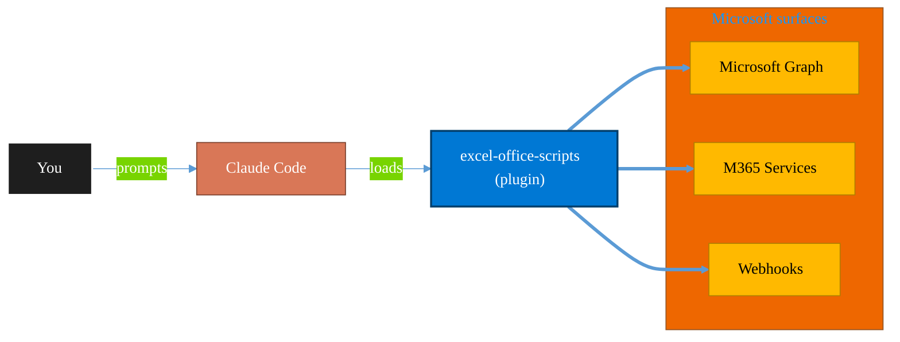

<!-- claude-m:premium-header:start -->
<div align="center">

<a id="top"></a>

# excel-office-scripts

### Deep knowledge of Excel Office Scripts — Microsoft's TypeScript-based automation platform for Excel on the web

<sub>Automate everyday Microsoft 365 collaboration workflows.</sub>

<br />

<table align="center">
<tr>
<td align="center"><b>Category</b><br /><code>Productivity</code></td>
<td align="center"><b>Surfaces</b><br /><sub>Microsoft Graph · M365 · Teams · Outlook · SharePoint · Loop</sub></td>
<td align="center"><b>Version</b><br /><code>1.0.0</code></td>
<td align="center"><b>Marketplace</b><br /><code>claude-m-microsoft-marketplace</code></td>
</tr>
</table>

<sub><code>microsoft</code> &nbsp;·&nbsp; <code>excel</code> &nbsp;·&nbsp; <code>office-scripts</code> &nbsp;·&nbsp; <code>power-automate</code> &nbsp;·&nbsp; <code>typescript</code> &nbsp;·&nbsp; <code>automation</code></sub>

<a href="#install"><b>Install</b></a> &nbsp;·&nbsp;
<a href="#overview"><b>Overview</b></a> &nbsp;·&nbsp;
<a href="#architecture"><b>Architecture</b></a> &nbsp;·&nbsp;
<a href="#related-plugins"><b>Related plugins</b></a> &nbsp;·&nbsp;
<a href="../README.md"><b>Marketplace</b></a>

</div>

---

> [!TIP]
> **One-line install** — `/plugin install excel-office-scripts@claude-m-microsoft-marketplace`


## Overview

> Deep knowledge of Excel Office Scripts — Microsoft's TypeScript-based automation platform for Excel on the web

<details>
<summary><b>What ships in this plugin</b> (commands, agents, skills)</summary>

| Component | Items |
|---|---|
| **Commands** | `/create-flow` · `/create-script` · `/validate-script` |
| **Agents** | `flow-definition-reviewer` · `office-script-reviewer` |
| **Skills** | `office-scripts` · `power-automate-flows` |

</details>


<details>
<summary><b>Quick example</b></summary>

```text
Use excel-office-scripts to automate Microsoft 365 collaboration workflows.
```

</details>

<a id="architecture"></a>

## Architecture



<a id="install"></a>

## Install

```bash
/plugin marketplace add markus41/Claude-m
/plugin install excel-office-scripts@claude-m-microsoft-marketplace
```

> [!IMPORTANT]
> This plugin operates against **Microsoft Graph · M365 · Teams · Outlook · SharePoint · Loop**. Configure credentials via environment variables — never commit secrets.

[Back to top](#top)

---

<!-- claude-m:premium-header:end -->

A Claude Code plugin that provides deep knowledge of Excel Office Scripts and Power Automate cloud flow creation — covering the full stack from writing TypeScript automation scripts to deploying flows programmatically via the Dataverse Web API.

## What This Plugin Does

Equips Claude with expert-level knowledge for:

- **Writing** correct, idiomatic Office Scripts from natural language descriptions
- **Reviewing** scripts for TypeScript compliance, performance, and best practices
- **Creating** Power Automate flow definitions (`clientdata` JSON) programmatically
- **Deploying** flows via the Dataverse Web API (REST and TypeScript)
- **Wiring** Office Scripts to Power Automate triggers (schedule, HTTP, Forms, SharePoint, etc.)
- **CI/CD provisioning** of flows across environments with template resolution

## Installation

```bash
claude --plugin-dir ./excel-office-scripts
```

## Components

### Skill: `office-scripts`

Core knowledge that activates when you mention Office Scripts, Excel automation, `.osts` files, or ask to write TypeScript for Excel. Includes:

- **SKILL.md** — Entry points, object model, TypeScript restrictions, key patterns
- **references/api-patterns.md** — Full API surface (Workbook, Worksheet, Range, Table, Chart, PivotTable, etc.)
- **references/power-automate.md** — Parameter passing, return values, connector usage, limits
- **references/constraints-and-best-practices.md** — TS 4.0.3 restrictions, platform limits, performance tips
- **examples/** — Range operations, table operations, chart operations, and complete real-world scripts

### Skill: `power-automate-flows`

Knowledge for creating and managing Power Automate flows programmatically. Activates on mentions of flow definitions, Dataverse workflows, `clientdata`, or flow provisioning. Includes:

- **SKILL.md** — Core concepts, Dataverse Web API quick reference, `clientdata` structure, trigger/action types
- **references/dataverse-web-api.md** — Full CRUD, OAuth auth, TypeScript client class, error handling
- **references/flow-definition-schema.md** — ARM-style definition: triggers, actions, expressions, connections
- **references/management-connector.md** — PA Management connector, HTTP trigger patterns, security
- **examples/office-script-flows.md** — Complete payloads: scheduled, HTTP-triggered, Forms, button flows
- **examples/ci-cd-provisioning.md** — Template deploy, environment promotion, GitHub Actions, idempotent deploy
- **examples/complete-payloads.md** — Ready-to-use `clientdata` for common scenarios

### Commands

| Command | Description |
|---------|-------------|
| `/create-script` | Generate a new Office Script from a natural language description |
| `/validate-script` | Check an existing script for compliance issues and performance problems |
| `/create-flow` | Generate a Power Automate flow definition JSON from a description |

### Agents

| Agent | Description |
|-------|-------------|
| `office-script-reviewer` | Reviews Office Scripts for TypeScript compliance, performance, and correctness |
| `flow-definition-reviewer` | Reviews flow definition JSON for schema validity, connection references, and best practices |

## Quick Start

```bash
# Write an Office Script
> Write an Office Script that creates a sales summary table with totals

# Generate a script with the command
> /create-script Read all data from Sheet1, group by Region, and create a summary

# Validate an existing script
> /validate-script ./my-report-script.ts

# Generate a flow definition
> /create-flow Run my SalesReport script every weekday at 8 AM and email the team

# Review a flow definition
> Can you review this flow definition JSON?

# Create a flow + script together
> Create an HTTP-triggered flow that accepts order data and writes it to Excel via an Office Script
```

## Key Facts

### Office Scripts
- **Runtime**: TypeScript 4.0.3 (restricted subset)
- **Entry point**: `function main(workbook: ExcelScript.Workbook)`
- **No imports**: Scripts are self-contained — no npm, no modules
- **No `any` type**: All variables must be explicitly or inferably typed
- **Execution limit**: 120 seconds
- **Power Automate**: `fetch` is disabled when called from a flow

### Power Automate Flows (Programmatic)
- **Storage**: Dataverse `workflow` table rows (`category = 5`)
- **API**: `POST /api/data/v9.2/workflows` with `clientdata` JSON
- **Schema**: ARM-style Logic Apps 2016-06-01 definition
- **Auth**: Azure AD OAuth 2.0 (client credentials or delegated)
- **Lifecycle**: Create (draft) → Enable → Update → Disable → Delete
- **Connectors**: Excel Online Business, Office 365, SharePoint, Teams, Forms, Approvals, etc.
<!-- claude-m:premium-footer:start -->

---

<a id="related-plugins"></a>

## Related plugins

<table>
<tr><th>Plugin</th><th>What it does</th></tr>
<tr><td><a href="../excel-automation/README.md"><code>excel-automation</code></a></td><td>Excel data cleaning with pandas, Office Script generation, and Power Automate flow creation</td></tr>
<tr><td><a href="../power-automate/README.md"><code>power-automate</code></a></td><td>Design and troubleshoot Power Automate cloud flows — trigger/action patterns, run diagnostics, retries, and deployment-safe flow definitions</td></tr>
<tr><td><a href="../plugins/excel/README.md"><code>microsoft-excel-mcp</code></a></td><td>Read and update workbooks, worksheets, ranges, and tables via MCP.</td></tr>
<tr><td><a href="../servicedesk-runbooks/README.md"><code>servicedesk-runbooks</code></a></td><td>M365 service desk auto-runbooks — guided workflows for common tickets like shared mailbox access, MFA reset, file recovery, and password reset with pre-checks, approval gates, and end-user verification</td></tr>
<tr><td><a href="../business-central/README.md"><code>business-central</code></a></td><td>Microsoft Dynamics 365 Business Central ERP — finance, supply chain, and inventory management via BC OData v4 / API v2.0 REST API</td></tr>
<tr><td><a href="../copilot-studio-bots/README.md"><code>copilot-studio-bots</code></a></td><td>Copilot Studio — design bot topics, author trigger phrases, configure generative AI orchestration, and publish chatbots</td></tr>
</table>


<details>
<summary><b>Composable stacks that include <code>excel-office-scripts</code></b></summary>

Combine with sibling plugins to build cross-surface runbooks. Browse the full [marketplace catalog](../README.md#plugin-catalog) for a tailored selection.

</details>

---

<div align="center">

<sub>Part of <a href="../README.md"><b>Claude-m</b></a> — the Microsoft plugin marketplace for Claude Code.</sub>

<sub>Licensed under <a href="../LICENSE">MIT</a>. Built for engineers, MSPs, SOC teams, and analytics leaders.</sub>

</div>

<!-- claude-m:premium-footer:end -->

