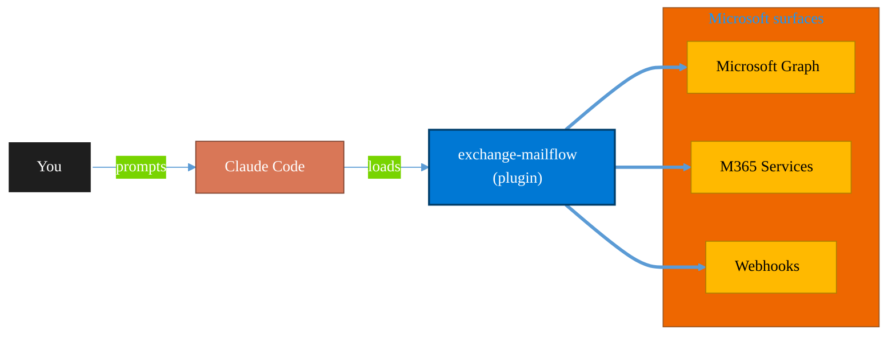

<!-- claude-m:premium-header:start -->
<div align="center">

<a id="top"></a>

# exchange-mailflow

### Exchange Online mail flow diagnostics and deliverability — guided 'email not received' troubleshooting, transport rules, quarantine, connectors, and SPF/DKIM/DMARC checks with client-safe explanations

<sub>Automate everyday Microsoft 365 collaboration workflows.</sub>

<br />

<table align="center">
<tr>
<td align="center"><b>Category</b><br /><code>Productivity</code></td>
<td align="center"><b>Surfaces</b><br /><sub>Microsoft Graph · M365 · Teams · Outlook · SharePoint · Loop</sub></td>
<td align="center"><b>Version</b><br /><code>1.0.0</code></td>
<td align="center"><b>Marketplace</b><br /><code>claude-m-microsoft-marketplace</code></td>
</tr>
</table>

<sub><code>microsoft</code> &nbsp;·&nbsp; <code>exchange</code> &nbsp;·&nbsp; <code>mail-flow</code> &nbsp;·&nbsp; <code>deliverability</code> &nbsp;·&nbsp; <code>spf</code> &nbsp;·&nbsp; <code>dkim</code></sub>

<a href="#install"><b>Install</b></a> &nbsp;·&nbsp;
<a href="#overview"><b>Overview</b></a> &nbsp;·&nbsp;
<a href="#architecture"><b>Architecture</b></a> &nbsp;·&nbsp;
<a href="#related-plugins"><b>Related plugins</b></a> &nbsp;·&nbsp;
<a href="../README.md"><b>Marketplace</b></a>

</div>

---

> [!TIP]
> **One-line install** — `/plugin install exchange-mailflow@claude-m-microsoft-marketplace`


## Overview

> Exchange Online mail flow diagnostics and deliverability — guided 'email not received' troubleshooting, transport rules, quarantine, connectors, and SPF/DKIM/DMARC checks with client-safe explanations

<details>
<summary><b>What ships in this plugin</b> (commands, agents, skills)</summary>

| Component | Items |
|---|---|
| **Commands** | `/mailflow-diagnose` · `/mailflow-explain` · `/mailflow-setup` |
| **Agents** | `mailflow-reviewer` |
| **Skills** | `exchange-mailflow` |

</details>


<details>
<summary><b>Quick example</b></summary>

```text
Use exchange-mailflow to automate Microsoft 365 collaboration workflows.
```

</details>

<a id="architecture"></a>

## Architecture



<a id="install"></a>

## Install

```bash
/plugin marketplace add markus41/Claude-m
/plugin install exchange-mailflow@claude-m-microsoft-marketplace
```

> [!IMPORTANT]
> This plugin operates against **Microsoft Graph · M365 · Teams · Outlook · SharePoint · Loop**. Configure credentials via environment variables — never commit secrets.

[Back to top](#top)

---

<!-- claude-m:premium-header:end -->

Guided diagnostics for "email not received" and mail flow issues in Exchange Online. Checks transport rules, quarantine, connectors, and DNS (SPF/DKIM/DMARC), then generates client-safe explanations.

## What this plugin helps with
- Diagnose "email not received" problems step by step
- Check transport rules, quarantine, and connector configurations
- Validate SPF, DKIM, and DMARC DNS records
- Convert technical findings into client-safe explanations with next actions

## Included commands
- `/mailflow-setup` — Configure Exchange Online Management module
- `/mailflow-diagnose` — Guided "email not received" diagnosis
- `/mailflow-explain` — Convert findings into client-safe explanation

## Skill
- `skills/exchange-mailflow/SKILL.md` — Mail flow diagnostics knowledge

## Agent
- `agents/mailflow-reviewer.md` — Reviews mail flow configurations and DNS recommendations
<!-- claude-m:premium-footer:start -->

---

<a id="related-plugins"></a>

## Related plugins

<table>
<tr><th>Plugin</th><th>What it does</th></tr>
<tr><td><a href="../business-central/README.md"><code>business-central</code></a></td><td>Microsoft Dynamics 365 Business Central ERP — finance, supply chain, and inventory management via BC OData v4 / API v2.0 REST API</td></tr>
<tr><td><a href="../copilot-studio-bots/README.md"><code>copilot-studio-bots</code></a></td><td>Copilot Studio — design bot topics, author trigger phrases, configure generative AI orchestration, and publish chatbots</td></tr>
<tr><td><a href="../dynamics-365-crm/README.md"><code>dynamics-365-crm</code></a></td><td>Dynamics 365 Sales and Customer Service via Dataverse Web API — leads, opportunities, accounts, contacts, cases, SLAs, queues, pipeline reporting, and CRM workflow automation</td></tr>
<tr><td><a href="../dynamics-365-field-service/README.md"><code>dynamics-365-field-service</code></a></td><td>Dynamics 365 Field Service via Dataverse Web API — work orders, bookings, resource scheduling, service accounts, assets, and IoT-triggered service events</td></tr>
<tr><td><a href="../dynamics-365-project-ops/README.md"><code>dynamics-365-project-ops</code></a></td><td>Dynamics 365 Project Operations via Dataverse Web API — projects, WBS, time and expense tracking, resource assignments, project contracts, and billing</td></tr>
<tr><td><a href="../excel-automation/README.md"><code>excel-automation</code></a></td><td>Excel data cleaning with pandas, Office Script generation, and Power Automate flow creation</td></tr>
</table>


<details>
<summary><b>Composable stacks that include <code>exchange-mailflow</code></b></summary>

Combine with sibling plugins to build cross-surface runbooks. Browse the full [marketplace catalog](../README.md#plugin-catalog) for a tailored selection.

</details>

---

<div align="center">

<sub>Part of <a href="../README.md"><b>Claude-m</b></a> — the Microsoft plugin marketplace for Claude Code.</sub>

<sub>Licensed under <a href="../LICENSE">MIT</a>. Built for engineers, MSPs, SOC teams, and analytics leaders.</sub>

</div>

<!-- claude-m:premium-footer:end -->

