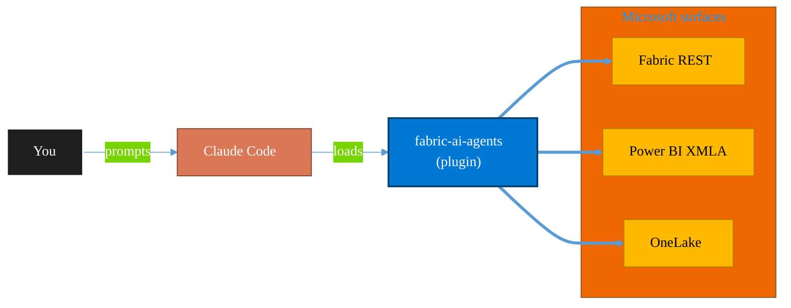

<!-- claude-m:premium-header:start -->
<div align="center">

<a id="top"></a>

# fabric-ai-agents

### Microsoft Fabric AI and operations agents - anomaly detector, data agent, operations agent, ontology, and digital twin builder workflows with preview guardrails.

<sub>Build, mirror, and govern analytics estates on Fabric.</sub>

<br />

<table align="center">
<tr>
<td align="center"><b>Category</b><br /><code>Analytics</code></td>
<td align="center"><b>Surfaces</b><br /><sub>Microsoft Fabric · Power BI · OneLake · DAX · KQL</sub></td>
<td align="center"><b>Version</b><br /><code>1.0.0</code></td>
<td align="center"><b>Marketplace</b><br /><code>claude-m-microsoft-marketplace</code></td>
</tr>
</table>

<sub><code>microsoft</code> &nbsp;·&nbsp; <code>fabric</code> &nbsp;·&nbsp; <code>ai-agents</code> &nbsp;·&nbsp; <code>anomaly-detector</code> &nbsp;·&nbsp; <code>ontology</code> &nbsp;·&nbsp; <code>digital-twin</code></sub>

<a href="#install"><b>Install</b></a> &nbsp;·&nbsp;
<a href="#overview"><b>Overview</b></a> &nbsp;·&nbsp;
<a href="#architecture"><b>Architecture</b></a> &nbsp;·&nbsp;
<a href="#related-plugins"><b>Related plugins</b></a> &nbsp;·&nbsp;
<a href="../README.md"><b>Marketplace</b></a>

</div>

---

> [!TIP]
> **One-line install** — `/plugin install fabric-ai-agents@claude-m-microsoft-marketplace`


## Overview

> Microsoft Fabric AI and operations agents - anomaly detector, data agent, operations agent, ontology, and digital twin builder workflows with preview guardrails.

<details>
<summary><b>What ships in this plugin</b> (commands, agents, skills)</summary>

| Component | Items |
|---|---|
| **Commands** | `/ai-agents-setup` · `/anomaly-detector-manage` · `/data-agent-manage` · `/digital-twin-builder-manage` · `/ontology-manage` · `/operations-agent-manage` |
| **Agents** | `fabric-ai-agents-reviewer` |
| **Skills** | `fabric-ai-agents` |

</details>


<details>
<summary><b>Quick example</b></summary>

```text
Use fabric-ai-agents to design, build, and govern Fabric / Power BI assets.
```

</details>

<a id="architecture"></a>

## Architecture



<a id="install"></a>

## Install

```bash
/plugin marketplace add markus41/Claude-m
/plugin install fabric-ai-agents@claude-m-microsoft-marketplace
```

> [!IMPORTANT]
> This plugin operates against **Microsoft Fabric · Power BI · OneLake · DAX · KQL**. Configure credentials via environment variables — never commit secrets.

[Back to top](#top)

---

<!-- claude-m:premium-header:end -->

Microsoft Fabric AI and operations agents - anomaly detector, data agent, operations agent, ontology, and digital twin builder workflows with preview guardrails.

Category: `analytics`

## Purpose

This is a knowledge plugin for planning and reviewing Fabric AI agent workflows. It provides deterministic command guidance and reviewer checks, but does not ship runtime MCP servers or executable automation.

## Preview Caveat

Fabric AI agent surfaces in this plugin are preview-heavy. APIs, item schemas, role requirements, and limits can change between releases. Re-run setup and re-validate assumptions before production use.

## Prerequisites

- Fabric-enabled tenant and workspace access.
- Workspace role that can read and manage the target artifacts (Contributor or higher where mutation is required).
- Integration context with required identity fields and permissions.
- Microsoft/Azure permissions aligned to each workflow command.

## Integration Context Contract

- Canonical contract: [`docs/integration-context.md`](../docs/integration-context.md)

| Command family | tenantId | subscriptionId | environmentCloud | principalType | scopesOrRoles |
|---|---|---|---|---|---|
| AI and operations agent workflows | required | optional (required only for Azure-linked resources) | `AzureCloud`* | `delegated-user` or `service-principal` | Fabric workspace read/write permissions plus workload-specific API grants |

* Use sovereign cloud values from the canonical contract where applicable.

Commands must fail fast before network calls when required context is missing or invalid. Output must redact tenant, subscription, workspace, item, and principal identifiers and must never expose secrets or tokens.

## Commands

| Command | Description |
|---|---|
| `/ai-agents-setup` | Validate preview readiness, identity context, and workspace prerequisites for agent workflows. |
| `/anomaly-detector-manage` | Define and manage anomaly detector workflows with deterministic validation and rollback checks. |
| `/data-agent-manage` | Define and manage data agent workflows and grounding sources with preview-safe guardrails. |
| `/operations-agent-manage` | Define and manage operations agent workflows for monitoring and runbook responses. |
| `/ontology-manage` | Define and manage ontology assets, versioning, and compatibility checks. |
| `/digital-twin-builder-manage` | Define and manage digital twin builder workflows, model links, and validation checks. |

## Agent

| Agent | Description |
|---|---|
| `fabric-ai-agents-reviewer` | Reviews docs for preview caveats, permission coverage, fail-fast behavior, redaction, and deterministic command quality. |

## Trigger Keywords

- `fabric ai agent`
- `anomaly detector`
- `data agent`
- `operations agent`
- `fabric ontology`
- `digital twin builder`
- `preview guardrails`
<!-- claude-m:premium-footer:start -->

---

<a id="related-plugins"></a>

## Related plugins

<table>
<tr><th>Plugin</th><th>What it does</th></tr>
<tr><td><a href="../fabric-graph-geo/README.md"><code>fabric-graph-geo</code></a></td><td>Microsoft Fabric graph and geospatial analytics - graph model, graph queryset, map, and exploration workflows with preview guardrails.</td></tr>
<tr><td><a href="../fabric-capacity-ops/README.md"><code>fabric-capacity-ops</code></a></td><td>Microsoft Fabric Capacity Operations — CU monitoring, throttling diagnostics, workload tuning, autoscale planning, and cost-performance optimization</td></tr>
<tr><td><a href="../fabric-data-activator/README.md"><code>fabric-data-activator</code></a></td><td>Microsoft Fabric Data Activator — Reflex triggers, condition-based alerts, real-time actions, and event-driven automation on Fabric data</td></tr>
<tr><td><a href="../fabric-data-engineering/README.md"><code>fabric-data-engineering</code></a></td><td>Microsoft Fabric Data Engineering — lakehouses, Spark notebooks, data pipelines, Delta Lake tables, lakehouse SQL endpoints, multi-notebook orchestration, workspace lifecycle management, pipeline monitoring, and advanced optimization</td></tr>
<tr><td><a href="../fabric-data-factory/README.md"><code>fabric-data-factory</code></a></td><td>Microsoft Fabric Data Factory — data pipelines, Dataflow Gen2, Copy activity, orchestration patterns, and scheduling</td></tr>
<tr><td><a href="../fabric-data-prep-jobs/README.md"><code>fabric-data-prep-jobs</code></a></td><td>Microsoft Fabric data preparation jobs - Dataflow Gen1, Apache Airflow jobs, mounted Azure Data Factory pipelines, and dbt job governance for deterministic prep workflows.</td></tr>
</table>


<details>
<summary><b>Composable stacks that include <code>fabric-ai-agents</code></b></summary>

Combine with sibling plugins to build cross-surface runbooks. Browse the full [marketplace catalog](../README.md#plugin-catalog) for a tailored selection.

</details>

---

<div align="center">

<sub>Part of <a href="../README.md"><b>Claude-m</b></a> — the Microsoft plugin marketplace for Claude Code.</sub>

<sub>Licensed under <a href="../LICENSE">MIT</a>. Built for engineers, MSPs, SOC teams, and analytics leaders.</sub>

</div>

<!-- claude-m:premium-footer:end -->

