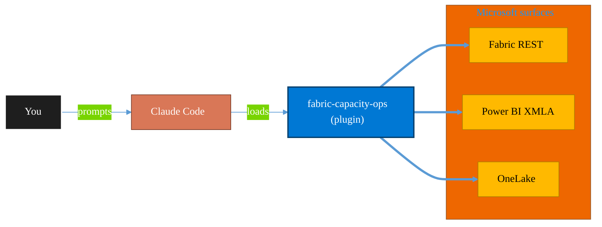

<!-- claude-m:premium-header:start -->
<div align="center">

<a id="top"></a>

# fabric-capacity-ops

### Microsoft Fabric Capacity Operations — CU monitoring, throttling diagnostics, workload tuning, autoscale planning, and cost-performance optimization

<sub>Build, mirror, and govern analytics estates on Fabric.</sub>

<br />

<table align="center">
<tr>
<td align="center"><b>Category</b><br /><code>Analytics</code></td>
<td align="center"><b>Surfaces</b><br /><sub>Microsoft Fabric · Power BI · OneLake · DAX · KQL</sub></td>
<td align="center"><b>Version</b><br /><code>1.0.0</code></td>
<td align="center"><b>Marketplace</b><br /><code>claude-m-microsoft-marketplace</code></td>
</tr>
</table>

<sub><code>microsoft</code> &nbsp;·&nbsp; <code>fabric</code> &nbsp;·&nbsp; <code>capacity</code> &nbsp;·&nbsp; <code>throttling</code> &nbsp;·&nbsp; <code>monitoring</code> &nbsp;·&nbsp; <code>autoscale</code></sub>

<a href="#install"><b>Install</b></a> &nbsp;·&nbsp;
<a href="#overview"><b>Overview</b></a> &nbsp;·&nbsp;
<a href="#architecture"><b>Architecture</b></a> &nbsp;·&nbsp;
<a href="#related-plugins"><b>Related plugins</b></a> &nbsp;·&nbsp;
<a href="../README.md"><b>Marketplace</b></a>

</div>

---

> [!TIP]
> **One-line install** — `/plugin install fabric-capacity-ops@claude-m-microsoft-marketplace`


## Overview

> Microsoft Fabric Capacity Operations — CU monitoring, throttling diagnostics, workload tuning, autoscale planning, and cost-performance optimization

<details>
<summary><b>What ships in this plugin</b> (commands, agents, skills)</summary>

| Component | Items |
|---|---|
| **Commands** | `/capacity-monitor` · `/capacity-setup` · `/throttling-diagnose` · `/workload-tune` |
| **Agents** | `capacity-ops-reviewer` |
| **Skills** | `fabric-capacity-ops` |

</details>


<details>
<summary><b>Quick example</b></summary>

```text
Use fabric-capacity-ops to design, build, and govern Fabric / Power BI assets.
```

</details>

<a id="architecture"></a>

## Architecture



<a id="install"></a>

## Install

```bash
/plugin marketplace add markus41/Claude-m
/plugin install fabric-capacity-ops@claude-m-microsoft-marketplace
```

> [!IMPORTANT]
> This plugin operates against **Microsoft Fabric · Power BI · OneLake · DAX · KQL**. Configure credentials via environment variables — never commit secrets.

[Back to top](#top)

---

<!-- claude-m:premium-header:end -->

`fabric-capacity-ops` is an advanced Microsoft Fabric knowledge plugin for capacity reliability and cost-performance tuning across Fabric workloads.

## What This Plugin Provides

This is a **knowledge plugin**. It provides implementation guidance, deterministic command workflows, and reviewer checks. It does not include runtime binaries or MCP servers.

Install with:

```bash
/plugin install fabric-capacity-ops@claude-m-microsoft-marketplace
```

## Prerequisites

- Fabric capacity admin or delegated operations permissions.
- Access to Fabric Capacity Metrics app and workspace monitor data.
- Known business SLAs for interactive and scheduled workloads.
- Budget and guardrail targets for cost-performance decisions.

## Setup

Run `/capacity-setup` first to baseline environment, permissions, and rollout constraints.

## Commands

| Command | Description |
|---|---|
| `/capacity-setup` | Prepare Fabric capacity operations by defining workload priorities, SLAs, and baseline telemetry. |
| `/capacity-monitor` | Analyze Fabric capacity utilization, burst behavior, and saturation windows to identify pressure points. |
| `/throttling-diagnose` | Diagnose Fabric throttling events and identify root causes across competing workloads and schedule collisions. |
| `/workload-tune` | Tune workload settings, scheduling, and concurrency controls to improve Fabric capacity efficiency. |

## Agent

| Agent | Description |
|---|---|
| **Capacity Ops Reviewer** | Reviews Fabric capacity operations for utilization accuracy, throttling analysis quality, and workload tuning safety. |

## Trigger Keywords

The skill activates when conversations mention: `fabric capacity`, `cu utilization`, `fabric throttling`, `workload settings fabric`, `fabric autoscale`, `capacity metrics app`, `fabric concurrency`, `cost performance fabric`.

## Author

Markus Ahling
<!-- claude-m:premium-footer:start -->

---

<a id="related-plugins"></a>

## Related plugins

<table>
<tr><th>Plugin</th><th>What it does</th></tr>
<tr><td><a href="../fabric-data-engineering/README.md"><code>fabric-data-engineering</code></a></td><td>Microsoft Fabric Data Engineering — lakehouses, Spark notebooks, data pipelines, Delta Lake tables, lakehouse SQL endpoints, multi-notebook orchestration, workspace lifecycle management, pipeline monitoring, and advanced optimization</td></tr>
<tr><td><a href="../fabric-graph-geo/README.md"><code>fabric-graph-geo</code></a></td><td>Microsoft Fabric graph and geospatial analytics - graph model, graph queryset, map, and exploration workflows with preview guardrails.</td></tr>
<tr><td><a href="../fabric-mirroring/README.md"><code>fabric-mirroring</code></a></td><td>Microsoft Fabric Mirroring — source onboarding, CDC replication, latency monitoring, schema drift handling, and reconciliation workflows</td></tr>
<tr><td><a href="../fabric-semantic-models/README.md"><code>fabric-semantic-models</code></a></td><td>Microsoft Fabric Semantic Models — Direct Lake modeling, DAX governance, calculation groups, XMLA deployment, and semantic link automation</td></tr>
<tr><td><a href="../powerbi-fabric/README.md"><code>powerbi-fabric</code></a></td><td>DAX measures, Power Query M, Power BI Embedded, deployment pipelines, PBIP scaffolding, Fabric Lakehouse, Direct Lake, performance optimization</td></tr>
<tr><td><a href="../fabric-ai-agents/README.md"><code>fabric-ai-agents</code></a></td><td>Microsoft Fabric AI and operations agents - anomaly detector, data agent, operations agent, ontology, and digital twin builder workflows with preview guardrails.</td></tr>
</table>


<details>
<summary><b>Composable stacks that include <code>fabric-capacity-ops</code></b></summary>

Combine with sibling plugins to build cross-surface runbooks. Browse the full [marketplace catalog](../README.md#plugin-catalog) for a tailored selection.

</details>

---

<div align="center">

<sub>Part of <a href="../README.md"><b>Claude-m</b></a> — the Microsoft plugin marketplace for Claude Code.</sub>

<sub>Licensed under <a href="../LICENSE">MIT</a>. Built for engineers, MSPs, SOC teams, and analytics leaders.</sub>

</div>

<!-- claude-m:premium-footer:end -->

