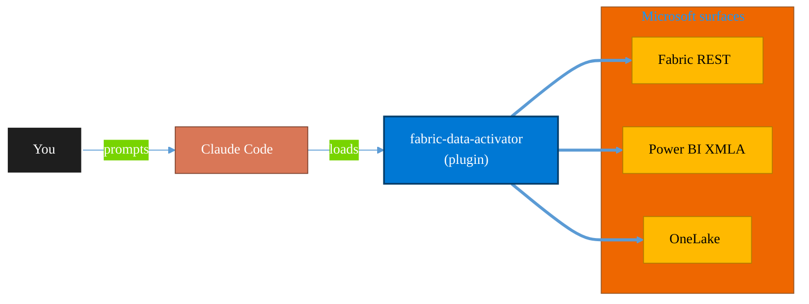

<!-- claude-m:premium-header:start -->
<div align="center">

<a id="top"></a>

# fabric-data-activator

### Microsoft Fabric Data Activator — Reflex triggers, condition-based alerts, real-time actions, and event-driven automation on Fabric data

<sub>Build, mirror, and govern analytics estates on Fabric.</sub>

<br />

<table align="center">
<tr>
<td align="center"><b>Category</b><br /><code>Analytics</code></td>
<td align="center"><b>Surfaces</b><br /><sub>Microsoft Fabric · Power BI · OneLake · DAX · KQL</sub></td>
<td align="center"><b>Version</b><br /><code>1.0.0</code></td>
<td align="center"><b>Marketplace</b><br /><code>claude-m-microsoft-marketplace</code></td>
</tr>
</table>

<sub><code>microsoft</code> &nbsp;·&nbsp; <code>fabric</code> &nbsp;·&nbsp; <code>data-activator</code> &nbsp;·&nbsp; <code>reflex</code> &nbsp;·&nbsp; <code>triggers</code> &nbsp;·&nbsp; <code>alerts</code></sub>

<a href="#install"><b>Install</b></a> &nbsp;·&nbsp;
<a href="#overview"><b>Overview</b></a> &nbsp;·&nbsp;
<a href="#architecture"><b>Architecture</b></a> &nbsp;·&nbsp;
<a href="#related-plugins"><b>Related plugins</b></a> &nbsp;·&nbsp;
<a href="../README.md"><b>Marketplace</b></a>

</div>

---

> [!TIP]
> **One-line install** — `/plugin install fabric-data-activator@claude-m-microsoft-marketplace`


## Overview

> Microsoft Fabric Data Activator — Reflex triggers, condition-based alerts, real-time actions, and event-driven automation on Fabric data

<details>
<summary><b>What ships in this plugin</b> (commands, agents, skills)</summary>

| Component | Items |
|---|---|
| **Commands** | `/action-configure` · `/reflex-create` · `/reflex-from-report` · `/reflex-monitor` · `/reflex-setup` · `/trigger-define` |
| **Agents** | `activator-reviewer` |
| **Skills** | `fabric-data-activator` |

</details>


<details>
<summary><b>Quick example</b></summary>

```text
Use fabric-data-activator to design, build, and govern Fabric / Power BI assets.
```

</details>

<a id="architecture"></a>

## Architecture



<a id="install"></a>

## Install

```bash
/plugin marketplace add markus41/Claude-m
/plugin install fabric-data-activator@claude-m-microsoft-marketplace
```

> [!IMPORTANT]
> This plugin operates against **Microsoft Fabric · Power BI · OneLake · DAX · KQL**. Configure credentials via environment variables — never commit secrets.

[Back to top](#top)

---

<!-- claude-m:premium-header:end -->

Microsoft Fabric Data Activator — create Reflex items with tracked objects, define trigger conditions (threshold, state change, absence, trend), configure actions (email, Teams, Power Automate, webhook), integrate with eventstreams and Power BI visuals, and build event-driven automation on real-time Fabric data.

## What This Plugin Provides

This is a **knowledge plugin** — it gives Claude deep expertise in Fabric Data Activator so it can design Reflex items, define trigger conditions, configure actions, integrate with eventstreams and Power BI, and guide monitoring and debugging. It does not contain runtime code, MCP servers, or executable scripts.

## Setup

Run `/setup` to verify Fabric workspace access and configure Azure identity:

```
/setup              # Full guided setup
/setup --minimal    # Workspace verification only
```

Requires an Azure subscription with access to a Fabric-enabled workspace.

## Commands

| Command | Description |
|---------|-------------|
| `/setup` | Verify Fabric workspace access, configure Azure identity, prepare eventstream connectivity |
| `/reflex-create` | Create a new Reflex item with objects and data source binding |
| `/trigger-define` | Define a trigger condition (threshold, state change, absence detection) |
| `/action-configure` | Configure an action (email, Teams, Power Automate, webhook) on a trigger |
| `/reflex-from-report` | Create a Reflex trigger from a Power BI report visual (no-code) |
| `/reflex-monitor` | Monitor trigger health, view execution history, diagnose issues |

## Agent

| Agent | Description |
|-------|-------------|
| **Activator Reviewer** | Reviews Reflex configurations for object model correctness, trigger condition validity, action setup, data source integration, and security |

## Trigger Keywords

The skill activates automatically when conversations mention: `data activator`, `reflex`, `fabric trigger`, `fabric alert`, `data alert`, `condition trigger`, `real time action`, `fabric notification`, `reflex item`, `activator`, `fabric automation`, `event driven fabric`.

## Author

Markus Ahling
<!-- claude-m:premium-footer:start -->

---

<a id="related-plugins"></a>

## Related plugins

<table>
<tr><th>Plugin</th><th>What it does</th></tr>
<tr><td><a href="../fabric-observability/README.md"><code>fabric-observability</code></a></td><td>Microsoft Fabric Observability — Monitor Hub triage, notebook/pipeline reliability runbooks, SLA tracking, alert design, and incident diagnostics</td></tr>
<tr><td><a href="../fabric-real-time-analytics/README.md"><code>fabric-real-time-analytics</code></a></td><td>Microsoft Fabric Real-Time Analytics — Eventhouse, KQL databases, eventstreams, Real-Time Dashboards, and streaming ingestion</td></tr>
<tr><td><a href="../fabric-ai-agents/README.md"><code>fabric-ai-agents</code></a></td><td>Microsoft Fabric AI and operations agents - anomaly detector, data agent, operations agent, ontology, and digital twin builder workflows with preview guardrails.</td></tr>
<tr><td><a href="../fabric-capacity-ops/README.md"><code>fabric-capacity-ops</code></a></td><td>Microsoft Fabric Capacity Operations — CU monitoring, throttling diagnostics, workload tuning, autoscale planning, and cost-performance optimization</td></tr>
<tr><td><a href="../fabric-data-engineering/README.md"><code>fabric-data-engineering</code></a></td><td>Microsoft Fabric Data Engineering — lakehouses, Spark notebooks, data pipelines, Delta Lake tables, lakehouse SQL endpoints, multi-notebook orchestration, workspace lifecycle management, pipeline monitoring, and advanced optimization</td></tr>
<tr><td><a href="../fabric-data-factory/README.md"><code>fabric-data-factory</code></a></td><td>Microsoft Fabric Data Factory — data pipelines, Dataflow Gen2, Copy activity, orchestration patterns, and scheduling</td></tr>
</table>


<details>
<summary><b>Composable stacks that include <code>fabric-data-activator</code></b></summary>

Combine with sibling plugins to build cross-surface runbooks. Browse the full [marketplace catalog](../README.md#plugin-catalog) for a tailored selection.

</details>

---

<div align="center">

<sub>Part of <a href="../README.md"><b>Claude-m</b></a> — the Microsoft plugin marketplace for Claude Code.</sub>

<sub>Licensed under <a href="../LICENSE">MIT</a>. Built for engineers, MSPs, SOC teams, and analytics leaders.</sub>

</div>

<!-- claude-m:premium-footer:end -->

