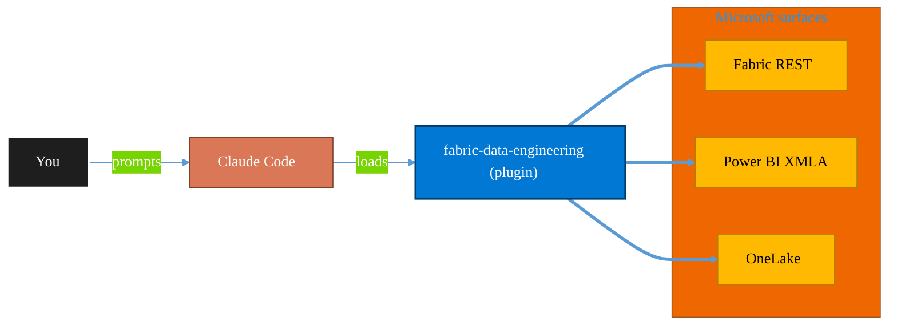

<!-- claude-m:premium-header:start -->
<div align="center">

<a id="top"></a>

# fabric-data-engineering

### Microsoft Fabric Data Engineering — lakehouses, Spark notebooks, data pipelines, Delta Lake tables, lakehouse SQL endpoints, multi-notebook orchestration, workspace lifecycle management, pipeline monitoring, and advanced optimization

<sub>Build, mirror, and govern analytics estates on Fabric.</sub>

<br />

<table align="center">
<tr>
<td align="center"><b>Category</b><br /><code>Analytics</code></td>
<td align="center"><b>Surfaces</b><br /><sub>Microsoft Fabric · Power BI · OneLake · DAX · KQL</sub></td>
<td align="center"><b>Version</b><br /><code>2.0.0</code></td>
<td align="center"><b>Marketplace</b><br /><code>claude-m-microsoft-marketplace</code></td>
</tr>
</table>

<sub><code>microsoft</code> &nbsp;·&nbsp; <code>fabric</code> &nbsp;·&nbsp; <code>lakehouse</code> &nbsp;·&nbsp; <code>spark</code> &nbsp;·&nbsp; <code>delta-lake</code> &nbsp;·&nbsp; <code>notebooks</code></sub>

<a href="#install"><b>Install</b></a> &nbsp;·&nbsp;
<a href="#overview"><b>Overview</b></a> &nbsp;·&nbsp;
<a href="#architecture"><b>Architecture</b></a> &nbsp;·&nbsp;
<a href="#related-plugins"><b>Related plugins</b></a> &nbsp;·&nbsp;
<a href="../README.md"><b>Marketplace</b></a>

</div>

---

> [!TIP]
> **One-line install** — `/plugin install fabric-data-engineering@claude-m-microsoft-marketplace`


## Overview

> Microsoft Fabric Data Engineering — lakehouses, Spark notebooks, data pipelines, Delta Lake tables, lakehouse SQL endpoints, multi-notebook orchestration, workspace lifecycle management, pipeline monitoring, and advanced optimization

<details>
<summary><b>What ships in this plugin</b> (commands, agents, skills)</summary>

| Component | Items |
|---|---|
| **Commands** | `/delta-table-manage` · `/fabric-eng-setup` · `/lakehouse-create` · `/lakehouse-load-data` · `/lakehouse-optimize` · `/notebook-create` · `/notebook-orchestrate` · `/pipeline-create` · `/pipeline-monitor` · `/spark-job-definition-manage` · `/workspace-manage` |
| **Agents** | `data-engineering-reviewer` · `pipeline-debugger` |
| **Skills** | `fabric-data-engineering` |

</details>


<details>
<summary><b>Quick example</b></summary>

```text
Use fabric-data-engineering to design, build, and govern Fabric / Power BI assets.
```

</details>

<a id="architecture"></a>

## Architecture



<a id="install"></a>

## Install

```bash
/plugin marketplace add markus41/Claude-m
/plugin install fabric-data-engineering@claude-m-microsoft-marketplace
```

> [!IMPORTANT]
> This plugin operates against **Microsoft Fabric · Power BI · OneLake · DAX · KQL**. Configure credentials via environment variables — never commit secrets.

[Back to top](#top)

---

<!-- claude-m:premium-header:end -->

Microsoft Fabric Data Engineering — lakehouses, Spark notebooks, Delta Lake operations, and data pipeline engineering.

## Purpose

`fabric-data-engineering` provides deterministic runbooks for Fabric lakehouse and Spark engineering workflows.

## Prerequisites

- Fabric capacity and workspace access with Spark notebook permissions.
- Lakehouse create/manage permissions in target workspace.
- Workspace role: Admin, Member, or Contributor.

## Setup

Run `/setup` to verify Fabric capacity, create workspace dependencies, and configure lakehouse access.

## Commands

| Command | Description |
|---|---|
| `/setup` | Verify Fabric capacity, create workspace, and configure lakehouse access. |
| `/lakehouse-create` | Create a lakehouse with medallion folder structure. |
| `/notebook-create` | Create a Spark notebook with scenario-specific starter code. |
| `/pipeline-create` | Create a data pipeline with activities and scheduling. |
| `/delta-table-manage` | Create, optimize, vacuum, and manage Delta tables. |
| `/lakehouse-load-data` | Load data from files and APIs into lakehouse Delta tables. |
| `/spark-job-definition-manage` | Manage Fabric Spark Job Definition assets and execution policy checks. |

## Agent

| Agent | Description |
|---|---|
| **Data Engineering Reviewer** | Reviews lakehouse design, Spark code quality, Delta management, and security posture. |
<!-- claude-m:premium-footer:start -->

---

<a id="related-plugins"></a>

## Related plugins

<table>
<tr><th>Plugin</th><th>What it does</th></tr>
<tr><td><a href="../fabric-capacity-ops/README.md"><code>fabric-capacity-ops</code></a></td><td>Microsoft Fabric Capacity Operations — CU monitoring, throttling diagnostics, workload tuning, autoscale planning, and cost-performance optimization</td></tr>
<tr><td><a href="../fabric-onelake/README.md"><code>fabric-onelake</code></a></td><td>Microsoft Fabric OneLake — unified data lake, shortcuts, file explorer, ADLS Gen2 APIs, and cross-workspace data access</td></tr>
<tr><td><a href="../powerbi-fabric/README.md"><code>powerbi-fabric</code></a></td><td>DAX measures, Power Query M, Power BI Embedded, deployment pipelines, PBIP scaffolding, Fabric Lakehouse, Direct Lake, performance optimization</td></tr>
<tr><td><a href="../fabric-ai-agents/README.md"><code>fabric-ai-agents</code></a></td><td>Microsoft Fabric AI and operations agents - anomaly detector, data agent, operations agent, ontology, and digital twin builder workflows with preview guardrails.</td></tr>
<tr><td><a href="../fabric-data-activator/README.md"><code>fabric-data-activator</code></a></td><td>Microsoft Fabric Data Activator — Reflex triggers, condition-based alerts, real-time actions, and event-driven automation on Fabric data</td></tr>
<tr><td><a href="../fabric-data-factory/README.md"><code>fabric-data-factory</code></a></td><td>Microsoft Fabric Data Factory — data pipelines, Dataflow Gen2, Copy activity, orchestration patterns, and scheduling</td></tr>
</table>


<details>
<summary><b>Composable stacks that include <code>fabric-data-engineering</code></b></summary>

Combine with sibling plugins to build cross-surface runbooks. Browse the full [marketplace catalog](../README.md#plugin-catalog) for a tailored selection.

</details>

---

<div align="center">

<sub>Part of <a href="../README.md"><b>Claude-m</b></a> — the Microsoft plugin marketplace for Claude Code.</sub>

<sub>Licensed under <a href="../LICENSE">MIT</a>. Built for engineers, MSPs, SOC teams, and analytics leaders.</sub>

</div>

<!-- claude-m:premium-footer:end -->

