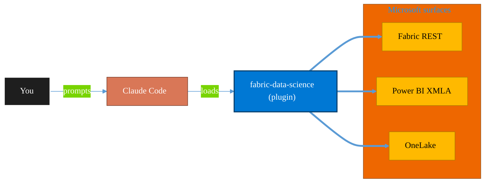

<!-- claude-m:premium-header:start -->
<div align="center">

<a id="top"></a>

# fabric-data-science

### Microsoft Fabric Data Science — ML experiments, model training, MLflow tracking, PREDICT function, and semantic link integration

<sub>Build, mirror, and govern analytics estates on Fabric.</sub>

<br />

<table align="center">
<tr>
<td align="center"><b>Category</b><br /><code>Analytics</code></td>
<td align="center"><b>Surfaces</b><br /><sub>Microsoft Fabric · Power BI · OneLake · DAX · KQL</sub></td>
<td align="center"><b>Version</b><br /><code>1.0.0</code></td>
<td align="center"><b>Marketplace</b><br /><code>claude-m-microsoft-marketplace</code></td>
</tr>
</table>

<sub><code>microsoft</code> &nbsp;·&nbsp; <code>fabric</code> &nbsp;·&nbsp; <code>data-science</code> &nbsp;·&nbsp; <code>mlflow</code> &nbsp;·&nbsp; <code>machine-learning</code> &nbsp;·&nbsp; <code>experiments</code></sub>

<a href="#install"><b>Install</b></a> &nbsp;·&nbsp;
<a href="#overview"><b>Overview</b></a> &nbsp;·&nbsp;
<a href="#architecture"><b>Architecture</b></a> &nbsp;·&nbsp;
<a href="#related-plugins"><b>Related plugins</b></a> &nbsp;·&nbsp;
<a href="../README.md"><b>Marketplace</b></a>

</div>

---

> [!TIP]
> **One-line install** — `/plugin install fabric-data-science@claude-m-microsoft-marketplace`


## Overview

> Microsoft Fabric Data Science — ML experiments, model training, MLflow tracking, PREDICT function, and semantic link integration

<details>
<summary><b>What ships in this plugin</b> (commands, agents, skills)</summary>

| Component | Items |
|---|---|
| **Commands** | `/experiment-create` · `/fabric-ds-setup` · `/model-predict` · `/model-register` · `/model-train` · `/semantic-link-query` |
| **Agents** | `data-science-reviewer` |
| **Skills** | `fabric-data-science` |

</details>


<details>
<summary><b>Quick example</b></summary>

```text
Use fabric-data-science to design, build, and govern Fabric / Power BI assets.
```

</details>

<a id="architecture"></a>

## Architecture



<a id="install"></a>

## Install

```bash
/plugin marketplace add markus41/Claude-m
/plugin install fabric-data-science@claude-m-microsoft-marketplace
```

> [!IMPORTANT]
> This plugin operates against **Microsoft Fabric · Power BI · OneLake · DAX · KQL**. Configure credentials via environment variables — never commit secrets.

[Back to top](#top)

---

<!-- claude-m:premium-header:end -->

Microsoft Fabric Data Science — create and track ML experiments with MLflow, train models with scikit-learn/LightGBM/XGBoost/PyTorch in Spark-based notebooks, leverage SynapseML for distributed ML, register and version models, batch-score with the T-SQL PREDICT function, and bridge Power BI semantic models to ML workflows via semantic link (SemPy).

## What This Plugin Provides

This is a **knowledge plugin** — it gives Claude deep expertise in Microsoft Fabric Data Science so it can scaffold experiment notebooks, generate model training code, configure MLflow tracking, write PREDICT queries, and guide semantic link integration. It does not contain runtime code, MCP servers, or executable scripts.

## Setup

Run `/setup` to configure a Fabric workspace, lakehouse, and verify MLflow tracking:

```
/setup              # Full guided setup
/setup --minimal    # Workspace and lakehouse only
```

Requires a Microsoft Fabric workspace with Data Science experience enabled.

## Commands

| Command | Description |
|---------|-------------|
| `/setup` | Configure Fabric workspace, lakehouse, and verify MLflow tracking |
| `/experiment-create` | Create an MLflow experiment with a scaffold notebook |
| `/model-train` | Generate a training notebook with MLflow tracking and evaluation |
| `/model-register` | Register a trained model to the Fabric model registry |
| `/model-predict` | Generate batch scoring code (T-SQL PREDICT or notebook inference) |
| `/semantic-link-query` | Query Power BI datasets from notebooks via semantic link |

## Agent

| Agent | Description |
|-------|-------------|
| **Data Science Reviewer** | Reviews Fabric ML notebooks for experiment tracking, data handling, model quality, PREDICT readiness, and best practices |

## Trigger Keywords

The skill activates automatically when conversations mention: `fabric data science`, `fabric ml`, `mlflow fabric`, `fabric experiment`, `fabric model`, `predict function`, `semantic link`, `fabric notebook ml`, `synapse ml`, `fabric machine learning`, `model training`, `fabric automl`.

## Author

Markus Ahling
<!-- claude-m:premium-footer:start -->

---

<a id="related-plugins"></a>

## Related plugins

<table>
<tr><th>Plugin</th><th>What it does</th></tr>
<tr><td><a href="../fabric-ai-agents/README.md"><code>fabric-ai-agents</code></a></td><td>Microsoft Fabric AI and operations agents - anomaly detector, data agent, operations agent, ontology, and digital twin builder workflows with preview guardrails.</td></tr>
<tr><td><a href="../fabric-capacity-ops/README.md"><code>fabric-capacity-ops</code></a></td><td>Microsoft Fabric Capacity Operations — CU monitoring, throttling diagnostics, workload tuning, autoscale planning, and cost-performance optimization</td></tr>
<tr><td><a href="../fabric-data-activator/README.md"><code>fabric-data-activator</code></a></td><td>Microsoft Fabric Data Activator — Reflex triggers, condition-based alerts, real-time actions, and event-driven automation on Fabric data</td></tr>
<tr><td><a href="../fabric-data-engineering/README.md"><code>fabric-data-engineering</code></a></td><td>Microsoft Fabric Data Engineering — lakehouses, Spark notebooks, data pipelines, Delta Lake tables, lakehouse SQL endpoints, multi-notebook orchestration, workspace lifecycle management, pipeline monitoring, and advanced optimization</td></tr>
<tr><td><a href="../fabric-data-factory/README.md"><code>fabric-data-factory</code></a></td><td>Microsoft Fabric Data Factory — data pipelines, Dataflow Gen2, Copy activity, orchestration patterns, and scheduling</td></tr>
<tr><td><a href="../fabric-data-prep-jobs/README.md"><code>fabric-data-prep-jobs</code></a></td><td>Microsoft Fabric data preparation jobs - Dataflow Gen1, Apache Airflow jobs, mounted Azure Data Factory pipelines, and dbt job governance for deterministic prep workflows.</td></tr>
</table>


<details>
<summary><b>Composable stacks that include <code>fabric-data-science</code></b></summary>

Combine with sibling plugins to build cross-surface runbooks. Browse the full [marketplace catalog](../README.md#plugin-catalog) for a tailored selection.

</details>

---

<div align="center">

<sub>Part of <a href="../README.md"><b>Claude-m</b></a> — the Microsoft plugin marketplace for Claude Code.</sub>

<sub>Licensed under <a href="../LICENSE">MIT</a>. Built for engineers, MSPs, SOC teams, and analytics leaders.</sub>

</div>

<!-- claude-m:premium-footer:end -->

