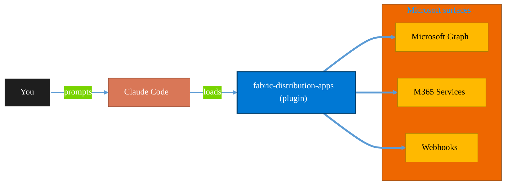

<!-- claude-m:premium-header:start -->
<div align="center">

<a id="top"></a>

# fabric-distribution-apps

### Microsoft Fabric org app distribution - package, permission model, release, and adoption workflows for organizational app rollout.

<sub>Automate everyday Microsoft 365 collaboration workflows.</sub>

<br />

<table align="center">
<tr>
<td align="center"><b>Category</b><br /><code>Productivity</code></td>
<td align="center"><b>Surfaces</b><br /><sub>Microsoft Graph · M365 · Teams · Outlook · SharePoint · Loop</sub></td>
<td align="center"><b>Version</b><br /><code>1.0.0</code></td>
<td align="center"><b>Marketplace</b><br /><code>claude-m-microsoft-marketplace</code></td>
</tr>
</table>

<sub><code>microsoft</code> &nbsp;·&nbsp; <code>fabric</code> &nbsp;·&nbsp; <code>org-app</code> &nbsp;·&nbsp; <code>distribution</code> &nbsp;·&nbsp; <code>release</code> &nbsp;·&nbsp; <code>adoption</code></sub>

<a href="#install"><b>Install</b></a> &nbsp;·&nbsp;
<a href="#overview"><b>Overview</b></a> &nbsp;·&nbsp;
<a href="#architecture"><b>Architecture</b></a> &nbsp;·&nbsp;
<a href="#related-plugins"><b>Related plugins</b></a> &nbsp;·&nbsp;
<a href="../README.md"><b>Marketplace</b></a>

</div>

---

> [!TIP]
> **One-line install** — `/plugin install fabric-distribution-apps@claude-m-microsoft-marketplace`


## Overview

> Microsoft Fabric org app distribution - package, permission model, release, and adoption workflows for organizational app rollout.

<details>
<summary><b>What ships in this plugin</b> (commands, agents, skills)</summary>

| Component | Items |
|---|---|
| **Commands** | `/org-app-adoption-report` · `/org-app-package` · `/org-app-permission-model` · `/org-app-release` · `/org-app-setup` |
| **Agents** | `fabric-distribution-apps-reviewer` |
| **Skills** | `fabric-distribution-apps` |

</details>


<details>
<summary><b>Quick example</b></summary>

```text
Use fabric-distribution-apps to automate Microsoft 365 collaboration workflows.
```

</details>

<a id="architecture"></a>

## Architecture



<a id="install"></a>

## Install

```bash
/plugin marketplace add markus41/Claude-m
/plugin install fabric-distribution-apps@claude-m-microsoft-marketplace
```

> [!IMPORTANT]
> This plugin operates against **Microsoft Graph · M365 · Teams · Outlook · SharePoint · Loop**. Configure credentials via environment variables — never commit secrets.

[Back to top](#top)

---

<!-- claude-m:premium-header:end -->

Microsoft Fabric org app distribution - package, permission model, release, and adoption workflows for organizational app rollout.

## Purpose

This plugin is a knowledge plugin for Fabric organizational app rollout workflows. It provides deterministic command guidance and review patterns, and does not include runtime MCP servers.

## Preview Caveat

Fabric organizational app distribution capabilities are preview. API contracts, portal flows, and role requirements can change; validate current behavior before production rollout.

## Prerequisites

- Microsoft Fabric tenant access with organizational app distribution features enabled.
- Tenant/workspace permissions for app packaging, release, and audience assignment.
- Required permissions baseline: `Fabric Tenant Admin` or delegated publisher governance role.

## Install

```bash
/plugin install fabric-distribution-apps@claude-m-microsoft-marketplace
```

## Integration Context Contract
- Canonical contract: [`docs/integration-context.md`](../docs/integration-context.md)

| Command family | tenantId | subscriptionId | environmentCloud | principalType | scopesOrRoles |
|---|---|---|---|---|---|
| Fabric org app distribution workflows | required | optional | `AzureCloud`* | delegated-user or service-principal | `Fabric Tenant Admin` or app distribution publisher role |

* Use sovereign cloud values from the canonical contract when applicable.

Commands must fail fast before network calls when required context is missing or invalid. All outputs must redact sensitive IDs, audience identifiers, and credential material.

## Commands

| Command | Description |
|---|---|
| `/org-app-setup` | Validate preview readiness, rollout scope, and operational guardrails. |
| `/org-app-package` | Build and validate org app package metadata and release artifacts. |
| `/org-app-permission-model` | Define and validate least-privilege org app permission model. |
| `/org-app-release` | Execute staged org app release workflow with approval gates and rollback checks. |
| `/org-app-adoption-report` | Produce redacted adoption and rollout health reporting for org app distribution. |

## Agent

| Agent | Description |
|---|---|
| `fabric-distribution-apps-reviewer` | Reviews org app docs for preview caveats, permission safety, deterministic steps, and redaction quality. |

## Trigger Keywords

- `fabric org app`
- `fabric app rollout`
- `fabric app package`
- `fabric app permissions`
- `fabric app adoption`
<!-- claude-m:premium-footer:start -->

---

<a id="related-plugins"></a>

## Related plugins

<table>
<tr><th>Plugin</th><th>What it does</th></tr>
<tr><td><a href="../business-central/README.md"><code>business-central</code></a></td><td>Microsoft Dynamics 365 Business Central ERP — finance, supply chain, and inventory management via BC OData v4 / API v2.0 REST API</td></tr>
<tr><td><a href="../copilot-studio-bots/README.md"><code>copilot-studio-bots</code></a></td><td>Copilot Studio — design bot topics, author trigger phrases, configure generative AI orchestration, and publish chatbots</td></tr>
<tr><td><a href="../dynamics-365-crm/README.md"><code>dynamics-365-crm</code></a></td><td>Dynamics 365 Sales and Customer Service via Dataverse Web API — leads, opportunities, accounts, contacts, cases, SLAs, queues, pipeline reporting, and CRM workflow automation</td></tr>
<tr><td><a href="../dynamics-365-field-service/README.md"><code>dynamics-365-field-service</code></a></td><td>Dynamics 365 Field Service via Dataverse Web API — work orders, bookings, resource scheduling, service accounts, assets, and IoT-triggered service events</td></tr>
<tr><td><a href="../dynamics-365-project-ops/README.md"><code>dynamics-365-project-ops</code></a></td><td>Dynamics 365 Project Operations via Dataverse Web API — projects, WBS, time and expense tracking, resource assignments, project contracts, and billing</td></tr>
<tr><td><a href="../excel-automation/README.md"><code>excel-automation</code></a></td><td>Excel data cleaning with pandas, Office Script generation, and Power Automate flow creation</td></tr>
</table>


<details>
<summary><b>Composable stacks that include <code>fabric-distribution-apps</code></b></summary>

Combine with sibling plugins to build cross-surface runbooks. Browse the full [marketplace catalog](../README.md#plugin-catalog) for a tailored selection.

</details>

---

<div align="center">

<sub>Part of <a href="../README.md"><b>Claude-m</b></a> — the Microsoft plugin marketplace for Claude Code.</sub>

<sub>Licensed under <a href="../LICENSE">MIT</a>. Built for engineers, MSPs, SOC teams, and analytics leaders.</sub>

</div>

<!-- claude-m:premium-footer:end -->

