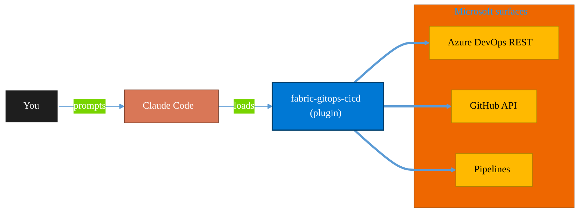

<!-- claude-m:premium-header:start -->
<div align="center">

<a id="top"></a>

# fabric-gitops-cicd

### Microsoft Fabric GitOps CI/CD — workspace Git integration, deployment pipelines, artifact promotion, branch strategy, and release validation

<sub>Ship reliably with first-class CI/CD and ALM.</sub>

<br />

<table align="center">
<tr>
<td align="center"><b>Category</b><br /><code>DevOps</code></td>
<td align="center"><b>Surfaces</b><br /><sub>Azure DevOps · GitHub · Pipelines · ALM · IaC</sub></td>
<td align="center"><b>Version</b><br /><code>1.0.0</code></td>
<td align="center"><b>Marketplace</b><br /><code>claude-m-microsoft-marketplace</code></td>
</tr>
</table>

<sub><code>microsoft</code> &nbsp;·&nbsp; <code>fabric</code> &nbsp;·&nbsp; <code>gitops</code> &nbsp;·&nbsp; <code>cicd</code> &nbsp;·&nbsp; <code>deployment-pipeline</code> &nbsp;·&nbsp; <code>workspace</code></sub>

<a href="#install"><b>Install</b></a> &nbsp;·&nbsp;
<a href="#overview"><b>Overview</b></a> &nbsp;·&nbsp;
<a href="#architecture"><b>Architecture</b></a> &nbsp;·&nbsp;
<a href="#related-plugins"><b>Related plugins</b></a> &nbsp;·&nbsp;
<a href="../README.md"><b>Marketplace</b></a>

</div>

---

> [!TIP]
> **One-line install** — `/plugin install fabric-gitops-cicd@claude-m-microsoft-marketplace`


## Overview

> Microsoft Fabric GitOps CI/CD — workspace Git integration, deployment pipelines, artifact promotion, branch strategy, and release validation

<details>
<summary><b>What ships in this plugin</b> (commands, agents, skills)</summary>

| Component | Items |
|---|---|
| **Commands** | `/deployment-pipeline-release` · `/gitops-setup` · `/promotion-checklist` · `/workspace-git-connect` |
| **Agents** | `gitops-reviewer` |
| **Skills** | `fabric-gitops-cicd` |

</details>


<details>
<summary><b>Quick example</b></summary>

```text
Use fabric-gitops-cicd to ship work through pipelines with full ALM.
```

</details>

<a id="architecture"></a>

## Architecture



<a id="install"></a>

## Install

```bash
/plugin marketplace add markus41/Claude-m
/plugin install fabric-gitops-cicd@claude-m-microsoft-marketplace
```

> [!IMPORTANT]
> This plugin operates against **Azure DevOps · GitHub · Pipelines · ALM · IaC**. Configure credentials via environment variables — never commit secrets.

[Back to top](#top)

---

<!-- claude-m:premium-header:end -->

`fabric-gitops-cicd` is an advanced Microsoft Fabric knowledge plugin for version-controlled Fabric delivery with controlled promotions across development rings.

## What This Plugin Provides

This is a **knowledge plugin**. It provides implementation guidance, deterministic command workflows, and reviewer checks. It does not include runtime binaries or MCP servers.

Install with:

```bash
/plugin install fabric-gitops-cicd@claude-m-microsoft-marketplace
```

## Prerequisites

- Fabric workspaces for dev/test/prod with deployment pipeline access.
- Git repository with protected branches and pull request workflow.
- Service principal or user identity authorized for promotion automation.
- Artifact ownership model across notebooks, pipelines, models, and reports.

## Setup

Run `/gitops-setup` first to baseline environment, permissions, and rollout constraints.

## Commands

| Command | Description |
|---|---|
| `/gitops-setup` | Set up Fabric GitOps foundations: repository model, branch controls, promotion policy, and environment ownership. |
| `/workspace-git-connect` | Connect Fabric workspaces to Git with deterministic branch mapping and conflict-safe synchronization. |
| `/deployment-pipeline-release` | Execute Fabric deployment pipeline promotions with preflight checks, evidence capture, and post-release validation. |
| `/promotion-checklist` | Generate a production promotion checklist covering data readiness, dependency safety, and rollback controls. |

## Agent

| Agent | Description |
|---|---|
| **GitOps Reviewer** | Reviews Fabric GitOps delivery for branch controls, promotion safety, deployment evidence, and rollback readiness. |

## Trigger Keywords

The skill activates when conversations mention: `fabric git integration`, `fabric deployment pipeline`, `fabric cicd`, `artifact promotion fabric`, `workspace branch strategy`, `release validation fabric`, `fabric rollback`, `fabric dev test prod`.

## Author

Markus Ahling
<!-- claude-m:premium-footer:start -->

---

<a id="related-plugins"></a>

## Related plugins

<table>
<tr><th>Plugin</th><th>What it does</th></tr>
<tr><td><a href="../fabric-developer-runtime/README.md"><code>fabric-developer-runtime</code></a></td><td>Microsoft Fabric developer runtime operations - GraphQL API, environments, user data functions, and variable library governance.</td></tr>
<tr><td><a href="../powerplatform-alm/README.md"><code>powerplatform-alm</code></a></td><td>Power Platform ALM — environments, solution transport, CI/CD pipelines, PCF controls, and deployment automation</td></tr>
<tr><td><a href="../azure-devops/README.md"><code>azure-devops</code></a></td><td>Comprehensive Azure DevOps expertise — Git repos with passwordless auth (GCM, WIF, SSH), YAML and Classic pipelines, deployment environments, agent pools, work items, boards, sprints, test plans, security namespaces, dashboards, wikis, service hooks, Analytics OData, CLI, and extensions</td></tr>
<tr><td><a href="../azure-devops-orchestrator/README.md"><code>azure-devops-orchestrator</code></a></td><td>Intelligent orchestration for Azure DevOps — ship work items with Claude Code, triage backlogs, plan sprints, coordinate releases, monitor pipelines, and balance workloads across projects. Integrates with microsoft-teams-mcp and microsoft-outlook-mcp when installed.</td></tr>
<tr><td><a href="../azure-dotnet-webapp/README.md"><code>azure-dotnet-webapp</code></a></td><td>Scaffold and build ASP.NET Core Web API and Blazor apps on Azure — Minimal API, controllers, Microsoft.Identity.Web, EF Core, SignalR, OpenAPI, App Service deployment, and Graph API integration patterns.</td></tr>
<tr><td><a href="../azure-graph-dotnet/README.md"><code>azure-graph-dotnet</code></a></td><td>Scaffold and build Microsoft Graph C# / .NET solutions on Azure — Functions, Container Jobs, Azure Identity, Polly resilience, and SharePoint file intelligence implementations.</td></tr>
</table>


<details>
<summary><b>Composable stacks that include <code>fabric-gitops-cicd</code></b></summary>

Combine with sibling plugins to build cross-surface runbooks. Browse the full [marketplace catalog](../README.md#plugin-catalog) for a tailored selection.

</details>

---

<div align="center">

<sub>Part of <a href="../README.md"><b>Claude-m</b></a> — the Microsoft plugin marketplace for Claude Code.</sub>

<sub>Licensed under <a href="../LICENSE">MIT</a>. Built for engineers, MSPs, SOC teams, and analytics leaders.</sub>

</div>

<!-- claude-m:premium-footer:end -->

