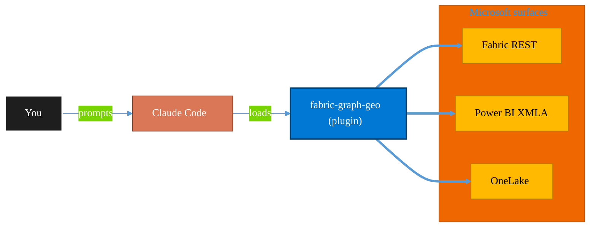

<!-- claude-m:premium-header:start -->
<div align="center">

<a id="top"></a>

# fabric-graph-geo

### Microsoft Fabric graph and geospatial analytics - graph model, graph queryset, map, and exploration workflows with preview guardrails.

<sub>Build, mirror, and govern analytics estates on Fabric.</sub>

<br />

<table align="center">
<tr>
<td align="center"><b>Category</b><br /><code>Analytics</code></td>
<td align="center"><b>Surfaces</b><br /><sub>Microsoft Fabric · Power BI · OneLake · DAX · KQL</sub></td>
<td align="center"><b>Version</b><br /><code>1.0.0</code></td>
<td align="center"><b>Marketplace</b><br /><code>claude-m-microsoft-marketplace</code></td>
</tr>
</table>

<sub><code>microsoft</code> &nbsp;·&nbsp; <code>fabric</code> &nbsp;·&nbsp; <code>graph</code> &nbsp;·&nbsp; <code>queryset</code> &nbsp;·&nbsp; <code>map</code> &nbsp;·&nbsp; <code>exploration</code></sub>

<a href="#install"><b>Install</b></a> &nbsp;·&nbsp;
<a href="#overview"><b>Overview</b></a> &nbsp;·&nbsp;
<a href="#architecture"><b>Architecture</b></a> &nbsp;·&nbsp;
<a href="#related-plugins"><b>Related plugins</b></a> &nbsp;·&nbsp;
<a href="../README.md"><b>Marketplace</b></a>

</div>

---

> [!TIP]
> **One-line install** — `/plugin install fabric-graph-geo@claude-m-microsoft-marketplace`


## Overview

> Microsoft Fabric graph and geospatial analytics - graph model, graph queryset, map, and exploration workflows with preview guardrails.

<details>
<summary><b>What ships in this plugin</b> (commands, agents, skills)</summary>

| Component | Items |
|---|---|
| **Commands** | `/exploration-manage` · `/graph-geo-setup` · `/graph-model-manage` · `/graph-queryset-manage` · `/map-manage` |
| **Agents** | `fabric-graph-geo-reviewer` |
| **Skills** | `fabric-graph-geo` |

</details>


<details>
<summary><b>Quick example</b></summary>

```text
Use fabric-graph-geo to design, build, and govern Fabric / Power BI assets.
```

</details>

<a id="architecture"></a>

## Architecture



<a id="install"></a>

## Install

```bash
/plugin marketplace add markus41/Claude-m
/plugin install fabric-graph-geo@claude-m-microsoft-marketplace
```

> [!IMPORTANT]
> This plugin operates against **Microsoft Fabric · Power BI · OneLake · DAX · KQL**. Configure credentials via environment variables — never commit secrets.

[Back to top](#top)

---

<!-- claude-m:premium-header:end -->

Microsoft Fabric graph and geospatial analytics - graph model, graph queryset, map, and exploration workflows with preview guardrails.

Category: `analytics`

## Purpose

This is a knowledge plugin for planning and reviewing Fabric graph and geospatial workflows. It provides deterministic command guidance and reviewer checks, and does not include runtime MCP servers.

## Preview Caveat

Graph and geospatial capabilities in Fabric are preview-heavy. API shapes, query semantics, limits, and visualization behavior may change; validate assumptions in the target tenant before production rollout.

## Prerequisites

- Fabric-enabled tenant and workspace access.
- Workspace role that can read and manage graph/geospatial artifacts.
- Integration context with required identity fields and permissions.
- Any linked Azure data source permissions for hybrid scenarios.

## Integration Context Contract

- Canonical contract: [`docs/integration-context.md`](../docs/integration-context.md)

| Command family | tenantId | subscriptionId | environmentCloud | principalType | scopesOrRoles |
|---|---|---|---|---|---|
| Graph and geospatial analytics workflows | required | optional (required for Azure-linked data paths) | `AzureCloud`* | `delegated-user` or `service-principal` | Fabric workspace read/write permissions and query execution grants |

* Use sovereign cloud values from the canonical contract where applicable.

Commands must fail fast before network calls when required context is missing or malformed. Output must redact tenant, subscription, workspace, item, and principal identifiers and must never expose secrets or tokens.

## Commands

| Command | Description |
|---|---|
| `/graph-geo-setup` | Validate workspace, context, and preview readiness for graph and geospatial workflows. |
| `/graph-model-manage` | Manage graph model assets, labels, relationships, and integrity checks. |
| `/graph-queryset-manage` | Manage graph querysets and deterministic validation for query behavior. |
| `/map-manage` | Manage geospatial map definitions, layers, and rendering guardrails. |
| `/exploration-manage` | Manage exploration workflows for graph and map-driven analysis. |

## Agent

| Agent | Description |
|---|---|
| `fabric-graph-geo-reviewer` | Reviews docs for preview caveats, deterministic command quality, permissions, fail-fast handling, and redaction coverage. |

## Trigger Keywords

- `fabric graph`
- `graph model`
- `graph queryset`
- `fabric map`
- `geospatial analytics`
- `graph exploration`
- `preview guardrails`
<!-- claude-m:premium-footer:start -->

---

<a id="related-plugins"></a>

## Related plugins

<table>
<tr><th>Plugin</th><th>What it does</th></tr>
<tr><td><a href="../fabric-ai-agents/README.md"><code>fabric-ai-agents</code></a></td><td>Microsoft Fabric AI and operations agents - anomaly detector, data agent, operations agent, ontology, and digital twin builder workflows with preview guardrails.</td></tr>
<tr><td><a href="../fabric-capacity-ops/README.md"><code>fabric-capacity-ops</code></a></td><td>Microsoft Fabric Capacity Operations — CU monitoring, throttling diagnostics, workload tuning, autoscale planning, and cost-performance optimization</td></tr>
<tr><td><a href="../fabric-mirroring/README.md"><code>fabric-mirroring</code></a></td><td>Microsoft Fabric Mirroring — source onboarding, CDC replication, latency monitoring, schema drift handling, and reconciliation workflows</td></tr>
<tr><td><a href="../fabric-semantic-models/README.md"><code>fabric-semantic-models</code></a></td><td>Microsoft Fabric Semantic Models — Direct Lake modeling, DAX governance, calculation groups, XMLA deployment, and semantic link automation</td></tr>
<tr><td><a href="../powerbi-fabric/README.md"><code>powerbi-fabric</code></a></td><td>DAX measures, Power Query M, Power BI Embedded, deployment pipelines, PBIP scaffolding, Fabric Lakehouse, Direct Lake, performance optimization</td></tr>
<tr><td><a href="../fabric-data-activator/README.md"><code>fabric-data-activator</code></a></td><td>Microsoft Fabric Data Activator — Reflex triggers, condition-based alerts, real-time actions, and event-driven automation on Fabric data</td></tr>
</table>


<details>
<summary><b>Composable stacks that include <code>fabric-graph-geo</code></b></summary>

Combine with sibling plugins to build cross-surface runbooks. Browse the full [marketplace catalog](../README.md#plugin-catalog) for a tailored selection.

</details>

---

<div align="center">

<sub>Part of <a href="../README.md"><b>Claude-m</b></a> — the Microsoft plugin marketplace for Claude Code.</sub>

<sub>Licensed under <a href="../LICENSE">MIT</a>. Built for engineers, MSPs, SOC teams, and analytics leaders.</sub>

</div>

<!-- claude-m:premium-footer:end -->

