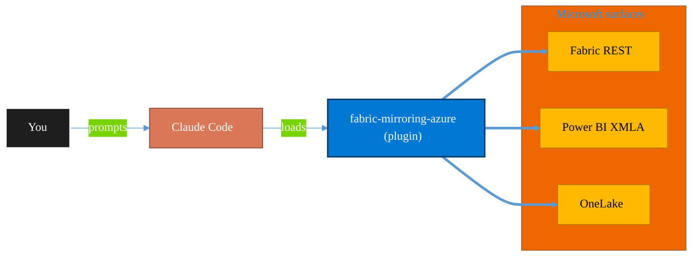

<!-- claude-m:premium-header:start -->
<div align="center">

<a id="top"></a>

# fabric-mirroring-azure

### Microsoft Fabric mirroring for Azure-native sources - Cosmos DB, PostgreSQL, Databricks catalog, Azure SQL Database, and SQL Managed Instance.

<sub>Build, mirror, and govern analytics estates on Fabric.</sub>

<br />

<table align="center">
<tr>
<td align="center"><b>Category</b><br /><code>Analytics</code></td>
<td align="center"><b>Surfaces</b><br /><sub>Microsoft Fabric · Power BI · OneLake · DAX · KQL</sub></td>
<td align="center"><b>Version</b><br /><code>1.0.0</code></td>
<td align="center"><b>Marketplace</b><br /><code>claude-m-microsoft-marketplace</code></td>
</tr>
</table>

<sub><code>microsoft</code> &nbsp;·&nbsp; <code>fabric</code> &nbsp;·&nbsp; <code>mirroring</code> &nbsp;·&nbsp; <code>azure</code> &nbsp;·&nbsp; <code>cosmos</code> &nbsp;·&nbsp; <code>postgresql</code></sub>

<a href="#install"><b>Install</b></a> &nbsp;·&nbsp;
<a href="#overview"><b>Overview</b></a> &nbsp;·&nbsp;
<a href="#architecture"><b>Architecture</b></a> &nbsp;·&nbsp;
<a href="#related-plugins"><b>Related plugins</b></a> &nbsp;·&nbsp;
<a href="../README.md"><b>Marketplace</b></a>

</div>

---

> [!TIP]
> **One-line install** — `/plugin install fabric-mirroring-azure@claude-m-microsoft-marketplace`


## Overview

> Microsoft Fabric mirroring for Azure-native sources - Cosmos DB, PostgreSQL, Databricks catalog, Azure SQL Database, and SQL Managed Instance.

<details>
<summary><b>What ships in this plugin</b> (commands, agents, skills)</summary>

| Component | Items |
|---|---|
| **Commands** | `/mirror-azure-cosmosdb` · `/mirror-azure-databricks-catalog` · `/mirror-azure-postgresql` · `/mirror-azure-setup` · `/mirror-azure-sql-database` · `/mirror-azure-sql-managed-instance` |
| **Agents** | `fabric-mirroring-azure-reviewer` |
| **Skills** | `fabric-mirroring-azure` |

</details>


<details>
<summary><b>Quick example</b></summary>

```text
Use fabric-mirroring-azure to design, build, and govern Fabric / Power BI assets.
```

</details>

<a id="architecture"></a>

## Architecture



<a id="install"></a>

## Install

```bash
/plugin marketplace add markus41/Claude-m
/plugin install fabric-mirroring-azure@claude-m-microsoft-marketplace
```

> [!IMPORTANT]
> This plugin operates against **Microsoft Fabric · Power BI · OneLake · DAX · KQL**. Configure credentials via environment variables — never commit secrets.

[Back to top](#top)

---

<!-- claude-m:premium-header:end -->

Microsoft Fabric mirroring for Azure-native sources - Cosmos DB, PostgreSQL, Databricks catalog, Azure SQL Database, and SQL Managed Instance.

## Purpose

This is a knowledge plugin for deterministic Azure-source mirroring workflows in Fabric. It provides setup and source-specific runbooks plus reviewer checks; it does not ship runtime MCP binaries.

## Install

```bash
/plugin install fabric-mirroring-azure@claude-m-microsoft-marketplace
```

## Prerequisites

- Fabric workspace access with at least `Contributor` on the target workspace.
- Tenant-level identity available as `delegated-user`, `service-principal`, or `managed-identity`.
- Source-specific access for Cosmos DB, Azure Database for PostgreSQL, Databricks, Azure SQL Database, and SQL Managed Instance.
- Documented rollback path if initial snapshot or CDC enablement fails.

## Integration Context Contract
- Canonical contract: [`docs/integration-context.md`](../docs/integration-context.md)

| Command family | tenantId | subscriptionId | environmentCloud | principalType | scopesOrRoles |
|---|---|---|---|---|---|
| Azure mirroring setup | required | required | `AzureCloud`* | delegated-user, service-principal, or managed-identity | `Fabric Workspace Contributor`, `Reader` |
| Cosmos DB / PostgreSQL onboarding | required | required | `AzureCloud`* | delegated-user or service-principal | `Cosmos DB Account Reader Role`, PostgreSQL replication grants |
| Databricks catalog onboarding | required | required | `AzureCloud`* | delegated-user or service-principal | Databricks metastore read grants, workspace access |
| Azure SQL Database / SQL MI onboarding | required | required | `AzureCloud`* | delegated-user, service-principal, or managed-identity | SQL login or Entra principal with CDC-related permissions |

* Use sovereign cloud values from the canonical contract when applicable.

Commands fail fast before network calls when required context or grants are missing. Command and review output must redact sensitive identifiers and secrets.

## Commands

| Command | Description |
|---|---|
| `/mirror-azure-setup` | Baseline workspace, identity, and source readiness for Azure-native mirroring. |
| `/mirror-azure-cosmosdb` | Onboard Azure Cosmos DB mirroring with change feed readiness checks. |
| `/mirror-azure-postgresql` | Onboard Azure Database for PostgreSQL mirroring with logical replication validation. |
| `/mirror-azure-databricks-catalog` | Mirror Databricks Unity Catalog objects into Fabric with scope controls. |
| `/mirror-azure-sql-database` | Onboard Azure SQL Database mirroring with CDC and connectivity guardrails. |
| `/mirror-azure-sql-managed-instance` | Onboard SQL Managed Instance mirroring with CDC and network validation. |

## Agent

| Agent | Description |
|---|---|
| `fabric-mirroring-azure-reviewer` | Reviews docs for source safety gates, permissions, fail-fast handling, and redaction compliance. |

## Trigger Keywords

- `fabric mirroring azure`
- `mirror cosmos db`
- `mirror azure postgresql`
- `mirror databricks catalog`
- `mirror azure sql database`
- `mirror sql managed instance`
<!-- claude-m:premium-footer:start -->

---

<a id="related-plugins"></a>

## Related plugins

<table>
<tr><th>Plugin</th><th>What it does</th></tr>
<tr><td><a href="../fabric-mirroring/README.md"><code>fabric-mirroring</code></a></td><td>Microsoft Fabric Mirroring — source onboarding, CDC replication, latency monitoring, schema drift handling, and reconciliation workflows</td></tr>
<tr><td><a href="../fabric-mirroring-external/README.md"><code>fabric-mirroring-external</code></a></td><td>Microsoft Fabric mirroring for external sources - generic databases, BigQuery, Oracle, SAP, Snowflake, and SQL Server with preview caveats where applicable.</td></tr>
<tr><td><a href="../fabric-ai-agents/README.md"><code>fabric-ai-agents</code></a></td><td>Microsoft Fabric AI and operations agents - anomaly detector, data agent, operations agent, ontology, and digital twin builder workflows with preview guardrails.</td></tr>
<tr><td><a href="../fabric-capacity-ops/README.md"><code>fabric-capacity-ops</code></a></td><td>Microsoft Fabric Capacity Operations — CU monitoring, throttling diagnostics, workload tuning, autoscale planning, and cost-performance optimization</td></tr>
<tr><td><a href="../fabric-data-activator/README.md"><code>fabric-data-activator</code></a></td><td>Microsoft Fabric Data Activator — Reflex triggers, condition-based alerts, real-time actions, and event-driven automation on Fabric data</td></tr>
<tr><td><a href="../fabric-data-engineering/README.md"><code>fabric-data-engineering</code></a></td><td>Microsoft Fabric Data Engineering — lakehouses, Spark notebooks, data pipelines, Delta Lake tables, lakehouse SQL endpoints, multi-notebook orchestration, workspace lifecycle management, pipeline monitoring, and advanced optimization</td></tr>
</table>


<details>
<summary><b>Composable stacks that include <code>fabric-mirroring-azure</code></b></summary>

Combine with sibling plugins to build cross-surface runbooks. Browse the full [marketplace catalog](../README.md#plugin-catalog) for a tailored selection.

</details>

---

<div align="center">

<sub>Part of <a href="../README.md"><b>Claude-m</b></a> — the Microsoft plugin marketplace for Claude Code.</sub>

<sub>Licensed under <a href="../LICENSE">MIT</a>. Built for engineers, MSPs, SOC teams, and analytics leaders.</sub>

</div>

<!-- claude-m:premium-footer:end -->

