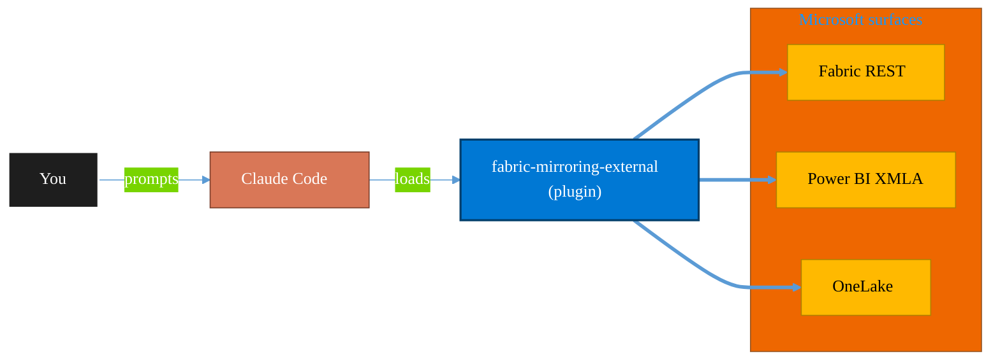

<!-- claude-m:premium-header:start -->
<div align="center">

<a id="top"></a>

# fabric-mirroring-external

### Microsoft Fabric mirroring for external sources - generic databases, BigQuery, Oracle, SAP, Snowflake, and SQL Server with preview caveats where applicable.

<sub>Build, mirror, and govern analytics estates on Fabric.</sub>

<br />

<table align="center">
<tr>
<td align="center"><b>Category</b><br /><code>Analytics</code></td>
<td align="center"><b>Surfaces</b><br /><sub>Microsoft Fabric · Power BI · OneLake · DAX · KQL</sub></td>
<td align="center"><b>Version</b><br /><code>1.0.0</code></td>
<td align="center"><b>Marketplace</b><br /><code>claude-m-microsoft-marketplace</code></td>
</tr>
</table>

<sub><code>microsoft</code> &nbsp;·&nbsp; <code>fabric</code> &nbsp;·&nbsp; <code>mirroring</code> &nbsp;·&nbsp; <code>external</code> &nbsp;·&nbsp; <code>bigquery</code> &nbsp;·&nbsp; <code>oracle</code></sub>

<a href="#install"><b>Install</b></a> &nbsp;·&nbsp;
<a href="#overview"><b>Overview</b></a> &nbsp;·&nbsp;
<a href="#architecture"><b>Architecture</b></a> &nbsp;·&nbsp;
<a href="#related-plugins"><b>Related plugins</b></a> &nbsp;·&nbsp;
<a href="../README.md"><b>Marketplace</b></a>

</div>

---

> [!TIP]
> **One-line install** — `/plugin install fabric-mirroring-external@claude-m-microsoft-marketplace`


## Overview

> Microsoft Fabric mirroring for external sources - generic databases, BigQuery, Oracle, SAP, Snowflake, and SQL Server with preview caveats where applicable.

<details>
<summary><b>What ships in this plugin</b> (commands, agents, skills)</summary>

| Component | Items |
|---|---|
| **Commands** | `/mirror-external-bigquery` · `/mirror-external-generic-database` · `/mirror-external-oracle` · `/mirror-external-sap` · `/mirror-external-setup` · `/mirror-external-snowflake` · `/mirror-external-sql-server` |
| **Agents** | `fabric-mirroring-external-reviewer` |
| **Skills** | `fabric-mirroring-external` |

</details>


<details>
<summary><b>Quick example</b></summary>

```text
Use fabric-mirroring-external to design, build, and govern Fabric / Power BI assets.
```

</details>

<a id="architecture"></a>

## Architecture



<a id="install"></a>

## Install

```bash
/plugin marketplace add markus41/Claude-m
/plugin install fabric-mirroring-external@claude-m-microsoft-marketplace
```

> [!IMPORTANT]
> This plugin operates against **Microsoft Fabric · Power BI · OneLake · DAX · KQL**. Configure credentials via environment variables — never commit secrets.

[Back to top](#top)

---

<!-- claude-m:premium-header:end -->

Microsoft Fabric mirroring for external sources - generic databases, BigQuery, Oracle, SAP, Snowflake, and SQL Server with preview caveats where applicable.

## Purpose

This is a knowledge plugin for deterministic Fabric mirroring workflows across non-Azure-native and hybrid sources. It provides setup guidance, source runbooks, and reviewer checks without shipping runtime MCP binaries.

## Install

```bash
/plugin install fabric-mirroring-external@claude-m-microsoft-marketplace
```

## Prerequisites

- Fabric workspace access with at least `Contributor` on the target workspace.
- Identity path for Fabric plus source-side credentials/secrets management.
- Approved source scope and ownership for mirrored schemas/tables.
- Defined fallback path for preview connectors and connector incidents.

## Preview Caveat (BigQuery and Oracle)

`BigQuery` and `Oracle` mirroring paths are treated as preview in this plugin. Availability, limits, and behavior can vary by tenant, region, and release ring. Validate current support before production rollout and keep a fallback ingestion pattern.

## Integration Context Contract
- Canonical contract: [`docs/integration-context.md`](../docs/integration-context.md)

| Command family | tenantId | subscriptionId | environmentCloud | principalType | scopesOrRoles |
|---|---|---|---|---|---|
| External mirroring setup | required | optional | `AzureCloud`* | delegated-user or service-principal | `Fabric Workspace Contributor` |
| Generic DB / SQL Server / Snowflake | required | optional | `AzureCloud`* | delegated-user or service-principal | Fabric workspace grants + source read/replication permissions |
| BigQuery / Oracle (preview caveat) | required | optional | `AzureCloud`* | delegated-user or service-principal | Fabric workspace grants + source-specific preview connector permissions |
| SAP mirroring | required | optional | `AzureCloud`* | delegated-user or service-principal | Fabric workspace grants + SAP source reader permissions |

* Use sovereign cloud values from the canonical contract when applicable.

Commands fail fast before network calls when required context, prerequisites, or grants are missing. Outputs and logs must redact IDs, secrets, and connection material.

## Commands

| Command | Description |
|---|---|
| `/mirror-external-setup` | Baseline workspace, credentials path, and connector readiness for external sources. |
| `/mirror-external-generic-database` | Onboard a generic external database with controlled object scope. |
| `/mirror-external-bigquery` | Onboard BigQuery mirroring with explicit preview caveat checks. |
| `/mirror-external-oracle` | Onboard Oracle mirroring with explicit preview caveat checks. |
| `/mirror-external-sap` | Onboard SAP source mirroring with object and extraction scope validation. |
| `/mirror-external-snowflake` | Onboard Snowflake mirroring with role and stream/read checks. |
| `/mirror-external-sql-server` | Onboard SQL Server mirroring with CDC and connectivity validation. |

## Agent

| Agent | Description |
|---|---|
| `fabric-mirroring-external-reviewer` | Reviews docs for connector caveats, permissions, deterministic steps, and safety controls. |

## Trigger Keywords

- `fabric mirroring external`
- `mirror generic database`
- `mirror bigquery`
- `mirror oracle`
- `mirror sap`
- `mirror snowflake`
- `mirror sql server`
<!-- claude-m:premium-footer:start -->

---

<a id="related-plugins"></a>

## Related plugins

<table>
<tr><th>Plugin</th><th>What it does</th></tr>
<tr><td><a href="../fabric-mirroring/README.md"><code>fabric-mirroring</code></a></td><td>Microsoft Fabric Mirroring — source onboarding, CDC replication, latency monitoring, schema drift handling, and reconciliation workflows</td></tr>
<tr><td><a href="../fabric-mirroring-azure/README.md"><code>fabric-mirroring-azure</code></a></td><td>Microsoft Fabric mirroring for Azure-native sources - Cosmos DB, PostgreSQL, Databricks catalog, Azure SQL Database, and SQL Managed Instance.</td></tr>
<tr><td><a href="../fabric-ai-agents/README.md"><code>fabric-ai-agents</code></a></td><td>Microsoft Fabric AI and operations agents - anomaly detector, data agent, operations agent, ontology, and digital twin builder workflows with preview guardrails.</td></tr>
<tr><td><a href="../fabric-capacity-ops/README.md"><code>fabric-capacity-ops</code></a></td><td>Microsoft Fabric Capacity Operations — CU monitoring, throttling diagnostics, workload tuning, autoscale planning, and cost-performance optimization</td></tr>
<tr><td><a href="../fabric-data-activator/README.md"><code>fabric-data-activator</code></a></td><td>Microsoft Fabric Data Activator — Reflex triggers, condition-based alerts, real-time actions, and event-driven automation on Fabric data</td></tr>
<tr><td><a href="../fabric-data-engineering/README.md"><code>fabric-data-engineering</code></a></td><td>Microsoft Fabric Data Engineering — lakehouses, Spark notebooks, data pipelines, Delta Lake tables, lakehouse SQL endpoints, multi-notebook orchestration, workspace lifecycle management, pipeline monitoring, and advanced optimization</td></tr>
</table>


<details>
<summary><b>Composable stacks that include <code>fabric-mirroring-external</code></b></summary>

Combine with sibling plugins to build cross-surface runbooks. Browse the full [marketplace catalog](../README.md#plugin-catalog) for a tailored selection.

</details>

---

<div align="center">

<sub>Part of <a href="../README.md"><b>Claude-m</b></a> — the Microsoft plugin marketplace for Claude Code.</sub>

<sub>Licensed under <a href="../LICENSE">MIT</a>. Built for engineers, MSPs, SOC teams, and analytics leaders.</sub>

</div>

<!-- claude-m:premium-footer:end -->

