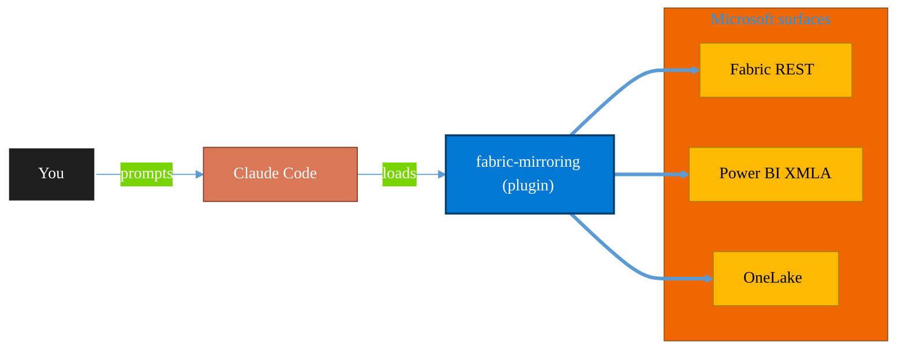

<!-- claude-m:premium-header:start -->
<div align="center">

<a id="top"></a>

# fabric-mirroring

### Microsoft Fabric Mirroring — source onboarding, CDC replication, latency monitoring, schema drift handling, and reconciliation workflows

<sub>Build, mirror, and govern analytics estates on Fabric.</sub>

<br />

<table align="center">
<tr>
<td align="center"><b>Category</b><br /><code>Analytics</code></td>
<td align="center"><b>Surfaces</b><br /><sub>Microsoft Fabric · Power BI · OneLake · DAX · KQL</sub></td>
<td align="center"><b>Version</b><br /><code>1.0.0</code></td>
<td align="center"><b>Marketplace</b><br /><code>claude-m-microsoft-marketplace</code></td>
</tr>
</table>

<sub><code>microsoft</code> &nbsp;·&nbsp; <code>fabric</code> &nbsp;·&nbsp; <code>mirroring</code> &nbsp;·&nbsp; <code>cdc</code> &nbsp;·&nbsp; <code>replication</code> &nbsp;·&nbsp; <code>latency</code></sub>

<a href="#install"><b>Install</b></a> &nbsp;·&nbsp;
<a href="#overview"><b>Overview</b></a> &nbsp;·&nbsp;
<a href="#architecture"><b>Architecture</b></a> &nbsp;·&nbsp;
<a href="#related-plugins"><b>Related plugins</b></a> &nbsp;·&nbsp;
<a href="../README.md"><b>Marketplace</b></a>

</div>

---

> [!TIP]
> **One-line install** — `/plugin install fabric-mirroring@claude-m-microsoft-marketplace`


## Overview

> Microsoft Fabric Mirroring — source onboarding, CDC replication, latency monitoring, schema drift handling, and reconciliation workflows

<details>
<summary><b>What ships in this plugin</b> (commands, agents, skills)</summary>

| Component | Items |
|---|---|
| **Commands** | `/cdc-reconciliation` · `/latency-health-check` · `/mirroring-setup` · `/source-onboarding` |
| **Agents** | `mirroring-reviewer` |
| **Skills** | `fabric-mirroring` |

</details>


<details>
<summary><b>Quick example</b></summary>

```text
Use fabric-mirroring to design, build, and govern Fabric / Power BI assets.
```

</details>

<a id="architecture"></a>

## Architecture



<a id="install"></a>

## Install

```bash
/plugin marketplace add markus41/Claude-m
/plugin install fabric-mirroring@claude-m-microsoft-marketplace
```

> [!IMPORTANT]
> This plugin operates against **Microsoft Fabric · Power BI · OneLake · DAX · KQL**. Configure credentials via environment variables — never commit secrets.

[Back to top](#top)

---

<!-- claude-m:premium-header:end -->

Microsoft Fabric Mirroring — source onboarding, CDC replication, latency monitoring, schema drift handling, and reconciliation workflows.

## Purpose

`fabric-mirroring` remains the broad runbook layer for mirrored data operations and incident triage.

## Prerequisites

- Supported source systems configured for Fabric Mirroring.
- Network and identity access from Fabric to source databases.
- Ownership for source schema changes and downstream consumers.
- Defined freshness targets and reconciliation tolerances.

## Setup

Run `/mirroring-setup` first to baseline environment, permissions, and rollout constraints.

## Commands

| Command | Description |
|---|---|
| `/mirroring-setup` | Prepare Fabric Mirroring by validating source readiness, connectivity, identity, and target workspace controls. |
| `/source-onboarding` | Onboard a new source to Fabric Mirroring with controlled table scope and replication guardrails. |
| `/latency-health-check` | Assess mirroring latency and replication health against defined freshness targets. |
| `/cdc-reconciliation` | Reconcile mirrored datasets with source-of-truth systems for CDC completeness and integrity. |

## Routing Boundaries

- Use `fabric-mirroring-azure` for Azure-native mirrored sources: Azure Cosmos DB, Azure PostgreSQL, Azure Databricks catalog, Azure SQL Database, and Azure SQL Managed Instance.
- Use `fabric-mirroring-external` for non-Azure mirrored sources: generic mirrored database, BigQuery (preview), Oracle (preview), SAP, Snowflake, and SQL Server.
- Keep `fabric-mirroring` focused on cross-source reliability, latency, drift, and reconciliation runbooks.

## Agent

| Agent | Description |
|---|---|
| **Mirroring Reviewer** | Reviews onboarding safety, CDC integrity, latency controls, and reconciliation rigor. |
<!-- claude-m:premium-footer:start -->

---

<a id="related-plugins"></a>

## Related plugins

<table>
<tr><th>Plugin</th><th>What it does</th></tr>
<tr><td><a href="../fabric-capacity-ops/README.md"><code>fabric-capacity-ops</code></a></td><td>Microsoft Fabric Capacity Operations — CU monitoring, throttling diagnostics, workload tuning, autoscale planning, and cost-performance optimization</td></tr>
<tr><td><a href="../fabric-graph-geo/README.md"><code>fabric-graph-geo</code></a></td><td>Microsoft Fabric graph and geospatial analytics - graph model, graph queryset, map, and exploration workflows with preview guardrails.</td></tr>
<tr><td><a href="../fabric-mirroring-azure/README.md"><code>fabric-mirroring-azure</code></a></td><td>Microsoft Fabric mirroring for Azure-native sources - Cosmos DB, PostgreSQL, Databricks catalog, Azure SQL Database, and SQL Managed Instance.</td></tr>
<tr><td><a href="../fabric-mirroring-external/README.md"><code>fabric-mirroring-external</code></a></td><td>Microsoft Fabric mirroring for external sources - generic databases, BigQuery, Oracle, SAP, Snowflake, and SQL Server with preview caveats where applicable.</td></tr>
<tr><td><a href="../fabric-semantic-models/README.md"><code>fabric-semantic-models</code></a></td><td>Microsoft Fabric Semantic Models — Direct Lake modeling, DAX governance, calculation groups, XMLA deployment, and semantic link automation</td></tr>
<tr><td><a href="../powerbi-fabric/README.md"><code>powerbi-fabric</code></a></td><td>DAX measures, Power Query M, Power BI Embedded, deployment pipelines, PBIP scaffolding, Fabric Lakehouse, Direct Lake, performance optimization</td></tr>
</table>


<details>
<summary><b>Composable stacks that include <code>fabric-mirroring</code></b></summary>

Combine with sibling plugins to build cross-surface runbooks. Browse the full [marketplace catalog](../README.md#plugin-catalog) for a tailored selection.

</details>

---

<div align="center">

<sub>Part of <a href="../README.md"><b>Claude-m</b></a> — the Microsoft plugin marketplace for Claude Code.</sub>

<sub>Licensed under <a href="../LICENSE">MIT</a>. Built for engineers, MSPs, SOC teams, and analytics leaders.</sub>

</div>

<!-- claude-m:premium-footer:end -->

