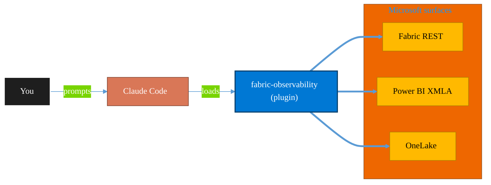

<!-- claude-m:premium-header:start -->
<div align="center">

<a id="top"></a>

# fabric-observability

### Microsoft Fabric Observability — Monitor Hub triage, notebook/pipeline reliability runbooks, SLA tracking, alert design, and incident diagnostics

<sub>Build, mirror, and govern analytics estates on Fabric.</sub>

<br />

<table align="center">
<tr>
<td align="center"><b>Category</b><br /><code>Analytics</code></td>
<td align="center"><b>Surfaces</b><br /><sub>Microsoft Fabric · Power BI · OneLake · DAX · KQL</sub></td>
<td align="center"><b>Version</b><br /><code>1.0.0</code></td>
<td align="center"><b>Marketplace</b><br /><code>claude-m-microsoft-marketplace</code></td>
</tr>
</table>

<sub><code>microsoft</code> &nbsp;·&nbsp; <code>fabric</code> &nbsp;·&nbsp; <code>observability</code> &nbsp;·&nbsp; <code>monitor-hub</code> &nbsp;·&nbsp; <code>reliability</code> &nbsp;·&nbsp; <code>slo</code></sub>

<a href="#install"><b>Install</b></a> &nbsp;·&nbsp;
<a href="#overview"><b>Overview</b></a> &nbsp;·&nbsp;
<a href="#architecture"><b>Architecture</b></a> &nbsp;·&nbsp;
<a href="#related-plugins"><b>Related plugins</b></a> &nbsp;·&nbsp;
<a href="../README.md"><b>Marketplace</b></a>

</div>

---

> [!TIP]
> **One-line install** — `/plugin install fabric-observability@claude-m-microsoft-marketplace`


## Overview

> Microsoft Fabric Observability — Monitor Hub triage, notebook/pipeline reliability runbooks, SLA tracking, alert design, and incident diagnostics

<details>
<summary><b>What ships in this plugin</b> (commands, agents, skills)</summary>

| Component | Items |
|---|---|
| **Commands** | `/incident-runbook` · `/monitor-hub-triage` · `/notebook-pipeline-slo` · `/observability-setup` |
| **Agents** | `observability-reviewer` |
| **Skills** | `fabric-observability` |

</details>


<details>
<summary><b>Quick example</b></summary>

```text
Use fabric-observability to design, build, and govern Fabric / Power BI assets.
```

</details>

<a id="architecture"></a>

## Architecture



<a id="install"></a>

## Install

```bash
/plugin marketplace add markus41/Claude-m
/plugin install fabric-observability@claude-m-microsoft-marketplace
```

> [!IMPORTANT]
> This plugin operates against **Microsoft Fabric · Power BI · OneLake · DAX · KQL**. Configure credentials via environment variables — never commit secrets.

[Back to top](#top)

---

<!-- claude-m:premium-header:end -->

`fabric-observability` is an advanced Microsoft Fabric knowledge plugin for operational diagnostics and reliability engineering for Fabric notebooks, pipelines, and semantic workloads.

## What This Plugin Provides

This is a **knowledge plugin**. It provides implementation guidance, deterministic command workflows, and reviewer checks. It does not include runtime binaries or MCP servers.

Install with:

```bash
/plugin install fabric-observability@claude-m-microsoft-marketplace
```

## Prerequisites

- Access to Monitor Hub, pipeline history, notebook run details, and workspace logs.
- Defined service-level objectives for freshness, latency, and success rate.
- Alert routing channels with clear on-call ownership.
- Runbook location for incident response and postmortems.

## Setup

Run `/observability-setup` first to baseline environment, permissions, and rollout constraints.

## Commands

| Command | Description |
|---|---|
| `/observability-setup` | Set up Fabric observability with SLO definitions, signal inventory, and incident ownership. |
| `/monitor-hub-triage` | Triage Fabric failures and degradations from Monitor Hub with repeatable severity and dependency analysis. |
| `/notebook-pipeline-slo` | Define and validate notebook and pipeline SLOs with measurement logic, error budgets, and breach handling. |
| `/incident-runbook` | Create Fabric incident runbooks for recurring notebook, pipeline, and refresh failure patterns. |

## Agent

| Agent | Description |
|---|---|
| **Observability Reviewer** | Reviews Fabric observability practices for signal quality, alert reliability, runbook completeness, and SLO integrity. |

## Trigger Keywords

The skill activates when conversations mention: `fabric monitor hub`, `pipeline failure triage`, `fabric notebook reliability`, `fabric sla tracking`, `fabric alerting`, `incident diagnostics fabric`, `fabric runbook`, `job failure pattern fabric`.

## Author

Markus Ahling
<!-- claude-m:premium-footer:start -->

---

<a id="related-plugins"></a>

## Related plugins

<table>
<tr><th>Plugin</th><th>What it does</th></tr>
<tr><td><a href="../fabric-data-activator/README.md"><code>fabric-data-activator</code></a></td><td>Microsoft Fabric Data Activator — Reflex triggers, condition-based alerts, real-time actions, and event-driven automation on Fabric data</td></tr>
<tr><td><a href="../fabric-ai-agents/README.md"><code>fabric-ai-agents</code></a></td><td>Microsoft Fabric AI and operations agents - anomaly detector, data agent, operations agent, ontology, and digital twin builder workflows with preview guardrails.</td></tr>
<tr><td><a href="../fabric-capacity-ops/README.md"><code>fabric-capacity-ops</code></a></td><td>Microsoft Fabric Capacity Operations — CU monitoring, throttling diagnostics, workload tuning, autoscale planning, and cost-performance optimization</td></tr>
<tr><td><a href="../fabric-data-engineering/README.md"><code>fabric-data-engineering</code></a></td><td>Microsoft Fabric Data Engineering — lakehouses, Spark notebooks, data pipelines, Delta Lake tables, lakehouse SQL endpoints, multi-notebook orchestration, workspace lifecycle management, pipeline monitoring, and advanced optimization</td></tr>
<tr><td><a href="../fabric-data-factory/README.md"><code>fabric-data-factory</code></a></td><td>Microsoft Fabric Data Factory — data pipelines, Dataflow Gen2, Copy activity, orchestration patterns, and scheduling</td></tr>
<tr><td><a href="../fabric-data-prep-jobs/README.md"><code>fabric-data-prep-jobs</code></a></td><td>Microsoft Fabric data preparation jobs - Dataflow Gen1, Apache Airflow jobs, mounted Azure Data Factory pipelines, and dbt job governance for deterministic prep workflows.</td></tr>
</table>


<details>
<summary><b>Composable stacks that include <code>fabric-observability</code></b></summary>

Combine with sibling plugins to build cross-surface runbooks. Browse the full [marketplace catalog](../README.md#plugin-catalog) for a tailored selection.

</details>

---

<div align="center">

<sub>Part of <a href="../README.md"><b>Claude-m</b></a> — the Microsoft plugin marketplace for Claude Code.</sub>

<sub>Licensed under <a href="../LICENSE">MIT</a>. Built for engineers, MSPs, SOC teams, and analytics leaders.</sub>

</div>

<!-- claude-m:premium-footer:end -->

