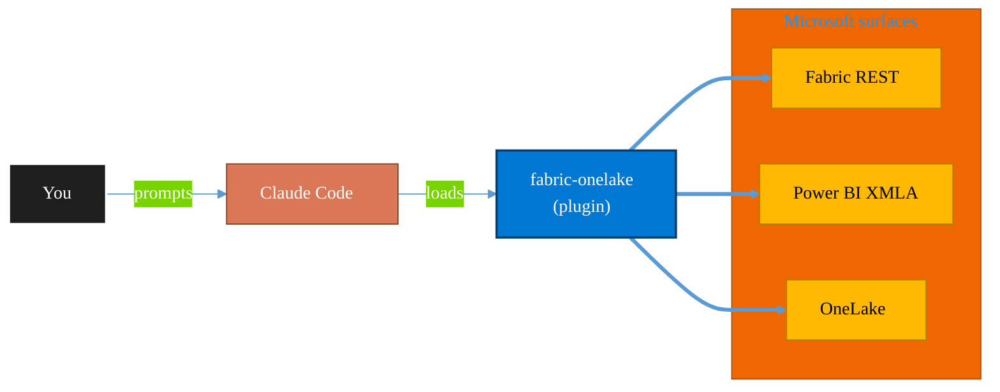

<!-- claude-m:premium-header:start -->
<div align="center">

<a id="top"></a>

# fabric-onelake

### Microsoft Fabric OneLake — unified data lake, shortcuts, file explorer, ADLS Gen2 APIs, and cross-workspace data access

<sub>Build, mirror, and govern analytics estates on Fabric.</sub>

<br />

<table align="center">
<tr>
<td align="center"><b>Category</b><br /><code>Analytics</code></td>
<td align="center"><b>Surfaces</b><br /><sub>Microsoft Fabric · Power BI · OneLake · DAX · KQL</sub></td>
<td align="center"><b>Version</b><br /><code>1.0.0</code></td>
<td align="center"><b>Marketplace</b><br /><code>claude-m-microsoft-marketplace</code></td>
</tr>
</table>

<sub><code>microsoft</code> &nbsp;·&nbsp; <code>fabric</code> &nbsp;·&nbsp; <code>onelake</code> &nbsp;·&nbsp; <code>data-lake</code> &nbsp;·&nbsp; <code>shortcuts</code> &nbsp;·&nbsp; <code>adls</code></sub>

<a href="#install"><b>Install</b></a> &nbsp;·&nbsp;
<a href="#overview"><b>Overview</b></a> &nbsp;·&nbsp;
<a href="#architecture"><b>Architecture</b></a> &nbsp;·&nbsp;
<a href="#related-plugins"><b>Related plugins</b></a> &nbsp;·&nbsp;
<a href="../README.md"><b>Marketplace</b></a>

</div>

---

> [!TIP]
> **One-line install** — `/plugin install fabric-onelake@claude-m-microsoft-marketplace`


## Overview

> Microsoft Fabric OneLake — unified data lake, shortcuts, file explorer, ADLS Gen2 APIs, and cross-workspace data access

<details>
<summary><b>What ships in this plugin</b> (commands, agents, skills)</summary>

| Component | Items |
|---|---|
| **Commands** | `/onelake-access-audit` · `/onelake-browse` · `/onelake-file-api` · `/onelake-local-browse` · `/onelake-setup` · `/onelake-upload` · `/shortcut-create` |
| **Agents** | `onelake-reviewer` |
| **Skills** | `fabric-onelake` |

</details>


<details>
<summary><b>Quick example</b></summary>

```text
Use fabric-onelake to design, build, and govern Fabric / Power BI assets.
```

</details>

<a id="architecture"></a>

## Architecture



<a id="install"></a>

## Install

```bash
/plugin marketplace add markus41/Claude-m
/plugin install fabric-onelake@claude-m-microsoft-marketplace
```

> [!IMPORTANT]
> This plugin operates against **Microsoft Fabric · Power BI · OneLake · DAX · KQL**. Configure credentials via environment variables — never commit secrets.

[Back to top](#top)

---

<!-- claude-m:premium-header:end -->

Microsoft Fabric OneLake — unified data lake management, shortcuts, file operations, ADLS Gen2 compatibility, and cross-workspace data access patterns.

## What This Plugin Provides

This is a **knowledge plugin** — it gives Claude deep expertise in Microsoft Fabric OneLake so it can manage file hierarchies, create shortcuts, interact with the OneLake REST and DFS APIs, configure access control, and design cross-workspace data architectures. It does not contain runtime code, MCP servers, or executable scripts.

## Setup

Run `/setup` to install Azure CLI, authenticate, and configure Fabric workspace access:

```
/setup              # Full guided setup
/setup --minimal    # Dependencies only
```

Requires an Azure subscription with Microsoft Fabric capacity enabled.

## Commands

| Command | Description |
|---------|-------------|
| `/setup` | Install Azure CLI, authenticate, configure Fabric workspace access |
| `/onelake-browse` | Browse OneLake hierarchy — workspaces, items, folders, and files |
| `/shortcut-create` | Create a shortcut to ADLS Gen2, S3, GCS, Dataverse, or another OneLake item |
| `/onelake-upload` | Upload local files or directories to a OneLake lakehouse |
| `/onelake-access-audit` | Audit OneLake access roles, item permissions, and sharing |
| `/onelake-file-api` | Generate OneLake REST or SDK code for file/directory operations |
| `/onelake-local-browse` | Browse locally synced OneLake files — workspaces, items, tables, files (no API auth needed) |

## Agent

| Agent | Description |
|-------|-------------|
| **OneLake Reviewer** | Reviews OneLake configurations for shortcut health, hierarchy conventions, access control, ADLS Gen2 usage, and performance |

## Trigger Keywords

The skill activates automatically when conversations mention: `onelake`, `fabric data lake`, `fabric shortcuts`, `onelake file`, `adls gen2 fabric`, `onelake api`, `lakehouse files`, `fabric file explorer`, `onelake shortcut`, `onelake storage`, `fabric unified lake`, `onelake endpoint`, `onelake desktop sync`, `onelake local`, `local file access onelake`.

## Author

Markus Ahling
<!-- claude-m:premium-footer:start -->

---

<a id="related-plugins"></a>

## Related plugins

<table>
<tr><th>Plugin</th><th>What it does</th></tr>
<tr><td><a href="../fabric-data-engineering/README.md"><code>fabric-data-engineering</code></a></td><td>Microsoft Fabric Data Engineering — lakehouses, Spark notebooks, data pipelines, Delta Lake tables, lakehouse SQL endpoints, multi-notebook orchestration, workspace lifecycle management, pipeline monitoring, and advanced optimization</td></tr>
<tr><td><a href="../fabric-ai-agents/README.md"><code>fabric-ai-agents</code></a></td><td>Microsoft Fabric AI and operations agents - anomaly detector, data agent, operations agent, ontology, and digital twin builder workflows with preview guardrails.</td></tr>
<tr><td><a href="../fabric-capacity-ops/README.md"><code>fabric-capacity-ops</code></a></td><td>Microsoft Fabric Capacity Operations — CU monitoring, throttling diagnostics, workload tuning, autoscale planning, and cost-performance optimization</td></tr>
<tr><td><a href="../fabric-data-activator/README.md"><code>fabric-data-activator</code></a></td><td>Microsoft Fabric Data Activator — Reflex triggers, condition-based alerts, real-time actions, and event-driven automation on Fabric data</td></tr>
<tr><td><a href="../fabric-data-factory/README.md"><code>fabric-data-factory</code></a></td><td>Microsoft Fabric Data Factory — data pipelines, Dataflow Gen2, Copy activity, orchestration patterns, and scheduling</td></tr>
<tr><td><a href="../fabric-data-prep-jobs/README.md"><code>fabric-data-prep-jobs</code></a></td><td>Microsoft Fabric data preparation jobs - Dataflow Gen1, Apache Airflow jobs, mounted Azure Data Factory pipelines, and dbt job governance for deterministic prep workflows.</td></tr>
</table>


<details>
<summary><b>Composable stacks that include <code>fabric-onelake</code></b></summary>

Combine with sibling plugins to build cross-surface runbooks. Browse the full [marketplace catalog](../README.md#plugin-catalog) for a tailored selection.

</details>

---

<div align="center">

<sub>Part of <a href="../README.md"><b>Claude-m</b></a> — the Microsoft plugin marketplace for Claude Code.</sub>

<sub>Licensed under <a href="../LICENSE">MIT</a>. Built for engineers, MSPs, SOC teams, and analytics leaders.</sub>

</div>

<!-- claude-m:premium-footer:end -->

