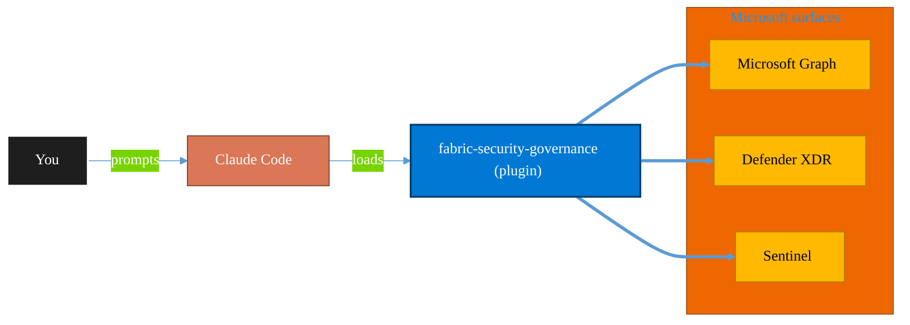

<!-- claude-m:premium-header:start -->
<div align="center">

<a id="top"></a>

# fabric-security-governance

### Microsoft Fabric Security Governance — workspace RBAC, RLS/OLS patterns, sensitivity labels, lineage controls, and audit readiness

<sub>Protect identity, endpoints, data, and information.</sub>

<br />

<table align="center">
<tr>
<td align="center"><b>Category</b><br /><code>Security</code></td>
<td align="center"><b>Surfaces</b><br /><sub>Microsoft Graph · Defender · Sentinel · Purview · Entra</sub></td>
<td align="center"><b>Version</b><br /><code>1.0.0</code></td>
<td align="center"><b>Marketplace</b><br /><code>claude-m-microsoft-marketplace</code></td>
</tr>
</table>

<sub><code>microsoft</code> &nbsp;·&nbsp; <code>fabric</code> &nbsp;·&nbsp; <code>security</code> &nbsp;·&nbsp; <code>governance</code> &nbsp;·&nbsp; <code>rbac</code> &nbsp;·&nbsp; <code>rls</code></sub>

<a href="#install"><b>Install</b></a> &nbsp;·&nbsp;
<a href="#overview"><b>Overview</b></a> &nbsp;·&nbsp;
<a href="#architecture"><b>Architecture</b></a> &nbsp;·&nbsp;
<a href="#related-plugins"><b>Related plugins</b></a> &nbsp;·&nbsp;
<a href="../README.md"><b>Marketplace</b></a>

</div>

---

> [!TIP]
> **One-line install** — `/plugin install fabric-security-governance@claude-m-microsoft-marketplace`


## Overview

> Microsoft Fabric Security Governance — workspace RBAC, RLS/OLS patterns, sensitivity labels, lineage controls, and audit readiness

<details>
<summary><b>What ships in this plugin</b> (commands, agents, skills)</summary>

| Component | Items |
|---|---|
| **Commands** | `/lineage-audit` · `/rls-ols-policy` · `/security-setup` · `/workspace-rbac-design` |
| **Agents** | `security-governance-reviewer` |
| **Skills** | `fabric-security-governance` |

</details>


<details>
<summary><b>Quick example</b></summary>

```text
Use fabric-security-governance to investigate, contain, and harden against threats.
```

</details>

<a id="architecture"></a>

## Architecture



<a id="install"></a>

## Install

```bash
/plugin marketplace add markus41/Claude-m
/plugin install fabric-security-governance@claude-m-microsoft-marketplace
```

> [!IMPORTANT]
> This plugin operates against **Microsoft Graph · Defender · Sentinel · Purview · Entra**. Configure credentials via environment variables — never commit secrets.

[Back to top](#top)

---

<!-- claude-m:premium-header:end -->

`fabric-security-governance` is an advanced Microsoft Fabric knowledge plugin for least-privilege governance across workspaces, data access layers, and compliance controls.

## What This Plugin Provides

This is a **knowledge plugin**. It provides implementation guidance, deterministic command workflows, and reviewer checks. It does not include runtime binaries or MCP servers.

Install with:

```bash
/plugin install fabric-security-governance@claude-m-microsoft-marketplace
```

## Prerequisites

- Fabric admin or security governance permissions for target workspaces.
- Documented data classification policy and sensitivity label taxonomy.
- Identity groups mapped to business roles for access control.
- Audit and compliance stakeholders for policy review and sign-off.

## Setup

Run `/security-setup` first to baseline environment, permissions, and rollout constraints.

## Commands

| Command | Description |
|---|---|
| `/security-setup` | Prepare Fabric security governance by confirming role model, data classification, and policy owners. |
| `/workspace-rbac-design` | Design Fabric workspace role assignments using least-privilege access and separation of duties. |
| `/rls-ols-policy` | Define row-level and object-level security patterns for semantic models and shared datasets. |
| `/lineage-audit` | Audit lineage visibility and control coverage across Fabric artifacts for compliance readiness. |

## Agent

| Agent | Description |
|---|---|
| **Security Governance Reviewer** | Reviews Fabric security governance design for least privilege, data-level controls, and audit-ready lineage coverage. |

## Trigger Keywords

The skill activates when conversations mention: `fabric rbac`, `fabric rls`, `fabric ols`, `sensitivity labels fabric`, `fabric lineage governance`, `fabric audit readiness`, `least privilege fabric`, `data access policy fabric`.

## Author

Markus Ahling
<!-- claude-m:premium-footer:start -->

---

<a id="related-plugins"></a>

## Related plugins

<table>
<tr><th>Plugin</th><th>What it does</th></tr>
<tr><td><a href="../azure-policy-security/README.md"><code>azure-policy-security</code></a></td><td>Evaluate Azure policy compliance and security posture — policy assignments, drift analysis, remediation planning, and guardrail recommendations</td></tr>
<tr><td><a href="../graph-investigator/README.md"><code>graph-investigator</code></a></td><td>Microsoft Graph Investigator — unified user investigation, mailbox forensics, activity timelines, device correlation, and forensic reporting across all M365 services</td></tr>
<tr><td><a href="../entra-id-security/README.md"><code>entra-id-security</code></a></td><td>Microsoft Entra ID identity governance and security — app registrations, service principals, conditional access, sign-in logs, and risk detection</td></tr>
<tr><td><a href="../purview-compliance/README.md"><code>purview-compliance</code></a></td><td>Microsoft Purview compliance workflows — DLP review, retention planning, sensitivity labels, eDiscovery readiness, and guided compliance playbooks with audit-ready change logs</td></tr>
<tr><td><a href="../azure-key-vault/README.md"><code>azure-key-vault</code></a></td><td>Azure Key Vault — secrets, keys, and certificates management with RBAC, rotation policies, and managed identity integration</td></tr>
<tr><td><a href="../defender-sentinel/README.md"><code>defender-sentinel</code></a></td><td>Microsoft Sentinel SIEM/SOAR and Defender XDR — incident triage, KQL threat hunting, analytics rules, SOAR playbooks, advanced hunting, and unified security operations center workflows</td></tr>
</table>


<details>
<summary><b>Composable stacks that include <code>fabric-security-governance</code></b></summary>

Combine with sibling plugins to build cross-surface runbooks. Browse the full [marketplace catalog](../README.md#plugin-catalog) for a tailored selection.

</details>

---

<div align="center">

<sub>Part of <a href="../README.md"><b>Claude-m</b></a> — the Microsoft plugin marketplace for Claude Code.</sub>

<sub>Licensed under <a href="../LICENSE">MIT</a>. Built for engineers, MSPs, SOC teams, and analytics leaders.</sub>

</div>

<!-- claude-m:premium-footer:end -->

