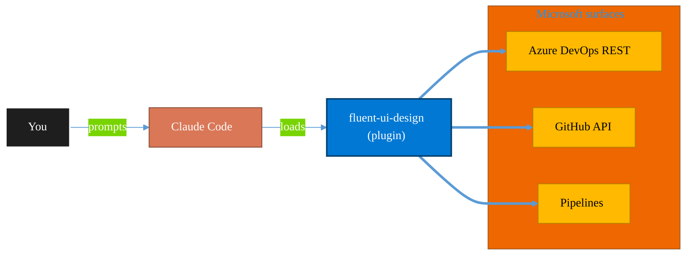

<!-- claude-m:premium-header:start -->
<div align="center">

<a id="top"></a>

# fluent-ui-design

### Microsoft Fluent 2 design system mastery — design tokens, color system, typography, layout, components, Teams theming, advanced UI patterns, Griffel styling, accessibility, responsive design, and Figma design kits

<sub>Ship reliably with first-class CI/CD and ALM.</sub>

<br />

<table align="center">
<tr>
<td align="center"><b>Category</b><br /><code>DevOps</code></td>
<td align="center"><b>Surfaces</b><br /><sub>Azure DevOps · GitHub · Pipelines · ALM · IaC</sub></td>
<td align="center"><b>Version</b><br /><code>2.0.0</code></td>
<td align="center"><b>Marketplace</b><br /><code>claude-m-microsoft-marketplace</code></td>
</tr>
</table>

<sub><code>microsoft</code> &nbsp;·&nbsp; <code>fluent</code> &nbsp;·&nbsp; <code>fluent-ui</code> &nbsp;·&nbsp; <code>design-system</code> &nbsp;·&nbsp; <code>react</code> &nbsp;·&nbsp; <code>teams</code></sub>

<a href="#install"><b>Install</b></a> &nbsp;·&nbsp;
<a href="#overview"><b>Overview</b></a> &nbsp;·&nbsp;
<a href="#architecture"><b>Architecture</b></a> &nbsp;·&nbsp;
<a href="#related-plugins"><b>Related plugins</b></a> &nbsp;·&nbsp;
<a href="../README.md"><b>Marketplace</b></a>

</div>

---

> [!TIP]
> **One-line install** — `/plugin install fluent-ui-design@claude-m-microsoft-marketplace`


## Overview

> Microsoft Fluent 2 design system mastery — design tokens, color system, typography, layout, components, Teams theming, advanced UI patterns, Griffel styling, accessibility, responsive design, and Figma design kits

<details>
<summary><b>What ships in this plugin</b> (commands, agents, skills)</summary>

| Component | Items |
|---|---|
| **Commands** | `/fluent-audit` · `/fluent-chart` · `/fluent-component` · `/fluent-form` · `/fluent-griffel-optimize` · `/fluent-layout` · `/fluent-migrate-v8` · `/fluent-nextjs-setup` · `/fluent-office-addin` · `/fluent-setup` · `/fluent-test` · `/fluent-theme` · `/fluent-tokens` · `/fluent-web-component` |
| **Agents** | `fluent-accessibility-auditor` · `fluent-component-builder` · `fluent-migration-assistant` · `fluent-theme-engineer` · `fluent-ui-designer` |
| **Skills** | `fluent-charting` · `fluent-cross-platform` · `fluent-design-system` · `fluent-extensibility` · `fluent-forms` · `fluent-griffel` · `fluent-integration` · `fluent-nextjs` · `fluent-web-components` |

</details>


<details>
<summary><b>Quick example</b></summary>

```text
Use fluent-ui-design to ship work through pipelines with full ALM.
```

</details>

<a id="architecture"></a>

## Architecture



<a id="install"></a>

## Install

```bash
/plugin marketplace add markus41/Claude-m
/plugin install fluent-ui-design@claude-m-microsoft-marketplace
```

> [!IMPORTANT]
> This plugin operates against **Azure DevOps · GitHub · Pipelines · ALM · IaC**. Configure credentials via environment variables — never commit secrets.

[Back to top](#top)

---

<!-- claude-m:premium-header:end -->

Microsoft Fluent 2 design system mastery for Claude Code — design tokens, component library, Teams theming, Griffel styling, Next.js SSR, Web Components, charting, cross-platform, forms, Office Add-ins, accessibility auditing, v8→v9 migration, and Figma design kits.

## Install

```bash
/plugin install fluent-ui-design@claude-m-microsoft-marketplace
```

## What's new in v2.0.0

- **9 focused skills** (was 1 monolith) — faster activation, better coverage
- **5 agents** (+Accessibility Auditor, +Migration Assistant)
- **14 commands** (+8 new for Next.js, Griffel, migration, charts, forms, testing, Office Add-ins, Web Components)
- **~20 reference files** with 80+ external URLs
- **New content areas**: Next.js SSR, Griffel AOT, Web Components, charting, iOS/Android, B2C UI, form orchestration, slots/extensibility, Office Add-ins, testing

## Skills

| Skill | Topics |
|---|---|
| **Fluent 2 Design System** (core) | Design tokens, color system, typography, layout, component library, theming, accessibility, icons |
| **Fluent UI Next.js** | App Router + Pages Router setup, SSR, `use client` boundaries, Griffel AOT with webpack |
| **Fluent UI Griffel** | makeStyles, makeResetStyles, shorthands, AOT compilation, selectors, RTL, DevTools |
| **Fluent UI Extensibility** | Slots (4 levels), custom variants, customStyleHooks, headless patterns, v8→v9 migration |
| **Fluent UI Web Components** | `@fluentui/web-components`, framework-agnostic (Angular, Vue, Svelte) |
| **Fluent UI Charting** | `@fluentui/react-charting` — line, bar, pie, donut, area, heatmap, sankey, gauge |
| **Fluent UI Cross-Platform** | iOS (Swift/UIKit), Android (Kotlin), token parity, Figma kits |
| **Fluent UI Forms** | Field validation, Formik + Yup, React Hook Form + Zod, multi-step wizards |
| **Fluent UI Integration** | Azure AD B2C UI, Office Add-ins, SharePoint, Nav/Drawer patterns |

## Agents

| Agent | Purpose |
|---|---|
| **Fluent UI Designer** | Architects UI layouts with proper token usage, theming, and component selection |
| **Fluent Component Builder** | Builds custom React components with Fluent UI v9 best practices |
| **Fluent Theme Engineer** | Creates custom themes with brand ramps and multi-theme support |
| **Fluent Accessibility Auditor** | WCAG 2.1 AA compliance scanning, ARIA validation, contrast checking |
| **Fluent Migration Assistant** | Scans v8 imports, maps to v9, plans incremental migration |

## Commands

| Command | Description |
|---|---|
| `fluent-ui-design:setup` | Set up a project with Fluent UI React v9 |
| `fluent-ui-design:component` | Scaffold a new Fluent component |
| `fluent-ui-design:theme` | Generate a custom theme from a brand color |
| `fluent-ui-design:tokens` | Look up design token values and usage |
| `fluent-ui-design:layout` | Generate responsive layout patterns |
| `fluent-ui-design:audit` | Audit a project for Fluent 2 compliance |
| `fluent-ui-design:nextjs-setup` | Set up Fluent UI in Next.js with SSR |
| `fluent-ui-design:griffel-optimize` | Analyze and optimize Griffel styling |
| `fluent-ui-design:migrate-v8` | Scan v8 usage and plan v9 migration |
| `fluent-ui-design:web-component` | Scaffold Web Component integration |
| `fluent-ui-design:chart` | Generate a Fluent-themed chart component |
| `fluent-ui-design:form` | Generate a form with validation (Formik/RHF) |
| `fluent-ui-design:office-addin` | Set up Fluent UI in an Office Add-in |
| `fluent-ui-design:test` | Generate tests for Fluent components |

## Prompt examples

- "Build a Teams tab dashboard with Fluent UI"
- "Create a custom Fluent theme with brand color #5B5FC7"
- "Set up Fluent UI in my Next.js App Router project"
- "Optimize Griffel styling with AOT compilation"
- "Migrate my DetailsList from Fluent v8 to DataGrid v9"
- "Build a form with Formik + Yup validation using Fluent components"
- "Add a line chart to my dashboard with @fluentui/react-charting"
- "Scaffold Fluent Web Components for my Angular app"
- "Set up Fluent UI in my Excel add-in task pane"
- "Audit my app for WCAG 2.1 AA accessibility compliance"
- "Design a responsive master-detail layout using Fluent"
- "Customize Azure AD B2C sign-in page with Fluent tokens"

## Opinionated flows

1. **Next.js + Fluent full stack**
   Triggers: `fluent-nextjs`, `fluent-griffel`
   Prompt: "Set up Fluent UI in my Next.js App Router project with Griffel AOT and dark mode toggle"

2. **v8 → v9 migration**
   Triggers: `fluent-extensibility`, `fluent-griffel`
   Prompt: "Scan my project for Fluent v8 usage, create a migration plan, and migrate the Button components first"

3. **Accessible form design**
   Triggers: `fluent-forms`, core skill
   Prompt: "Build an accessible multi-step registration form with Formik validation and error announcements"

4. **Cross-platform design system**
   Triggers: `fluent-cross-platform`, core skill
   Prompt: "Compare Fluent token availability across Web, iOS, and Android for our design system"

5. **Office Add-in development**
   Triggers: `fluent-integration`, core skill
   Prompt: "Create an Excel add-in task pane with Fluent UI, including theme switching and responsive layout"
<!-- claude-m:premium-footer:start -->

---

<a id="related-plugins"></a>

## Related plugins

<table>
<tr><th>Plugin</th><th>What it does</th></tr>
<tr><td><a href="../teams-app-dev/README.md"><code>teams-app-dev</code></a></td><td>Custom Teams app development — manifest v1.25, M365 Agents Toolkit, Adaptive Cards, message extensions, meeting apps, Custom Engine Agents, Agent 365 blueprints, workflow bots, notification hubs, Copilot plugins, Teams SDK migration, and advanced meeting experiences with Live Share</td></tr>
<tr><td><a href="../azure-devops/README.md"><code>azure-devops</code></a></td><td>Comprehensive Azure DevOps expertise — Git repos with passwordless auth (GCM, WIF, SSH), YAML and Classic pipelines, deployment environments, agent pools, work items, boards, sprints, test plans, security namespaces, dashboards, wikis, service hooks, Analytics OData, CLI, and extensions</td></tr>
<tr><td><a href="../azure-devops-orchestrator/README.md"><code>azure-devops-orchestrator</code></a></td><td>Intelligent orchestration for Azure DevOps — ship work items with Claude Code, triage backlogs, plan sprints, coordinate releases, monitor pipelines, and balance workloads across projects. Integrates with microsoft-teams-mcp and microsoft-outlook-mcp when installed.</td></tr>
<tr><td><a href="../azure-dotnet-webapp/README.md"><code>azure-dotnet-webapp</code></a></td><td>Scaffold and build ASP.NET Core Web API and Blazor apps on Azure — Minimal API, controllers, Microsoft.Identity.Web, EF Core, SignalR, OpenAPI, App Service deployment, and Graph API integration patterns.</td></tr>
<tr><td><a href="../azure-graph-dotnet/README.md"><code>azure-graph-dotnet</code></a></td><td>Scaffold and build Microsoft Graph C# / .NET solutions on Azure — Functions, Container Jobs, Azure Identity, Polly resilience, and SharePoint file intelligence implementations.</td></tr>
<tr><td><a href="../fabric-developer-runtime/README.md"><code>fabric-developer-runtime</code></a></td><td>Microsoft Fabric developer runtime operations - GraphQL API, environments, user data functions, and variable library governance.</td></tr>
</table>


<details>
<summary><b>Composable stacks that include <code>fluent-ui-design</code></b></summary>

Combine with sibling plugins to build cross-surface runbooks. Browse the full [marketplace catalog](../README.md#plugin-catalog) for a tailored selection.

</details>

---

<div align="center">

<sub>Part of <a href="../README.md"><b>Claude-m</b></a> — the Microsoft plugin marketplace for Claude Code.</sub>

<sub>Licensed under <a href="../LICENSE">MIT</a>. Built for engineers, MSPs, SOC teams, and analytics leaders.</sub>

</div>

<!-- claude-m:premium-footer:end -->

