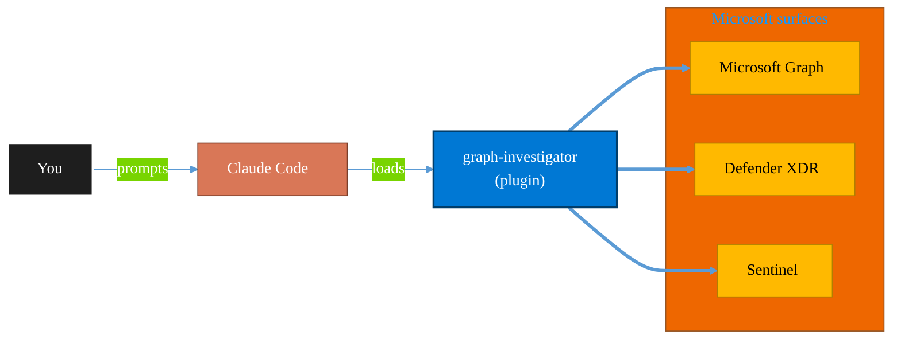

<!-- claude-m:premium-header:start -->
<div align="center">

<a id="top"></a>

# graph-investigator

### Microsoft Graph Investigator — unified user investigation, mailbox forensics, activity timelines, device correlation, and forensic reporting across all M365 services

<sub>Protect identity, endpoints, data, and information.</sub>

<br />

<table align="center">
<tr>
<td align="center"><b>Category</b><br /><code>Security</code></td>
<td align="center"><b>Surfaces</b><br /><sub>Microsoft Graph · Defender · Sentinel · Purview · Entra</sub></td>
<td align="center"><b>Version</b><br /><code>1.0.0</code></td>
<td align="center"><b>Marketplace</b><br /><code>claude-m-microsoft-marketplace</code></td>
</tr>
</table>

<sub><code>microsoft</code> &nbsp;·&nbsp; <code>graph</code> &nbsp;·&nbsp; <code>investigation</code> &nbsp;·&nbsp; <code>forensic</code> &nbsp;·&nbsp; <code>audit</code> &nbsp;·&nbsp; <code>email</code></sub>

<a href="#install"><b>Install</b></a> &nbsp;·&nbsp;
<a href="#overview"><b>Overview</b></a> &nbsp;·&nbsp;
<a href="#architecture"><b>Architecture</b></a> &nbsp;·&nbsp;
<a href="#related-plugins"><b>Related plugins</b></a> &nbsp;·&nbsp;
<a href="../README.md"><b>Marketplace</b></a>

</div>

---

> [!TIP]
> **One-line install** — `/plugin install graph-investigator@claude-m-microsoft-marketplace`


## Overview

> Microsoft Graph Investigator — unified user investigation, mailbox forensics, activity timelines, device correlation, and forensic reporting across all M365 services

<details>
<summary><b>What ships in this plugin</b> (commands, agents, skills)</summary>

| Component | Items |
|---|---|
| **Commands** | `/inv-apps` · `/inv-audit` · `/inv-devices` · `/inv-email` · `/inv-files` · `/inv-risk` · `/inv-setup` · `/inv-signin` · `/inv-teams` · `/inv-timeline` · `/inv-user` |
| **Agents** | `investigation-report-generator` |
| **Skills** | `graph-investigation` |

</details>


<details>
<summary><b>Quick example</b></summary>

```text
Use graph-investigator to investigate, contain, and harden against threats.
```

</details>

<a id="architecture"></a>

## Architecture



<a id="install"></a>

## Install

```bash
/plugin marketplace add markus41/Claude-m
/plugin install graph-investigator@claude-m-microsoft-marketplace
```

> [!IMPORTANT]
> This plugin operates against **Microsoft Graph · Defender · Sentinel · Purview · Entra**. Configure credentials via environment variables — never commit secrets.

[Back to top](#top)

---

<!-- claude-m:premium-header:end -->

Microsoft Graph Investigator — unified user investigation, mailbox forensics, activity timelines, device correlation, and forensic reporting across all Microsoft 365 services.

---

## When to Use This Plugin

Most M365 security plugins focus on a single surface. This plugin fills the gap when you need to **correlate across all surfaces for a single user** — connecting sign-in anomalies to mailbox changes to device registrations to file access in one coherent investigation.

| Plugin | What it covers | What it lacks vs. graph-investigator |
|--------|---------------|--------------------------------------|
| `entra-id-security` | Sign-in logs and risky users (basic) | No mailbox forensics, device correlation, or OAuth audit |
| `defender-sentinel` | Alert-centric SIEM/SOAR investigation | Not user-centric; no cross-service activity timeline |
| `m365-admin` | Directory audits and tenant management | No forensic depth; no anomaly detection logic |
| `exchange-mailflow` | Mail delivery diagnostics, SPF/DKIM/DMARC | No forensic mailbox analysis or inbox rule inspection |

Use **graph-investigator** when you need to answer: "Was this account compromised, what did the attacker access, and what do we do now?"

---

## Installation

```bash
/plugin install graph-investigator@claude-m-microsoft-marketplace
```

---

## Commands

| Command | Description |
|---------|-------------|
| `/inv-setup` | Verify Graph permissions and test connectivity |
| `/inv-user <upn>` | Comprehensive user profile investigation |
| `/inv-email <upn>` | Search Exchange messages for a user |
| `/inv-signin <upn>` | Sign-in log analysis and anomaly detection |
| `/inv-devices <upn>` | Device inventory and compliance status |
| `/inv-audit <upn>` | Unified audit log search |
| `/inv-timeline <upn>` | Build unified cross-service activity timeline |
| `/inv-files <upn>` | SharePoint/OneDrive file access investigation |
| `/inv-teams <upn>` | Teams chat and meeting activity |
| `/inv-risk <upn>` | Risk assessment and compromise indicators |
| `/inv-apps <upn>` | OAuth consent and app permission audit |

---

## Agent

### `investigation-report-generator`

Autonomous deep-dive agent that takes a UPN or user object ID and produces a comprehensive forensic report by correlating data across all M365 services.

**Trigger with any of these prompts:**
- "Run a full investigation on user@domain.com"
- "Generate forensic report for this user"
- "Deep dive investigation on john.doe@contoso.com"
- "Investigate potential account compromise for UPN: victim@company.com"
- "Full forensic report for userId xxxxxxxx-xxxx-xxxx-xxxx-xxxxxxxxxxxx"
- "Is user@domain.com compromised?"

**Investigation depths:**
- `quick` — sign-in logs + risk state + mailbox rules (fastest, ~2 min)
- `standard` — all phases including devices, OAuth apps, file access (default, ~5 min)
- `deep` — standard + Teams activity + full UAL PowerShell sweep (~10 min)

The agent produces a structured markdown forensic report including executive summary, key findings table, per-phase analysis, activity timeline, and a prioritized action plan.

---

## Required Permissions

All permissions are delegated or app-based Microsoft Graph scopes. Grant via Entra app registration or admin consent.

| Investigation Type | Required Scopes |
|---|---|
| User profile | `User.Read.All`, `GroupMember.Read.All`, `RoleManagement.Read.Directory` |
| Sign-in analysis | `AuditLog.Read.All` |
| Risk assessment | `IdentityRiskyUser.Read.All`, `IdentityRiskEvent.Read.All` (requires Entra P2) |
| Mailbox forensics | `Mail.Read`, `MailboxSettings.Read` |
| Device investigation | `DeviceManagementManagedDevices.Read.All`, `Device.Read.All` |
| Teams investigation | `Chat.Read.All`, `Team.ReadBasic.All`, `ChannelMessage.Read.All` |
| File access audit | `AuditLog.Read.All`, `Sites.Read.All` |
| OAuth audit | `DelegatedPermissionGrant.ReadWrite.All`, `Application.Read.All` |

**Minimum setup** (basic investigations without risk APIs or Teams): `AuditLog.Read.All` + `User.Read.All`

**Recommended setup** (full standard investigations): all scopes in the table except Teams-specific ones.

> Note: `IdentityRiskyUser.Read.All` and `IdentityRiskEvent.Read.All` require Entra ID P2 licensing on the tenant. If unavailable, the risk phase is skipped gracefully.

---

## Prompt Examples

```
Investigate potential account compromise for john.doe@contoso.com
```

```
Show me all sign-in anomalies for user@domain.com in the last 30 days
```

```
Check if user@company.com has any suspicious inbox rules or forwarding enabled
```

```
List all OAuth apps that user@company.com has consented to and flag any risky ones
```

```
Build an activity timeline for user@domain.com from January 1 to January 31
```

```
Show devices enrolled for user@company.com and their current compliance status
```

```
Run a full forensic investigation on victim@contoso.com and generate a report
```

```
Quick investigation on user@domain.com — sign-in and risk check only
```

```
Deep dive on john.doe@contoso.com — include Teams messages and full UAL
```

---

## Skill Triggers

The `graph-investigation` skill activates on the following phrases:

`graph investigator`, `investigate user`, `user investigation`, `mailbox forensics`, `email investigation`, `sign-in investigation`, `device investigation`, `activity timeline`, `forensic timeline`, `microsoft graph investigation`, `m365 investigation`, `audit log search`, `unified audit log`, `compromise assessment`, `data exfiltration investigation`, `insider threat`, `BEC investigation`, `business email compromise`, `teams investigation`, `file access audit`, `oauth consent audit`, `app permission investigation`, `user activity report`, `exchange investigation`, `sharepoint investigation`, `account compromise`, `investigate account`, `forensic report`

---

## What the Report Covers

A standard investigation report includes:

1. **Executive Summary** — 2-3 sentence risk assessment with overall risk level (HIGH / MEDIUM / LOW)
2. **Key Findings Table** — ranked findings with severity, evidence, and recommendation
3. **User Profile** — account details, manager, group memberships, privileged roles
4. **Sign-In Analysis** — 30-day sign-in statistics, country distribution, anomaly highlights, legacy auth usage
5. **Mailbox Forensics** — inbox rules inventory, SMTP forwarding config, delegation settings
6. **Device Inventory** — all managed and registered devices with compliance state
7. **Risk Assessment** — current Entra ID Protection risk level and detection history
8. **OAuth App Audit** — all delegated consents with permission analysis and risk flags
9. **File Access Summary** — SharePoint/OneDrive bulk access and external sharing events
10. **Activity Timeline** — unified chronological table of all flagged events across services
11. **Recommended Actions** — immediate, short-term, and monitoring steps with Graph API commands

---

## Reference Documents

| Reference | Contents |
|-----------|---------|
| `skills/graph-investigation/references/user-activity-endpoints.md` | Complete Graph API endpoint reference for user activity |
| `skills/graph-investigation/references/mailbox-forensics.md` | Exchange forensics deep reference — inbox rules, headers, UAL |
| `skills/graph-investigation/references/timeline-construction.md` | Timeline construction patterns and event correlation logic |
| `skills/graph-investigation/references/device-correlation.md` | Device investigation workflows and Intune/Entra mapping |
| `skills/graph-investigation/references/permission-scopes.md` | Required permissions by scenario with least-privilege guidance |
| `skills/graph-investigation/references/unified-audit-log.md` | UAL reference and PowerShell patterns for deep investigations |

---

## Integration with Other Plugins

This plugin works well alongside:

- **`entra-id-security`** — use graph-investigator for deep user forensics, entra-id-security for app registration and CA policy review
- **`defender-sentinel`** — escalate confirmed compromises found by graph-investigator to Sentinel incident workflows
- **`exchange-mailflow`** — use exchange-mailflow for delivery path diagnostics, graph-investigator for mailbox tampering forensics
- **`purview-compliance`** — combine graph-investigator file access findings with Purview DLP alerts for data loss assessment
- **`sharing-auditor`** — use graph-investigator for user-centric investigation, sharing-auditor for tenant-wide oversharing posture

---

## Troubleshooting

**Sign-in logs return 0 results**
Ensure `AuditLog.Read.All` is granted and that the tenant has Entra ID P1 or P2 (sign-in logs require a premium license).

**Risk APIs return 403**
Entra ID P2 is required for Identity Protection APIs. The investigation continues without risk data.

**mailFolders/inbox/messageRules returns empty**
The user may have no inbox rules, or the `Mail.Read` scope may be missing. Verify permission grant.

**Device inventory is empty**
Confirm `DeviceManagementManagedDevices.Read.All` is granted. If Intune is not deployed in the tenant, managed device data will be unavailable.

**Report generation takes >10 minutes**
Switch to `quick` or `standard` depth. For Teams and UAL data in deep mode, ensure adequate timeout settings.
<!-- claude-m:premium-footer:start -->

---

<a id="related-plugins"></a>

## Related plugins

<table>
<tr><th>Plugin</th><th>What it does</th></tr>
<tr><td><a href="../azure-policy-security/README.md"><code>azure-policy-security</code></a></td><td>Evaluate Azure policy compliance and security posture — policy assignments, drift analysis, remediation planning, and guardrail recommendations</td></tr>
<tr><td><a href="../fabric-security-governance/README.md"><code>fabric-security-governance</code></a></td><td>Microsoft Fabric Security Governance — workspace RBAC, RLS/OLS patterns, sensitivity labels, lineage controls, and audit readiness</td></tr>
<tr><td><a href="../entra-id-security/README.md"><code>entra-id-security</code></a></td><td>Microsoft Entra ID identity governance and security — app registrations, service principals, conditional access, sign-in logs, and risk detection</td></tr>
<tr><td><a href="../purview-compliance/README.md"><code>purview-compliance</code></a></td><td>Microsoft Purview compliance workflows — DLP review, retention planning, sensitivity labels, eDiscovery readiness, and guided compliance playbooks with audit-ready change logs</td></tr>
<tr><td><a href="../sharing-auditor/README.md"><code>sharing-auditor</code></a></td><td>SharePoint and OneDrive external sharing auditor — find overshared links, anonymous access, stale guest users, and auto-generate approval tasks for safe revocation</td></tr>
<tr><td><a href="../azure-key-vault/README.md"><code>azure-key-vault</code></a></td><td>Azure Key Vault — secrets, keys, and certificates management with RBAC, rotation policies, and managed identity integration</td></tr>
</table>


<details>
<summary><b>Composable stacks that include <code>graph-investigator</code></b></summary>

Combine with sibling plugins to build cross-surface runbooks. Browse the full [marketplace catalog](../README.md#plugin-catalog) for a tailored selection.

</details>

---

<div align="center">

<sub>Part of <a href="../README.md"><b>Claude-m</b></a> — the Microsoft plugin marketplace for Claude Code.</sub>

<sub>Licensed under <a href="../LICENSE">MIT</a>. Built for engineers, MSPs, SOC teams, and analytics leaders.</sub>

</div>

<!-- claude-m:premium-footer:end -->

