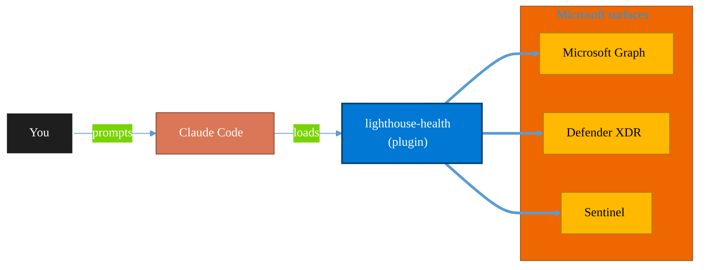

<!-- claude-m:premium-header:start -->
<div align="center">

<a id="top"></a>

# lighthouse-health

### Microsoft 365 Lighthouse tenant health scorecard — green/yellow/red dashboard for security posture, MFA coverage, stale accounts, and licensing anomalies across managed tenants

<sub>Protect identity, endpoints, data, and information.</sub>

<br />

<table align="center">
<tr>
<td align="center"><b>Category</b><br /><code>Security</code></td>
<td align="center"><b>Surfaces</b><br /><sub>Microsoft Graph · Defender · Sentinel · Purview · Entra</sub></td>
<td align="center"><b>Version</b><br /><code>1.0.0</code></td>
<td align="center"><b>Marketplace</b><br /><code>claude-m-microsoft-marketplace</code></td>
</tr>
</table>

<sub><code>microsoft</code> &nbsp;·&nbsp; <code>lighthouse</code> &nbsp;·&nbsp; <code>msp</code> &nbsp;·&nbsp; <code>tenant-health</code> &nbsp;·&nbsp; <code>multi-tenant</code> &nbsp;·&nbsp; <code>security-posture</code></sub>

<a href="#install"><b>Install</b></a> &nbsp;·&nbsp;
<a href="#overview"><b>Overview</b></a> &nbsp;·&nbsp;
<a href="#architecture"><b>Architecture</b></a> &nbsp;·&nbsp;
<a href="#related-plugins"><b>Related plugins</b></a> &nbsp;·&nbsp;
<a href="../README.md"><b>Marketplace</b></a>

</div>

---

> [!TIP]
> **One-line install** — `/plugin install lighthouse-health@claude-m-microsoft-marketplace`


## Overview

> Microsoft 365 Lighthouse tenant health scorecard — green/yellow/red dashboard for security posture, MFA coverage, stale accounts, and licensing anomalies across managed tenants

<details>
<summary><b>What ships in this plugin</b> (commands, agents, skills)</summary>

| Component | Items |
|---|---|
| **Commands** | `/lighthouse-health-scan` · `/lighthouse-remediation` · `/lighthouse-setup` |
| **Agents** | `lighthouse-health-reviewer` |
| **Skills** | `lighthouse-health` |

</details>


<details>
<summary><b>Quick example</b></summary>

```text
Use lighthouse-health to investigate, contain, and harden against threats.
```

</details>

<a id="architecture"></a>

## Architecture



<a id="install"></a>

## Install

```bash
/plugin marketplace add markus41/Claude-m
/plugin install lighthouse-health@claude-m-microsoft-marketplace
```

> [!IMPORTANT]
> This plugin operates against **Microsoft Graph · Defender · Sentinel · Purview · Entra**. Configure credentials via environment variables — never commit secrets.

[Back to top](#top)

---

<!-- claude-m:premium-header:end -->

Multi-tenant health dashboard for MSPs/CSPs using Microsoft 365 Lighthouse. Provides green/yellow/red scoring for security, MFA, stale accounts, backup posture, and licensing.

## What this plugin helps with
- Run health scans across managed customer tenants
- Green/yellow/red scorecard for security posture, MFA coverage, stale accounts, licensing anomalies
- One-click remediation plan generation from scorecard findings
- GDAP-aware multi-tenant operations

## Integration Context Contract
- Canonical contract: [`docs/integration-context.md`](../docs/integration-context.md)

| Command family | tenantId | subscriptionId | environmentCloud | principalType | scopesOrRoles |
|---|---|---|---|---|---|
| Lighthouse health and remediation | required (partner + customer context) | optional | `AzureCloud`\* | `delegated-user` | `DelegatedAdminRelationship.Read.All`, `Directory.Read.All`, `AuditLog.Read.All` |

\* Use sovereign cloud values from the contract when applicable.

Commands must fail fast if tenant chain context is incomplete, before scanning managed tenants.
Outputs must redact partner/customer tenant and object identifiers per contract.

## Included commands
- `/lighthouse-setup` — Configure Lighthouse access and GDAP relationships
- `/lighthouse-health-scan` — Scan tenants and produce health scorecard
- `/lighthouse-remediation` — Generate remediation plan from scan findings

## Skill
- `skills/lighthouse-health/SKILL.md` — Lighthouse API and health scoring knowledge

## Agent
- `agents/lighthouse-health-reviewer.md` — Reviews multi-tenant operations for GDAP compliance and safety
<!-- claude-m:premium-footer:start -->

---

<a id="related-plugins"></a>

## Related plugins

<table>
<tr><th>Plugin</th><th>What it does</th></tr>
<tr><td><a href="../lighthouse-operations/README.md"><code>lighthouse-operations</code></a></td><td>Comprehensive Azure Lighthouse and M365 Lighthouse operations for MSPs/CSPs — Azure delegation ARM/Bicep templates, managed services marketplace offers, GDAP full lifecycle management, baseline deployment automation, cross-tenant governance, Partner Center integration, and alert management.</td></tr>
<tr><td><a href="../azure-key-vault/README.md"><code>azure-key-vault</code></a></td><td>Azure Key Vault — secrets, keys, and certificates management with RBAC, rotation policies, and managed identity integration</td></tr>
<tr><td><a href="../azure-policy-security/README.md"><code>azure-policy-security</code></a></td><td>Evaluate Azure policy compliance and security posture — policy assignments, drift analysis, remediation planning, and guardrail recommendations</td></tr>
<tr><td><a href="../defender-sentinel/README.md"><code>defender-sentinel</code></a></td><td>Microsoft Sentinel SIEM/SOAR and Defender XDR — incident triage, KQL threat hunting, analytics rules, SOAR playbooks, advanced hunting, and unified security operations center workflows</td></tr>
<tr><td><a href="../entra-id-admin/README.md"><code>entra-id-admin</code></a></td><td>Microsoft Entra ID administration via Graph API — full user/group lifecycle, directory roles, PIM, authentication methods, admin units, B2B guest management, license assignment, named locations, and entitlement management</td></tr>
<tr><td><a href="../entra-id-security/README.md"><code>entra-id-security</code></a></td><td>Microsoft Entra ID identity governance and security — app registrations, service principals, conditional access, sign-in logs, and risk detection</td></tr>
</table>


<details>
<summary><b>Composable stacks that include <code>lighthouse-health</code></b></summary>

Combine with sibling plugins to build cross-surface runbooks. Browse the full [marketplace catalog](../README.md#plugin-catalog) for a tailored selection.

</details>

---

<div align="center">

<sub>Part of <a href="../README.md"><b>Claude-m</b></a> — the Microsoft plugin marketplace for Claude Code.</sub>

<sub>Licensed under <a href="../LICENSE">MIT</a>. Built for engineers, MSPs, SOC teams, and analytics leaders.</sub>

</div>

<!-- claude-m:premium-footer:end -->

