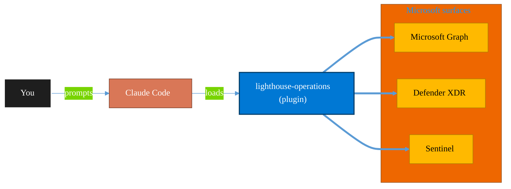

<!-- claude-m:premium-header:start -->
<div align="center">

<a id="top"></a>

# lighthouse-operations

### Comprehensive Azure Lighthouse and M365 Lighthouse operations for MSPs/CSPs — Azure delegation ARM/Bicep templates, managed services marketplace offers, GDAP full lifecycle management, baseline deployment automation, cross-tenant governance, Partner Center integration, and alert management.

<sub>Protect identity, endpoints, data, and information.</sub>

<br />

<table align="center">
<tr>
<td align="center"><b>Category</b><br /><code>Security</code></td>
<td align="center"><b>Surfaces</b><br /><sub>Microsoft Graph · Defender · Sentinel · Purview · Entra</sub></td>
<td align="center"><b>Version</b><br /><code>1.0.0</code></td>
<td align="center"><b>Marketplace</b><br /><code>claude-m-microsoft-marketplace</code></td>
</tr>
</table>

<sub><code>microsoft</code> &nbsp;·&nbsp; <code>azure</code> &nbsp;·&nbsp; <code>lighthouse</code> &nbsp;·&nbsp; <code>msp</code> &nbsp;·&nbsp; <code>csp</code> &nbsp;·&nbsp; <code>gdap</code></sub>

<a href="#install"><b>Install</b></a> &nbsp;·&nbsp;
<a href="#overview"><b>Overview</b></a> &nbsp;·&nbsp;
<a href="#architecture"><b>Architecture</b></a> &nbsp;·&nbsp;
<a href="#related-plugins"><b>Related plugins</b></a> &nbsp;·&nbsp;
<a href="../README.md"><b>Marketplace</b></a>

</div>

---

> [!TIP]
> **One-line install** — `/plugin install lighthouse-operations@claude-m-microsoft-marketplace`


## Overview

> Comprehensive Azure Lighthouse and M365 Lighthouse operations for MSPs/CSPs — Azure delegation ARM/Bicep templates, managed services marketplace offers, GDAP full lifecycle management, baseline deployment automation, cross-tenant governance, Partner Center integration, and alert management.

<details>
<summary><b>What ships in this plugin</b> (commands, agents, skills)</summary>

| Component | Items |
|---|---|
| **Commands** | `/azure-lighthouse-delegate` · `/baseline-deploy` · `/gdap-manage` · `/lighthouse-alerts` · `/lighthouse-report` · `/lighthouse-setup` |
| **Agents** | `lighthouse-architect` |
| **Skills** | `lighthouse-operations` |

</details>


<details>
<summary><b>Quick example</b></summary>

```text
Use lighthouse-operations to investigate, contain, and harden against threats.
```

</details>

<a id="architecture"></a>

## Architecture



<a id="install"></a>

## Install

```bash
/plugin marketplace add markus41/Claude-m
/plugin install lighthouse-operations@claude-m-microsoft-marketplace
```

> [!IMPORTANT]
> This plugin operates against **Microsoft Graph · Defender · Sentinel · Purview · Entra**. Configure credentials via environment variables — never commit secrets.

[Back to top](#top)

---

<!-- claude-m:premium-header:end -->

Deep operational tooling for Azure Lighthouse delegation and Microsoft 365 Lighthouse multi-tenant management. Designed for MSPs and CSPs managing customer environments at scale.

Complements [`lighthouse-health`](../lighthouse-health) (which handles health scoring and reactive remediation) by providing the full operational lifecycle: delegation setup, GDAP lifecycle, baseline deployment, cross-tenant governance, alert management, and monthly reporting.

## Features

- **Azure Lighthouse** — Generate Bicep/ARM delegation templates, configure standard and JIT-eligible authorizations, deploy to customer subscriptions, verify from partner tenant
- **GDAP Lifecycle** — Create, assign, renew, and terminate Granular Delegated Admin Privilege relationships with full audit trail
- **Baseline Deployment** — Scan M365 Lighthouse management template compliance, identify gaps, generate remediation plans, apply supported actions
- **Cross-Tenant Reporting** — Monthly MSP health report with MFA coverage, device compliance, risky users, GDAP expiry, and Lighthouse delegation status
- **Alert Management** — List, triage, acknowledge, and dismiss M365 Lighthouse alerts with remediation guidance per alert type
- **Architecture Review** — AI-assisted audit of your Lighthouse/GDAP access model against security best practices

## Commands

| Command | Description |
|---------|-------------|
| `/lighthouse-operations:lighthouse-setup` | Initial setup wizard — configure partner tenant, enumerate managed tenants, verify GDAP and Lighthouse access |
| `/lighthouse-operations:gdap-manage` | Full GDAP lifecycle: create, list, renew, terminate, assign |
| `/lighthouse-operations:baseline-deploy` | Scan management template compliance and apply remediation actions |
| `/lighthouse-operations:lighthouse-report` | Generate monthly cross-tenant health report (Markdown + CSV) |
| `/lighthouse-operations:lighthouse-alerts` | List, triage, acknowledge, and dismiss active Lighthouse alerts |
| `/lighthouse-operations:azure-lighthouse-delegate` | Generate and deploy Azure Lighthouse ARM/Bicep delegation templates |

## Skill

The `lighthouse-operations` skill activates automatically when you discuss:
- Azure Lighthouse delegation, ARM/Bicep managed services templates
- GDAP lifecycle, role assignments, relationship expiry
- M365 Lighthouse baselines, management templates, compliance status
- Partner Center API for MSP operations
- Cross-tenant governance, Azure Policy via Lighthouse

## Agent

**`lighthouse-architect`** — Architectural review agent. Triggers when you ask to review or design a Lighthouse/GDAP access model. Audits role structure, security posture, and generates an architecture recommendation with prioritized actions.

Trigger phrases:
- "Review my lighthouse setup"
- "Design a GDAP structure for our MSP"
- "Is my delegation secure?"
- "Audit our managed services access model"

## Prerequisites

- Azure CLI (`az`) — authenticated to the **partner tenant**
- Microsoft Graph access — the signed-in identity needs:
  - `DelegatedAdminRelationship.ReadWrite.All` (GDAP management)
  - `ManagedTenants.ReadWrite.All` (M365 Lighthouse)
  - `ManagedServices.ReadWrite.All` (Azure Lighthouse)
- Partner Center access (for CSP onboarding flow) — requires `Partner Center Admin Agent` role

## Quick Start

### 1. Run setup

```
/lighthouse-operations:lighthouse-setup
```

This verifies prerequisites, enumerates managed tenants, and writes a `.lighthouse-config.local.md` config file.

### 2. Check GDAP relationships

```
/lighthouse-operations:gdap-manage --action list
```

### 3. Deploy a new Azure Lighthouse delegation

```
/lighthouse-operations:azure-lighthouse-delegate --customer-sub-id <subscription-id>
```

### 4. Generate monthly report

```
/lighthouse-operations:lighthouse-report
```

### 5. Triage active alerts

```
/lighthouse-operations:lighthouse-alerts --action triage
```

## Configuration

After running `lighthouse-setup`, a config file is created at `.claude/lighthouse-operations.local.md`:

```yaml
---
partner_tenant_id: <your-partner-tenant-id>
partner_tenant_name: Contoso MSP
app_id: <app-registration-id>
msp_name: "Contoso MSP"
offer_name: "Contoso MSP — Managed Services"
standard_groups:
  readers: <group-object-id>
  engineers: <group-object-id>
  security_team: <group-object-id>
  noc: <group-object-id>
  platform_admins: <group-object-id>
lighthouse_subscription_scopes:
  - production
  - development
default_delegation_location: eastus
alert_sla:
  critical_hours: 1
  high_hours: 4
  medium_hours: 24
---
```

## Related Plugins

| Plugin | Relationship |
|--------|-------------|
| [`lighthouse-health`](../lighthouse-health) | Health scoring and reactive remediation — use together for full MSP operations |
| [`msp-tenant-provisioning`](../msp-tenant-provisioning) | New customer onboarding — use before this plugin to create tenants |
| [`entra-id-security`](../entra-id-security) | Deep Entra ID security audit for individual tenants |
| [`azure-policy-security`](../azure-policy-security) | Cross-tenant Azure Policy governance |
<!-- claude-m:premium-footer:start -->

---

<a id="related-plugins"></a>

## Related plugins

<table>
<tr><th>Plugin</th><th>What it does</th></tr>
<tr><td><a href="../lighthouse-health/README.md"><code>lighthouse-health</code></a></td><td>Microsoft 365 Lighthouse tenant health scorecard — green/yellow/red dashboard for security posture, MFA coverage, stale accounts, and licensing anomalies across managed tenants</td></tr>
<tr><td><a href="../azure-key-vault/README.md"><code>azure-key-vault</code></a></td><td>Azure Key Vault — secrets, keys, and certificates management with RBAC, rotation policies, and managed identity integration</td></tr>
<tr><td><a href="../azure-policy-security/README.md"><code>azure-policy-security</code></a></td><td>Evaluate Azure policy compliance and security posture — policy assignments, drift analysis, remediation planning, and guardrail recommendations</td></tr>
<tr><td><a href="../defender-sentinel/README.md"><code>defender-sentinel</code></a></td><td>Microsoft Sentinel SIEM/SOAR and Defender XDR — incident triage, KQL threat hunting, analytics rules, SOAR playbooks, advanced hunting, and unified security operations center workflows</td></tr>
<tr><td><a href="../entra-id-admin/README.md"><code>entra-id-admin</code></a></td><td>Microsoft Entra ID administration via Graph API — full user/group lifecycle, directory roles, PIM, authentication methods, admin units, B2B guest management, license assignment, named locations, and entitlement management</td></tr>
<tr><td><a href="../entra-id-security/README.md"><code>entra-id-security</code></a></td><td>Microsoft Entra ID identity governance and security — app registrations, service principals, conditional access, sign-in logs, and risk detection</td></tr>
</table>


<details>
<summary><b>Composable stacks that include <code>lighthouse-operations</code></b></summary>

Combine with sibling plugins to build cross-surface runbooks. Browse the full [marketplace catalog](../README.md#plugin-catalog) for a tailored selection.

</details>

---

<div align="center">

<sub>Part of <a href="../README.md"><b>Claude-m</b></a> — the Microsoft plugin marketplace for Claude Code.</sub>

<sub>Licensed under <a href="../LICENSE">MIT</a>. Built for engineers, MSPs, SOC teams, and analytics leaders.</sub>

</div>

<!-- claude-m:premium-footer:end -->

