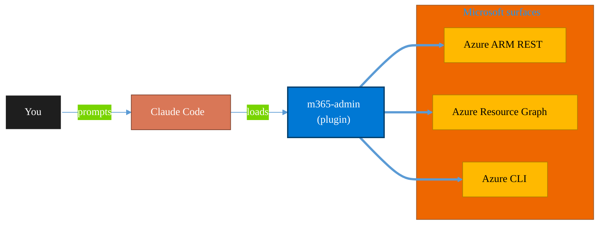

<!-- claude-m:premium-header:start -->
<div align="center">

<a id="top"></a>

# m365-admin

### M365 tenant admin via Microsoft Graph — users, groups, licenses, Exchange, SharePoint, Teams, Intune, PIM, access reviews, usage reports, guest management, administrative units, Microsoft Search, and domain/federation management

<sub>Inventory, govern, and operate Azure resources at any scale.</sub>

<br />

<table align="center">
<tr>
<td align="center"><b>Category</b><br /><code>Cloud</code></td>
<td align="center"><b>Surfaces</b><br /><sub>Azure ARM · Resource Graph · ARM REST · CLI</sub></td>
<td align="center"><b>Version</b><br /><code>1.1.0</code></td>
<td align="center"><b>Marketplace</b><br /><code>claude-m-microsoft-marketplace</code></td>
</tr>
</table>

<sub><code>microsoft</code> &nbsp;·&nbsp; <code>graph-api</code> &nbsp;·&nbsp; <code>entra-id</code> &nbsp;·&nbsp; <code>exchange</code> &nbsp;·&nbsp; <code>sharepoint</code> &nbsp;·&nbsp; <code>admin</code></sub>

<a href="#install"><b>Install</b></a> &nbsp;·&nbsp;
<a href="#overview"><b>Overview</b></a> &nbsp;·&nbsp;
<a href="#architecture"><b>Architecture</b></a> &nbsp;·&nbsp;
<a href="#related-plugins"><b>Related plugins</b></a> &nbsp;·&nbsp;
<a href="../README.md"><b>Marketplace</b></a>

</div>

---

> [!TIP]
> **One-line install** — `/plugin install m365-admin@claude-m-microsoft-marketplace`


## Overview

> M365 tenant admin via Microsoft Graph — users, groups, licenses, Exchange, SharePoint, Teams, Intune, PIM, access reviews, usage reports, guest management, administrative units, Microsoft Search, and domain/federation management

<details>
<summary><b>What ships in this plugin</b> (commands, agents, skills)</summary>

| Component | Items |
|---|---|
| **Commands** | `/m365-admin-units` · `/m365-audit` · `/m365-domain-management` · `/m365-exchange-mailbox` · `/m365-group-create` · `/m365-guest-management` · `/m365-intune-devices` · `/m365-license-assign` · `/m365-offboard-wizard` · `/m365-onboard-wizard` · `/m365-pim-roles` · `/m365-search-admin` · `/m365-setup` · `/m365-sharepoint-site` · `/m365-teams-admin` · `/m365-usage-reports` · `/m365-user-create` · `/m365-user-offboard` |
| **Agents** | `m365-admin-reviewer` |
| **Skills** | `m365-admin` |

</details>


<details>
<summary><b>Quick example</b></summary>

```text
Use m365-admin to audit and operate Azure resources end-to-end.
```

</details>

<a id="architecture"></a>

## Architecture



<a id="install"></a>

## Install

```bash
/plugin marketplace add markus41/Claude-m
/plugin install m365-admin@claude-m-microsoft-marketplace
```

> [!IMPORTANT]
> This plugin operates against **Azure ARM · Resource Graph · ARM REST · CLI**. Configure credentials via environment variables — never commit secrets.

[Back to top](#top)

---

<!-- claude-m:premium-header:end -->

Claude Code knowledge plugin for Microsoft 365 tenant administration via Microsoft Graph API.

## Purpose

This plugin provides Claude with deep expertise in M365 admin operations so it can generate correct code, scripts, and advice for managing users, groups, licenses, Exchange Online, SharePoint, and bulk operations. All content is markdown-based knowledge -- no runtime code or MCP servers.

## Coverage

| Area | API | Description |
|------|-----|-------------|
| Entra ID (Azure AD) | Microsoft Graph v1.0 | User CRUD, password resets, group management, role assignments, sign-in and audit logs |
| License Management | Microsoft Graph v1.0 | SKU inventory, license assignment/revocation, usage reporting, bulk migration |
| Exchange Online | Graph + PowerShell | Mailbox settings, auto-replies, shared mailboxes, distribution lists, delegates, mail flow rules |
| SharePoint Online | Graph + REST + PnP | Site creation, permissions, storage, sharing policies, hub sites, document libraries |
| Bulk Operations | Graph $batch | CSV-driven batch processing with validation, dry-run, rate limiting, and reporting |

## Setup

Run `/setup` to configure authentication and install dependencies:

```
/setup                          # Full guided setup
/setup --minimal                # Node.js dependencies only
/setup --with-exchange          # Include Exchange Online PowerShell module
/setup --with-sharepoint-pnp    # Include PnP PowerShell module
```

## Integration Context Contract
- Canonical contract: [`docs/integration-context.md`](../docs/integration-context.md)

| Command family | tenantId | subscriptionId | environmentCloud | principalType | scopesOrRoles |
|---|---|---|---|---|---|
| User/group/license/admin workflows | required | optional (only when chaining with Azure plugins) | `AzureCloud`\* | `delegated-user` | `User.ReadWrite.All`, `Group.ReadWrite.All`, `Directory.ReadWrite.All`, `AuditLog.Read.All` |
| Exchange/SharePoint admin workflows | required | optional | `AzureCloud`\* | `delegated-user` | `MailboxSettings.ReadWrite`, `Mail.ReadWrite`, `Sites.FullControl.All` |

\* Use sovereign cloud values from the contract when applicable.

Every command must validate required context up front and fail fast with contract error codes before Graph/PowerShell execution.
Examples and reports must redact sensitive identifiers per the shared contract.

## Authentication

All operations use delegated authentication with interactive browser login (MSAL). Scopes are requested dynamically based on the operation following the principle of least privilege.

## Commands

| Command | Description |
|---------|-------------|
| `/setup` | Set up the plugin — Azure app registration, dependencies, connectivity |
| `/m365-user-create` | Create user(s) with license and group assignment |
| `/m365-user-offboard` | Full offboarding: disable, revoke, remove, convert |
| `/m365-license-assign` | Assign, change, or revoke licenses |
| `/m365-group-create` | Create security, M365, or distribution groups |
| `/m365-exchange-mailbox` | Shared mailbox, auto-reply, delegates, conversion |
| `/m365-sharepoint-site` | Site creation, permissions, sharing, hub sites |
| `/m365-audit` | Sign-in logs, directory audits, license reports |

## Focused Plugin Routing

Use `m365-admin` for broad tenant administration, then route deep specialized workflows to focused plugins:

- `microsoft-intune`: endpoint lifecycle and compliance operations (non-compliant device triage, lost device actions, compliance policy rollout, app protection review).
- `entra-access-reviews`: repeatable access review lifecycle automation and remediation tracking.
- `m365-meeting-intelligence`: transcript-to-action workflows and Planner or To Do handoff from meetings.

## Agent

| Agent | Description |
|-------|-------------|
| `m365-admin-reviewer` | Reviews M365 scripts for API correctness, security, bulk safety, PowerShell patterns, and offboarding completeness |

## Structure

```
m365-admin/
├── .claude-plugin/
│   └── plugin.json
├── skills/
│   └── m365-admin/
│       ├── SKILL.md
│       ├── references/
│       │   ├── entra-id.md
│       │   ├── exchange-online.md
│       │   ├── sharepoint-admin.md
│       │   └── bulk-operations.md
│       └── examples/
│           ├── user-management.md
│           ├── license-management.md
│           ├── exchange-operations.md
│           └── sharepoint-operations.md
├── commands/
│   ├── m365-user-create.md
│   ├── m365-user-offboard.md
│   ├── m365-license-assign.md
│   ├── m365-group-create.md
│   ├── m365-exchange-mailbox.md
│   ├── m365-sharepoint-site.md
│   ├── m365-audit.md
│   └── setup.md
├── agents/
│   └── m365-admin-reviewer.md
└── README.md
```
<!-- claude-m:premium-footer:start -->

---

<a id="related-plugins"></a>

## Related plugins

<table>
<tr><th>Plugin</th><th>What it does</th></tr>
<tr><td><a href="../agent-foundry/README.md"><code>agent-foundry</code></a></td><td>Azure AI Foundry agent lifecycle management — scaffold, deploy, test, and manage AI agents with Azure AI Foundry MCP integration</td></tr>
<tr><td><a href="../azure-ai-services/README.md"><code>azure-ai-services</code></a></td><td>Azure AI workloads — Azure OpenAI Service deployments, AI Search indexes, AI Studio/Foundry projects, Cognitive Services provisioning, content filtering, and responsible AI governance</td></tr>
<tr><td><a href="../azure-containers/README.md"><code>azure-containers</code></a></td><td>Azure Container Apps, Container Instances, and Container Registry — build, push, deploy, and scale containerized workloads</td></tr>
<tr><td><a href="../azure-cost-governance/README.md"><code>azure-cost-governance</code></a></td><td>Azure FinOps and governance workflows — query costs, monitor budgets, detect anomalies, and identify idle resources for optimization</td></tr>
<tr><td><a href="../azure-document-intelligence/README.md"><code>azure-document-intelligence</code></a></td><td>Azure AI Document Intelligence — OCR, prebuilt models (invoices, receipts, IDs, tax forms), custom models, layout analysis, document classification, and batch processing</td></tr>
<tr><td><a href="../azure-functions/README.md"><code>azure-functions</code></a></td><td>Azure Functions — triggers, bindings, Durable Functions, deployment, and local development with Azure Functions Core Tools</td></tr>
</table>


<details>
<summary><b>Composable stacks that include <code>m365-admin</code></b></summary>

Combine with sibling plugins to build cross-surface runbooks. Browse the full [marketplace catalog](../README.md#plugin-catalog) for a tailored selection.

</details>

---

<div align="center">

<sub>Part of <a href="../README.md"><b>Claude-m</b></a> — the Microsoft plugin marketplace for Claude Code.</sub>

<sub>Licensed under <a href="../LICENSE">MIT</a>. Built for engineers, MSPs, SOC teams, and analytics leaders.</sub>

</div>

<!-- claude-m:premium-footer:end -->

