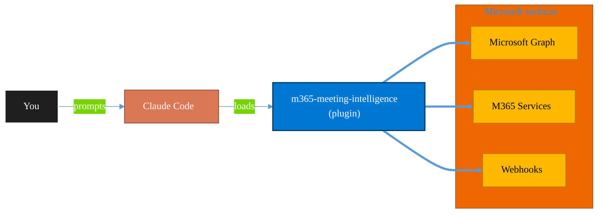

<!-- claude-m:premium-header:start -->
<div align="center">

<a id="top"></a>

# m365-meeting-intelligence

### Meeting transcript intelligence for Teams and Outlook - transcript fetch, commitment extraction, task handoff, and owner reminder workflows.

<sub>Automate everyday Microsoft 365 collaboration workflows.</sub>

<br />

<table align="center">
<tr>
<td align="center"><b>Category</b><br /><code>Productivity</code></td>
<td align="center"><b>Surfaces</b><br /><sub>Microsoft Graph · M365 · Teams · Outlook · SharePoint · Loop</sub></td>
<td align="center"><b>Version</b><br /><code>1.0.0</code></td>
<td align="center"><b>Marketplace</b><br /><code>claude-m-microsoft-marketplace</code></td>
</tr>
</table>

<sub><code>m365</code> &nbsp;·&nbsp; <code>meeting</code> &nbsp;·&nbsp; <code>intelligence</code></sub>

<a href="#install"><b>Install</b></a> &nbsp;·&nbsp;
<a href="#overview"><b>Overview</b></a> &nbsp;·&nbsp;
<a href="#architecture"><b>Architecture</b></a> &nbsp;·&nbsp;
<a href="#related-plugins"><b>Related plugins</b></a> &nbsp;·&nbsp;
<a href="../README.md"><b>Marketplace</b></a>

</div>

---

> [!TIP]
> **One-line install** — `/plugin install m365-meeting-intelligence@claude-m-microsoft-marketplace`


## Overview

> Meeting transcript intelligence for Teams and Outlook - transcript fetch, commitment extraction, task handoff, and owner reminder workflows.

<details>
<summary><b>What ships in this plugin</b> (commands, agents, skills)</summary>

| Component | Items |
|---|---|
| **Commands** | `/meeting-commitments-extract` · `/meeting-intelligence-setup` · `/meeting-owner-reminders` · `/meeting-tasks-sync` · `/meeting-transcript-fetch` |
| **Agents** | `m365-meeting-intelligence-reviewer` |
| **Skills** | `m365-meeting-intelligence` |

</details>


<details>
<summary><b>Quick example</b></summary>

```text
Use m365-meeting-intelligence to automate Microsoft 365 collaboration workflows.
```

</details>

<a id="architecture"></a>

## Architecture



<a id="install"></a>

## Install

```bash
/plugin marketplace add markus41/Claude-m
/plugin install m365-meeting-intelligence@claude-m-microsoft-marketplace
```

> [!IMPORTANT]
> This plugin operates against **Microsoft Graph · M365 · Teams · Outlook · SharePoint · Loop**. Configure credentials via environment variables — never commit secrets.

[Back to top](#top)

---

<!-- claude-m:premium-header:end -->

Meeting transcript intelligence for Teams and Outlook - transcript fetch, commitment extraction, task handoff, and owner reminder workflows.

## Purpose

This plugin is a knowledge plugin for M365 Meeting Intelligence workflows. It provides deterministic command guidance and review patterns, and does not include runtime MCP servers.

## Prerequisites

- Microsoft tenant access for the target workload.
- Required scopes or roles: `OnlineMeetings.Read.All`, `Calendars.Read`, `Tasks.ReadWrite`
- Redaction and fail-fast behavior must follow the shared integration contract.

## Install

```bash
/plugin install m365-meeting-intelligence@claude-m-microsoft-marketplace
```

## Integration Context Contract
- Canonical contract: [`docs/integration-context.md`](../docs/integration-context.md)

| Command family | tenantId | subscriptionId | environmentCloud | principalType | scopesOrRoles |
|---|---|---|---|---|---|
| M365 Meeting Intelligence operations | required | optional | `AzureCloud`* | delegated-user | `OnlineMeetings.Read.All`, `Calendars.Read`, `Tasks.ReadWrite` |

* Use sovereign cloud values from the canonical contract when applicable.

Commands must fail fast before network calls when required context is missing or invalid. All outputs must redact sensitive IDs and secrets.

## Commands

| Command | Description |
|---|---|
| `/meeting-intelligence-setup` | Run meeting intelligence setup workflow. |
| `/meeting-transcript-fetch` | Run meeting transcript fetch workflow. |
| `/meeting-commitments-extract` | Run meeting commitments extract workflow. |
| `/meeting-tasks-sync` | Run meeting tasks sync workflow. |
| `/meeting-owner-reminders` | Run meeting owner reminders workflow. |

## Agent

| Agent | Description |
|---|---|
| `m365-meeting-intelligence-reviewer` | Reviews command and skill docs for API correctness, permissions, and safety checks. |

## Trigger Keywords

- `meeting transcript`
- `teams transcript`
- `meeting commitments`
- `meeting tasks`
- `owner reminder`
<!-- claude-m:premium-footer:start -->

---

<a id="related-plugins"></a>

## Related plugins

<table>
<tr><th>Plugin</th><th>What it does</th></tr>
<tr><td><a href="../microsoft-loop/README.md"><code>microsoft-loop</code></a></td><td>Microsoft Loop workspaces, pages, and components — create collaborative spaces, embed portable Loop components across M365 apps, manage via Graph API, and govern Loop at the tenant level.</td></tr>
<tr><td><a href="../planner-orchestrator/README.md"><code>planner-orchestrator</code></a></td><td>Intelligent orchestration for Microsoft Planner — ship tasks with Claude Code, triage backlogs, plan sprint buckets, monitor deadlines, and balance workloads across plans. Integrates with microsoft-teams-mcp, microsoft-outlook-mcp, and powerbi-fabric when installed.</td></tr>
<tr><td><a href="../business-central/README.md"><code>business-central</code></a></td><td>Microsoft Dynamics 365 Business Central ERP — finance, supply chain, and inventory management via BC OData v4 / API v2.0 REST API</td></tr>
<tr><td><a href="../copilot-studio-bots/README.md"><code>copilot-studio-bots</code></a></td><td>Copilot Studio — design bot topics, author trigger phrases, configure generative AI orchestration, and publish chatbots</td></tr>
<tr><td><a href="../plugins/domain-business-name-finder/README.md"><code>domain-business-name-finder</code></a></td><td>Brainstorm business names and check domain availability across popular TLDs using Firecrawl, Perplexity, WHOIS, and Domain Search MCP servers</td></tr>
<tr><td><a href="../dynamics-365-crm/README.md"><code>dynamics-365-crm</code></a></td><td>Dynamics 365 Sales and Customer Service via Dataverse Web API — leads, opportunities, accounts, contacts, cases, SLAs, queues, pipeline reporting, and CRM workflow automation</td></tr>
</table>


<details>
<summary><b>Composable stacks that include <code>m365-meeting-intelligence</code></b></summary>

Combine with sibling plugins to build cross-surface runbooks. Browse the full [marketplace catalog](../README.md#plugin-catalog) for a tailored selection.

</details>

---

<div align="center">

<sub>Part of <a href="../README.md"><b>Claude-m</b></a> — the Microsoft plugin marketplace for Claude Code.</sub>

<sub>Licensed under <a href="../LICENSE">MIT</a>. Built for engineers, MSPs, SOC teams, and analytics leaders.</sub>

</div>

<!-- claude-m:premium-footer:end -->

