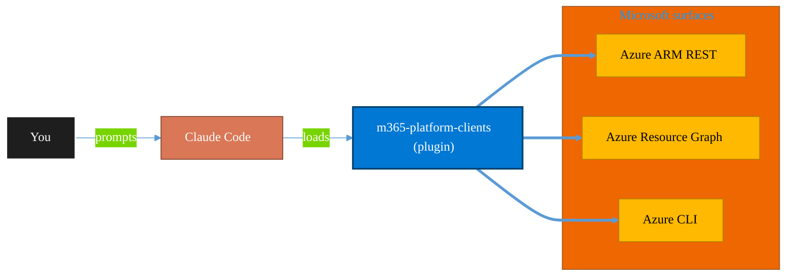

<!-- claude-m:premium-header:start -->
<div align="center">

<a id="top"></a>

# m365-platform-clients

### TypeScript patterns for Dataverse Web API and Microsoft Graph — auth, clients, and combined provisioning workflows

<sub>Inventory, govern, and operate Azure resources at any scale.</sub>

<br />

<table align="center">
<tr>
<td align="center"><b>Category</b><br /><code>Cloud</code></td>
<td align="center"><b>Surfaces</b><br /><sub>Azure ARM · Resource Graph · ARM REST · CLI</sub></td>
<td align="center"><b>Version</b><br /><code>1.0.0</code></td>
<td align="center"><b>Marketplace</b><br /><code>claude-m-microsoft-marketplace</code></td>
</tr>
</table>

<sub><code>microsoft</code> &nbsp;·&nbsp; <code>dataverse</code> &nbsp;·&nbsp; <code>graph</code> &nbsp;·&nbsp; <code>azure</code> &nbsp;·&nbsp; <code>typescript</code> &nbsp;·&nbsp; <code>microsoft-graph</code></sub>

<a href="#install"><b>Install</b></a> &nbsp;·&nbsp;
<a href="#overview"><b>Overview</b></a> &nbsp;·&nbsp;
<a href="#architecture"><b>Architecture</b></a> &nbsp;·&nbsp;
<a href="#related-plugins"><b>Related plugins</b></a> &nbsp;·&nbsp;
<a href="../README.md"><b>Marketplace</b></a>

</div>

---

> [!TIP]
> **One-line install** — `/plugin install m365-platform-clients@claude-m-microsoft-marketplace`


## Overview

> TypeScript patterns for Dataverse Web API and Microsoft Graph — auth, clients, and combined provisioning workflows

<details>
<summary><b>What ships in this plugin</b> (commands, agents, skills)</summary>

| Component | Items |
|---|---|
| **Commands** | `/create-m365-client` |
| **Agents** | `m365-client-reviewer` |
| **Skills** | `m365-clients` |

</details>


<details>
<summary><b>Quick example</b></summary>

```text
Use m365-platform-clients to audit and operate Azure resources end-to-end.
```

</details>

<a id="architecture"></a>

## Architecture



<a id="install"></a>

## Install

```bash
/plugin marketplace add markus41/Claude-m
/plugin install m365-platform-clients@claude-m-microsoft-marketplace
```

> [!IMPORTANT]
> This plugin operates against **Azure ARM · Resource Graph · ARM REST · CLI**. Configure credentials via environment variables — never commit secrets.

[Back to top](#top)

---

<!-- claude-m:premium-header:end -->

Claude Code plugin providing deep knowledge of TypeScript patterns for Microsoft 365 platform integration — Dataverse Web API, Microsoft Graph, and shared Azure Identity authentication.

## What's Included

### Skill: `m365-clients`

Core knowledge for building typed TypeScript clients that wrap Dataverse and Graph APIs with shared `@azure/identity` credentials.

**Triggers on**: "dataverse client", "graph client", "DefaultAzureCredential", "managed identity", "Microsoft Graph TypeScript", "DataverseClient", "GraphService", "m365 integration"

**References**:
- `azure-auth.md` — Credential types, Entra app registration, token caching, scopes
- `dataverse-client.md` — Full `DataverseClient` class with typed CRUD, queries, batch, actions
- `graph-client.md` — Full `GraphService` class with Users, Teams, SharePoint, Mail, Calendar
- `environment-strategies.md` — Auth patterns per environment (local, Azure, K8s, CI/CD)

**Examples**:
- `auth-patterns.md` — 7 auth scenarios (local dev, client secret, managed identity, multi-tenant, etc.)
- `dataverse-operations.md` — 7 Dataverse patterns (CRUD, OData queries, lookups, bulk, flows)
- `graph-operations.md` — 7 Graph patterns (users, Teams, SharePoint, email, calendar, batch)
- `combined-workflows.md` — 5 combined patterns (provisioning, onboarding, reporting, decommission)

### Command: `/create-m365-client`

Generates production-ready TypeScript code for Dataverse and/or Graph operations with proper auth, typing, and error handling.

```
/create-m365-client query active projects from Dataverse and post summary to Teams
```

### Agent: `m365-client-reviewer`

Reviews TypeScript code that integrates with Dataverse or Graph for correctness, auth patterns, API usage, and production readiness.

## Dependencies

```
@azure/identity
@microsoft/microsoft-graph-client
dotenv (dev)
```

## Quick Start

```typescript
import { DefaultAzureCredential } from "@azure/identity";
import { DataverseClient } from "./clients/dataverseClient";
import { GraphService } from "./clients/graphClient";

const credential = new DefaultAzureCredential();

const dv = new DataverseClient(
  { environmentUrl: process.env.DATAVERSE_ENV_URL! },
  credential
);
const graph = new GraphService(credential);

// Both clients share the same credential and token cache
const whoAmI = await dv.whoAmI();
const user = await graph.getUser("admin@contoso.com");
```

## Required Environment Variables

| Variable | Description | Example |
|----------|-------------|---------|
| `AZURE_TENANT_ID` | Entra tenant ID | `xxxxxxxx-xxxx-...` |
| `AZURE_CLIENT_ID` | App registration client ID | `xxxxxxxx-xxxx-...` |
| `AZURE_CLIENT_SECRET` | Client secret (local/CI only) | `your-secret` |
| `DATAVERSE_ENV_URL` | Dataverse environment URL | `https://contoso.crm.dynamics.com` |

In Azure-hosted environments, use Managed Identity instead of client secrets — no env vars needed beyond `DATAVERSE_ENV_URL`.
<!-- claude-m:premium-footer:start -->

---

<a id="related-plugins"></a>

## Related plugins

<table>
<tr><th>Plugin</th><th>What it does</th></tr>
<tr><td><a href="../dataverse-schema/README.md"><code>dataverse-schema</code></a></td><td>Dataverse table, column, and relationship management via Web API — schema design, data seeding, and solution lifecycle</td></tr>
<tr><td><a href="../msp-tenant-provisioning/README.md"><code>msp-tenant-provisioning</code></a></td><td>Full MSP/CSP new customer provisioning — Partner Center CSP tenant creation, Azure subscription and management group setup, initial M365 security baseline, domain DNS configuration, and Microsoft 365 Lighthouse onboarding.</td></tr>
<tr><td><a href="../agent-foundry/README.md"><code>agent-foundry</code></a></td><td>Azure AI Foundry agent lifecycle management — scaffold, deploy, test, and manage AI agents with Azure AI Foundry MCP integration</td></tr>
<tr><td><a href="../azure-ai-services/README.md"><code>azure-ai-services</code></a></td><td>Azure AI workloads — Azure OpenAI Service deployments, AI Search indexes, AI Studio/Foundry projects, Cognitive Services provisioning, content filtering, and responsible AI governance</td></tr>
<tr><td><a href="../azure-containers/README.md"><code>azure-containers</code></a></td><td>Azure Container Apps, Container Instances, and Container Registry — build, push, deploy, and scale containerized workloads</td></tr>
<tr><td><a href="../azure-cost-governance/README.md"><code>azure-cost-governance</code></a></td><td>Azure FinOps and governance workflows — query costs, monitor budgets, detect anomalies, and identify idle resources for optimization</td></tr>
</table>


<details>
<summary><b>Composable stacks that include <code>m365-platform-clients</code></b></summary>

Combine with sibling plugins to build cross-surface runbooks. Browse the full [marketplace catalog](../README.md#plugin-catalog) for a tailored selection.

</details>

---

<div align="center">

<sub>Part of <a href="../README.md"><b>Claude-m</b></a> — the Microsoft plugin marketplace for Claude Code.</sub>

<sub>Licensed under <a href="../LICENSE">MIT</a>. Built for engineers, MSPs, SOC teams, and analytics leaders.</sub>

</div>

<!-- claude-m:premium-footer:end -->

